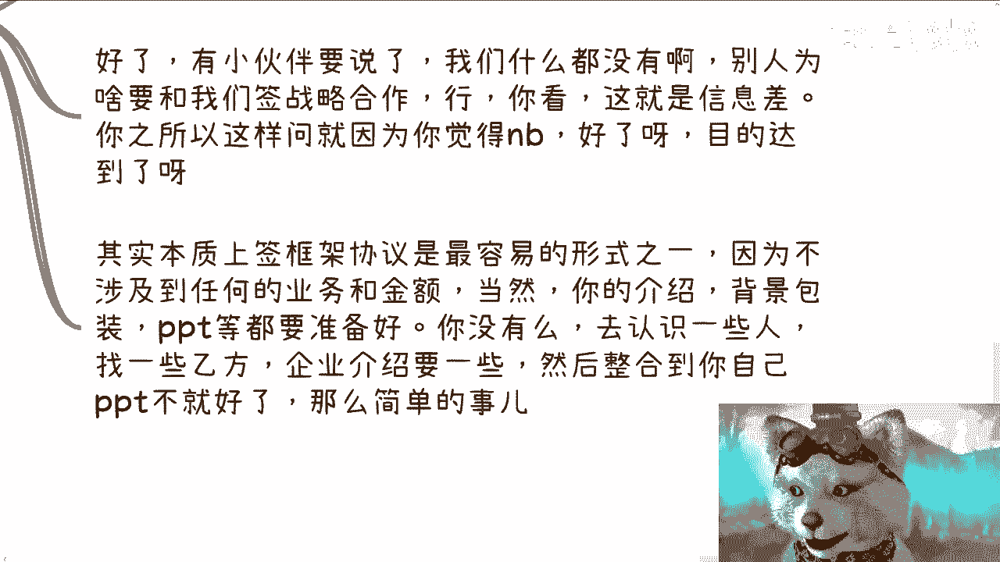

# 没有啥牛逼或者高大上的-一切的源头只有信息差---P1---赏味不足---BV1u5411B7t3_

在本节课中，我们将要学习一个核心概念：**信息差**。我们将探讨为什么许多看似“高大上”的事物，其本质仅仅是信息的不对称，并理解信息差在商业决策、个人发展中的决定性作用。

## 讲师背景介绍

我长期为政府、企业、高校及产业园提供数字经济相关的咨询与培训服务。


例如，在2020至2022年间，我为海南省上下百余个厅局领导提供了数字经济相关的咨询培训。我的工作也覆盖上海、北京、苏州、常州、上饶、天津等多个地区。


我的观点与建议均源于实际操作经验，旨在揭示真正的资本与既得利益者的行事逻辑。

## 核心观点：一切源于信息差

本节中我们来看看核心观点。世界上并不存在真正“牛逼”或“高大上”的事物。人们觉得某些事物高级，根本原因只有一个：**信息差**。

**信息差**可以理解为：
```
你所掌握的信息 ≠ 他人掌握的信息
```
这种不对称导致了认知与机会上的差距。

## 深入剖析“草台班子”现象


上一节我们介绍了核心观点，本节中我们来深入剖析一个常见现象。


“草台班子”现象背后有两个核心逻辑。

以下是这两个逻辑的阐述：


1.  **位置决定论**：一个人能坐在某个位置上，往往是由于天时、地利、人和，而非其个人能力绝对出众。
2.  **能力无差别**：处于任何位置的人，本质上都是普通人。他们能想到的方案、做出的文件，其他人同样有能力完成。关键区别在于，他们因所处位置而掌握了你不了解的信息。


因此，外在的“高大上”感源于信息壁垒，而非能力鸿沟。世界的规则本身就不希望大多数人了解这些信息差。


## 信息差与个人决策困境


理解了信息差的普遍存在后，我们来看看它如何影响普通人的决策。

大部分人无法做出有效判断和选择，根本原因在于缺乏足够且有用的信息。没有信息作为依据，决策就如同赌博。


以下是信息差导致的几个具体困境：


*   **选择面狭窄**：许多人认为除了考研、考公别无他路。这并非没有其他路，而是因为不了解其他行业存在的高性价比赚钱方式。**“不知道”不等于“不存在”**。
*   **盲目行动**：在完全不了解市场现状的情况下进行创业或推出产品服务，就像游戏中的1级新手直接挑战最终BOSS，成功率极低。
*   **关注点错误**：早期创业或开展业务时，许多人过度关注产品细节或服务优化。然而，在缺乏市场信息和渠道时，这属于“闭门造车”，无法直接换来收益或打破信息壁垒。



## 实战策略：如何构建与利用信息差

认识到困境后，本节我们探讨一些实战策略，看看内行人是如何主动构建和利用信息差的。


真正懂行的人，在商业起步阶段，最关心的往往不是具体的业务细节。

以下是他们早期的核心策略：


1.  **广泛建立合作**：积极与各类企业（无论规模大小）签订**战略合作框架协议**。这类协议不涉及具体业务金额，门槛相对较低。
2.  **持续进行公关**：利用已签订的框架协议进行宣传和造势。影响力（PR）和唬人的“真凭实据”（框架合同）比空洞的产品自夸更有用。
3.  **巧妙包装整合**：通过整合合作伙伴的企业介绍、官网内容来包装自己的PPT和背景，营造拥有团队、产品和业务的“信息差”，让甲方信服。具体业务可以后续外包或合作完成。


**核心公式**：
```
初期成功 = 战略框架协议 + 持续PR造势 > 单纯的产品打磨
```

## 当前环境：获取信息差的难度在增加

掌握了构建信息差的方法，我们必须正视一个现实：如今普通人获取核心信息差的难度正在急剧上升。


近年来，既得利益者与资本家早已形成紧密的圈子。商业环境对“外来者”越来越不友好。

以下是难度增加的主要原因：

*   **圈子排外**：现有利益团体为求安全和稳定，倾向于与熟悉的合作伙伴（圈子内）交易，不愿冒险与陌生人合作。
*   **信息封闭**：真正高性价比的赚钱方式及一手合作信息（如政企、高校项目）几乎不会出现在公开网络。它们只在特定的团体内流通。即便是公开招投标，也常由“关系”主导，外人多是陪标。
*   **人性使然**：掌握信息差并能借此盈利的人，没有动机将其公开分享，因为这会稀释其竞争优势。

**一个基本逻辑**：如果你能用某个信息差赚钱，你会免费公布在网上吗？显然不会。

## 总结与建议

本节课中我们一起学习了“信息差”这一商业世界的底层逻辑。


我们从剖析“草台班子”现象开始，明确了**一切表面的“高大上”都源于信息不对称**。接着，我们探讨了信息差如何导致个人决策困境，例如选择面狭窄和盲目行动。然后，我们学习了一些实战策略，了解如何通过**签订框架协议**和**PR造势**来主动构建信息差。最后，我们认识到在当前环境下，获取核心信息差的**难度日益增加**，因为它们被封闭在特定的利益圈层内。

**核心总结**：
1.  破除对任何头衔或背景的迷信，理解其背后的信息差本质。
2.  个人发展的关键之一是努力打破信息壁垒，获取有效信息。
3.  在商业世界中，构建信任和关系网络比初期打磨完美产品更重要。
4.  警惕网络上的“暴富秘籍”，真正有价值的信息差不会轻易公开。

你需要结合自身情况，有意识地寻找和整合信息，做出属于自己的判断和选择。时间流逝，最终为决策买单的只有你自己。