# 没有啥牛逼或者高大上的，一切的源头只有信息差 - P1 - 赏味不足 - BV1u5411B7t3

大家好啊，今天礼拜天啊，呃最近这个电视剧看的，大家对这个上海话真的还是比较感兴趣的啊，我觉得也可以给大家来稍微翻译翻译啊，大家好对吧，哈哈啊，呃首先啊是这样子的啊，因为有很多新的小伙伴我再说明一下啊。

呃很多新的小伙伴可能对我不了解不了解啊，我简单说明一下啊，我是一个到今年为止啊，在未来也一直会在做啊，企业政府，高校产业园，生态园等数字经济相关主题的咨询的啊，这么一个人或者这么一个主体啊。

或者你们也可以认为是一个专家啊，那么比如啊我可以告诉你们，比如2020212022，整个海南省啊，连续两年上下的整个100多号厅局领导啊，数字经济相关的咨询培训就是我做的啊，你们但凡认识的。

你们可以去问啊，你们就要去问啊，问问问我真名啊，他们都知道的，为什么，因为我跟他们在一个群里面啊，那么同样的呃上海北京啊，苏州对吧，然后什么常州上饶呃，那个天津对吧，等其他地方啊，我做的也很多。

非常的多啊，所以不要把我跟那些网络上面的纸上谈兵的人，混为一谈好吧，我所有东西都是实操出来的啊，他们啊我不管我不care啊，那么第二点就是我现在所阐述的，其实也并非只有我的三观跟观点。

更多的是我要告诉大家，真正的资本家，跟记得利益者做事情的方式是什么样子的，我虽然不能代表他们，但是我略知一二啊，略知一二好吧，好咳咳咳咳咳，干嘛，啊阿拉蕾港啊，今天这个主题什么呢。

就是没有什么是牛逼或者高大上，一切的源头啊，你们觉得牛逼或高大上，其根本原因只有一个东西，就是信息差啊，本质上没有什么牛逼不牛逼的啊。

那么第一点。

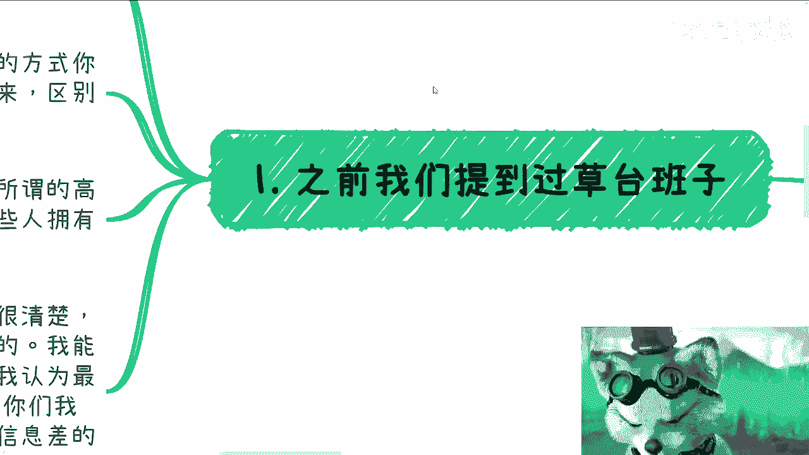

之前我们提过草草台班子，对不对，好，其实草台班子背后啊，我想表达的核心逻辑有两个，一个是什么，任何一个位置上的人，你甭管他是谁，哪怕他妈的是领导啊，咱不管他是谁啊，他坐在那个位置上。

仅仅是因为天时地利人和你明白吗，不是说啊他多优秀啊，或者怎么样子没有的啊，我告诉你们不存在的而不存在的好，第二点，任何一个位置的人，他终究就是个人，我就告诉你，他能想得到的方式，你一定想不到。

他能做出来的文件，你也一定能做得出来啊，区别仅仅在于它在这个位置上，他掌握了一些信息，你不在你不知道，所以你在外面去看，你觉得牛逼，你觉得高大上，其实他妈的没卵用啊，所以我告诉你们。

本质上并不存存在谁牛逼，谁不牛逼，或者所谓的高大上，大家其实都是一样的，唯一不同的是什么，就是一些人拥有的信息差，但大部分人没有办法了解这个信息差啊，当然为什么不能了解，我就告诉你们这个世界的规则。

他就不想你们了解对吧，那么在我的充电视频跟咨询里面，我也想跟大家说的很清楚呃，我跟很多人沟通说，我都会告诉他是什么呢，就是你但凡想要一个方案，想要一个方法，说我车20，你给我一个东西啊，未来我怎么走。

怎么赚钱，我告诉你不可能的，怎么会有这种东西呢，对不对啊，我能告诉你们的是什么，就是结合你们自己的情况，给出我认为最符合当下社会发展，或者最符合当下中国发展的建议，以及我能告诉你们的是。

我经历过我所看过的案例，而这些东西就是我所谓的信息差之间的啊，当中的冰山一角，但是接下来的决定和思考，还有到底具体落地怎么做。

这是你们自己去决定的，而不是说我帮你们看，我他妈怎么知道呢，对不对啊，那么第二点，你们大部分人是没法做判断和选择的啊。

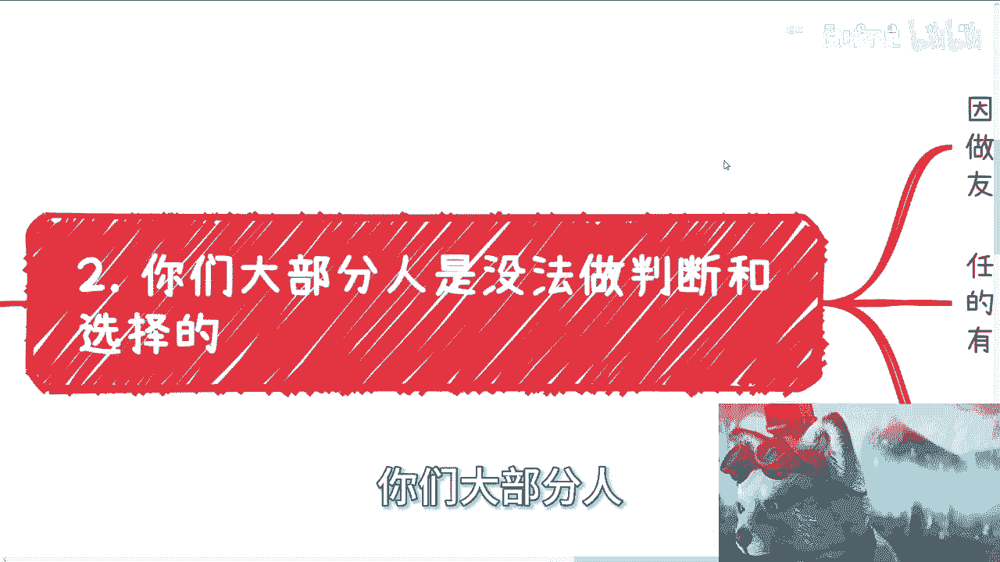

或者没有依据，为什么，因为你们没有足够的信息，你别说没有足够的信息，你连一点有用的信息都没有，你怎么去做判断和选择，怎么做，或者身边的朋友信息。

你就能去做决定决定了啊，这他妈BUSHIT嘛，对不对啊，第二任何一个行业，任何一个产业都是无数种啊，就都有无数种自己赚钱方式啊，包括高高性价比赚钱方式，你很多人评论区啊，或者其他地方还要跟我杠对吧。

说什么说啊，这个哎我们除了考研啊，除了考公，我们他妈没别的路，我告诉你你没别的路，就他妈是因为你不懂有信息差哦，你有心自杀不代表你没别的路好吗，我们不知道不代表没有，不代表不存在好吗，好好这第二点。

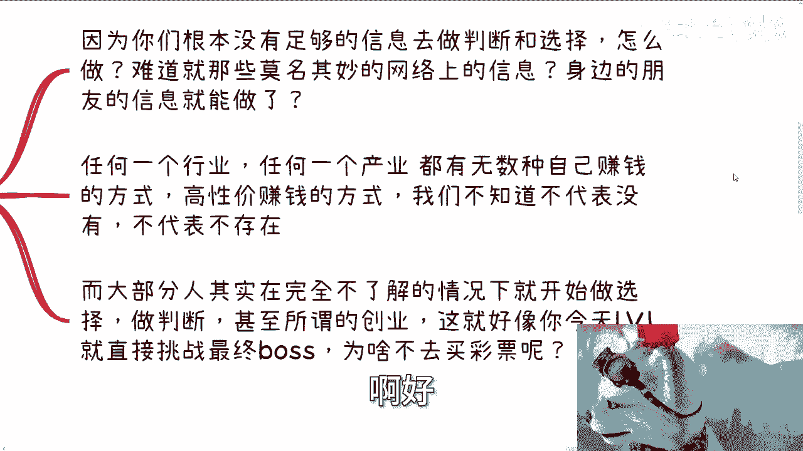

第三点，大部分的人其实对当下的情况他是完全不了解，那你完全不了解的情况下，你去做选择，做判断，甚至去做所谓的产品，做所谓的服务，做所谓的创业，你就好像你今天是一个LV1级的新手村的人，对吧。

直接挑战最终boss，怎么不去直接买彩票呢。

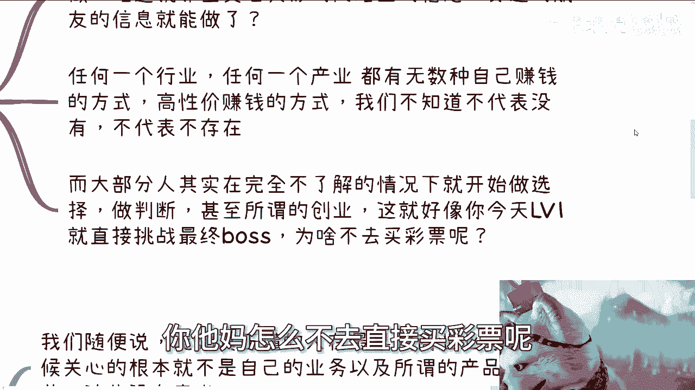

对不对啊，好第三点我们就来直接的说，比如说某些title和某些所谓的铺垫啊。

和某些所谓的背景啊，我们随便说啊，比如说我告诉你们真正懂的人，在最早做商务商业的时候，他他妈关心的关心的根本就不是自己的业务。

也不是关心所谓的产品，更不是关心所谓的服务的细节，这些都是没有意义的。

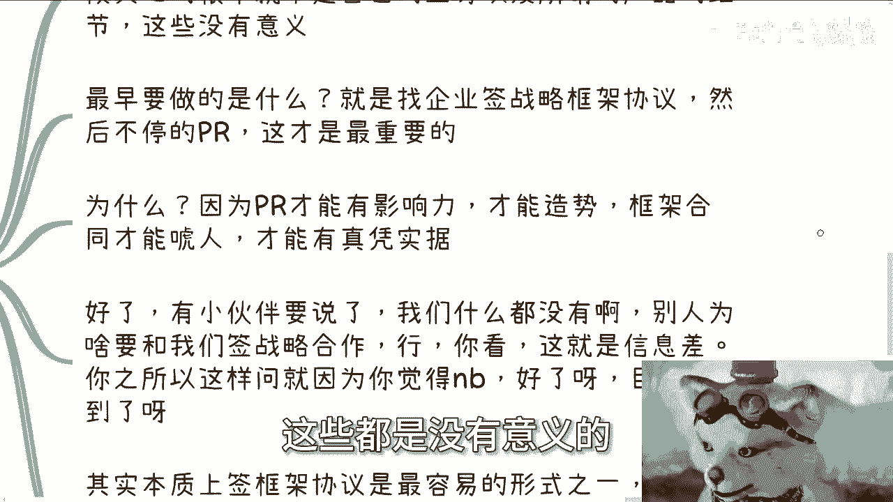

为什么，因为的确没有意义，我请问你关注产品的细节，关注服务的细节，能能换来钱吗，能换来个屁，对不对，你能换来信息差吗，也没有，你这叫什么叫闭门造车啊，那么我告诉你们最早要做的是什么。

就是找各种各样的企业，你甭管他阿猫阿狗，三教九流，找各种各样的企业来签战略合作框架协议，然后不停的PR。

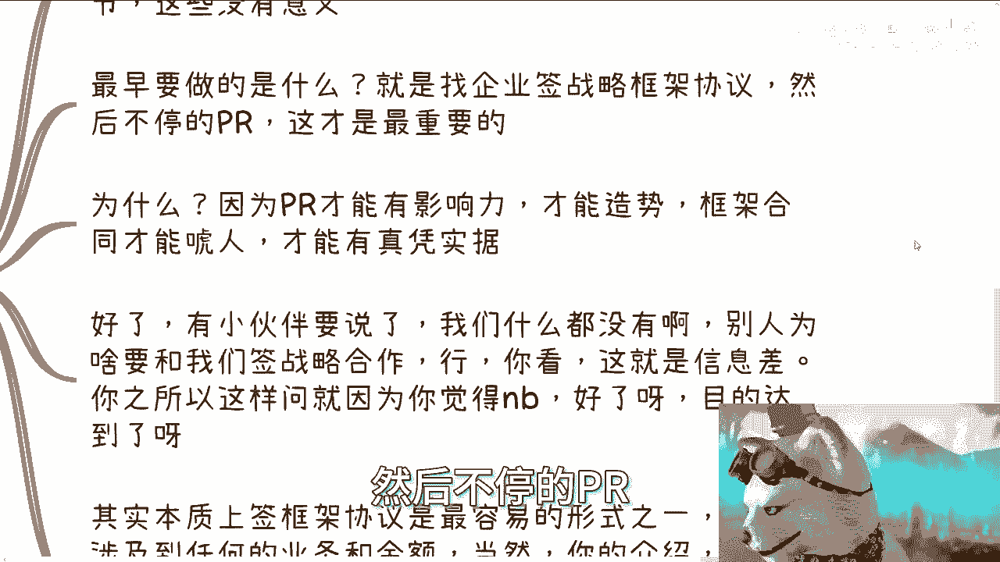

这才是最重要的，为什么，因为pr你才能有影响力，pr才能有造势，你框架合同才能唬人，才能有真凭实据。

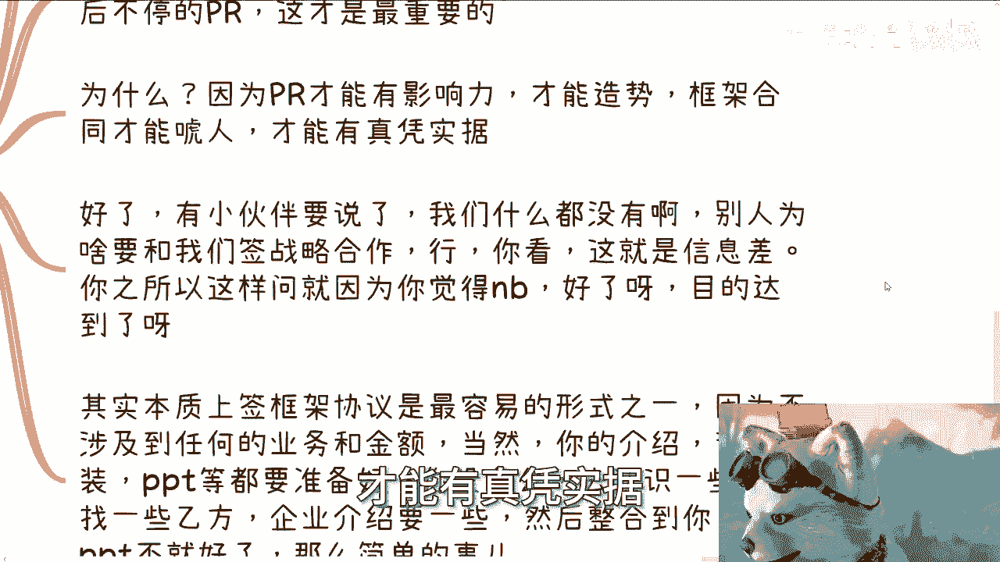

拿别的东西有屁用啊啊，你跑出来，你说哎老子这个产品做的多么牛逼，这个服务做的多么好，有什么用，搞笑的有什么用，你觉得这个还是那句话吗，你觉得你能不能赚到钱，是你说了算的吗，早就说过了，不是你说了算的。

是对方甲方爸爸说了算的，是这个市场说了算的，对不对，那你今天跑到一个市场里面说，卧槽老子多牛逼，有用的了，有用的了，对不对啊，好了，有时候伙伴要说了对吧，每次说到这里啊，小伙伴就要说了，嗯嗯我们没有啊。

我们什么都没有啊，别人要跟我们签战略，还别人为什么要跟我们签战略方向协议呢，对不对，好，我告诉你，你看啊，这就是信息差，你之所以会这样问，就是因为你觉得牛逼呀，你觉得这个东西好像不好弄啊，对不对。

那对了呀。

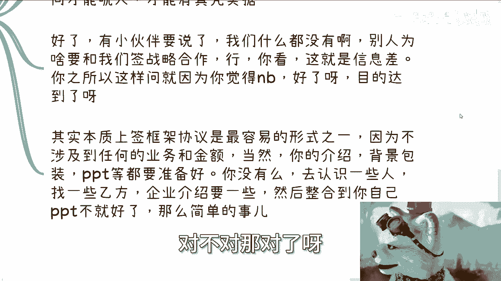

目的达到了呀，为什么，因为我告诉你们，本质上你但凡只要签过，你就会明白，框架协议其实是最容易的形式之一，为什么，因为它不涉及不涉及到任何的业务跟金额，当然你的介绍产企业的介绍背景的包装PPT等。

你都得准备好对吧，你没有没有嘛，你去认识一些人呀，找一些甲方呀，企业介绍要一些呀，对不对，你你每个企业都有企业介绍，都有官网，你这我就告诉你，你就整合到你自己的PPT里面不就好了吗，这么简单的事对吧。

那当然和我告诉你吧，你你整合到你pp里面，不叫你抄别人对吧，只是你你也要营造信息差，让你的甲方觉得你是有业务的，你是你是有团队的，你是有这个产品的，你最终外包给别人不就好了吗，分点钱给别人不就好了吗。

对不啦，不是说你抄呀，你也没能力抄啊对吧，但是你怎么白手起家呢，你只能这么白手起家呀，这他妈叫信息差呀对吧。

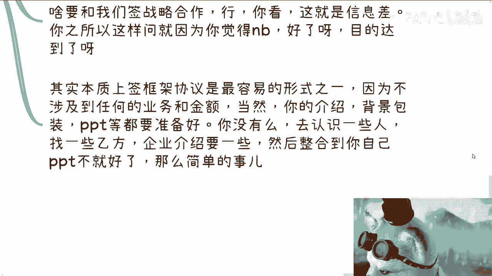

好第四点，我告诉你们，记住你们获取信息差的难度越来越高啊。

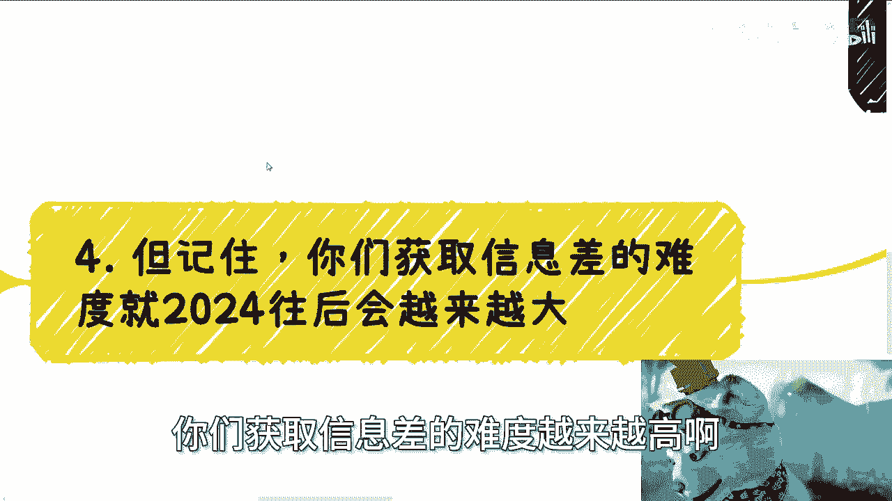

越来越高，为什么很简单，因为近几年，既得利益者跟资本家早就已经抱团了，你们但凡去做商业，你们就会明白现在越来越艰难，为什么，因为大家越来越排外，为什么，因为V因为要赚钱。

但是为什么你们去获取难度越来越大，因为你们相对，这些抱抱团的既得利益者和资本家，你们就是bug，你们就是外来的病菌，为什么，因为你们没有合作过，你们是陌生人啊，谁敢去和陌生人合作，对吧。

我们跟陌生人合作，我们冒冒着风险去赚这点钱，我就告诉你们钱我情愿不赚，就这就这就这么简单，我不愿意冒风险，因为什么，因为2024年的中国，没有什么东西比安全比稳定更重要，就这么简单啊，对不对。

你不要来跟我讲他妈的什么叫考公稳定，什么那种稳定，那些他妈都是屁啊。

这他妈叫稳定啊，只有赚钱才叫稳定的啊，只有关系链才叫稳定的啊，好吧还是那句话，网络上不会出现任何高性价比赚钱的方式，也不可能有任何的那种，就比如说像我涉及到的政企，高校等相关机构的这种合作的一手信息。

有看到过，未来你们哪个人有看到过，你们看到的都是结果，对不对对吧，因为真正的一手信息，它只会在抱团的这个团体内，那我举不好听一点对吧，未来高校有单子，企业有单子，政府有单子，他们第一时间也只会来找我。

他会第一时间把东西发到网上吗，啊你看到过中国哪个地方政府，哪个哪个中央哪个地方，哪个地方政府，哪个哪个这种高校，他们做事情这么做的，没有的呀，对不了，我就告诉你们，就算公开招投标的有很多他妈的也是走官。

也是最终是关系拿下来的，你招投标其实是去陪标的对吧，这种事情多了去了哦，你竟然会相信网上会有所谓的信息差，这莫名其妙啊，而且我就你们你们换位思考一下，如果你们哪天能够用信息差赚到高性价比的钱。

你会把它放到网上吗，你不会的呀，对不啦，一个道理啊，就像就像我跟你们讲的，我的那个叫什么，就充电视频也好，你们咨询我也好，对不对，我只会跟你们讲我所了解的信息差对吧。

但是我了解的信息差不代表你们一定能做啊，而且你们如果真的能做，对我来讲你不影响我的蛋糕啊，你明白吧，就是说你但凡能做你更多的，我跟你是合作关系，为什么，因为你没有办法拿走我的关系啊，对不对。

我你想想看这种信息下是什么意思，就是我会告诉你，我这边会有新的单子啊，然后你跟我一起去赚钱，是这种逻辑，对不对，那好了，有很多人要问了，那车老师，你自己赚不香吗，我就告诉你，我一个人坐不动啊，我是香啊。

我做不动啊，你明白吧，卧槽哎，我就这么跟你们讲啊，别的我不说，你知道吗，高校这边跟我合作，他一要就是要三四百个课时，我怎么做啊，弄死我啊，你想想看三四百个课是什么概念，对不对。

哎很多时候不是你们想的那样哦。

我跟你们讲，你们自己好好考量考量。

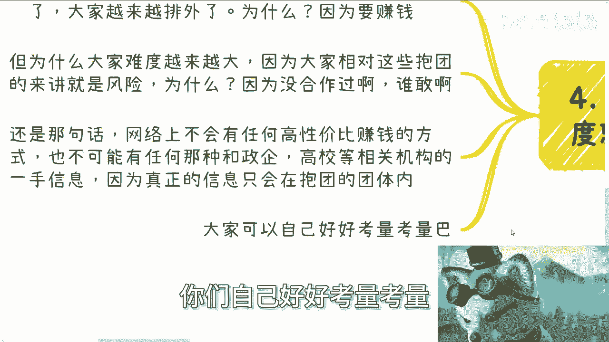

真的考量考量就这么回事啊，就是你们看短视频啊，看别的东西，看大家什么朋友圈啊，这个乌里玛丽，乌里玛丽，有的没的，在那边讲来讲去啊，2024年到时候过掉了，25年过去了之后，一切你都是你们自己买单。

你知道吗，就是我就告诉你们，你们看我所有的视频，你们现在可能不会太理解，但你们未来早晚有一天会理解的，但到那个时候已经晚了，好吧好结果这样子好吧，就这样子啊，深圳的活动啊，就是报名，你们要报名的。

私信我好吧，然后剩下的比如说有什么合同啊，有什么有什么创业东西啊对吧，有什么未来的规划啊对吧，或者怎么样的，你们可以呃整理好问题，如果觉得就是说需要一个完整的咨询的话，你们可以整理好问题。

我们再做咨询好吧。