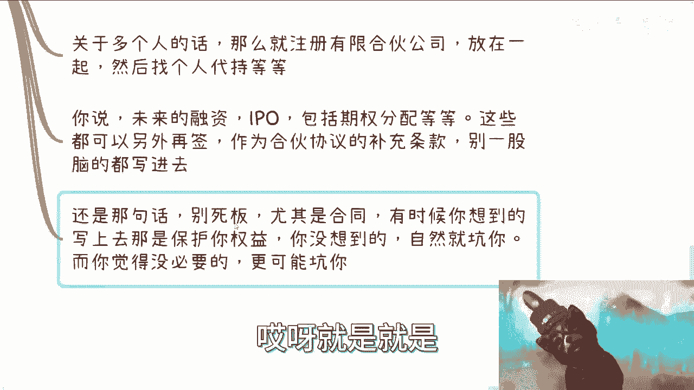

# 注册公司不是必须的-创业也不代表一定要融资和有所谓的团队---P1---赏味不足---BV1xN4y

在本节课中，我们将探讨关于创业、注册公司、团队和融资的几个常见误解。我们将逐一分析这些概念，帮助你建立更清晰、更务实的创业认知。

## 创业的本质：从模糊到清晰

上一节我们提到了课程的主题，本节中我们来看看“创业”这个词的真实含义。

许多人听到“创业”，脑海中会立刻浮现出注册公司、组建团队、寻求融资等一系列复杂场景。这种理解比较模糊。

从宏观角度来看，**创业 = 在劳动合同之外创造自己的收入**。只要你在本职工作之外，通过自己的努力获得了收入，本质上就是在开创自己的事业。创业的成功与否，取决于业务做得好不好，而不在于形式是否“正规”。

在当前环境下，不建议进行大量的资金投入。业务能做则做，不能做则不要勉强。创业的核心是创造价值并获得回报，而不是必须完成注册公司或组建团队这些特定动作。

## 关于注册公司：必要性分析

上一节我们澄清了创业的本质，本节中我们来看看“注册公司”这个具体动作。

注册公司本身在2023年已经非常便捷，通常可以委托代理公司办理。例如，在上海地区，代理注册加年度报账服务的费用可能在 **4000元/年** 左右。

然而，是否注册公司应基于明确的业务需求，而非跟风或执念。注册公司的决策应看准契机。

以下是注册公司的主要考量点：

*   **业务确定性**：你是否有非常确定要开展、并且能产生营收的业务？
*   **合作正规性**：你的上下游合作伙伴是否值得你以正规公司主体进行长期合作？这取决于对方是否可靠，而非你一厢情愿。
*   **背书与资源**：是否有股东（可能是企业）能为你提供背书或关键资源？
*   **清晰的合作**：与合伙人开展业务前，是否已进行充分的市场调研？能否清晰回答客户是谁、付费多少、客户从哪里来等核心问题？

如果以上问题答案都是模糊的，那么盲目注册公司可能带来不必要的麻烦，例如后续还需要办理注销。公司的成立应服务于明确的、有价值的商业行为。

## 关于合伙人协议：核心要点

上一节我们讨论了注册公司的时机，本节中我们来看看创业中常见的“合伙人协议”问题。

合伙人协议需要根据具体情况（Case by Case）来拟定，没有放之四海而皆准的模板。如果对方提供的协议条款包罗万象，看似专业，反而需要警惕，因为这可能意味着对方并不真正专业，或者存在“画饼”嫌疑。

获取合同框架的途径可以是咨询律师，或向对方索要框架协议进行讨论。协议的核心内容应围绕双方具体的合作方式展开。

以下是签订合伙人协议时的关键行动指南：

*   **明确权责利**：避免使用“我感觉”这类模糊表述。必须通过谈判明确：**“我做什么，你做什么，我占多少股份”**。
*   **协议核心**：协议应主要约定股权分配、各方权益、违约责任等。
*   **多方签署**：通常，所有合伙人/股东应共同签署一份多方协议。
*   **灵活处理未来事项**：对于未来的融资、IPO、期权池等遥远且不确定的事项，不必在初期协议中过度细化。这些可以作为补充条款，在未来时机成熟时另行签订。没有人是先知，初期协议应聚焦于解决当前可见的合作问题。

在审阅合同时，不要害怕提问。对于任何不理解的条款，直接询问“**为什么合同要写上这个东西？**”商业合作本身就是一个不断沟通和博弈（Battle）的过程，清晰的质疑是为了避免未来的陷阱。

## 关于团队建设：目的与执念

上一节我们剖析了合伙人协议，本节中我们来看看“团队”这个概念的真正目的。

是否需要组建团队，与你所做的具体事情强相关，而非创业的标配。

以下是需要组建团队的几种典型情况：

*   **硬性要求**：例如，承接某些政府、国企项目时，对方会对团队的学历构成（本科率、硕士率）、专利、资质认证（如ISO标准）有明确要求。
*   **业务规模化**：当你的个人业务模式已经跑通并产生稳定收入（例如每月盈利10万元），你希望将自己从具体执行中解放出来，用钱购买时间和效率，从而实现“躺赚”。这时，招募人员来分担工作就成为必要。

组建团队的本质目的是**通过购买他人的时间和技能，来提升效率或解放自己**，而不是为了满足“拥有团队很厉害”的虚荣心或社会固有观念。

要警惕关于团队的执念。有团队与否，与一个人是否专业、一家公司能否赚钱**没有必然的因果关系**。许多成功的初期项目都是由个人或极小的核心单元完成的。盲目追求团队形式，可能会带来巨大的管理负担和沟通成本，这些苦衷往往外人难以体会。放下无谓的执念，聚焦于业务本身和效率提升，才是根本。

## 核心总结与行动建议

本节课中我们一起学习了关于创业的几个核心认知。

1.  **创业定义**：创业是创造劳动合同之外的收入，重在实质而非形式。
2.  **公司注册**：公司是工具，应在业务明确、合作正规的需求出现时注册，而非创业起点。
3.  **合伙人协议**：协议需量身定制，明确权责利，对模糊条款敢于提问，未来事项可灵活处理。
4.  **团队建设**：团队是提升效率或满足特定要求的工具，而非装点门面的执念，其存在与成功无必然联系。

对于初学者，最关键的一点是：**在行动前，先努力消除“一无所知”的状态**。大部分人在校园教育后，对商业世界的实际规则是陌生的。不要基于模糊的感觉或道听途说来行动，否则每一步都可能是陷阱。在做任何事之前，先尝试了解基本信息：你的客户是谁？他们为什么付费？你如何触达他们？只有带着基本认知去实践和试错，路径才会清晰。

商业世界没有标准答案，需要的是清晰的思考、灵活的应变和敢于沟通的勇气。希望本课内容能帮助你举一反三，以更务实、更开放的心态面对未来的各种可能性。