# 注册公司不是必须的，创业也不代表一定要融资和有所谓的团队 - P1 - 赏味不足 - BV1xN4y127Ci

大家好呃，首先还是那个事情啊，抖音上那个假账号真的气笑我了，照抄呢都是从头抄到尾的，大家记得帮我点一下举报啊，就是从名字到介绍到内容都一模一样，我也是真的气笑了啊，啊首先我们来说一下这个啊。

对这个今天我们继续来说一下啊，就是啊上海这个活动啊，我已经订好了，12月16号呃，这次呢我也请了，就是之前跟我一起合作了，有合作好多年了，45年了，一个英国留学的那个小伙伴啊。

然后给大家分享这个数据治理，然后相关的这个内容啊，然后我呢来给大家讲这个数字经济好吧，然后大家报名的可以私信我，然后北京活动已经满了好吧，北京活动就塞不下了，只能上海了。

那么我们本次呢主要来讲的是注册公司，不代表要创业啊，创业也不代表就一定要融资和有所谓的团队呃，因为什么呢，因为最近聊下来呢，其实也有一些小伙伴嗯有点资历了啊，然后就是在弄合伙人，再弄一些相关的东西。

所以我就想着就说索性也跟大家说一下。

呃，首先呢我发现大家对创业呢它比较模糊啊，就是说呃你一听到创业，可能就觉得还是一家公司啊，然后是一个团队啊，然后比如说阿里巴巴百百度字节，或者说是那种就是融资ABCD，EFG的这种公司啊。

或者说就是说他一听到这个创业呢，就觉得说我要拉团队啊，反正就很复杂啊，其实我个人觉得啊，模糊点来讲啊，你但凡有自己的收入啊，本质上就是创业，也就是说你但凡在劳动合同以外有自己的收入，我觉得都算创业对吧。

因为你宏观点来讲嘛，这怎么不算创业呢，你创自己的业嘛，对创业创业创自己的事业嘛，能创业嘛对吧，但是按照我理解的，创业本身也看创的好不好啊，就如我之前轻资产那一期说的，就当下这个情况呢。

所有的资金投入我其实都是不建议的啊，你很多业务能做就做，那不能做其实也不要硬做呃，但是不是说一定要去弄一个公司，或者说一定要拉个团队啊，因为之前沟通咨询下来，有些小伙有些小伙伴啊，他比较有执念啊。

他就觉得就是说我创业就一定是要去融资，ABCDE的啊，包括就是他们创业就是比较恐惧嘛，他上来就觉得啊，我弄错公司对吧，我公司弄不来啊，然后弄了公司之后要不要融资对吧，就是就是我发现啊。

就是大大家做事情呢，呃往往都是在做自己不熟悉的东西，但是呢他也没有去熟悉这个认知，你知道吗，就是就是你看我讲到现在为止，我发现其实大家还是一样的，就是就是你们去做一件事情呢，其实这件事情你们是不了解的。

但是大部分人呢他没有这个了解的意识啊，然后就开始干那干了吧，你就会发现你这个不懂那个不懂对吧，那这个不是很正常吗，是不是啊，别他怎么又不识别了，嘿嘿嘿嘿，怎么回事，垃圾诶诶诶诶好了好了好了啊。

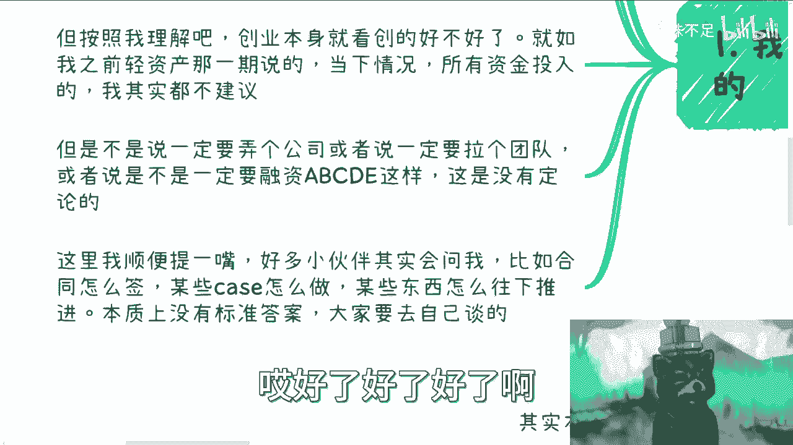

然后这是一个啊，那么这里我顺嘴提一嘴啊，就是好多小伙伴会问我，比如说合同怎么签啊，比如说这个case怎么做啊，某些东西怎么往下推进啊，这个东西还是那句话啊，你们只要到了商业上没有标准答案。

你你你不可能说，你今天比如说签个什么什么什么合伙人合同，然后你问我就是你有我我有没有什么合同给你，我就算给你，你也不能照签啊对吧，你还是得要去改里面的东西的啊。

那么这是第一个，第二个呢就是说关于这个注册公司啊。

但是要注册公司呢是不是很烦，或者说是不是说代表后面很多事啊，这个是不一定，因为公司这个事情呢，首先啊注册本身就很容易了，因为毕竟都2023年了，你说注册公司有啥难的，对不对。

一般你找个代理公司注册加报账啊，他可以付个年费。

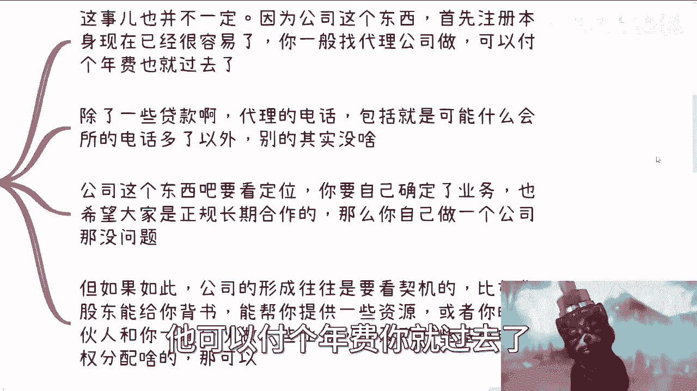

你就过去了，反正上海这边我现在付4000块钱吧，那么你注册之后呢。

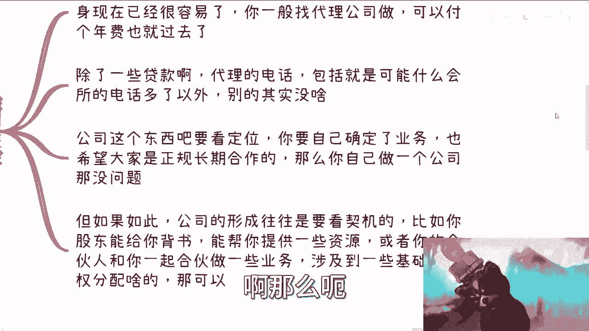

除了一些贷款代理，说白了就是你电话被卖了，那么包括就是说有可能会有些什么会所啊对吧，各种各样银行贷款啊对吧，其他其实也没什么啊，那么公司这个东西呢其实要看你定位，就是你除非啊是非常确定了你要做业务。

并且这个业务是有营收的啊，那么同时呢，你也觉得你跟上下游，是希望那个长期的正规的合作，那这个地方呢我有一个呃这个隐藏的意思啊，这个隐藏的意思就是说，不是说你想正规长期的合作，而是说你觉得这个上下游值得。

让你正规的长期合作，而不是属于那种打一枪换一个地方的啊，你要是就是摸不准的对吧，吃不准的或者摸不清楚的，你说啊，我现在要做了，我就莫名其妙注册个公司，那没必要。

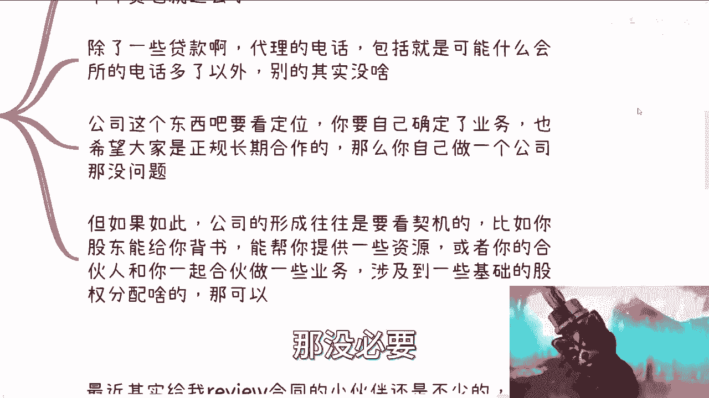

你回的话还得注销，没有必要，很烦呐啊，但是呢就是呃就是诶我这边写的啥玩意儿啊，我说我说除除除除除去此外就是除掉这些啊，我们说公司的行程呢往往是要看契机的，就是比如啊你比如说你的股东啊，能给你背书。

那么你说哎我可能跟跟这个股东对吧，成立一家公司，因为你的股东不一定，你的股东不一定是个人啊对吧，往往是一些企业嘛对吧，那你说这个企业能给你背书吧，或者说能给你提供一些资源。

或者说你的合伙人跟你一起合伙做一些业务，同时呢这些业务你也是很看好的啊，同时呢就是说啊，当然啊你一定要做市场调研啊，就我发现很多人做业务是这样子的，他说他说吕老师，我我我我跟我小伙伴做一些东西。

我就问他，我说你客户是谁呃，付多少钱对吧，哪里来，他一问三不知对吧，那你这些东西都要摸清楚了，你说好，那么我跟合伙人做些业务。

涉及到一些基础的股权分配啊，那OK那你去做啊，我觉得没毛病。

就这个是很正常嘛对吧，你商业行为嘛，对不对啊，那么第三点。

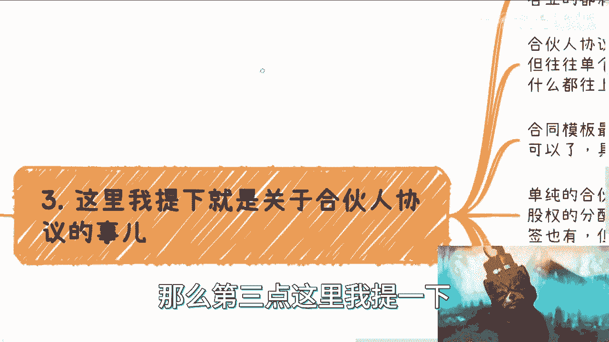

这里我提一下关于合伙人协议这个事情啊，因为最近呢找我review啊，这个合同的小伙伴呢其实也是蛮多的啊，各行各业都有医疗啊，金融啊啊这个各种各样的啊，那么合伙人协议呢是这样子的。

一般呢呃的确是看合同怎么写，但是呢呃合伙人协议是这样子的，单个合同呢最好case by case啊，你别想着什么都往上写啊，什么都去写。

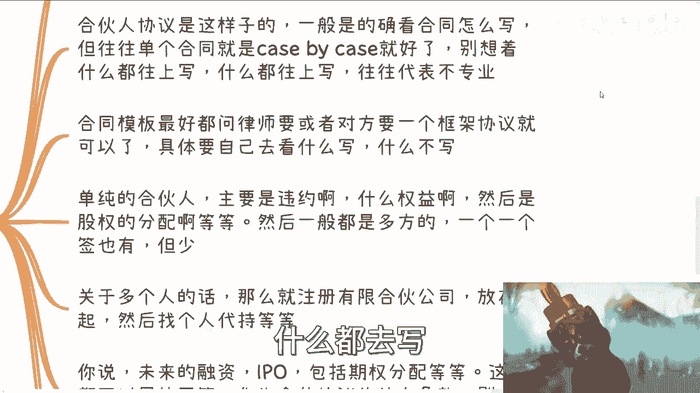

我我就这么跟你们讲啊，如果你们的合伙人或者你们的股东给你一份，合伙人协议，是什么都在上面的，那么你也要警惕，因为说明他其实并不专业啊，他给你可能画饼啊，画的好像你觉得他很专业。

但其实他妈的拿出来事情就很不专业啊，那么合同模板呢最好是问律师去要，或者说你问对方要一个框架协议也行哦，那么至于里面写什么东西，这个具体是要看你自己希望。

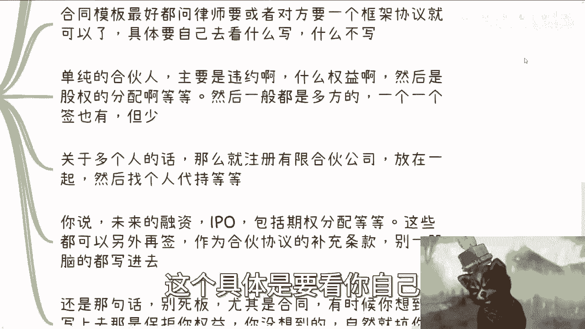

就在这里面达成怎么样的一个过程，那我就像昨天晚上一个小伙伴那个跟我咨询到，我就是跟他这么说的，就是他给我的说法都是什么呢，都是哎你看啊，我这边有个有个朋友啊，我这边有个亲戚啊。

我这边有个什么什么小合伙人啊，然后呢我跟他们是可以合作的啊，那么合作呢，就是我感觉我好像是个工具人或者怎么样，我就跟他说，我说不要你感觉你感觉有什么用啊，我说你去谈啊，对不对，就是我过来我做什么。

你做什么，我占多少股份，行不行行，就签合同，你别你感觉所有东西大家感觉没有用的，你懂吗，就是做任何东西都是一样的，你去谈啊，对吧啊咳咳，然后单纯的合伙人呢就是主要是违约对吧，包括你的一些权益啊。

主要的股权分配等等等，然后一般是多方的啊，呃就是比如说你三个合伙人，四个合伙人对吧，或者三个股东，四个股东你就一起签对吧。

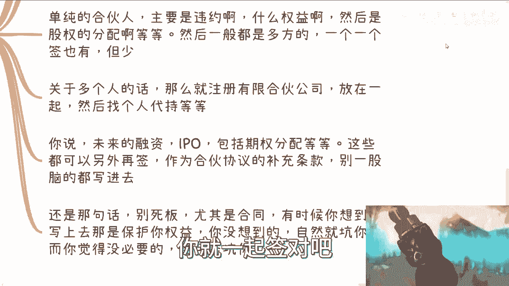

就多方的，你说一个个签有没有吧也有，但是这其实也不多啊。

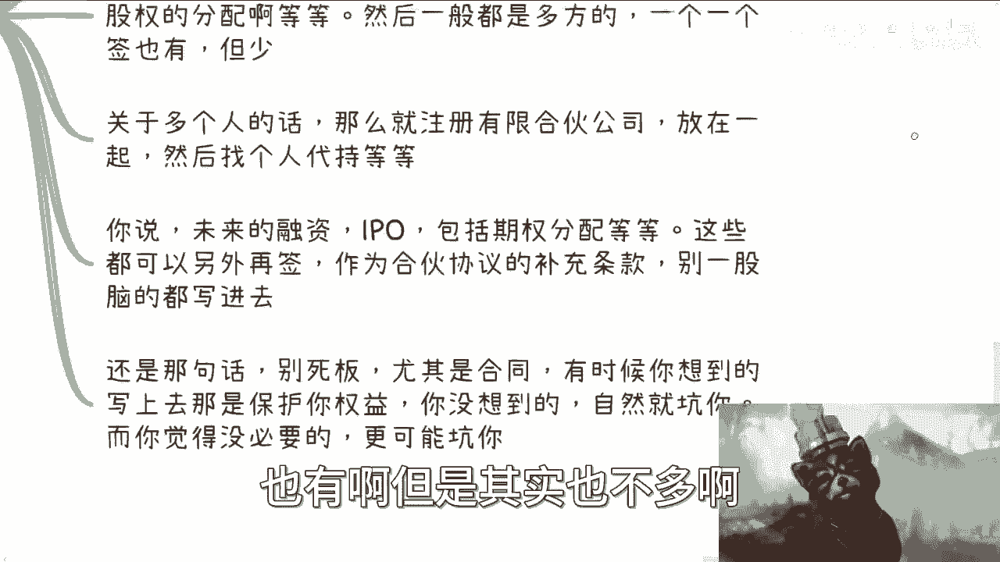

当然这个也没有个定论啊，也没有定论，我只是跟你们讲一般是怎么样子的啊，那么关于多个人的话呢，那么就注册有限合伙，你比如说你说啊有个5%的股份啊，你20个人要一起做吧，或者怎么样，你不可能。

你不可能在那个主要的股东名单上面去搞的嘛，对不对，那么你就注册个有限合伙公司，把这20个人扔进去。

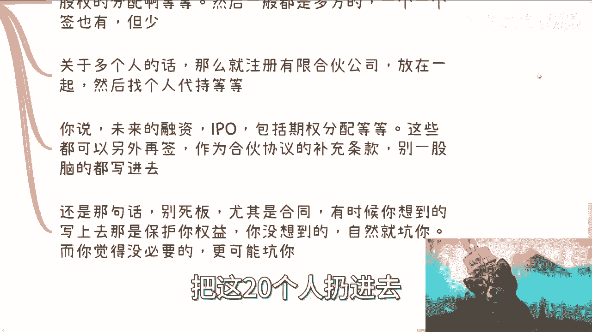

都作为有限合伙，对不对，然后找个人代持啊，这这这就结束了啊，那么你说关于这个未来的融资IPO啊，包括就是留给团队的期权分配啊，对吧，这些东西呢你要这么想啊，你们在一开始做这家公司的时候。

你们一定想不清楚的，没有人能想得清楚，没有人是先知，对不对，那么这些都可以另外再去签，作为合伙协议的补充条款，你可以未来再去签合同，无所谓的啊，可以的，而且一般也都是这么做的啊，你别一股脑的都写进去。

一一股脑写进去，谁知道未来怎么样子，哎哎我跟你讲很搞笑的，之前还有合同是什么，就说什么未来什么IPO对吧，然后股份怎么样怎么样，你怎么知道你IPO的时候股份怎么样啊，对不对啊，还是那句话啊，别死板。

尤其是合同，因为有时候呢我跟你讲啊，你想到的写上去呢是保护你的权益，你没有想到的写上去呢，呃也有可能保护你，但也有可能是坑你，而你觉得没必要的人，大概率都是坑你，你知道吗，就是因为很多人他哎呀。

就是就是我觉得大家不要怕你知道吧。

就是你不要觉得你不专业，或者你觉得你怎么样子。

你有什么东西你问对吧，你问嘛，你你就问他。

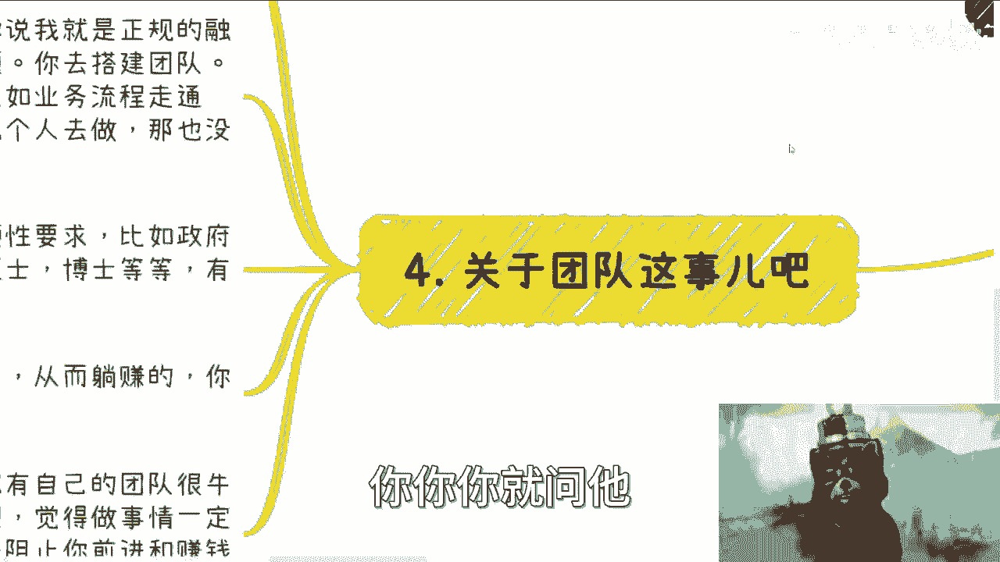

你说为什么合同要写上这个东西，你问吧，问了你又不少块肉，对不啦，你就是很多东西，我们辩论辩论辩论为什么要辩论，就是因为你有疑问对吧。

你有你你有问题，那大家开始battle吗，对啊，你都做商业了，你不battle你，你说你想你想你你你你你恐惧别人说什么东西，你是什么，那你做什么生意，你不就等着被坑吗啊然后再用最后一点呢。

就是关于团队这个事啊，呃其实本质上我觉得这个事情呢，也没有什么太大的这个这个纠结的点，因为这个事儿，本质上跟你做什么事情是有关系的，就比如说你说我要正规的融资啊，我要找找这个资方做团队，做产品。

那没问题，你去搭，对不对啊，包括就是说你要做一些小业务，比如说业务流程，业务流程去走通啊对吧，你需要把一些呃，这个这个这个自己脱离出来对吧，招几个人就相当于你现在业务已经成熟了啊。

你说我虽然每个月能赚个10万块钱，但是呢我不想自己再扑上去了，那么你就找一个人对吧，或者找几个人，一个人管理。

几个人干活对吧，那你就自己脱离出来嘛，啊那么团队这个是核心是什么呢，要么是硬性要求，就比如说政府项目啊，这个这个国企央企的合作啊，他说我要看中你这个团队对吧，你比如说多少本科率，多少硕士率。

多少博士率对吧，占占有多少比例对吧，然后有什么专利，有哪些ISO的标准对吧等等等，那你是需要的，但是除此以外，你搭建团队的本质目的是什么，不是为了装逼啊啊，你搭建团队的本质目的是为了让自己脱身。

从而躺赚对吧，也就是说你是在用钱来买你的效率，买你的时间啊，这个是你的本质啊，我们要放下一些执念。

就比如说貌似就是感觉自己有自己的团队，很牛逼对吧，或者说为了有一些固有的思想对吧，觉得做事情一定要有团队，包括啊我就说有些人啊，他会因为别人没有团队去喷人家，唉你有没有团队，你喷人家干嘛呢。

哦有团队就已经做得好，没团队一定做得不好吗，要命嘞，我跟你讲，这种都是纸上谈兵，你们他妈的去做做，我跟你讲，你们你们但凡以后要是有机会去弄个团队，你们自己就知道，你知道吗，就有苦自己知道。

这叫说不出来的，你懂吗，你我跟你讲，你碍于政府，碍于舆论，碍于你的团队，碍于你的合作合伙人，我跟你讲，你根本就说不出来的，你有苦自己知道啊，这个叫啊，不要现在年轻啊，没做过，然后就喷人家啊。

这个人没团队，这个人有团队对吧，这他妈有什么因果关系啊，我跟你讲，所有的这些执念，都是都是阻止你前进和赚钱的，这么一个根本问题啊，这些东西根本没有任何因果关系，和这个人专业或者和这家公司专业不专业。

和他能不能赚到钱。

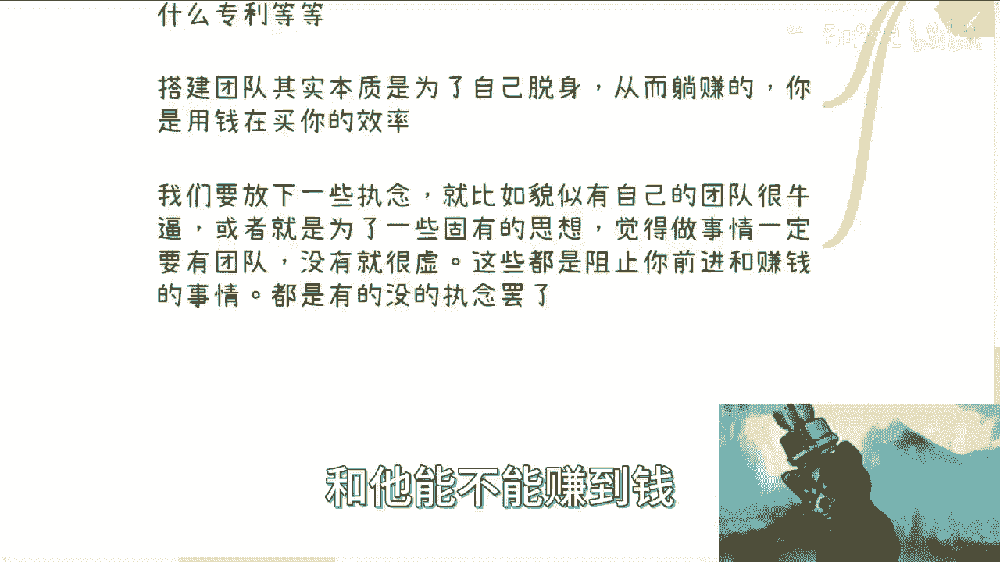

也没有任何因果关系，本质上这些东西都是有的没的执念而已哦。

所以说啊就是说嗯还是回到最核心的，我还是要说那句话，就是说大部分的人啊，你们除了本硕博读书以外，你们对外面的东西一无所知，那么一无所知呢，你们就不要去，就是直接干对吧，因为你无一无所知，你怎么干的。

你一干了就一步一个坑，那你要是觉得你你你你资金足够足够够惨，你试错成本足够低，那你去做对吧，那大概率你做事情之前总会先了解一下嘛对吧，你不能以讹传讹的，就大家说啊，这个大大众觉得这个不好啊。

大众觉得那个不好对吧，你就像我跟你们讲，昨天还有个人呢，就是找我咨询的钱都打过来了，我就把他退回去了，我说你别找我对吧，我说你现在找我，你你你问出来的东西也问不到点子上，我回你，我也回不到点子上。

你给我这钱干嘛，我不要，我就直接退回去对吧，包括之前也是的，就是就是我感觉就是对方明显是个韭菜，你知道吗，什么叫韭菜，就是他不懂啊，他不懂啊对吧，那你不懂，你问出来问题不在点子上，你问我有什么用呢。

你别说今天付给我咨询你，你付给我5万，付给我10万都没用了对吧，因为我说实话，你付给我10万，我带你可以，我带不动啊，我怎么带啊，不我会去考量这件事情，就是我带你这10万块钱，我我花出的精力。

说实话可能比我赚10万块钱还要累，对不对啊，所以就这个是核心啊，好嗯行啊，那希望就是说大家对很多事情呢能举一反三啊，就是说今天你说注册公司啊，创业是这么个故事，别的事情呢也是一样的啊。

不要太就是拘泥于做做人嘛，要灵活一点啊好吧，然后上海活动，反正你们就是看一下我的那个那个，B站的那个动态哦，了解一下，然后OK吗，你们就可以找我私信报名，然后剩下有什么，比如说就像他们要找我什么呃。

看一下合同的啊对吧，商业上面看看毕业之后怎么做的啊对吧，自己手上牌怎么打的啊。