# 测试面试之职业规划 - P1 - 赏味不足 - BV1Hs4y1a76t

好啊大家好啊，那个首先祝大家情人节快乐啊。

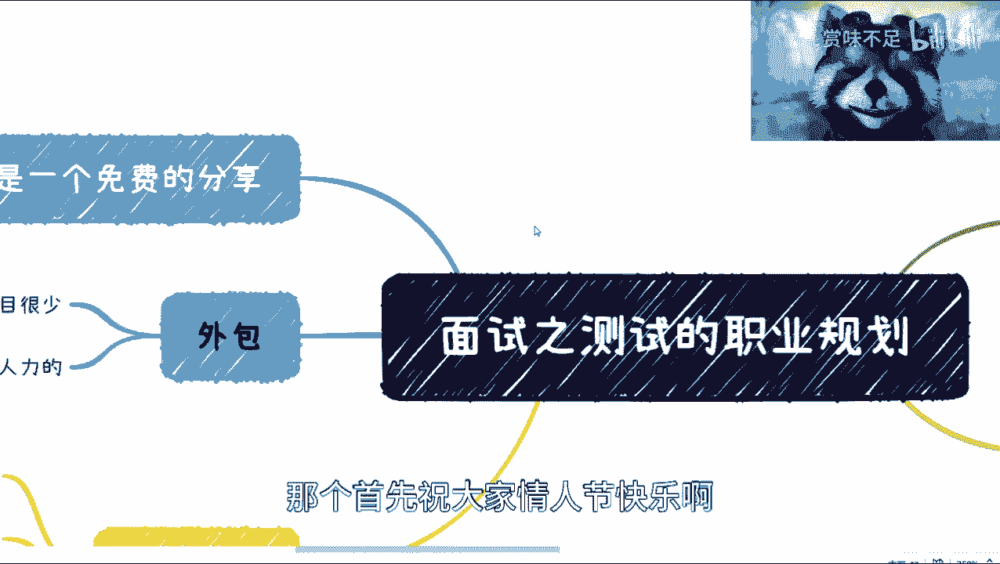

呃然后我在这个地方呢想再强调一下，因为我发现很多人这个私信评论啊，都这个跟我说啊，我说的东西都是这个说半段啊，然后说这个这个大家都知道啊。

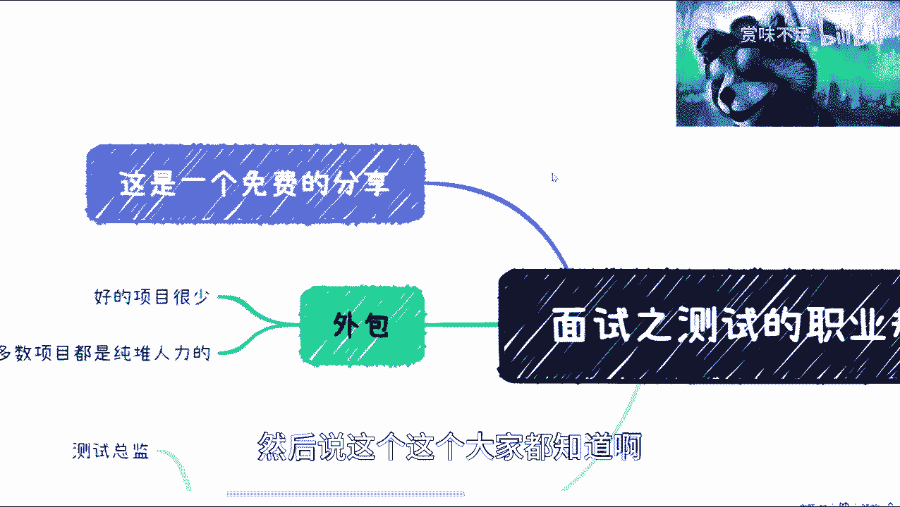

呃首先呢我觉得是这样子的，这个我这个都是一个免费分享对吧，第二呢我觉得我能说的我也都说了啊，不存在什么藏不藏半段的问题，那另外一方面呢就是也有很多人私信问我啊，我都是一条条回的啊。

而且回到就是说大家都是没有问题的维持啊，我也没说，我也没说啊，我回你了，我要收个费啊。

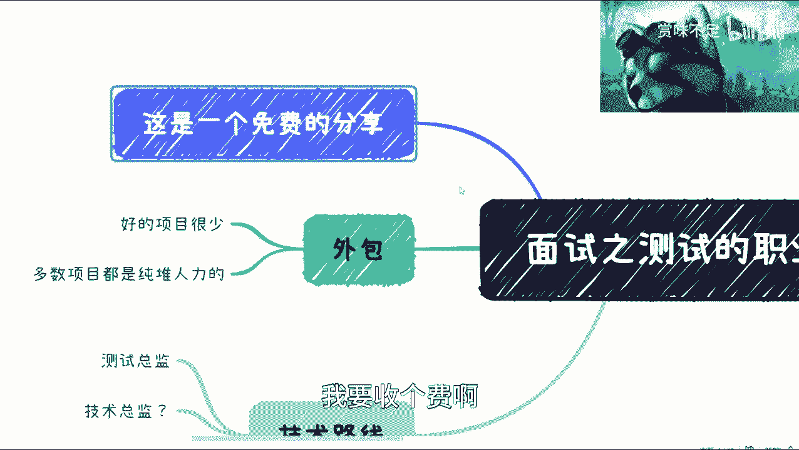

这个大家随缘好吧，咳咳咳啊，我觉得现在这个像我这么直接帮大家去说对吧。

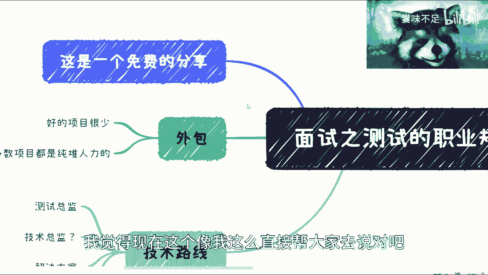

就是为大家着想的就很少了好吧，别再把整个网络环境搞这么差啊。

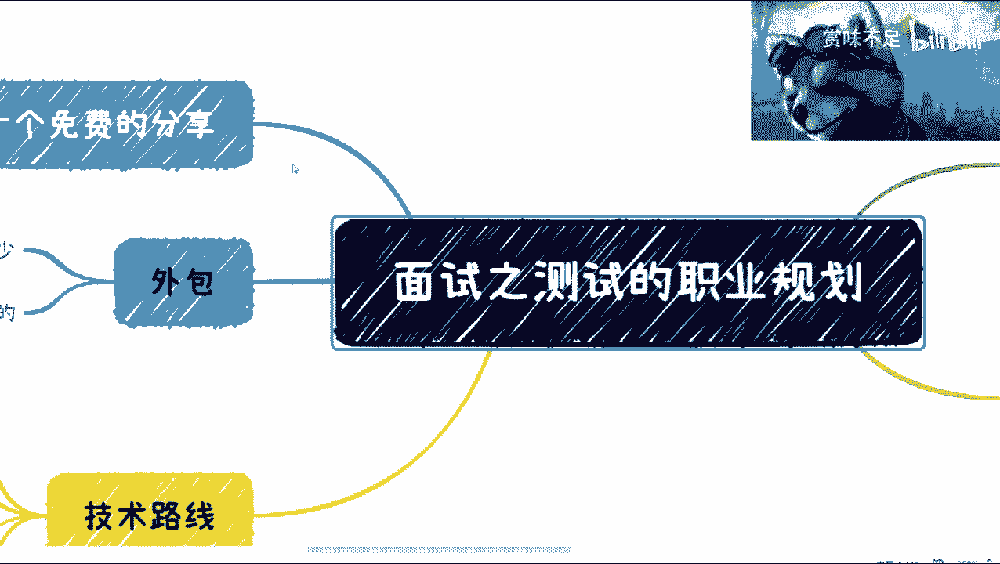

那么，这一期呢我想开始从那个面试开始讲了，按照之前的这个叫做计划啊，但是面试本身呢我想了一下，就是呃东西蛮多的啊，我不可能在一期里讲调，那么我就打算就是说呃分几块啊，那么这一块呢是这个测试。

首先啊我们说面试之前肯定还有简历对吧，还有别的东西呢，回头我这个一个一个个拆开来说啊，啊我们先说这个整体职业规划，因为你做一个事情呢，你得对全局的有个了解对吧，你对全局没了解呢，你说你要去面试。

你要去怎么样，这个改这个成功率不大的啊。

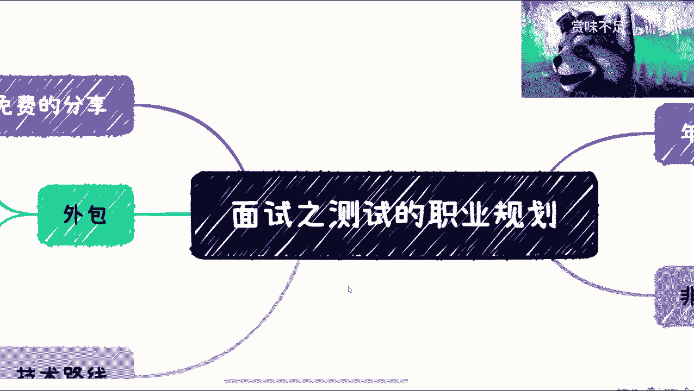

呃我在这个地方呢列了几点啊，这个能想得到的，我们来看啊，首先这个关于外包啊。

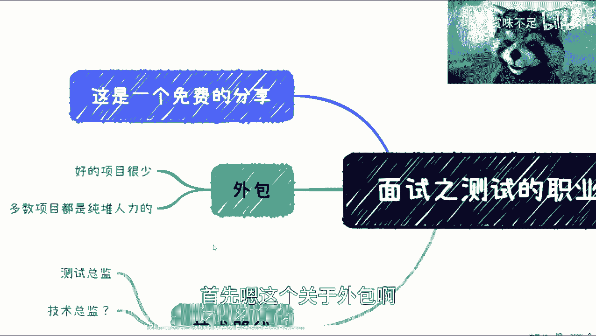

嗯外包呢其实整个的这个好的项目呃，我觉得他好的项目只会越来越少啊，以前还是可能还蛮多的，就可能比如说2000 202010年吧，那段时间可能还有啊，但我觉得现在可能就越来越少了。

多数项目还是说是那种非人力的啊，那么我觉得这一款呢大家可以呃自己评估一下，就是我是觉得吧就是嗯去头去尾的平均来说啊，呃如果基数足够大的话，前几年啊你说你毕业一两年做过外包呢，我觉得问题不大啊。

但是你说你这个如果做的时间比较长了对吧，还是去外包呢，我是觉得除非是你生活所迫啊，否则我不是很建议做啊。

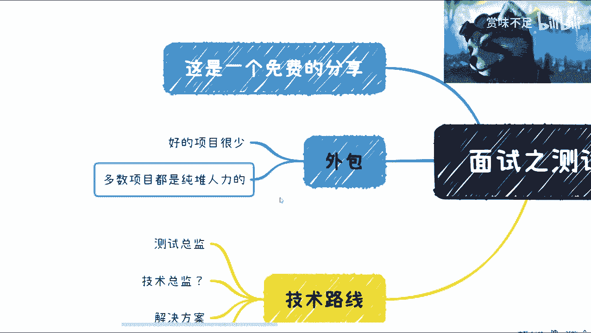

把机会留给年轻人吧对吧，我觉得这是一个呃，然后从整个这个路线来看呢，我说实话啊，就是，工作10年以及更多的呢，我看到测试呢几乎没有继续再做测试的嗯，应该说很少很少很少很少很少。

所以说呢我觉得我也想告诉大家，就是你们现在在做这个职业规划时候呢，你们就得想好了啊，就说往后怎么做，而且呢就随着你们的这个年龄增长呢，你们去这个做这个测试啊，到最后不是你们想不想做，是别人让不让你做啊。

我觉得这个地方就说的很明白了，就已经好吧，我觉得从技术路线来讲呢，就是测试总监是一个顶啊啊封顶了，但是你要说好做吧，其实也好做测试，做测试总监并不那么难呃，难是难在，就像我就像我前两天这个微博上也说啊。

我看看这个时间啊，对我在微博上也说，我说就是普通人，你要你要说什么月入8万10万难吗，我觉得不难真不难，难在什么地方，难在你要可持续发展了对吧，你说你做个测试总监，我这个派克就100万可以啊。

请问你能做几个月，你能做几年，你做得稳吗，做的久吗对吧，所以我觉得这个是问题，因为我就是我身边有蛮多那种，年纪也也比较大了对吧，以前都是在那个ACAP啊对吧，这个IBM嘛，那个腾讯百度啊。

做做测试总监呢，就人家到后面就不做了，但是你想想人家为什么不做啊，那不是因为不做啊，但这实在是做不下去了对吧，那我觉得这个是一块，那技术总监呢我就没看到过啊，真没看到过啊，所以我这个打的问号。

但是也不是说不能做哦，可以做嗯，然后解决方案呢我觉得就是说嗯相当于什么呢，就是说，唉这个要看公司吧，就可能游离在这种测试开发之间的啊，可以做一些就是就像solution这种的。

但这个可能也不见得每个公司都有啊，嗯然后就是这个测试开发，我觉得测试开发呢其实是一个呃，中期就成长到中期时候的这么一个呃，岗位或者一种形态，但是呢测试开发本身它也是可以分label的对吧。

并不是说你做测试开发哦，我就就就就就到这个水平了对吧，因为测试开发里面你也可以分啊，就一级二级三级四级，你做的好的对吧，也也很好对吧，呃但是呢还是我之前就说，前面几次分享所说到的。

就是说测试开发就是很四不像，这没办法，这是他的基因导致的，这是它整个中国互联网的这个环境导致的啊，所以说就是这个事儿呢，我就觉得就是说你比如说我在这个地方，给大家这个技术路径的几个方向对吧，你可以做啊。

但是呢我希望大家能明白一点，我就强调啊，真的强调，这可能最多也就是个5年到10年的职业规划了，不起来啊，这顶天了，我就跟你们说啊，啊也就是意味着什么呢，意味着你们现在在考虑这个问题的时候。

你们就得考虑好10年后你们做什么啊，听明白就是说不是考虑10年后测试做什么。

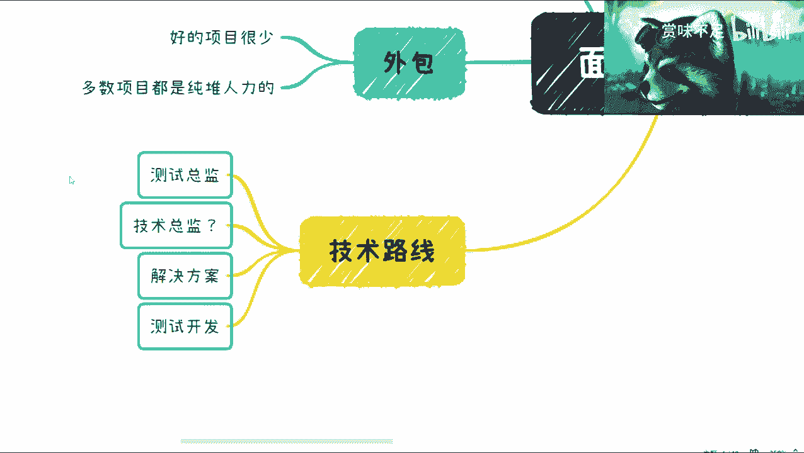

而是说几十年后你们做什么啊。

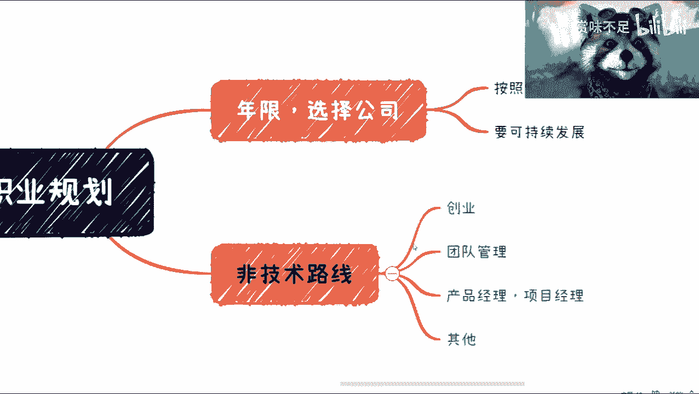

对吧，那么我们来换到这啊，换到这个啊，对我顺便提一嘴啊，就有很多人也会说啊，这个说我这个呃比较焦虑，我今天还在微博上跟别人说，我说第一呢你听不听我这个内容，你看不看我发的东西，焦虑都在哪啊。

不是因为我说了这个才焦虑的，首先这低一点啊，第二点是我是把整个市场仓上面，当下最真实的情况告诉你们啊，这个大家信则有，不信则不信还是有啊，就这么个情况啊啊非主线，我觉得我看到比较多的呢创业创业。

那创业这边呢有的是创产品的啊，有的是创就是测试类的这种解决方案的，也有的啊，就比如说什么性能测试平台啦对吧，众包平台啦对吧，等等等都有的哦，但是呢就是说嗯就测试做创业，还是嗯比较欠缺的啊。

说实话比较欠缺，因为商业逻辑呢也不是那么清晰啊，然后那个技术上面也不是这么的过硬是吧，嗯那这是第一个，第二个呢就是说可以一直做做管理，我觉得是可以的，但是做管理呢就是也是一样的，就是你的年龄增长之后呢。

你就容易被淘汰啊，还是那句话，他跟你的能力没关系，是跟你的年纪有关系，跟中国互联网的大环境有关系，然后这是第二点，第三点呢就是产品经理，项目经理我觉得也是可以转的，呃但话又说回来啊。

产品经理项目经理倒是可以长期做的啊，这有一说一啊，但是呢还是那句话，就是说大家不要觉得就是听了这个话，就觉得哎产品经理，好像目经理这个生命周期很长，你知道吧，也不是哦，所谓能够很常做呢。

是因为产品经理项目经理做得好呢，它是能够有很多深挖的，而且深挖之后别人是觉得有价值的啊，就比如说你今天做了20年的产品经理对吧，你觉得你做的很好，并且你深挖了很多东西，你既可以总结出来啊。

包括很多别的公司也会请你做咨询，但是你换句话来讲啊，你今天测试做了20年，我请问你能挖到什么东西啊，就是你是能把自动化挖得更深的，还是能把这个叫什么测试开发挖的更深了对吧，而且我们再退1万步来讲。

你就算挖的再深，别人认可的这个价值吗，会为这个这个东西做咨询而付费吗，对吧，我可以明确告诉你们，从整个资本市场，商业市场上面没有这个逻辑的，不存在的啊，不存在的好吧，那么这是一块啊。

然后其他的话呢我觉得就很多了啊，就很多了，我也不可能一一列出来啊，但是我觉得就是说嗯核心是什么呢，核心就是最终呢还是要呃脱离公司去做的，那么我在这个地方还是强调了一点啊，并不是你们想脱离。

而是最终你们不得不脱离啊，你们想想看，你们想想看现在的情况啊，应届生一年比一年一年多啊，岗位一年比一年少对吧，应届生的整个量是井喷式的哦，然后就是说大部分那个嗯那个叫什么互联网的。

这个从业人员呢也差不多30多岁，40岁了啊，然后又有很多人说，他说那你这个没有历史可循对吧，没有没有这个这个参考参考，参考的这个对标物呃，是没有，那么的确没有，为什么，因为中国的互联网就发展了20年。

你再往前没有这个东西，你怎么去对标对吧，但是我可以明确告诉你们，后面就是这个样子的啊。

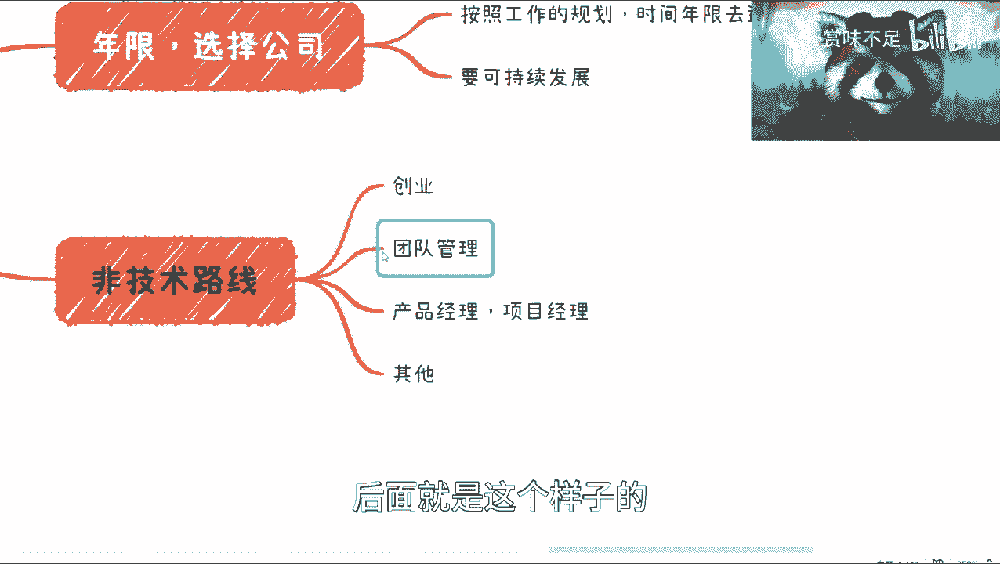

毫无疑问，OK那么，啊这个年限选择工作，选择公司嗯，我在这个地方也提一点啊，就是说我们做职业规划的时候呢，我们可以去想好啊，就是说你到底会去哪，怎么安全公司，比如说你是工作35年去创业公司呢。

还是说是工作78年去大公司呢还是怎么样，就你可以给自己一个规划，大概的不是说那么明确，对不对，然后呢你去了这个公司呢，你说哎我可能是去A公司积累的技术经验对吧，我去B公司积累管理经验对吧。

我去C公司积累这个舔狗经验对吧，都可以啊，但是你要想好，那你想好，你一开始就得把这个事情大概率的想清楚啊，这后面你说变可以变，但是你有了这个规划之后，你就很清楚当下自己在怎么样的一个一个位置。

找一个位置，然后呢就是说你这个选择公司的时候呢，你得可持续发展啊，我这个可能描述不太清楚啊，不叫可持续发展，而是说改改啊，叫做叫做有这个相关的连贯性啊，啊什么意思呢，就是说你在选择这些公司的时候呢。

呃你可能做的业务都不一样对吧，你可能做的这个这个，这个这个这个项目也都不一样啊，你做的这个技术也都不一样，但是呢你自己得要去想好，就是虽然我做的东西都不一样，但是我就是你相当于每个人都有技能树嘛对吧。

就相当于你自己就跟功能数在不同企业里面，是不是都能够去提升啊，你不要就是说，就是说就像我们底层打游戏一样的，你不要说啊，因为我去A公司好，我发展两个技能书对吧，点了两个点对吧。

我去B公司又因为不做这个东西了啊，我又另外一点两个点，那你很容易就是做了10年之后，你可能有那么十几个技能书的，每个技能书就都都点两个点，就说白了就是你可能什么都知道，但你都不精对吧，那你就没有意义。

那就没有意义，所以说就是说对于大部分的这种这种普通的呃，就最终把自己成长成普通的，这么一个情况来讲的话，你们想看你们如果是一个老板，你们是愿意招一个工作10年对吧，要求薪资相对很高啊，要求还很高对吧。

还老油条啊，这么一个人呢还说愿意去招一个应届生对吧，那你们想想就知道了对吧，所以就说我觉得就在这个地方呢。

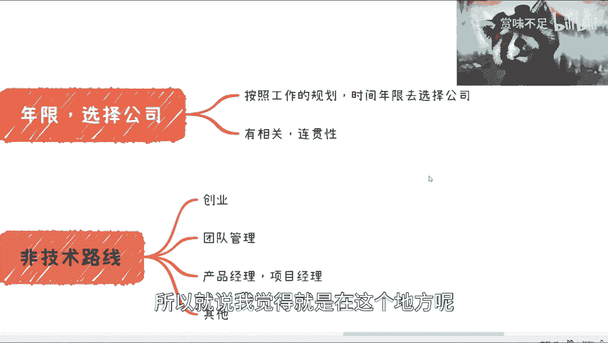

一开始啊我希望大家就尽可能的去做，当然这个我觉得对所有的岗位都有用啊。

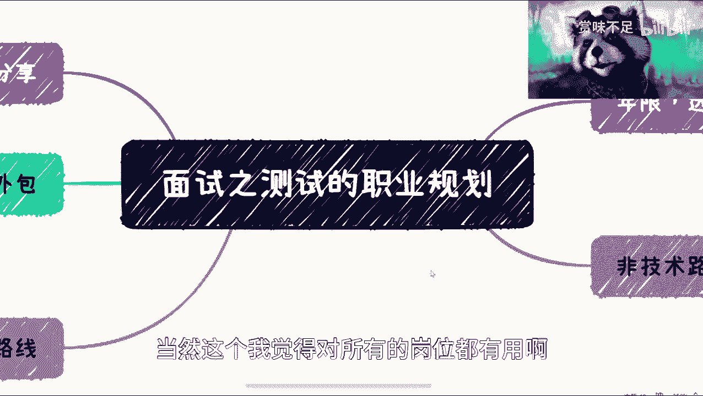

不一不建议说测试啊，但是我因为比较了解。

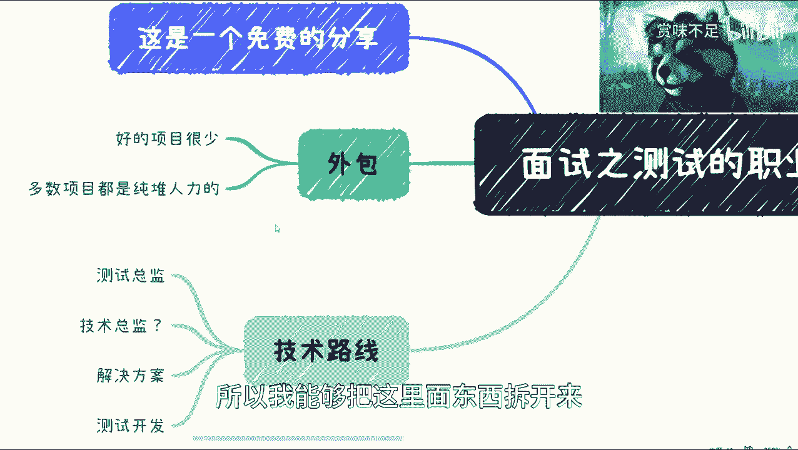

所以我能够把这里面东西拆开来，否则讲别的东西我就不一定拆得动啊，好那么就先这样吧，后面我会把一些面试相关对这个拆分开来。

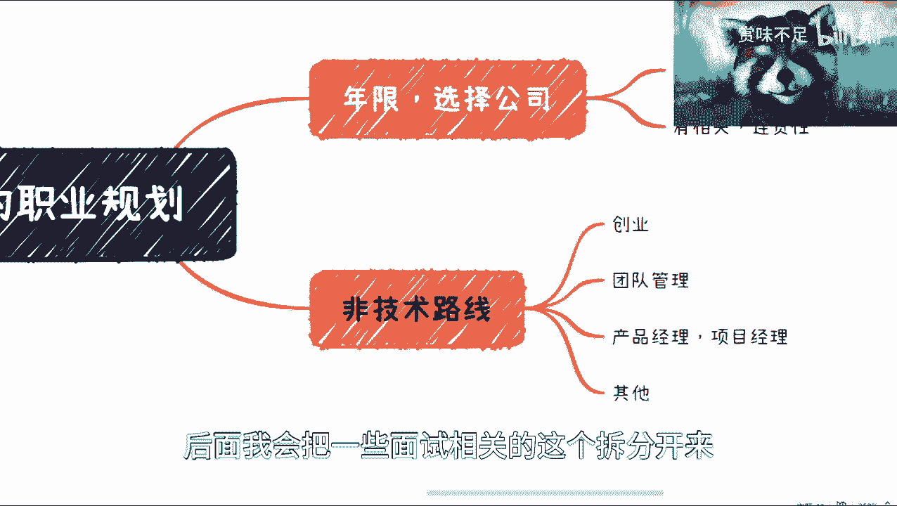