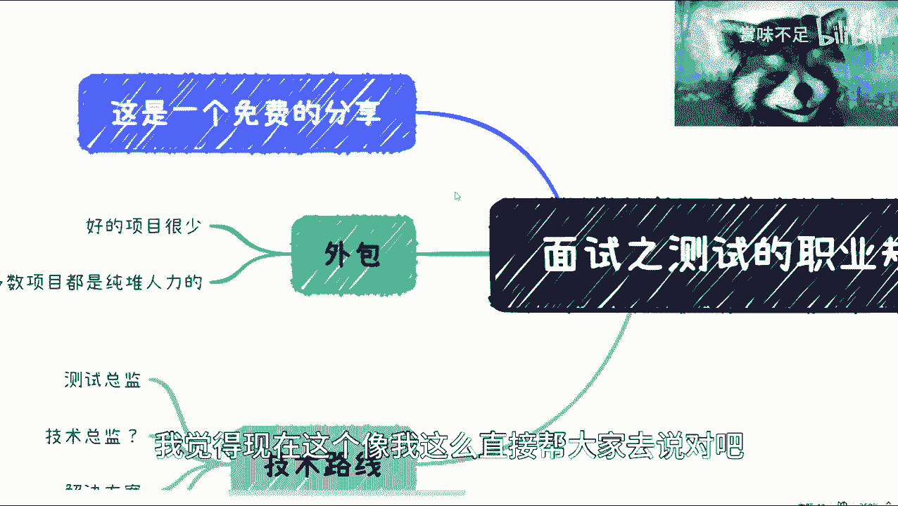
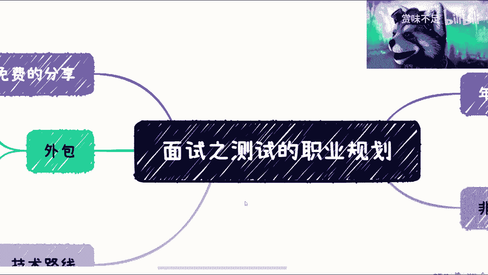
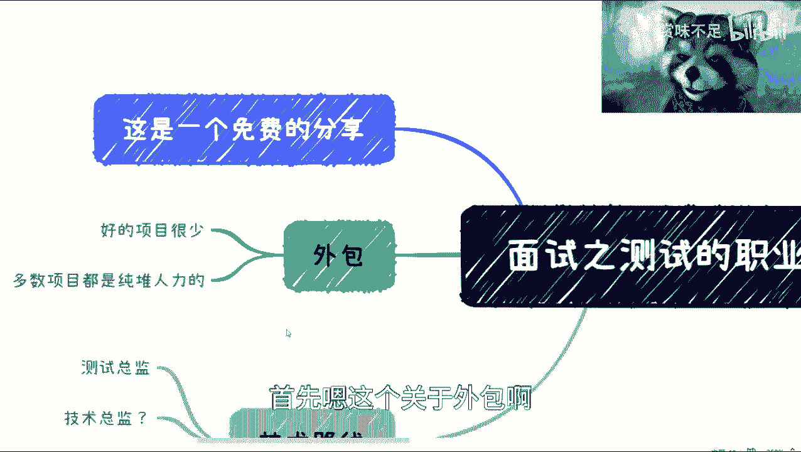
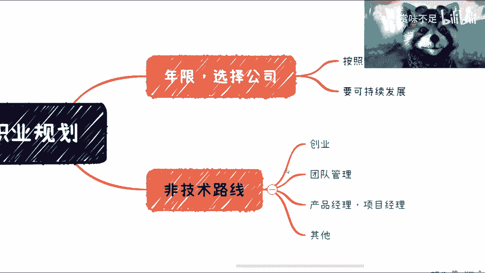
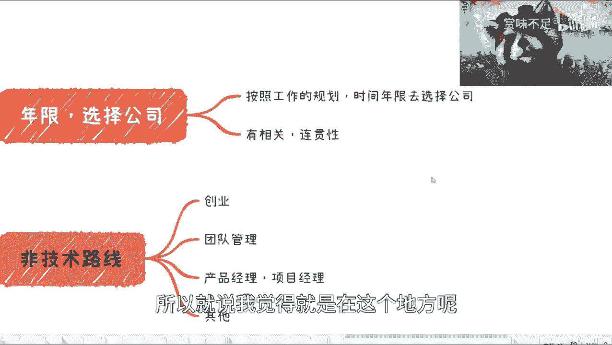
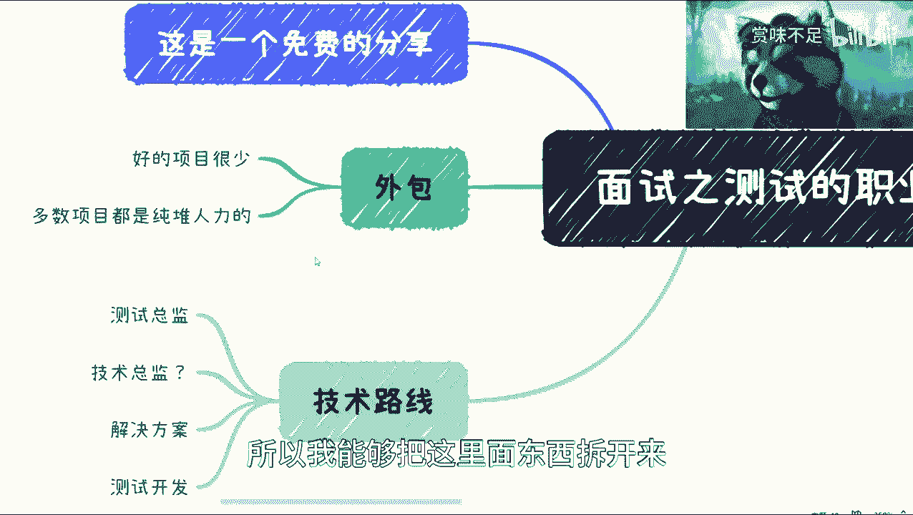

# 测试面试之职业规划---P1---赏味不足---BV1Hs4y1a76t

在本节课中，我们将要学习软件测试工程师如何进行长远的职业规划。我们将探讨测试岗位的职业发展路径、面临的现实挑战，以及如何为未来10年甚至更久的发展做好准备。

---

## 关于外包工作的考量

首先，我们来讨论关于外包工作的选择。

外包项目中真正优质的项目会越来越少。多数项目属于非核心的人力外包类型。

以下是关于选择外包工作的几点评估建议：
*   从整体趋势看，如果样本足够大，毕业初期的一两年从事外包工作问题不大。
*   如果长期从事外包工作，除非是生活所迫，否则不建议持续做下去。
*   可以把这类机会留给更年轻的从业者。

---

## 测试岗位的技术发展路径

上一节我们讨论了职业起点，本节中我们来看看测试岗位内部的技术发展路径。

工作10年或更久的测试人员，继续专职做测试的已经非常少。随着年龄增长，能否继续做测试不仅取决于个人意愿，更取决于市场是否提供机会。

技术路线的顶端通常是测试总监，达到这个职位并不算特别困难。真正的难点在于职位的可持续性与稳定性。月入可观不难，难在能否长期稳定地维持这个收入水平。

至于技术总监的职位，在测试领域极为罕见。解决方案工程师则是一个介于测试与开发之间的岗位，但并非所有公司都设置此职位。

测试开发是职业发展中期的常见形态。测试开发本身也有级别划分，做得好可以有不错的发展。但测试开发岗位本身具有其局限性，这是由中国互联网行业环境决定的。

需要强调的是，测试相关的技术路径，其规划周期最多也就是5到10年。这意味着在思考职业规划时，必须考虑10年后自己要做什么，而不仅仅是10年后测试这个岗位会如何变化。

---

## 测试人员的非主线发展路径

除了技术主线，测试人员还有许多其他的发展方向。

以下是几种常见的非主线发展路径：
*   **创业**：包括创立产品公司或测试解决方案公司（如性能测试平台、众包平台等）。但测试背景创业在商业逻辑和技术深度上可能面临挑战。
*   **转向管理**：可以持续从事管理工作，但同样会面临年龄增长带来的淘汰压力，这与个人能力无关，而与行业大环境相关。
*   **转向产品经理或项目经理**：这是一个可以长期发展的方向。其生命周期长的原因在于，这些岗位做得好可以有很深的积累，并且其经验价值容易被市场认可和付费。相比之下，测试经验即使挖得很深，其市场咨询价值也有限。

核心在于，最终可能需要脱离单纯依赖公司的状态。这并不是个人主观意愿，而是行业趋势下的客观结果。应届生数量井喷，岗位却在减少，大量互联网从业者年龄集中在30-40岁，历史虽无先例可循，但未来的趋势已然清晰。

---

## 如何规划工作年限与公司选择

在进行职业规划时，需要思考不同阶段的目标公司。

可以为自己设定一个大致的规划框架，例如工作3-5年去创业公司积累，工作7-8年进入大公司等。去A公司可能是为了积累技术经验，去B公司为了积累管理经验，目标需要事先想清楚。

选择公司时，要注重经历的**连贯性**。虽然在不同公司做的业务、项目、技术可能不同，但要确保自己的“技能树”是在持续深化，而不是不断另起炉灶。避免出现工作十年后，每个技能领域都只懂皮毛的情况。对于雇主而言，一个要求高薪的“万金油”式资深员工，其吸引力可能不如有潜力的应届生。

因此，建议从一开始就尽可能规划好发展路径，专注于核心技能的深度积累。这个建议对所有岗位都适用，只因对测试领域更为了解，故在此详细拆解。

---

本节课中我们一起学习了测试工程师的职业规划全景。我们分析了从外包选择、技术路径天花板到非主流发展方向的各种可能性，并强调了长期规划与技能深度积累的重要性。记住，规划不是为了制造焦虑，而是为了在清晰的认知下，更主动地掌控自己的职业未来。后续我们将继续拆解面试相关的其他环节。