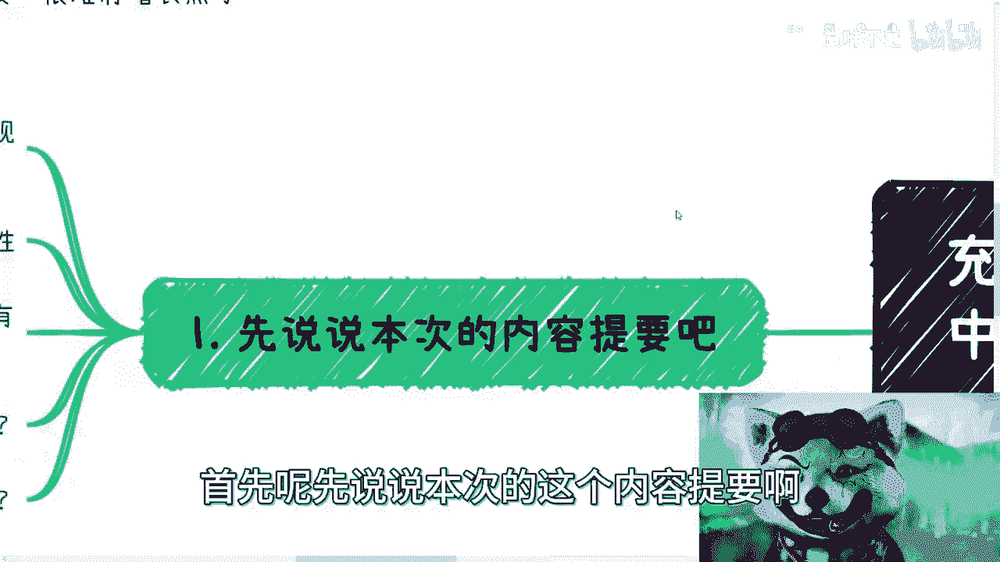
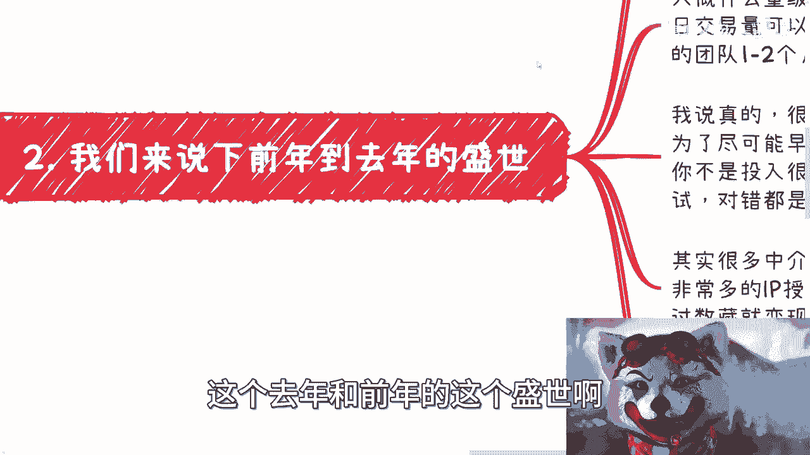
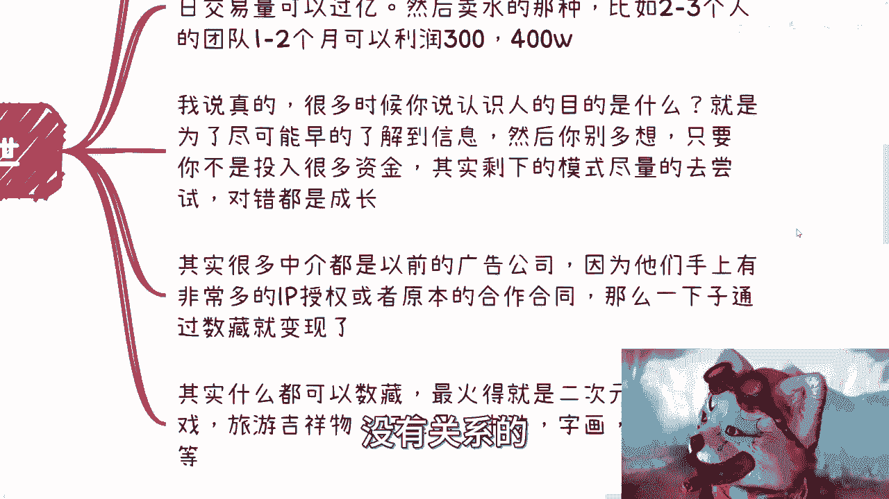
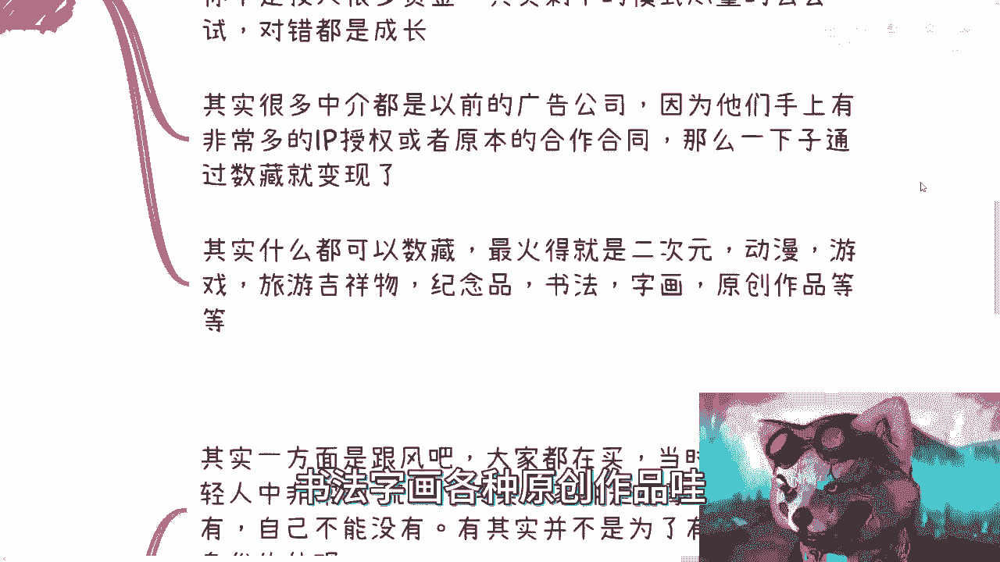
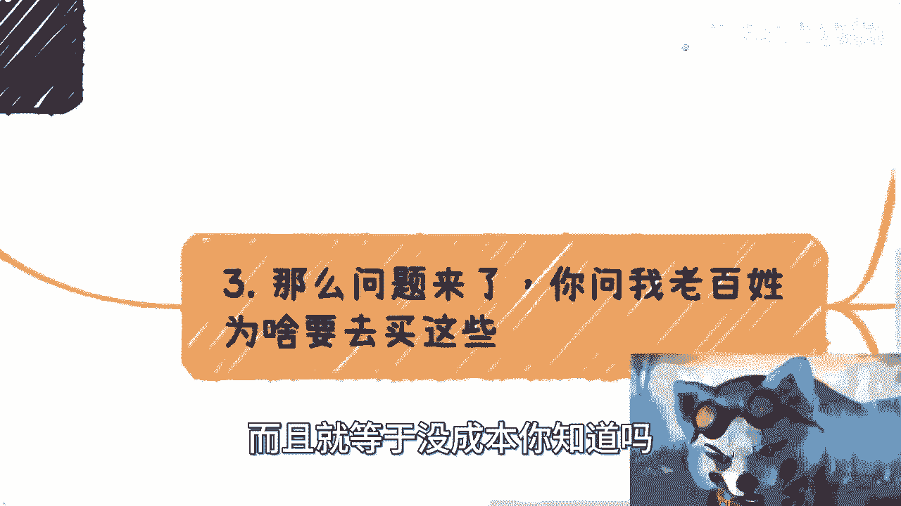

# 深入聊下数字经济中藏品的赚钱闭环和接下来的机会 - P1 - 赏味不足 - BV1Qj411B7RJ

哈喽大家好啊，这个首先我先这个感谢大家啊这个充电的支持，然后我也得说一点啊，就是说这个东西呢可能得随缘，我不能保证我的更新频率啊，我也希望就是说大家可以就告诉我啊，可能大家想要知道点什么好吧。

这样子因为本身人数就不多嘛，然后我也感谢，就是说B站今天是给了我一些啊，就是联名就B站联名的那个键盘跟耳机啊，本来还有一些抱枕啊什么东西，反正回头我会给你们抽奖的，反正就这两天吧，好我来设置一下啊。

呃然后今天这个主题呢是讲什么呢，讲的是去年跟前年的数字藏品的内容啊，然后我会毕竟充电嘛对吧，那我就讲的露骨一点哈哈对吧，呃透彻一点啊，就是这个赚钱的模式和接下来的这个机会啊，不管大家有没有接触过啊。

我觉得很多东西是触类旁通的啊，你们可以了解一下，首先呢先说说本次的这个内容提要啊。

额数字藏品呢从外外界看啊，如果没有接触过的人或者听说过的人呢，你们就把它理解为它就是一种文创产品，就在政府的文件里面啊，它官方的说说法叫文创哦，或者说叫做数字新闻创啊。

那么它的这个媒介呢你们可以理解为就是图片，视频，音频啊等数字产品啊，我顺便提一嘴啊，就这个因为充电这个事啊，我我这个小熊猫我就不改了，我就不在这个有的没的事情上面多花力气了。

没什么必要对吧，那这是第一个啊，第二个呢就是说数字藏品为什么会崛起呢，其实主要还是因为其金融属性啊，呃他崛起的原因很综合哦，很综合在这里面有一部分原因啊，就是跟以前什么小浣熊干脆面是一样的。

就是呃经过我们后面的调研啊，他的确是在很多这种年轻人啊，就高校啊对吧，甚至高中里面流行啊，这个我后面会讲啊。

呃那么第三个呢就是说很多人会疑问啊，就是因为数字藏品模式是什么，就是他进一张图啊，就比如说今天有一个这个奥特曼，对吧啊，呃机器猫啊，这个图这个图呢也不是独一无二的对吧，比如说有9999分啊，然后呢。

每张图，每张图九九块钱或19块钱或49块钱啊，反正就是就是这种图啊，要么是图，要么是视频啊，就说正常人我就这么说，正常人对吧，你们今天看到这个视频的人，我估计你们也都会问，就是这个东西有什么用。

对不对啊，你就说这玩意儿很多人去买，买它干啥对吧啊，你说这个发型啊，我可以这么跟你讲，上知上到天文啊，上到卫星啊，下到什么什么一颗种子对吧，这个什么是一一片土啊，一个石头，我跟你讲都发过数字藏品啊。

就有你们我跟着你们这么说，要多离谱有多离谱啊，呃然后这个是一点啊，那么最大的问题点是购买点在哪对吧，他整个商业闭环为什么能逼得起来，你知道吗，就是正常人可能就会觉得嘛这个这个东西啊，需求也没有对吧。

然后这个用户也没有对吧，那你这个东西怎么比得起来啊，然后呢就是说为什么对方愿意付钱，这个对方指的是什么呢，指的是品牌方啊，就比如说我们跟麦当劳，因为麦当劳我跟你讲也发过啊，你知道吗，你去看麦当劳也发过。

茅台也发过，还要多离谱有多离谱啊，星巴克也发过啊，就为什么这些企业会愿意付钱啊，你说经济很差啊对吧，怎么样子啊，为什么愿意付钱，这个也是啊，我们待会儿会来讲啊，然后最后一个就是未来怎么发展啊。

首先啊我们先来说啊，这个去年和前年的这个盛世啊。

呃大家得有个概念啊，首先赚钱的这一方呢有几方啊，一个是平台方，一个是IP方啊，所谓平台方就是数字产品的发行方，发行方一个是平台方，一个是IP方，一个还有卖水的中介方，我跟你们讲，真的别看不起拉皮条啊。

别看不起中介，真的中介在所有的这个这个叫什么业务闭环，里面都有他一杯羹，你知道吗，就那个罗永浩也好，还有那个叫罗振宇也好，我跟你讲那个话说的都很没错，是什么呢，就是你不要看不起卖水是吧，卖铲子的。

卖卖铁锹的，你知道吗，为什么这么多人会去卖水，卖铲子，卖铁锹，你懂吗，是因为卖无论你做什么，卖铲子，卖水卖铁锹，它的风险性永远是最低的，你知道吗，而且他永远是最不用动脑子的，因为你不用有自己的东西啊。

我就是个搬运工了对吧，那句话怎么说来着呢对吧，我不生产水，我只做大自然的搬运工，你要多牛逼啊，对不对啊，那个前两天我们那个群里面还在吐槽，那他说他说最近这个百事可乐，可口可乐对吧，各种各样的都涨价对吧。

哎这农夫山泉不涨价，为什么，因为它不生产了，他搬运了，对对对，那当然就开个玩笑对吧啊，呃还有一个呢就是交易平台方，交易平台方呢这个东西呢，说白了就是呃帮助数字藏品做交易的，但是呢呃这个咱也说啊。

就是说呃从国家官方规定来讲，没有一个平台是官方的，因为它没有一个就是说合规的一个，一个文件或者什么东西，但是呢啊这个不妨碍啊，中国这片土地上面各各省市区，各地方啊都冒出来很多说自己是官方的平台啊。

这不妨碍啊，这也是怎么说呢，国情啊国情，所以说啊，所以说我就回到我们这个那个，今天免费视频当中所说的，就是说你们如果想要去赚钱，你们得要先去明白，就在这片土地上面有哪些方法，那你再去用啊，对不对啊。

你说我什么都不知道啊，我就说我想出个id，没有用的，你知道吧啊没有用的，就千万不要去意淫，不要去幻想啊，没有用的啊，那么大概什么量级呢，啊我给大家一个概念啊，什么量级呢，单个交易平台日交易量可以过亿啊。

不夸张不夸张，过过亿，过5亿好像也有啊，这个单教一点啊，然后呢卖水的那种呢，嗯就比如说啊这个中介对吧，怎么样啊，比如说就两三个人团队啊，一两个月利润呢可以在300到400万。

差不多是去年4月份到6月份那个时候啊，那么这个时候呢我跟你讲啊，就有人要说了啊，有人又要来讲了啊，说啊这个呃我觉得啊这些东西一定是有背景的，一定是有背景的，一定是有积累的，一定是有背书的，我跟你们讲啊。

屁他妈都没有啊，真的屁他妈都没有啊，你要问我有什么对吧好，我告诉你有什么，他一定是第一时间知道这个信息的，二他有很强的执行力，他不会在那边东想西想啊，什么什么，比如说你现在跟我说啊。

这个吕老师我们要做个东西对吧，好了在在在那边什么准备一两个月，我跟你讲，没有的，我跟你讲啊，真正要赚钱的速度是什么，就是他妈的今天要干的吧，好明天明天就去找找外包，他妈的。

你一周之内给我做甩结束他妈上线，你知道吗，这他妈叫速度啊，不要去想着说卧槽他妈的我做个什么东西啊，然后什么一两个月过去了呀，这这种都是没有做过事啊，我说真的啊，很多时候我跟你们讲认识人。

认识人的目的是什么，认识的目的就是为了尽可能的消除信息差，你知道吗，然后是什么，然后就是你别多想，就干，你懂吗，我就这么跟你讲，所有的事情，只要不是说让你投入什么什么什么，比如说几10万对吧。

或者几万块钱，不要不是什么，你自己投很多的，你要去干一件事，你就干，你别去想哎呀，这个东西我懂不懂啊，这个东西有没有风险啊，这个东西怎么样，有关系了，没有关系，干就完了，你知道吗，只要不是非常直接的。

你说写在刑法上的，有问题的，你干嘛啊，有啥好想的呢对吧，剩下的模式你就尽量去尝试，对和错，都是成长，你知道吧，没有关系的。

不要想这么多啊，有风口就是上啊，当然啊你得真的这个叫什么，就是真的明白这是风口啊，的到最后什么什么啊，人家都就玩过两三遍了对吧，你又不懂，然后被人家忽悠，你这是个风口是吧，那就废了啊。

所以说呢其实很多中介啊，呃我跟你们讲都是以前的广告公司啊，或者说呢就是他以前是广告公司的皮条，就广告公司的证件，你知道吧，为什么啊，因为他们手上有非常多的IP授权，或者有原本的那些IP的合作合同啊。

而这些东西呢可能原本只能用来做做联名，或者做做这个叫广告商，你知道吧，但是呢他没有很好的变现渠道，那现在怎么办呢，哎他一下子发现卧槽他妈收藏牛逼啊对吧，那这正好不是变不是能够匹配起来吗，那就想办法变性。

对不对好，所以呢其实在前年跟去年啊。

数藏所涉及的面非常广，上到银行保险公司就是官方的啊，银行保险公司，党媒央媒，下到就是各种各样什么什么乱七八糟的东西啊，这个太多了啊，所以说当时最火的是什么呢，就是二次元啊，动漫游戏啊，然后旅游景区。

旅游吉祥物，旅游景点啊，然后什么纪念品，书法字画。

各种原创作品，我的遍地都是，而且这东西没成本。

你知道吗，因为因为你想嘛，他今天一幅字画对吧，这个字画呢可以复制999份。

然后每一份能卖99块钱，你想嘛这不比你印钞快呀。

是吧啊，那么问题来了，你问问老百姓为什么要去买这些对吧，那很简单，我们来看啊，首先一方面是跟风，跟风这个东西呢，取决于呃主要是集中在这个年轻人啊，就高中啊，大学生啊这些群体啊，那么当时就去年前年嘛。

当时在高校的年轻人非常的流行呃，说白了这个就跟我当时我刚刚说的什么以前的，以前的什么水浒传对吧，小浣熊干脆面什么什么各种各样的东西，其实这种东西就大家都在攀比，你知道吧，就别人有自己不能没有。

但是你说他有了有什么用，但不知道哎就是攀比，你知道吧啊就为了有，所以说呢数字藏品里面有很多一部分啊，它是出现他是出来那种叫什么，就是就是比如说一套对吧，哎比如说我我我一张我一张图是999分。

但是我有六张图啊，大家集成六，直到直到六张图呢，哎还能帮你这个合成一张金金卡对吧，哎呀反正就这个意思啊对吧，那那反正你看吧模式都差不多的呀，对不对，那另外一方面呢主要是因为能变现啊，主要能赚钱啊。

那么能交易啊，那么能增值啊，其实数藏模式你们真的可以学习一下，收藏里面所有的模式基本上都已经有过了哦，淋漓尽致，你知道吧，真的什么都有啊，什么合成啊，盲盒啦，优先购了会员购了对吧，什么分等级了对吧。

盲盒盲盒出现的概率，盲盒盲盒合成盲盒交易对吧等等等，我跟你讲什么都有啊，只有你们想不到没有收藏，没有的啊，你们要真的学习模式。

那好好去看看数藏的模式，哎呀那简直是他妈的人类智慧结晶都在里面啊，呃回到主题啊，那么你说老百姓为什么会买呢，是因为老百姓啊在经济不好的时候，永远会有喜欢三个东西啊，一是教育，也就是所谓的购买希望啊。

二叫以小博大，也就是所谓的赌博啊，三就是什么玄学，对不对，就这三个东西啊。

永远的不变的啊，不变的，那么第四个问题来了。

你说收藏啊这么一个东西，营销费用怎么来啊，为什么这些品牌方愿意付钱对吧好，那很简单啊，那首先钱一般来自于品牌方啊，但是呢我告诉你这个费用啊，并不是我们一般讲的服务费用，因为你如果走的是正常服务费用。

就是什么意思呢，就比如说我去找麦当劳，我说哎我帮你做个什么东西啊，那么你要付我笔钱，那我就问嘛，那麦当劳脑子是晚上呃，就是脑子是被门挤过来还是被驴踢过对吧，就是他不可能莫名其妙你跑过去，哎我不合作。

他妈的，你谁啊，谁你啊，你说对不对啊，那么你要明白，商业合作很多时候你得要很清楚一点，就是这个费用到底什么地方出，你知道吧，这就好像我跟很多人说，你们连公司里面到底有哪些部门，哪些费用怎么出。

政府里面哪些部门，政府里面钱怎么出，你们都不知道，你们就想去做，你们就想谈合作，这怎么可能呢，这不一想天开吗，对不对啊，那么我们在这个地方说的是什么叫营销费用，所谓营销费用什么概念。

就是营销费用是一个每一年都会有的一个费用，同时如果你花不出去，跟你的KPI会绑定，同时你花不出去，第2年其实也是归零的，说难听点就是今年如果能花1000万，明年很可能还很有可能有1500万。

如果今年1000万花不出去好，那不好意思，明年可能只有500万人，你明白吧啊这个叫营销费用啊，不是大家想的说哦，我今天今年花不出去，我给公司节约钱了，不好意思，营销费用不需要你节约哦，花不出去花的不对。

那是你能力的问题，那是你垃圾啊，好吧好，那么为什么会愿意付给数藏啊，是因为营销费用，这个东西上面和收藏的结合度极高啊，什么意思呢，就是不管你什么东西，你有吉祥物也好，你有IP也好，你有任何一个东西。

比如说卡地亚TIFFANY都跟收藏做过，你知道吧，那都可以做，为什么，因为卡地亚TIFFANY这些东西，手链也好，项链也好，他也能做出个藏品，有什么不能做的，我把项链变成个数变变成个电子屏啊。

一张图对吧，然后变成卖999分，怎么了，怎么不能卖了，对不对啊，好那么营销费用呢，本质上啊主要有主要要打两个点，因为所有的营销费用都是要到VP，到老板这边审批的，他主要打两个点，第一个点叫创新。

什么叫创新，就是你营销本身的模式要创新啊，你不能说去年啊我们跟肯定跟那个呃，比如说机器猫联过名了啊，今年呢又跟什么，比如说跟什么火影去联名，这种叫做没有创新，因为你都是联名，你知道吧。

而且从营销模式上面来讲，你都是什么什么品牌方去联名，那么这种都是没有创新，而你数字藏品这个东西噱头就很足，你只要把可以联名哦，可以合作对吧，这是第一点，第二点就是所谓的要找要找增量市场的用户。

那么这种用户怎么找呢，OK收藏，为什么，因为收藏里面的用户画像，不管是一线到五线城市还是年轻人，你会发现好巧不巧，跟所有的品牌方都很match，因为那些人对这些品牌来，品牌方来讲都是增量市场没有交集的。

哎说麦当劳啊对吧，这个奢侈品啊，什么什么什么火影啊，动漫游戏都没有交集的，你知道为什么，因为那些真正做收藏的，他不是说啊，不是说什么特别大的，你知道吧，就是比如说什么特别大的很多啊，就是联名的。

他不是什么很很知名的品牌，你知道吧啊那么那么他就会发现，卧槽哎这些人是我要的对吧，而且更何况就是你今天去打一个市场，一定是年轻人，市场对营销费用上面是最最吃香的对吧。

你打一个五六岁时人的市场需要啊啊哦好。

那么年轻有消费能力，而且无论何品牌方，什么品牌方，基本上他的基本用户都差点开，哎就这么牛逼啊对吧。

那么我们来看第五点啊，就是未来的发展好啊。

再说这个之前，我先给大家捋一下它的商业逻辑，对不对，你会发现商业闭环就这么容易闭，就是说呃企业房为什么愿意出钱呢，因为他做营销对吧，那你我怎么赚钱呢，我们在这当中可以做发行方，可以做交易所。

可以做卖水的对吧，那么既然有人能够把这几百万掏出来，那么我们就可以把这几百万花掉，对不对，你掏都掏出来了，不花掉干什么，对不对，好，那么我我卖水可以怎么卖啊，我可以帮你发数场，我可以帮你营销啊对吧。

我有社群，我可以帮你打广告，卧槽这钳子怎么不好赚啊，怎么赚都好赚，你知道吧啊主要最重要就像我跟你们讲的，最重要的是有人谁有没有本事把这笔钱掏出来，你懂吗啊，包括你们去做任何商业模式一样的。

你们得要想明白谁掏这笔钱后面都不重要啊，对不对啊好吧，那么你看用户这边有非常match，用户这边什么，这是我刚刚说的，要么想以小博，以小博大，要么想这个叫什么教育对吧，就是学习啊。

要么就是想这个玄学都满足了，我跟你讲，真的那个数字藏品他妈的还发过什么八卦的啊，什么没发过，那八卦炉八卦阵哟，我去妈的什么没有什么都能结合啊，啊那么从目前来讲呢，今年看就凉透了啊，今年就没这个市场了。

哎我跟你讲，快钱都是一波一波的啊，但是呢这几天有有一个方向啊，就是数字藏品呢开始慢慢慢慢改名了啊，叫数字资产了啊，它有这个趋势啊，当然了，很多人他说啊，这个呃因为这个事情是不是说未来一级市场。

二级市场又要开始活跃了啊，或者说怎么样，你从我角度来讲啊，我觉得不会啊，因为我觉得说白了这个是一波新的方向，大家跟以前呢可能就割裂开来，就划清界限了啊，但是我觉得啊就是不管怎么样啊，不可能就是什么。

从去年这种乱象一下子跳到一个啊，你说什么很正规很怎么样，不会的啊，我绝对不相信的国情就不是这样子啊，历史就不是这样子啊，所以说呢我觉得不排除有新的机会跟新的热潮，也就是说让大家能够赚快钱的方式出来。

肯定是有的啊，毕竟数字经济是目前我觉得全球唯一的亮点，唯一的增量市场，没有别的没有了，你知道吧啊呃然后他又是个很通用的东西，就是什么都可以结合啊，所以说呢我觉得就是说呃就是很多时候啊。

就是你会发现我们哎我们回到那个吧，我们回到这个主题啊，就是你会发现啊，就是真正的赚快钱也好，做生意也好，你就这么想，我以前跟大家讲过对吧，赚钱这件事情分成两种，一种是长期的积累，第二种叫快钱对吧。

那你会发现快件这个东西呢，跟你日常积累肯定也有关系，因为你信息差嘛对吧，但是呢就是说我跟你讲，最大的障碍点真的就是你们自己啊，就是不要去想，你懂不懂，等我跟你讲很多东西，等你懂了，你就赚不到钱了。

你记住啊，你千万不要去想，懂不懂没关系的啊，然后呢就是说呃，第二点就是说那个想办法先从最小去切，不要去想着说我到底做什么，就是就像我刚刚说的，就是大家如果不知道好，没关系，就卖水啊，短了就卖水。

你就跟他说，你说我这边有两个社群对吧，1000个人，一个人，一个群五百五百人，对不对，两个社群我帮你卖，卧槽我跟你讲，真的，当大家赚快钱的时候啊，脑子都是发热的，你知道吧，就是根本不用逻辑思考问题的。

我我跟你们说啊，就是你别说两个社群，1000个人，你今天就算是一个僵尸号，你到时候给他打广告，什么什么几千块钱不是的，几万块钱一副的，我告诉你啊，就是很多时候在这种快钱的市场里面，虽然大家在一个地球上。

虽然大家在一个世界里面，但是你们跟别人就会在一个平行宇宙里面，你知道吧，这钱就不像钱啊，但是真的我跟你讲，跟你们想象的不一样，不是说一定要什么有积累啊，有什么东西不一定的，你知道吧，就一个就看你想象力。

一个就看你执行力啊，一个就看你对吧，就忽悠的能力啊，真的就是这样子啊，当然了，这个核心啊还是要讲讲啊，就是这个踩准风口还是很重要的，就不要到时候就像我说的，就是搞得自己感觉是个风口啊，很嗨对吧，很上头。

但其实不是，行啊，就这么着好吧，哎这个同样的啊，虽然是这个充电片啊，但是我还是希望大家能够啊有什么主要的对吧，核心的比如说规划或者什么东西好吧，来咨询我好吧行。

