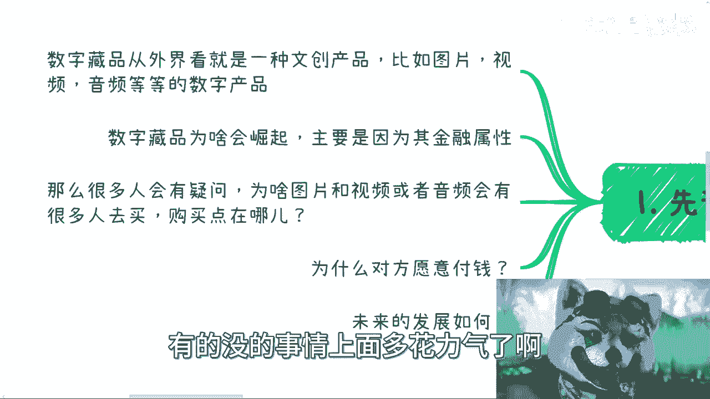
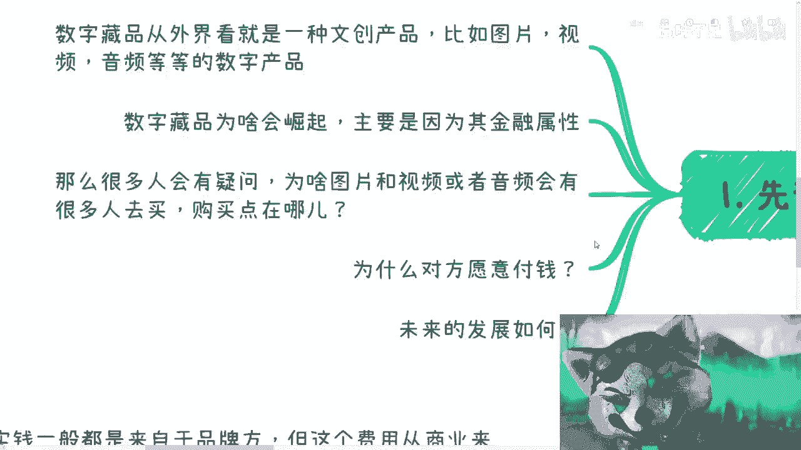
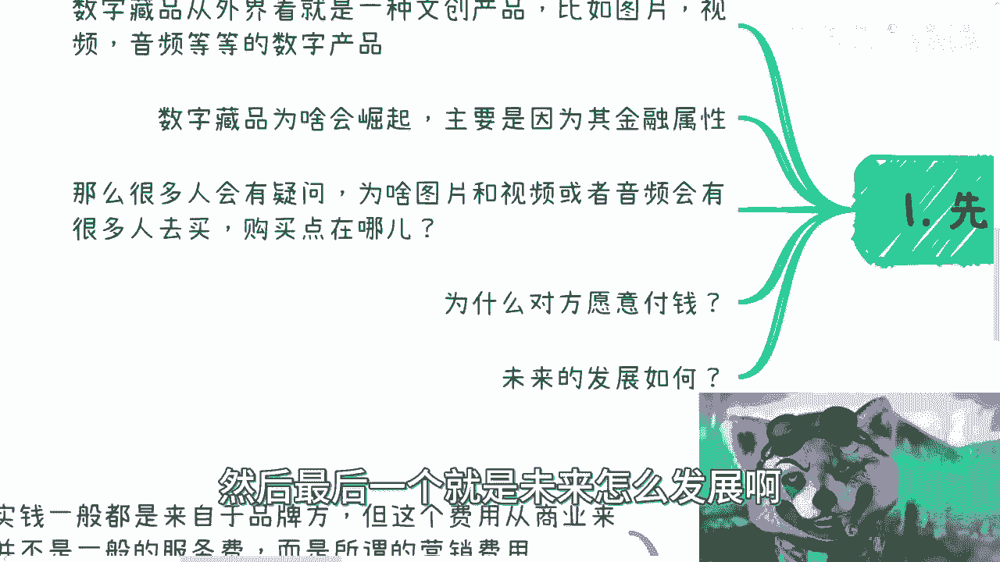
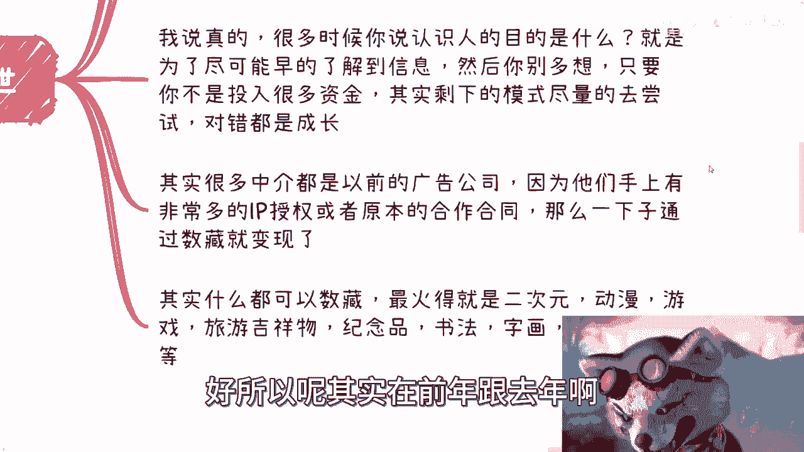
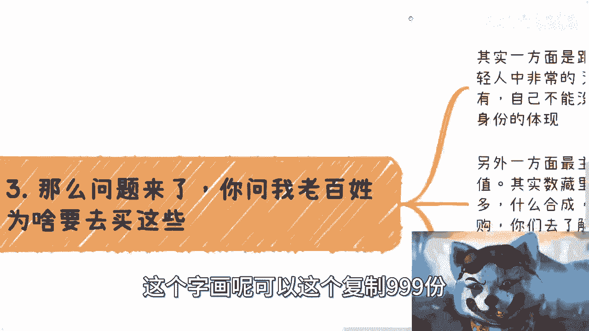
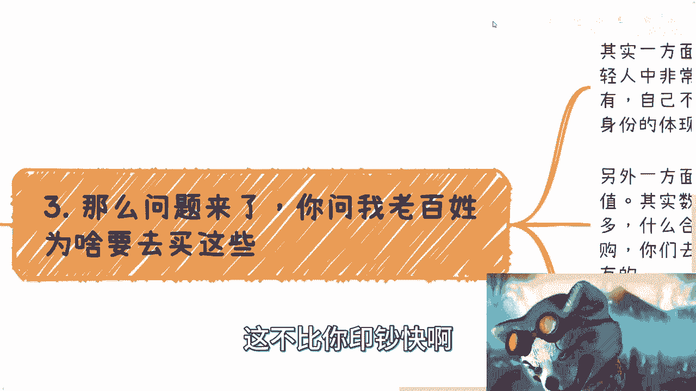
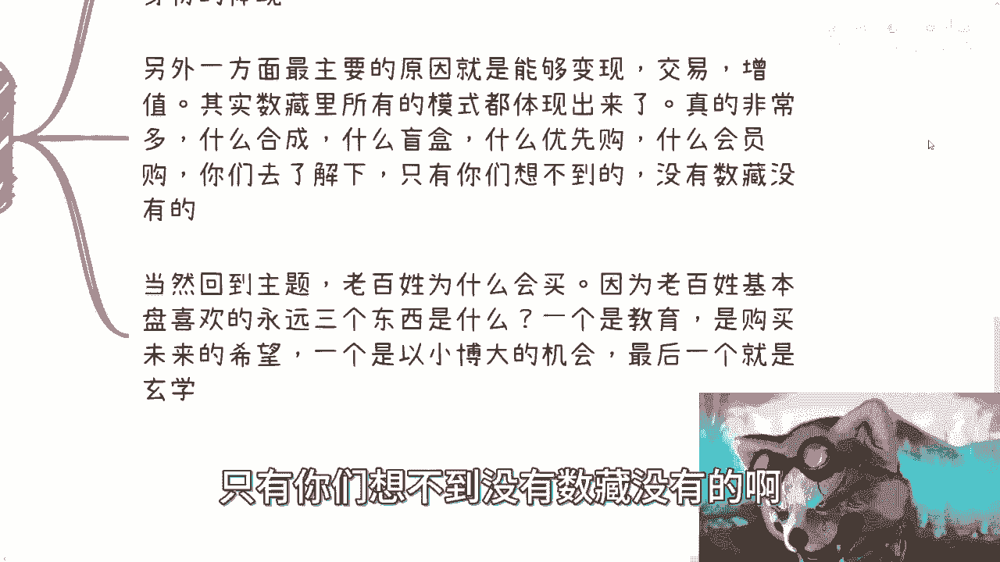
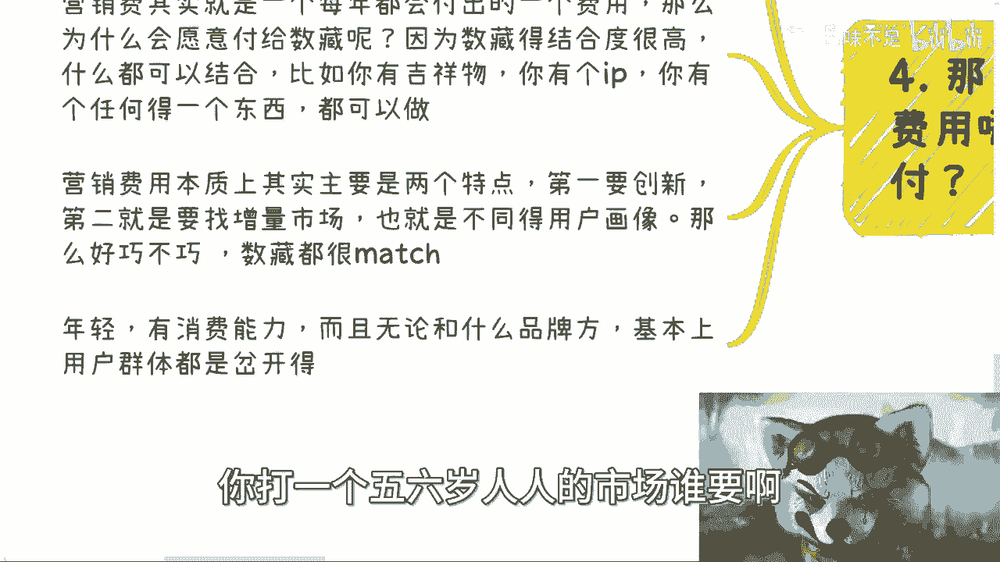
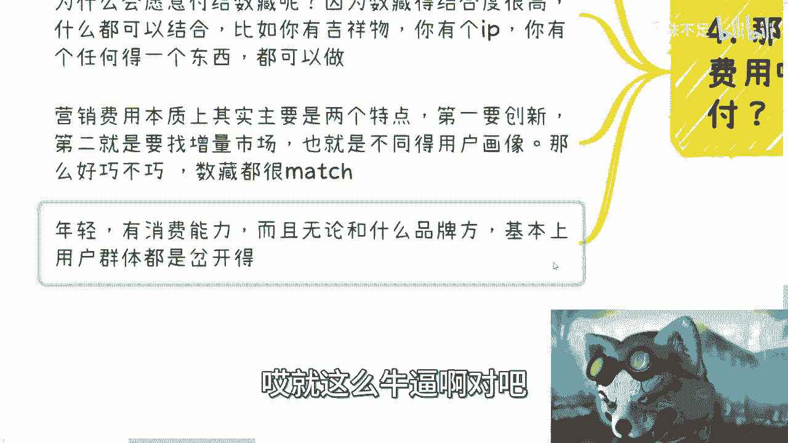
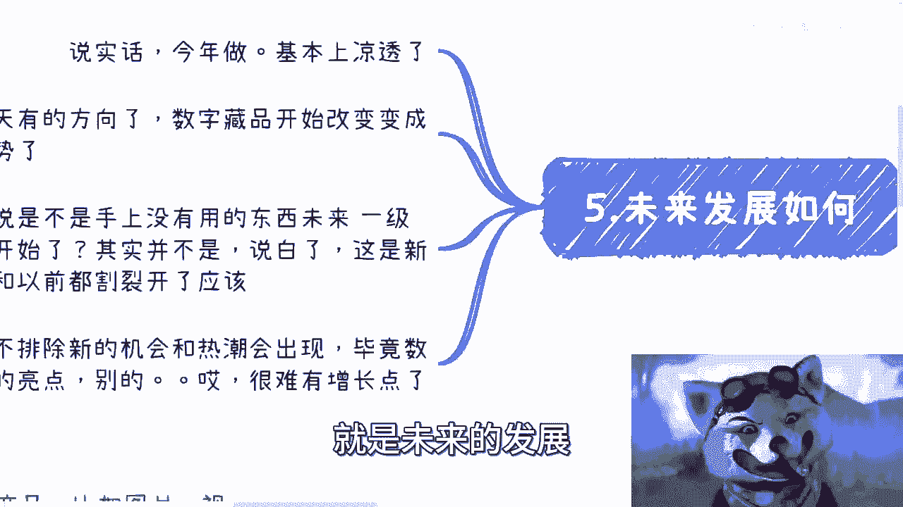

# 课程一：数字经济中的数字藏品：赚钱闭环与未来机会 🚀

在本节课中，我们将深入探讨数字藏品（或称数字文创）在数字经济中的商业模式。我们将分析其如何形成赚钱闭环，并探讨其中蕴含的机会。内容将涵盖数字藏品的基本概念、崛起原因、核心商业模式以及未来发展趋势。

---

## 什么是数字藏品？ 🖼️

数字藏品，在政府文件中常被称为“数字文创”或“文创产品”。对于未接触过的人来说，可以将其理解为一种数字化的文创产品。

它的媒介形式主要是**图片、视频、音频**等数字文件。

---

## 数字藏品为何崛起？ 📈

数字藏品崛起的原因是多方面的，但核心驱动力在于其**金融属性**。

经过调研发现，它在年轻群体，尤其是高校甚至高中生中非常流行，这与过去收集“小浣熊干脆面”卡片的模式有相似之处。

---

## 核心商业模式与大众疑问 ❓

许多人会感到困惑：一张图片（例如奥特曼或机器猫的图片）被复制成9999份，每份售价9元、19元或49元，这有什么用？谁会买？

事实上，发行过的数字藏品题材极其广泛，上至卫星，下至一粒种子、一片土壤或一块石头，都曾被制作成数字藏品。

那么，最大的问题在于：**购买点在哪里？整个商业闭环是如何运转起来的？**

正常思维会认为，这东西既没有明确需求，也没有稳定用户，商业模式如何成立？此外，品牌方（如麦当劳、茅台、星巴克都发行过）为何愿意为此付费？在经济环境不佳的背景下，他们的付费逻辑是什么？

---

## 盛世中的赚钱方与量级 💰

在去年和前年的市场热潮中，主要的赚钱方有以下几类：

*   **平台方**：即数字藏品的发行方。
*   **IP方**：提供知识产权或内容的一方。
*   **中介方（卖水方）**：即连接各方的中介或服务商。在所有业务闭环中，中介总能分得一杯羹。提供基础设施（如卖水、卖铲子）的风险通常最低，且无需拥有核心产品，本质是“搬运工”。
*   **交易平台方**：协助数字藏品进行交易的平台。需注意，从国家规定看，目前没有完全“官方”合规的交易平台，但这并不妨碍各地方涌现出许多自称官方的平台。

当时的市场量级非常惊人：
*   单个交易平台的日交易量可以过亿，甚至有过5亿的情况。
*   一些仅有两三人的中介团队，在一两个月内利润可达300到400万人民币（主要集中在去年4到6月）。

很多人认为成功需要背景、积累或背书。但实际情况是，成功的关键在于**第一时间获取信息**和**强大的执行力**。认识人的目的是消除信息差，然后就是快速行动，只要不涉及重大资金投入或法律风险，就应该大胆尝试。对错都是成长。

当然，前提是能准确判断风口，而不是在热潮末期被忽悠入场。

---

## 广泛的应用与用户购买动机 🎯

数字藏品涉及的面非常广，上至银行、保险公司、党媒央媒，下至各种实体商品和文创产品。

当时最火的领域包括：**二次元、动漫游戏、旅游景区、吉祥物、纪念品、书法字画、原创作品**等。其成本极低，一幅字画复制999份，每份卖99元，利润非常可观。

那么，老百姓为什么要购买呢？主要有两方面原因：

**1. 跟风与攀比**
这主要集中在年轻群体（高中生、大学生）。就像过去收集水浒卡一样，这是一种社交攀比心理，别人有，自己也不能没有。

**2. 投资与投机心理**
数字藏品可以交易、可能增值，这满足了人们“以小博大”的投机心理。其设计模式（如合成、盲盒、优先购、等级制）极大地刺激了购买和交易欲望。

以下是用户在经济下行时期普遍存在的三种心理，数字藏品恰好都能满足：
*   **购买希望（教育）**：认为可以学习新事物或获得未来收益。
*   **以小博大（赌博）**：希望用小额投入获取高额回报。
*   **玄学**：对带有神秘或稀缺属性物品的追捧。

---

## 品牌方为何愿意付费？ 💸

品牌方支付的费用，通常来自其每年的**营销预算**。

营销预算有几个特点：每年都有；如果花不完，可能影响第二年的预算额度；花得不对或花不出去，会被视为能力问题。

品牌方愿意为数字藏品付费，是因为它与营销预算的两个核心审批要点高度契合：

**1. 模式创新**
数字藏品本身是一个新噱头、新形式，符合营销需要“创新”的要求，比简单的品牌联名更有亮点。

**2. 获取增量用户**
数字藏品平台的用户画像（从一线到五线城市，以年轻人为主）与许多品牌方想要触达的“增量市场”高度匹配。这些用户是品牌以往未曾有效覆盖的，且年轻、有消费潜力。

因此，对于品牌营销负责人来说，用数字藏品做营销，既能体现创新，又能触达新用户群体，这笔预算就花得“名正言顺”。

---

## 商业闭环梳理与未来展望 🔮

上一节我们分析了品牌方的付费逻辑，现在我们来梳理整个商业闭环，并展望未来。

**商业闭环非常简单：**
*   **付费端**：企业（品牌方）有营销预算，需要创新和获取新用户。
*   **服务端**：中介、发行方、交易平台可以提供各种服务（发行、营销、社群运营等）来帮助企业花掉这笔预算。
*   **用户端**：存在大量希望“以小博大”、学习或追求玄学的用户，形成了购买市场。

**关键在于：谁有能力让企业掏出这笔预算。** 只要钱能掏出来，后面怎么赚都好说。

**关于未来发展：**
从目前看，去年那种狂热的市场已经冷却。但近期出现了一个新趋势：**“数字藏品”开始改名为“数字资产”**。

这或许意味着新一波机会。虽然不可能立刻从乱象变得完全正规，但在“数字经济”这个全球性的增量市场里，结合数字资产这种通用性极强的形式，很可能会催生新的热潮和赚快钱的机会。

**给初学者的核心建议：**
1.  **消除信息差，快速行动**：赚钱，尤其是赚快钱，信息差和执行力比所谓的“积累”更重要。很多东西等你完全弄懂，机会就过去了。
2.  **从最小切入点入手**：如果不知道做什么，就从“卖水”开始。例如，告诉品牌方你有一些社群可以帮他们推广。在狂热的市场里，决策往往非理性，机会比你想象的多。
3.  **准确判断风口**：核心还是要能判断什么是真正的风口，而不是在虚假繁荣中成为接盘者。

---

## 总结 📝

本节课我们一起学习了数字藏品在数字经济中的赚钱闭环。
*   我们了解了数字藏品的基本概念和因其金融属性而崛起的背景。
*   我们剖析了其核心商业模式，涉及平台方、IP方、中介方和交易平台。
*   我们探讨了用户购买的动机（跟风、投机、满足特定心理）和品牌方付费的逻辑（营销创新与获取增量用户）。
*   最后，我们梳理了清晰的商业闭环，并对以“数字资产”为名的新趋势进行了展望，同时给出了抓住此类机会的行动建议。

记住，在快速变化的市场中，保持信息敏锐、敢于从最小单元试错，是发现和抓住机会的关键。