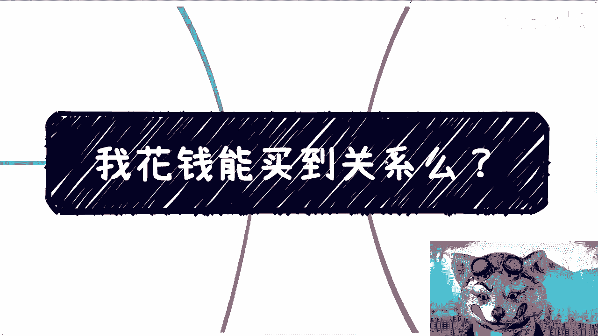
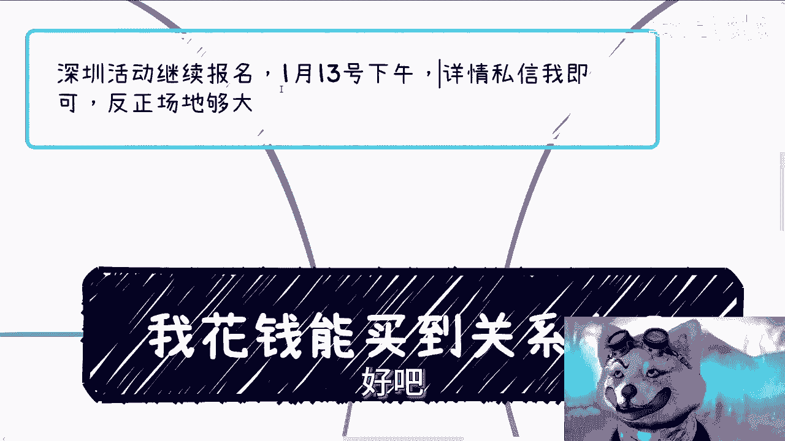
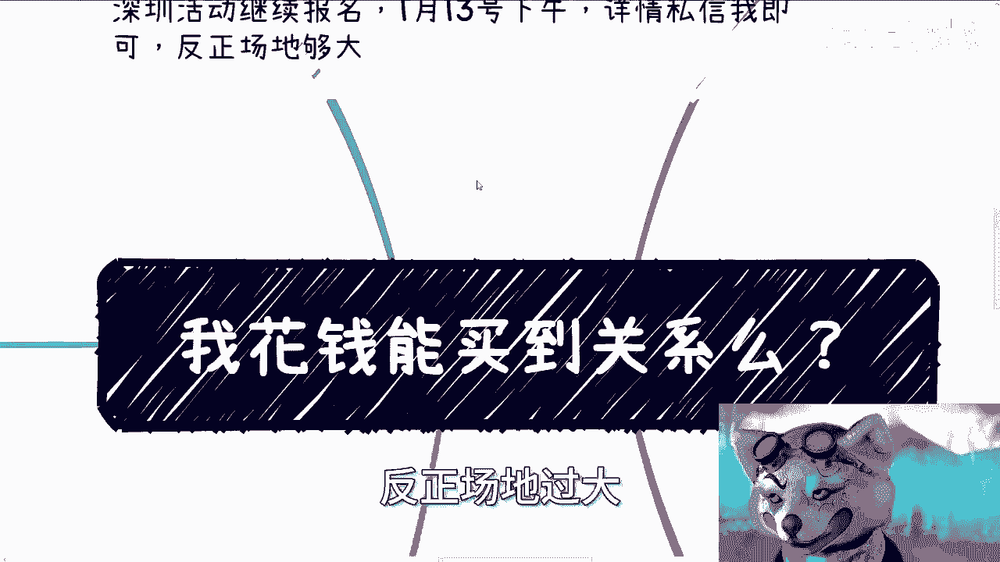
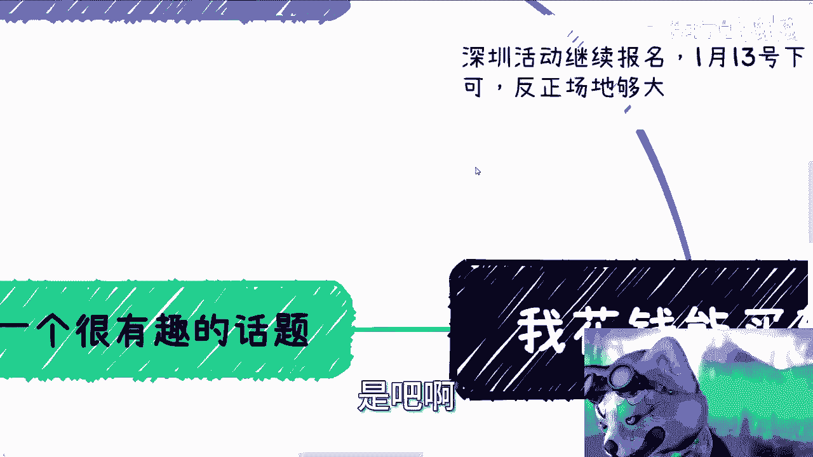
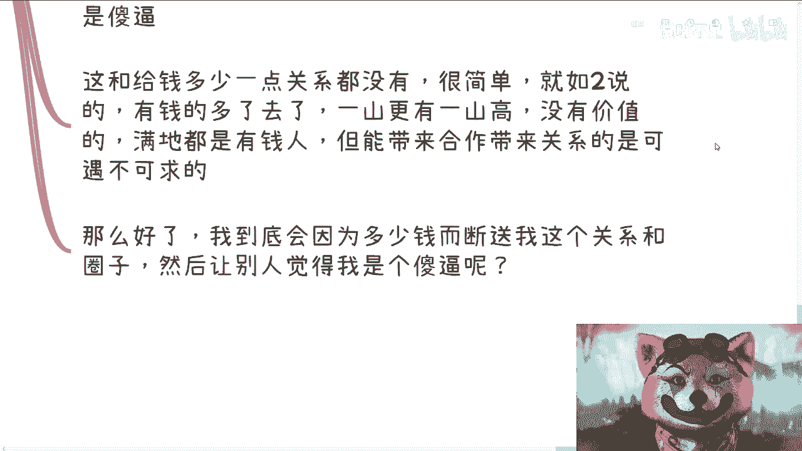
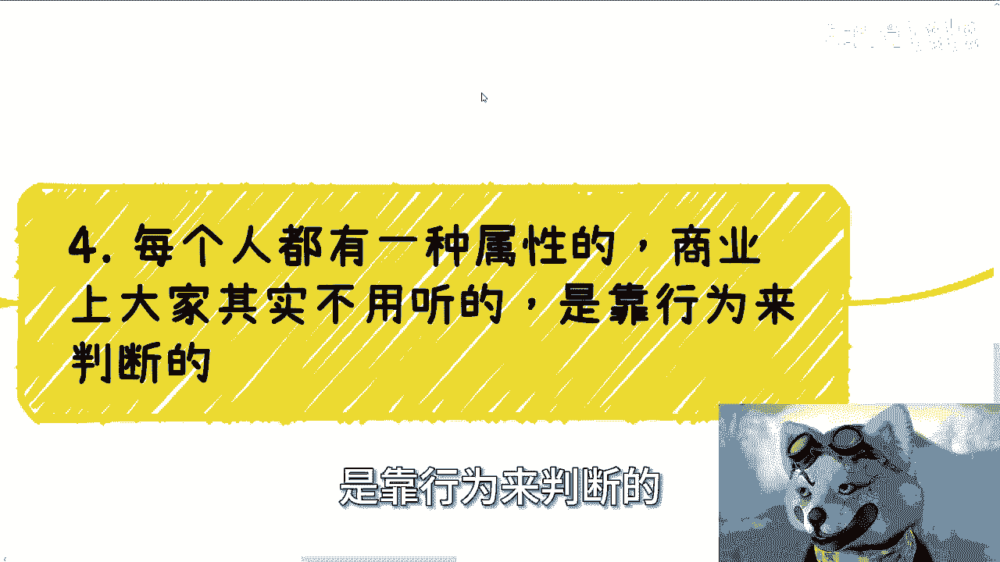
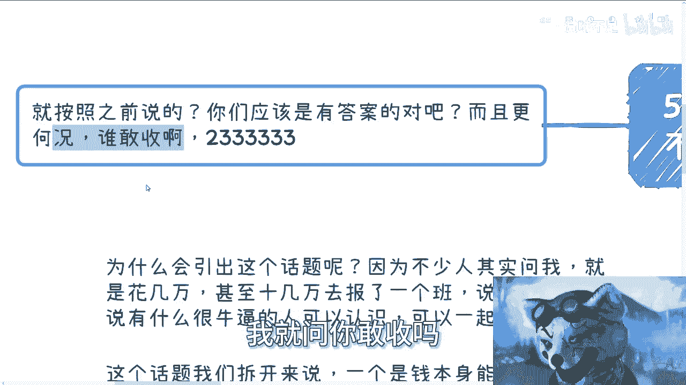
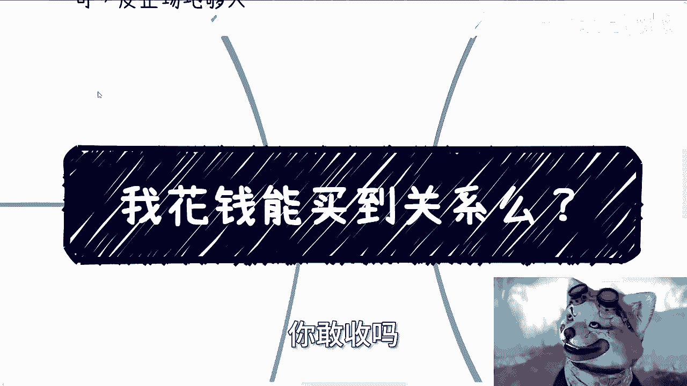
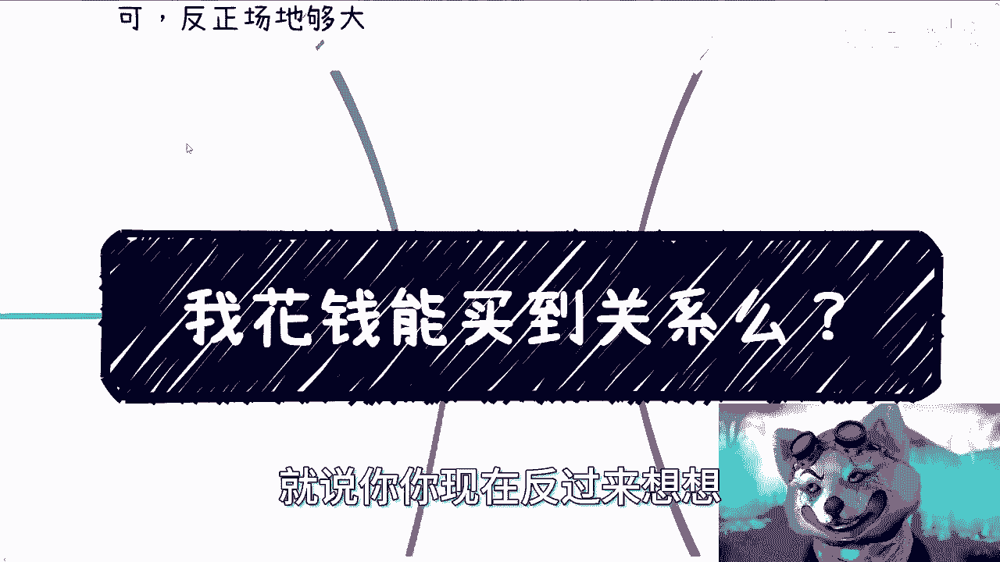
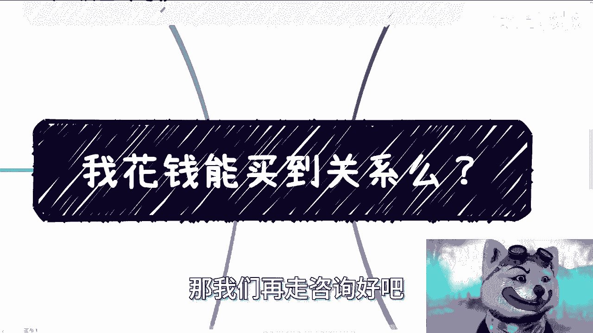

# 课程一：金钱能否买到关系？💰 - P1

在本节课中，我们将探讨一个核心问题：金钱能否买到真正有价值的人际关系或资源？我们将通过逻辑推演和现实案例，分析金钱与关系的本质联系。

---

## 概述

许多人希望通过支付费用（例如报名高价培训班）来获取所谓的“人脉资源”或“大佬引荐”。本节课将拆解这一现象背后的逻辑，分析金钱在获取核心关系中的作用与局限。

---

## 核心逻辑拆解

我们将问题拆解为两个层面进行探讨：
1.  金钱本身能否买到关系？
2.  当金钱达到“量变产生质变”的巨额级别时，能否买到关系？

逻辑本身并不复杂，跟随思路便能理解。

---

## 一、 金钱与资源的供需矛盾

上一节我们概述了核心问题，本节中我们来看看一个基础的经济学原理：供需关系。

许多人认为，付费就能获得稀缺资源。这类似于在上海寻求医院病床：病床数量是固定的，但需求者众多。

**公式**：
`稀缺资源价值 ≠ 单纯由出价高低决定`

如果每个人都愿意出钱购买，那么资源就不再具有排他性，其附加价值便会消失。你愿意支付几万或十几万，别人也同样可以。当所有人都能通过出价获得时，实际上等同于所有人都没有获得独特优势。

这类似于学历贬值：如果每个人都能轻易买到名校学历，那么学历的鉴别价值就不复存在。

**推论**：
如果付费就能确保获得资源并成功（例如在跨境电商中赚钱），那么理论上所有人都能致富。这显然不符合经济规律，因为盈利总是伴随着亏损。

> 请注意，这并非指所有提供资源的都是骗子，而是指用小额金钱所能换取的，往往不是真正稀缺或高价值的核心资源。

---

## 二、 “站台”现象与价值认知

理解了供需矛盾后，我们进一步看看市场上常见的资源交换形式。

在商业或某些培训中，存在一种“站台”模式。例如，你支付10万元，其中可能只有3万给组织者，7万给那位出面“站台”的“老法师”或“大佬”。

这是一种用名气换取金钱的交易。问题在于，大多数人缺乏鉴别“名气”真伪与价值的能力。将一份正规介绍与一份精心包装的微商宣传放在一起，很多人难以区分。

**结论**：
你支付的几万或十几万，购买的很可能只是一个心理安慰，或是一个联系方式（如微信、知识星球、微信群）。然而，如果对方真有高价值的圈子，你也无法融入。真正有价值的圈子不会在网络上公开兜售。

**补充观察**：
真正掌握核心资源的人（如高校、政府、大型企业、资本方的重要人物），通常不会活跃在B站、微博等公共社交平台进行此类资源交换。

---

## 三、 关系的单向通道：价值优先原则

既然小额金钱难以买到真关系，那么从关系拥有者的角度思考，情况又如何？

假设有人付钱请我（陈老师）引荐一位有价值的人士。我的思考逻辑如下：

1.  **如果求助者自身没有价值**：那么这纯粹是一场金钱交易。我可能会引荐一个你认为有价值、但在我看来价值不高的人。这是一次性买卖。
2.  **如果被引荐者真有价值**：这就引出了核心原则——**关系与金钱之间，往往是一个单向通道**。

**核心原则**：
`有价值的关系 → 可能带来金钱收益`
`金钱 ↛ 轻易买到有价值的关系`

为什么？商业价值的判断基于行为。

如果我向一位有价值的人士引荐了一个无法带来任何商业机会、仅是有钱的陌生人，这位人士会认为我的行为缺乏商业头脑，损害了我自身的信誉。

**灵魂拷问**：
对于一位拥有高质量关系和圈子的人，他会为了收取多少引荐费，而甘愿损害自己的信誉和核心圈子关系？答案是：通常不会，除非他短视到不顾长远发展。

---

## 四、 行为定义个人：态度与目的性

关系建立的基础不是金钱，而是个人在互动中展现的行为与特质。

在商业社交中，行为比固定的规则更重要。例如，请教别人后发一个红包或送一份小礼，重在表达感谢的态度。**“不给”可能意味着不懂礼节或没有格局。**

以我拜访相关部门（如公安三所、协会、工信厅）为例：
*   **目的必须明确**：每次拜访都必须有清晰的目标和期望的结果，不能只是闲聊。即使合作未成，获得一个明确的“否”也是结果。
*   **展现可合作性**：通过有目的的、专业的交流，让对方认为你是一个未来潜在的可合作对象，建立信任基础。

在中国，做事的最高优先级是**政治正确与安全**。在商业上，则是**基于合作建立的信任**。金钱可以用于请客吃饭、送礼，但这只是“锦上添花”。核心在于你是否有对方认可的价值点或合作潜力，哪怕它是经过精心包装的。

---

## 五、 关于“量变产生质变”的终极思考

最后，我们来探讨那个假设性问题：如果金钱多到足以“量变产生质变”，比如出一个亿，能否买到关系？

我们可以通过一个逻辑循环来思考：

1.  如果有人愿意且能够出一个亿来获取关系，这说明他本身已经拥有巨额财富。
2.  能积累如此财富的人，很可能早已身处相应的圈子，或者自身就具备极高的价值。
3.  一个自身具备极高价值、懂得商业规则的人，不会简单地用一个亿去“购买”一段不确定的关系，因为他深谙“关系单向通道”原则。
4.  退一步讲，在当前的环境下（如2023年的中国），收取如此巨额的“引荐费”本身也伴随着巨大的法律与政治风险。

因此，这个逻辑闭环表明，**到了用亿级金钱讨论问题的层面，金钱本身已不再是关键变量，个人及机构自身的价值与安全性才是核心**。

---

## 总结

本节课我们一起学习了金钱与关系的本质：
1.  **金钱在稀缺资源面前效用有限**，因为付费者众会稀释其购买力。
2.  **小额金钱易购得“心理安慰”或低价值链接**，难触达核心圈子。
3.  **关系通往金钱是单向通道**，核心关系基于价值交换，而非单纯金钱购买。
4.  **个人由行为定义**，商业社交中清晰的目的性和专业态度比金钱更重要。
5.  **巨额金钱也难破价值壁垒**，到了那个量级，讨论的基础已从金钱转移至自身价值与风险控制。

**核心结论**：金钱重要，但在获取真正有价值的关系层面，其作用非常有限。构建关系的基础在于**持续提升自身价值，并以专业、可靠的行为进行互动**。

---
*深圳活动报名进行中，日期为1月13日（下周六）下午。场地充裕，有意者请私信。*
*如有职业发展、商业合作、合同等涉及国内外差异的问题需要咨询，也可联系。*