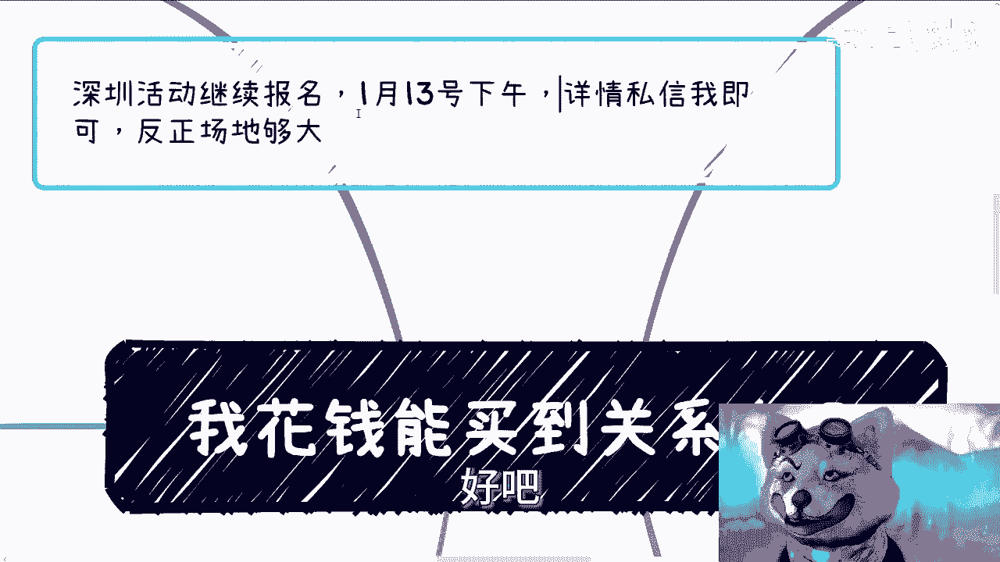
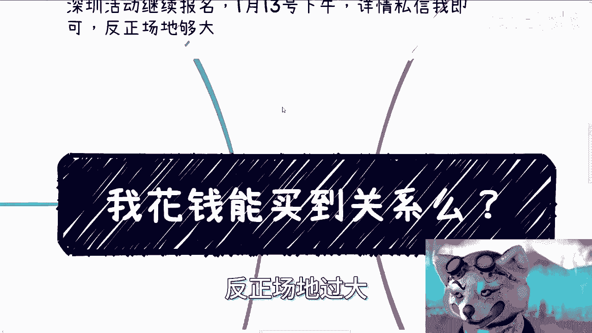
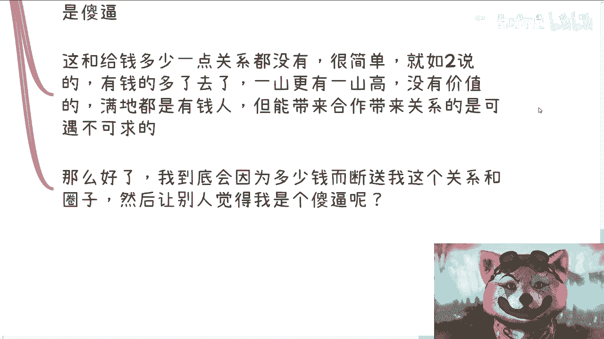
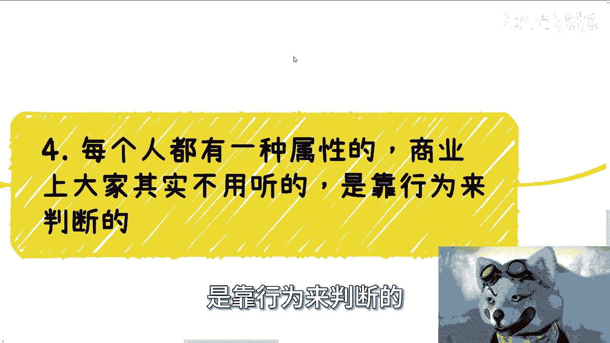
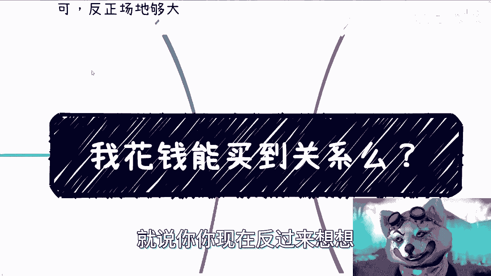
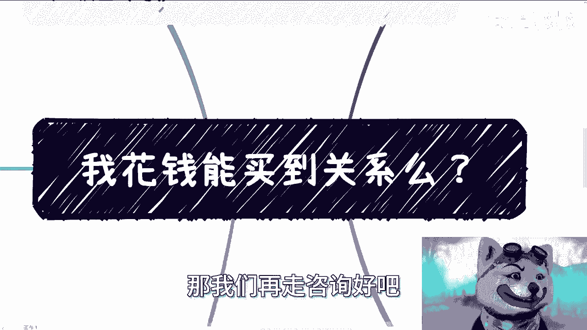

# 灵魂拷问：我花钱能买到关系么？ - P1 - 赏味不足 - BV1Be411i7QH

啊大家好，今天礼拜六礼拜六呃。

首先啊深圳活动继续报名好吧，13号对我他妈时间都忘记写，13号，1月13号下个礼拜呃，下午好吧。

相信你们在私信我啊，反正场地够大。

嗯这个问题啊叫我花钱能不能买到关系是吧。

首先呢这是一个很有趣的话题，为什么为什么会引出这个话题，因为不少人啊，他问我，他说张老师我报了一个班啊，呃好像最近那个跨境电商这种班比较多啊，亚马逊独立站这种，他说我花了几万块钱甚至十几万去报一个班。

说呢有老法师，因为什么，因为跨境电商这种东西他很吃资源货源啊对吧，或者说什么渠道啊，对吧好，他说有老法师啊，说什么有很牛逼的人可以认识啊，可以一起合作啊，能带过来什么资源啊。

呃这个话题呢你看啊我们拆开来讲两个问题，一个问题是钱本身到底能不能买到关系，一个问题是如果钱突破了一个量级，就大量变产生质变的时候，能不能买到关系好，这是逻辑，我跟你们讲其实很清楚，但是很多人想不明白。

你跟着我思路走，你自己去想想看，逻辑简单，我跟你讲，就就可能我觉得高中毕业吧，应该都能想的明白啊，就是我们曾经说过，赚钱是什么，赚钱的本身是信息差，那么为什么你会知道这些信息差，别人不知道。

因为你有圈子，对不对，好，那为什么你有圈子，因为这些圈子容易接纳你，你要明白你为什么有圈子，不是因为你牛逼，你再牛逼没有用，为什么，因为你再牛逼，你都是个个体，山外有山，人外有人对吧。

你你个体怎么样没有意义的啊，就像很多人说啊，我拥有很强的社会地位，政治地位对吧，他说我很有钱或者怎么样，怎么有用的呀，你再有钱再强，总有人比你更强对吧，而且更何况圈子愿不会容纳你，是这个圈子决定的。

你个人的能量再强，你比不上一个team，对不对啊，好我们来看第二点，我们先正过来推这个问题，你就如我之前说的上海，上海这个城市啊，他的病房病房病床一直是供不应求的啊，你们但凡在上海看过病。

你们就知道就是不管是正常的病房还是加床，他都是供不应求的，那么这个时候你就会发现，就跟你们报班是一个道理，你说我要加床，我要有病床，我要有病床好，老子愿意出钱，一比如说医院跟你说5万。

你说那这样子我给你20万对吧好，我跟你讲，这个就跟你们去报班是一样的，你去付钱，你获得资源对吧，就是你因果关系是因为你付了钱，所以你获得了一个资源对吧，好，那么你想想看啊，你为什么会说上海病床这个事情。

就是因为你整个上海市2500万人口这么多，医院有多少病床加上加床，我他妈就算他加到大马路上，对它的数量是不是定值，它的数量是个定值啊，我们假设啊假设它有它有啊100万床位床位啊，100万床位啊。

好那么这个时候你想想看，如果2500万人都出钱，那我就请问这100万床位给谁啊，给谁对不对，你到那个时候你总不能说，因为我出钱了，我给我，那不好意思，他妈出钱的人多了对吧，你当用钱能够获得的时候。

这个资源就没有价值，为什么，因为你有几万十几万，别人也有对吧，你又不是说你每个人弄个床位，包括你去买个资源，你花的就是几万和十几万，你又不是他妈花几个亿，对不对啊，你有几万十几万，别人也有。

那凭什么你能得到呢，那反过来说，如果你能得到，别人也能得到，那等于大家都没有你参考学历不是一个道理吗，对不对哦，如果按照你们的想法啊，就是我今天出钱，我得到了一个老法师，然后呢我就能在自媒体上面。

或者在那个跨境电商上面赚钱，那按照这么个说法，那他妈大家早就均富了啊，你们都赚钱，谁亏钱，谁亏钱对不对，当然我并不是说那些资源不是真的，或者说就是骗子没有这么说过。

而是说那些资源呢他就是一些过家家的资源，不是那些真的说值几万或者十几万，因为或者说啊你看啊我们在商业上，政府啊这种资本上面啊，我们叫做什么叫做纯站台的费用，我举个例子，比如说你现在交了10万给我对吧。

那么我可能只拿3万，剩下的7万给谁给那个站台的人，就是所谓的老法师对吧，给这个大佬啊，反正这种站台的人肯定不要脸啊，那么大家大家就分钱就好了嘛，就是用钱用用名来换钱对吧，而且那这个时候有很多人要说。

他说那这种名对吧，他肯定也没什么什么正规，或者说有什么没什么高大上的，我就问嘛，中国14亿老百姓有多少人分得清楚，高大上不高大上啊，我我今天就这么说啊，我拿我的这个介绍跟一个纯传销。

纯微商的就是放在一起，你们看得出来哪个好哪个不好啊，不知道的呀，你们没有，就大部分人没有判断能力的呀，对不对，这事实就这样子，因为没人教过你们这些东西，对不对啊，我说个结论。

说白了你无非是花了几万和十几万，买了一个心理安慰，或者说你可能买了个微信，买了个什么什么，比如说朋友圈或者买了一个呃知识星球对吧，或者说什么微信群啊，或者什么东西啊。

但是你最终如果啊这个老法师或者这个大佬，他真的有资源，有圈子，你也进不去啊，啊更何况从目前这个角度来讲，也不会有什么有价值的圈子，有价值的圈子不可能在网上打，你明白吧，那我这个地方再多说一嘴啊。

你们但凡真的接触过高校，接触过政府，接触过企业，接触过一些那个政府机关，你们就会明白真正的这些人，包括资本啊，包括资本，真正这些人他会上网吗，就我指的是他们会上什么什么B站啊，微博啊，什么其他地方会吗。

根本就不会，你知道吗，他根本就不care他们女儿，他们儿子可能会伤他们，怎么会伤人，对不对，好第三啊，我们反过来推啊，我们反过来推，你就拿我来讲，你给我一笔钱，你说陈老师给我介绍谁谁谁或者吃个饭。

我怎么思考啊，如果你找我这个人，就是你这个人啊，如果你这个人没有价值，那么OK就纯看在前字名字上，对不对好，那么我介绍你这个人，我介绍给你这个人也没有价值，或者说你觉得它有价值，我觉得他没有价值。

那OK我介绍给你介绍给你了，这他妈就是纯哥啊，随便我收了钱拉倒啊，因为你觉得有价值啊，那这是你的事情，我能怎么办呢，对不对，好，那么反过来说，如果我今天介绍给你，这个人的确有点价值，我不说多大啊。

就是它有一定的社会地位，有一定的政治地位，或者说他背后有一定的能量，它背后有一定的圈子，那么我之前就说过啊，钱和关系它是个单向通道哦，他是个单向通道，就是说关系它可以带来无数多的赚钱的可能性。

但是你用钱去买关系，你买不来好，那么我们说为什么买不来，因为商业价，商业上所谓的价值怎么来的，他不是看你说什么，不是看你包装什么，他看你的一举一动，你明白了啊，什么意思。

就是说今天我和一个有价值的人说啊，我介绍一个人给你，对不对，然后呢，我介绍的这个人，就是就是你是付我钱的这个人嘛对吧，我把你介绍给他，但是你无法给他和我带来赚钱的机会啊。

那么这个时候那个所谓的真正的有价值的人，他就会觉得陈老师是个，为什么，因为我我吃饱了撑的，我做了一件没有商业价值的事情对吧，那他肯定就觉得我是啊啊，那么这和给多少钱一点关系都没有，很简单。

你就如上面二所说的对吧，因为我如果跟他说，没有某局长对吧，或者某一个这个这个某种啊，我说我说我介绍给你一个人啊，我说可能这个人我就我就直接跟他说，我说这个人可能很有钱啊，然后呢这个给了我们20万啊。

我们比如说两个人平分10万块钱对吧，就是这种话说出去，他真正的一个商业的人或者有价值的人，有有格局的人，他就会明白就是有钱的多了去了，满地都是有钱的人啊，一山更有一山高啊对吗。

那他为什么要出来见这个人呢，他为什么要出来吃这顿饭呢，啊你没有价值，他出来干什么，他出来只会降低他的身价，他出来只会只会让他觉得我是个，你懂吗啊，所以说你要明白，没有价值的，有钱的人满地都是。

但是能带来合作的，能带来商业价值的这种关系，可遇不可求，对吧好，那么好了，我们最终一个灵魂拷问，就是我到底会因为多少钱而断送，我跟这个有价值人的这个关系，跟这个人的背后的圈子，你们想想看，如果你是我。

你们会为了多少钱断送他，你没有道理的呀，除非你是个，对不对。

好那么第四个就是我跟你们说啊，每个人都有一种属性，商业上大家其实不是永定的，是靠行为来判断什么意思呢。

就比如说好比你今天问别人一个问题，或者麻烦别人一下，你可以给个红包，你可以送礼啊，你可以给个很小的红包，你也可以送的很low啊，你不用你不用担心说哎，好像我不懂规矩或者怎么样，这不重要。

但是你不能没有表示为什么，因为你给和不给是你的态度，但是你没有表示，那就说明你这个人不行啊，就没有格局啊，对吧，所以说这句账号好像我每次出去社交，我去拜访别人，比如说呃那个公安三所啊对吧。

然后那个协会啊对吧，比如说什么什么工信厅啊对吧，就是我去没问题，我随时都可以去，但是我得想好我的目的是什么，你不能真的让别人觉得我，陈老师过来打三回啊，对就是陈老师过来聊天的，吃饱了撑的吗，对不对。

那我时间就算不值钱了吗，人家时间值钱，对不对啊，就是我的目的要很清楚，就是我到底要怎么样的结果，我不能白跑一趟，就是哪怕最终失败，人家不跟我合作，那也是个结果，我一定要拿到这个结果，因为只有我拿到结果。

对我来讲，这个买卖才是成功的，我拿不到结果就是亏本买卖啊，同时对方也会明白，我是一个目的性很强，同时可能商业思维比较清晰的人，那么也就是说，无论现在能不能合作，对上对方，至少觉得我是个可合作的人对吧。

或者可合作的资源，未来总有机会的来日方长，所以还是那句话，中国做事情优先级最高的是什么，政治正确，安全好，商业上是什么，就是合作过的信任对吧，那么你会发现没有钱这件事情，因为钱这种东西本身就是个风险。

你明白吧，就没有说哦，我们今天什么什么拉个关系或者怎么样子，我们是什么通过钱去那个的，你钱可以用来请客吃饭，你可以用来买送礼，但是请客吃饭和送礼都是所谓的锦上添花，你一定要有核心的东西跟对方去合作。

哪怕这个东西是你吹出来的，是你包装出来的，这没有关系，但是你得让对方觉得你是一个懂行的人，你明白你不要说自己在那边冥想啊，这个我包装一个东西，然后对方怎么不认可我那么屁话，你连对方比如说公安也好。

竞争也好，对吧，包括协会，包括其他各种东西，你连对方怎么运作，你都不知道，自己在那边包，别人怎么会觉得你靠谱呢，对不对啊，好那么就到最后一个问题，他说最后来讲啊，那么我们就说这个量变产生质变的时候。

它能不能有效啊，你想首先如果那我们就拿，我们就拿这边最后一个问题是你给我多少钱，我会断送这个关系和圈子，哎有人会想，有人会说他说那足够多可以啊，那他说既然就是说我们讨论嘛对吧。

那我们可以说为就是就是扯下蛋啊，就是说哎给我一个亿对吧好，那么你仔细想想看，给你一个亿，如果这个人有一个亿，同时他愿意给你，那就意味着他原本一定就会有相关的圈子，没有相关的圈子，他怎么赚得到一个亿。

对不对好，那么如果他有相关圈子，他就一定是一个懂得商业的一个人，那他懂得商业这个人，那就说明他一定会有价值，如果他有价值，他就不会给你一个亿，对不对，一个道理呀，你仔细想想就知道了。

对方就是你要明白一点啊，所有的人都不是哦，所有的人都不是，就是你每个人都有一个阈值在那个地方，就是就是可能在他的你你就这么想的，在他的认知范围内，他不是，但他认知范围内YYY。

如果他的认知不就是他的做事方式，如果不明确，那他可能是个，但是问题是多少钱，这个东西大部分人还在认知内吧对吧，你让他花5000，花5万，他可能还愿意花，你让他掏50万，你看看啊，有几个人会掏一个道理啊。

但是同样的，如果他今天真的愿意掏50万，那就说明什么，那就说明他一定有对应的价值，但是它不一定能跟你合作，但不代表它没有价值对吧，而且我就说啊，退1万步来讲，我就问你敢收吗。

你敢收吗，你去了解了解2023中国在干嘛啊，你敢收吗。

对不对啊，所以说啊就是说你你现在反过来想想。

这个逻辑是不是很简单，是不是很简单，钱重要吗重要，但是你放到某一个层面真的不重要，对吧啊，好吧行啊，就这么着，这个大家双休日愉快啊，嗯嗯活动要报名的，私信我，然后剩下的就是你们。

反正有什么这个这个这个这个发展，职业发展啊，商业发展啊，商业合作，商业合同啊对吧，各种各样的东西，你们要是觉得不了解的，或者说人在海外，对国内不是很了解的。

