# 父母让你找铁饭碗-你要追求自己的事业-来谈谈三个观点---P1---赏味不足---BV1oN4y1q

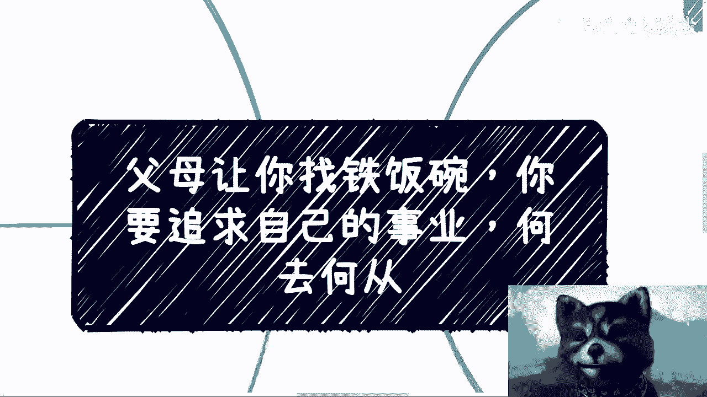

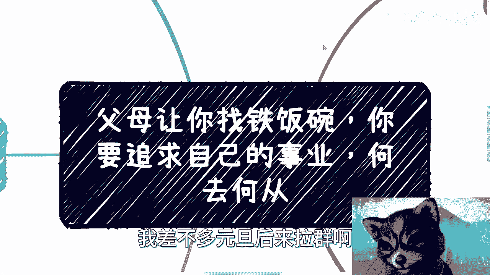

在本节课中，我们将深入探讨一个普遍的职业困惑：当父母希望你追求“铁饭碗”式的稳定工作，而你内心渴望追求个人事业时，该如何思考？我们将逐一分析三种常见的观点，并揭示其背后的逻辑与现实考量。

## 观点一：边工作边发展副业，进退有据 🤹

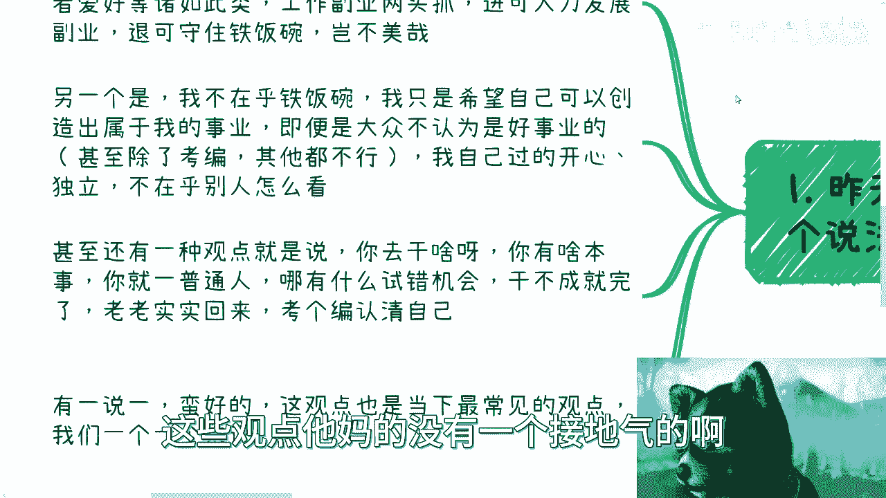

上一节我们介绍了课程主题，本节中我们来看看第一种常见观点。这种观点主张先找一份稳定的工作，同时利用业余时间发展副业或爱好，试图实现“进可攻、退可守”的局面。

以下是支持此观点的主要逻辑：

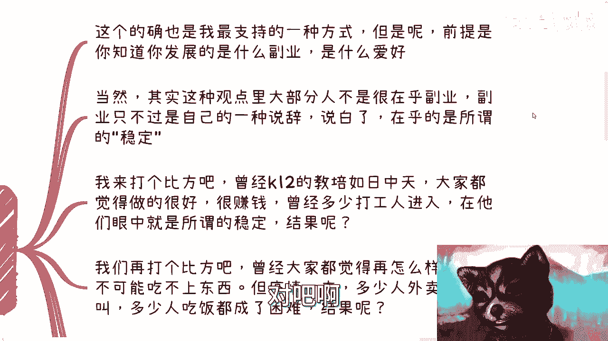

*   拥有一份稳定工作作为经济基础和退路。
*   利用业余时间探索和发展其他可能性。
*   理想状态下，副业可能成长为主业。

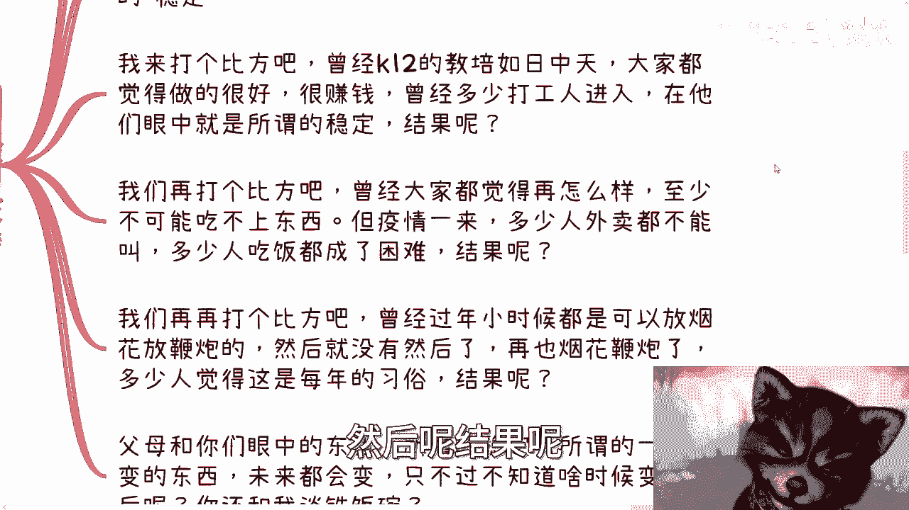

然而，这种策略的成功与否，关键在于对“副业”的定义。许多人所谓的“副业”缺乏真正的积累和商业主体，更像是一种临时性的“赚外快”行为。一个能称之为“事业”的副业，需要具备**可持续的积累、明确的主体和商业合作模式**。

更重要的是，许多人声称追求“副业”，实则内心深处最看重的是前者的“稳定”。但所谓的“稳定”本身并不可靠。历史告诉我们，许多曾被视作“铁饭碗”的行业（如过去的K12教育）或我们认为一成不变的生活状态（如疫情前的物资供应），都可能因政策、环境等变化而瞬间改变。

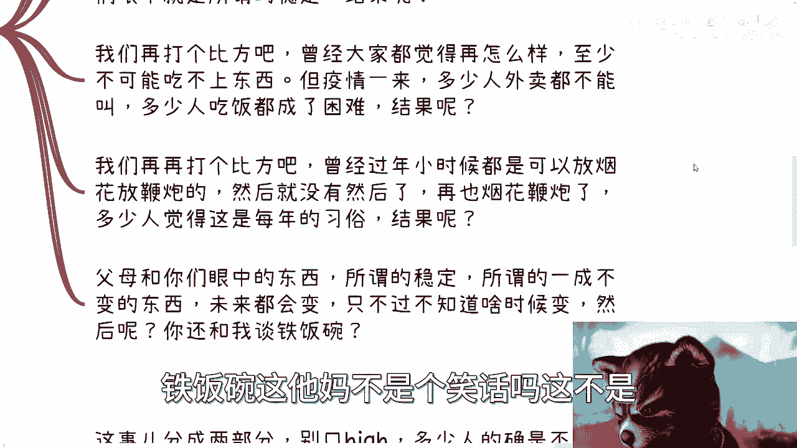

因此，将希望完全寄托于外部定义的“稳定”是危险的。真正的可控性源于自身的能力和选择，而非某个固定的职位。

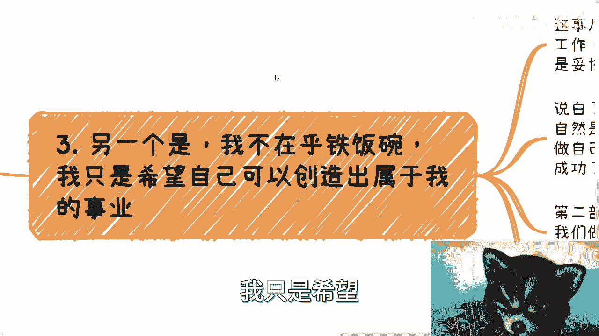

## 观点二：不在乎铁饭碗，只愿创造自己的事业 🚀

上一节我们讨论了“边工作边发展”的策略，本节中我们来看看第二种更为理想化的观点。这种观点宣称完全不在乎工作的稳定性，只专注于创造属于自己的、哪怕不被大众看好的事业。

这种观点需要拆解为两部分来看待：

1.  **“不在乎”是否真实**：许多人声称不在乎他人眼光，但最终仍因父母、亲戚的压力而妥协，陷入内耗。真正的“做自己”意味着内心坚定，不纠结，这本身就是一种成功，与赚钱多少无关。
2.  **“创造事业”的实质**：在谈论宏伟的“事业”之前，首要任务是解决生存问题，即**先赚钱**。没有经济基础，任何理想和情怀都难以落地，甚至可能成为被利用的弱点。在起步阶段，务实的目标比空谈“事业”更重要。

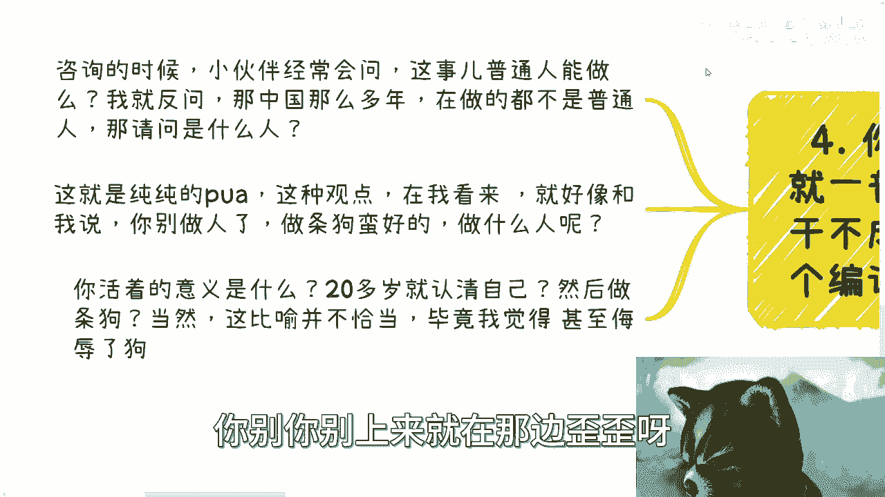

简而言之，避免陷入“口嗨”式的理想主义，将关注点从“创造伟大事业”转移到“如何脚踏实地地创造价值并获取回报”上。

## 观点三：认清现实，普通人没有试错成本 🚧

上一节我们剖析了追求个人事业的理想化观点，本节中我们来看看第三种看似“务实”却可能极具局限性的观点。这种观点认为，作为普通人，没有资本和机会去试错，应该尽早认清现实，回归“考编”等传统路径。

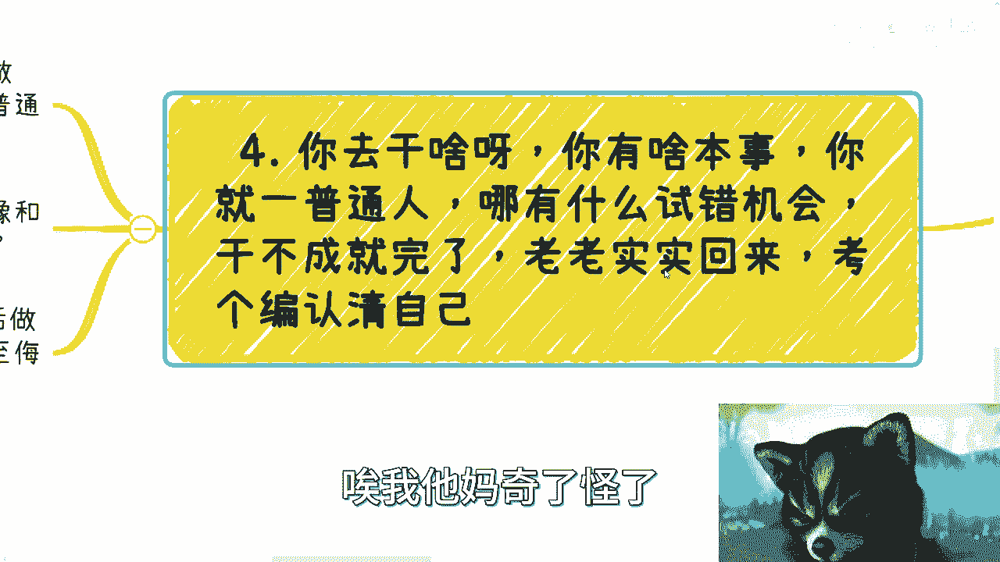

这种论调本质上是**一种PUA（精神操控）**，它预设了人生的失败，并扼杀了任何尝试的可能性。如果所有人都信奉“普通人做不成事”，那么社会上诸多成功的业务和产品又是谁创造的呢？事实上，绝大多数创业者起步时都是“普通人”。

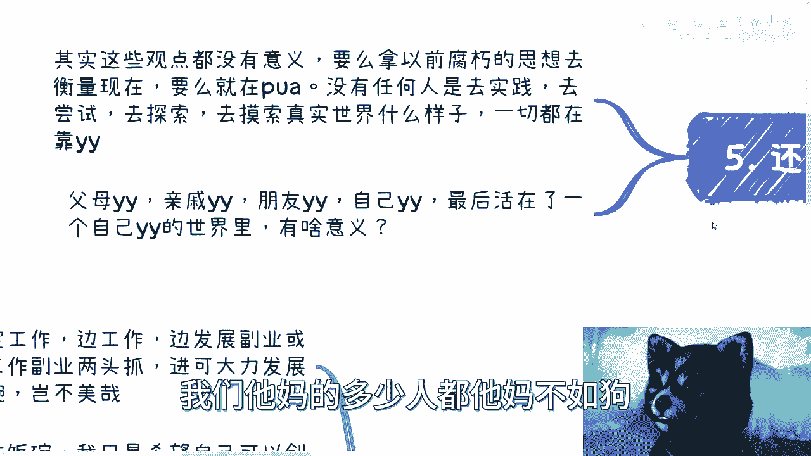

接受这种观点，等同于在二十多岁就宣告精神上的死亡，放弃探索人生的多种可能。人生的意义不应被简化为遵循一条被他人设定好的、看似安全的路径。

## 核心总结与行动建议 📝

本节课中我们一起学习了关于“铁饭碗”与“个人事业”的三种典型观点。我们发现，无论是追求表面的“稳定”，陷入空想的“理想”，还是接受消极的“认命”，这些讨论常常停留在“空对空”的脑补层面，缺乏与实践的连接。

有价值的思考应源于实践与探索。你需要做的是：

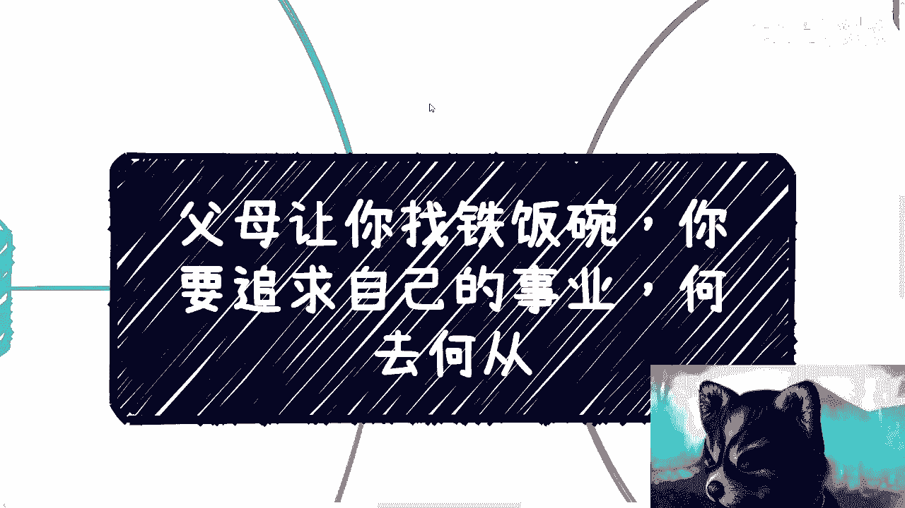

*   **走出信息茧房**：主动去了解真实的社会和行业，而非被动吸收各种观点。
*   **建立批判思维**：与他人的观点进行“battle”（辩论）时，应基于自己的实践和观察，而非感觉。
*   **关注一线反馈**：真正有参考价值的信息，来自那些深入参与社会规则、并持续获得反馈的实践者。

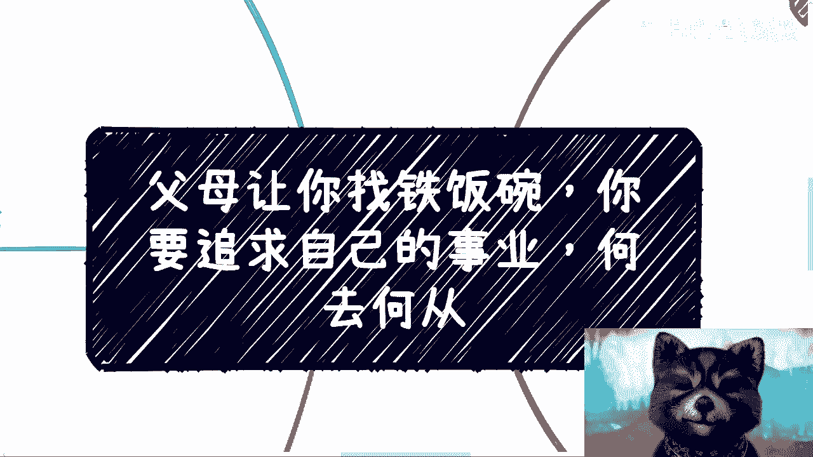

最终，不要沉迷于讨论“铁饭碗”是否存在。真正的安全感来源于**自身能力的提升和对世界运行规律的洞察**。停止空想，开始行动，在实践与碰撞中形成属于自己的、坚实的职业认知。