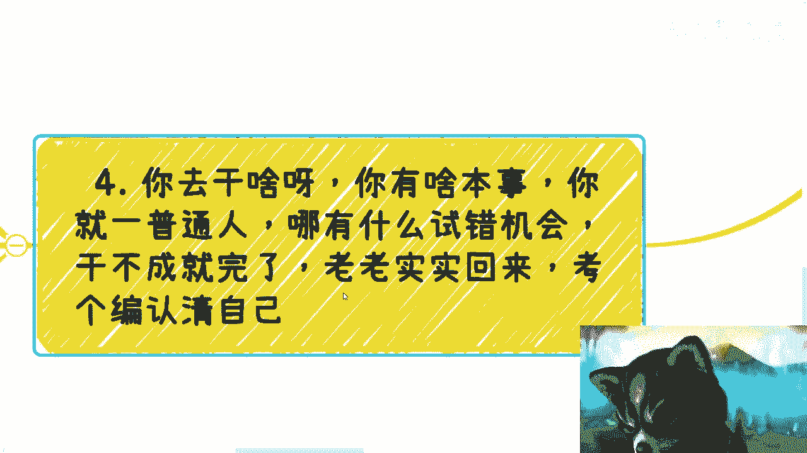

# 父母让你找铁饭碗，你要追求自己的事业，来谈谈三个观点 - P1 - 赏味不足 - BV1oN4y1q774

好啊大家好啊，这个深圳活动继续继续报名啊，1月13号我差不多元旦后来拉群啊。

嗯昨天呢这个小伙伴啊，私信上说了这么一个东西啊，我觉得这个东西蛮好的啊，他说让我来讲一下啊。

昨天小伙伴呢给了我三个说法啊，第一个啊叫做啊，我去找一个稳定的工作啊，边工作边发展副业或者爱好等诸如此类工作，副业两头抓啊，进而可大力发展副副业啊，退可守住铁饭碗，岂不美哉对吧，这是第一种说法啊。

咳咳另外一种呢叫做我不在乎铁饭碗啊，我只希望自己可以创造属于我的视野啊，即便是大众不认为是好的视野，你看啊，我这边就是直接CTRLCCTRLV他的说法啊，我自己过得开心独立啊，不在乎别人怎么看啊。

好可以好，没问题啊，那么还有一种叫做什么，咳咳咳，叫做你去干啥啊，你有本事你有啥本事啊，你就一普通人啊，哪有什么试错机会啊，干不成就完了，老老实实回来考个编，认清自己是吧啊，好可以啊，没问题啊。

呃有一说一啊都蛮好的啊，这些观点他妈的没有一个接地气的啊。

都他妈瞎瞎他妈扯淡啊，嗯这些观点呢也是当下最常见的观点啊，我们一个个来讲，首先啊就是说我要去找个稳定工作啊。

边工作边发展副业或者爱好，诸如此类的吧，好啊呃有一说一啊，这个也的确是我最支持的一种方式，但是啊前提是你得明白你发展的什么叫副业，什么叫爱好，你发展的是个什么玩意儿对吧，就像我以前跟你们说的。

那一群人在那边做做的都他妈是过家家的东西，有什么好发展的啊，发展什么玩意儿啊，我你就说不好听点，赚外快就赚外快对吧，这个割韭菜就割韭菜，还他妈副业呢，他妈这么多副业啊对吧，就在我看来。

你要去发展所谓的副业，他正因之所以能叫一个事业啊，他有积累吧啊他得就我们说我们说商业上面，他得他得有主体，他得有背书，他得有合作方法，什么玩意就副业对吧啊。

当然其实这种观点里呢，我觉得大部分人他不是很在乎这个副业啊，说是这么说的啊，啊副业呢只不过是自己的一种说辞，说白了他在乎的他妈的不是后者，是他妈，前者是所谓的稳定对吧好，我来打个比方啊。

曾经K12的教育如日中天对吧，很多创业者都觉得卧槽他妈的咳咳咳，能赚钱啊，很多打工人啊也觉得妈的铁饭碗是吧，冲啊大家都觉得觉得做的很好很赚钱，曾经有多少人进去啊，啊在他们眼中就是所谓的稳定。

然后呢我就问，然后呢结果呢对啊。

我们再来打个比方，曾经大家都觉得啊，再怎么样，至少2022年，2021年，2023年不可能吃不上东西对吧好，但疫情一来呢啊多少人家里没有东西吃啊，外卖不能叫多少人吃饭都成困难对吧，结果呢然后呢。

我们再再打个比方，曾经过年，小时候都是可以放烟花，放鞭炮的，然后呢然后就没有然后了对吧，还有吗，烟花还有吗，鞭炮啊，多少人觉得这是所谓的习俗，你们稳定吗啊，结果呢，我就说啊父母跟你们眼中的东西。

所谓的稳定，所谓的一成不变的东西，未来都会变啊，只不过我们不知道什么时候会变，但是它会变，一定是板上钉钉的，然后呢，你跟我谈铁饭碗啊，那么搞笑吗，这不是在你要说铁饭碗对吧，有的那你到你到路上。

路边拿个碗在那边讨跪着，我觉得这是铁饭碗，为什么，因为这件事情是你自主可控的，剩下的呢，哪件事情你可控啊，啊这铁饭碗这他妈不是个笑话吗。

这不是，我还是那句话啊，公开的视频，我能够讲的东西不绝对是占到不止，就不足10%的，你们自己想想看，你们就自己悟吧，第二个观点啊，他说我不在乎铁饭碗，我只是希望自己快去创造属于我自己的视野。

对吧好，这个观点啊分成两部分，别口嗨，多少人的确是不在乎工作，但他妈在乎别人的眼光啊，在乎父母啊，在乎亲戚啊，最后不还是妥协了吗对吧，然后他妈20多岁，开设了自己一个四不像的人生对吧，你说白了是什么。

就是你要真的不在乎，你真的做自己对吧，我觉得我就很支持，但多少人做得到呢，他们都是在口嗨呀啊，都是我跟你说，中国老百姓擅长什么，擅长他妈三个字叫人来疯对吧，就是别人说这个啊，我也要这样，别人说那个啊。

我也要那样，你真的在乎吗，你真的在乎做自己吗，你要真的不在乎对吧，你就不会内耗，你就不会纠结，在我看来，你其实已经成功了，你的内心已经成功了啊，这跟赚不赚到钱没有关系，你已经是成功了对吧。

第二部分是什么，就是他说做属于自己的事业，我就这么说啊，你别那么看得起我们，别看得起自己，也你也别看得起我们啊，我告诉你们，我们做不出什么事业啊，你要做任何事情之前，你就先赚钱，没赚到钱，屁都不是啊。

别去谈他妈的，做自己的事也没什么东西可以做的，你做不了，我也做不了，别想了，好吧对吧，我就告诉你，你的理想，你的善良，你的情怀最终只会被资本家作为收割的理由，没有啦，nothing就这么干净。

就这么清楚对吧，好，第三个观点叫你去干啥，你有啥本事对吧，你就一普通人对吧，哪有什么试错成本，巴拉巴拉巴拉吧，好啊，咨询的时候啊，很多小伙伴经常会问啊，问我这个事儿，普通人能不能做那个事儿。

普通人能不能做，那我他妈就反问中国他妈这么多年满地的业务，满地的这个落地的东西啊，那在座的不是普通人，他妈的是什么人，哎我就奇了怪了，那所有做的那些事情的人不是普通人吗，那是什么人，都他妈家缠万贯啊。

家里面有关系的，你去了解了解，你去问问看呀，你别你别上来就在那边歪歪呀对吧。

然后第三个观点说这种话的。

我不管是你父母还是你亲戚还是谁啊，这他妈就是纯纯的PUA，这种观点在我看来就好像他妈在跟我说，别做人了，做条狗蛮好的，做什么人对吧啊，那我就问嘛，你活着的意义是什么。

你活着的意义难道就是他妈的活了20多岁，然后告诉自己，老子认清楚我自己了，我他妈这一生这辈子就这个吊样子了，然后做条狗啊，当然我觉得这个比喻并不恰当，因为我觉得这个比比喻毕竟侮辱了狗，那奇了怪了。

真的是对吧，那照这个说法，我觉得你不要读书了，你读什么书啦，对不啦，你从他们生下来开始。

你就是条狗不结束了吗，哎这观点我他妈奇奇，真的奇了怪了哦，我生下来就是为了给给他妈的父母PUA的啊，就是给他妈亲戚PUA的啊，就是为了结婚生孩子啊，哎我怎么吃了怪了。

对啊，最后还是那句话，其实这些观点都是没有意义的，为什么，因为要么就是拿以前腐朽的思想去衡量现在，要么就是在PUA，没有任何人上到父母，下到你们，没有任何人去实践，去尝试，去探索。

去摸索这个世界真实的样子，咳咳对吧，哦永远都是世界在变化，人的思想是不变化的，一切都他妈靠脑补啊，父母脑补，亲情脑补，朋友脑补，你自己脑补，最后活在了一个你自己脑补的世界里面，有什么意义啊。

有什么意义呢，你按我说吧，他妈的狗他妈每天都都他妈的六阶，至少看看世界什么样子呢，我们他妈的多少人都他妈不如狗。

对不对。

就是我一直以来跟你们讲的这个观点是什么，就是你们在网上看东西，你们跟别人沟通，不是为了一味的去吸纳，有的没的观点，不是让别人把思想植入给你们没有意义的对吧，你们要的是什么，你们要的是出去自己了解。

了解完了之后跟别人去battle对吧，你比如说你说你说陈老师，你说的不对啊，我经过我的实践对吧，好，我怎么样怎么样怎么样怎么样可以呀，聊啊BO啊，对不对啊，而不是说啊不是的啊，我觉得不是这样子的啊。

我觉得怎么样怎么样，那你依据呢对吧，我早就跟你们讲了，我为什么有很多观点，我觉得我是能够给你们的对吧，那是因为第一我这么多年去过很多地方对吧，一线到五线我都去过，我不会待在一个城市。

第二我的业务贯穿了高校政府企业，而且一直到现在为止，一直都还在一线在做对吧，所有的东西我从来不关心我自己感觉是什么，和我看到是什么，我其实都不关心，我只关心是说所有的那些真正在一线的。

贯贯穿于整个社会规则当中的这些人，他们到底得到了什么，他们到底看到了什么，他们给我的信息是什么，我只会如实的跟你们讲对吧，而不是一味的就跟你们说，卧槽你们是没有意义的，你们他妈的活着就是他妈的生育机器。

有意义了，没有意义的呀，然后哦这个20多年读完书跟你们说，哎呀你们他妈的只能找工作对吧，除了找不到找不到工作，你们就他妈的死路一条，何必呢，对吧就是你们会发现很多的battle。

很多的讨论全他妈是空对空对吧，就是一个活在自己脑补的世界当中的人，跟另外一个活在自己脑补世界当中的人，大家开始在那边隔空讨论，没有意义的呀，对你造成的流量，你造成的流量最终都是资本家所收获的。

你能收获什么。

你收获不到什么东西，好吧，不要再来他妈的谈什么铁饭碗了，有吗有吗，你除了拿个饭碗在那边讨饭，我觉得都他妈不是铁饭碗，哎妈奇了怪了，好吧就这么简单的事啊，这观点我也说的很清楚了，我就这么个态度。

所有的这些观点都是，行那就这么着吧啊有啥你们有什么详细问题呢，你们整理好。

