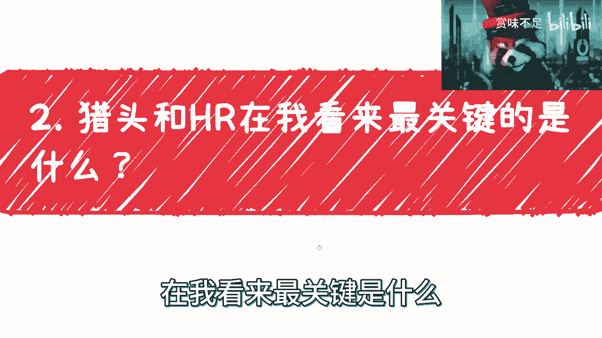
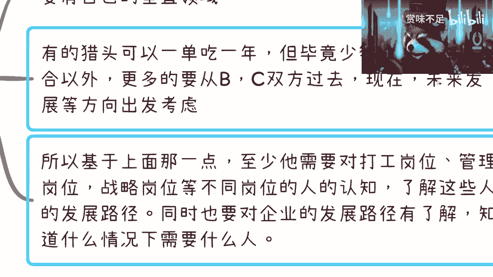

# 猎头和招聘是一个需要提升和改革的领域 - P1 - 赏味不足 - BV1Rh411E7AD

好啊大家好啊，这个，细心的小伙伴已经发现了是吧，我换了一下背景，然后戴了个帽子是吧啊，上周那个小伙伴有跟我提到这个hr啊，还有这个猎头相关的一些事啊，然后这里面呢我就总结了一下，因为本身猎头。

那跟我之前所做的培训呢也有一定的关系啊，但是不得不说啊，我也觉得啊猎头也好，包括hr也好，其实我觉得hr是需要有提升的一个行业，但是诶诶猎头呢也的，的确是一个需要改革的一个岗位和行业。

而且我觉得呢这个东西往外扩啊，不见得只是猎头，他更多的其实像个招聘啊，像个招聘这样子。

OK那我往身边拉啊，首先呢其实我觉得hr跟猎头呢，在现在行业当中属于重灾区。

那这个重灾区呢主要是因为说啊，哎呀怎么放大来着，对就是hr本身我肯定不熟嘛对吧，那我就没办法去说了，这小浣熊为什么嘴是歪的呢，靠这个拉远了啊，求得嘛得，行行就这么着吧。

就是这hr呢我不是我就不评头论足了对吧，但是猎头呢我的确接触很多啊，那么重灾区呢主要是在于说什么呢，就是量呢，就比如说做hr，做猎头的人很多对吧，就是现在量呢也就是非常大，但是关键是在于什么呢。

关键在于说整个的这个啊，这个好的人就比较难找，等一下啊啊对吵的人就比较难找，那就是一个，然后越来同时呢就是专业的人呢也越来越贵，而且我觉得呢长江后浪推前浪，他也没跟上对吧。

剩下的就是说这个前浪呢有一部分人还在对吧，长江后浪呢大部分人都是在浑水摸鱼，就摸的比较厉害，那你看啊其实hr对吧，做什么，你说他叫人力资源对吧，然后呢这里面呢还有人力资源管理对吧。

包括一些呃这个hr d对吧，就业务的对吧，但是问题是你会发现现在的hr啊，无论是在这个人力资源管理上面，包括一些呃这个技能上面，包括就是说像一些团队业务上面，其实真的能做到比较专业的hr的人还是比较少。

这一方面，第二方面就是说呃你比如说hr对吧，在人所谓人力资源管理，那什么是资源对吧，资源就是说你这你得知道怎么去找合适的资源，你得知道到哪里去找合适的资源，你得知道怎么合理的分配资源。

那这个叫叫做那个resource，对啊你你你说我就是对吧，招招人对吧，面试面试这不能叫hr，这只能是你hr里面的某一个，最最简单的一个技能对吧，那你话又说回来，猎头又是什么猎头对吧。

你理论上应该是一个我们说啊，那你说是这么说，就是帮助企业去寻找好的人才，帮助好的人才去寻找符合他的企业对吧，但是这个猎头现在变成什么，你看我后面写了对吧，首先呢现在这个hr变成什么呢。

hr就是演变成了这个大家向后面简历，我跟你们讲啊，一个行业怎么变怎么变烂的啊，怎么变卷的，就是因为里面的垃圾太多啊，那你说hr也是一样的，hr其实有很多人素质很低很低啊，他就是背后卖简历。

其实也不叫卖简历吧，他相互就是说相互互通对吧，你别觉得就是这种这种这个简历，是你的隐私信息或者怎么样，你会发现真的相互慢，而且不但相互卖呢，还是那种就是说有些人还在背后作恶对吧。

就是属于他可能跟你跟你有私人恩怨，但是呢就到别的那种企业里面传你闲话对吧，很多很多我跟你讲，还有很多很多，所以你们一定要明白，因为之前在一些咨询的时候，我也跟他们提过，就是说呃像那个劳动仲裁啊对吧。

像hr啊，像猎头啊，就是我跟你们讲啊，就是很多时候对吧，就就真的不能相信任何人，你知道吗，就背后很多事情我们也许不知道，但是就给我们会造成很大的伤害啊，啊猎头我跟你们讲，现在就更别说了啊。

基本上就电话传销，就跟我对我来讲，跟电话传销还不如电话传销呢，他妈电话传销都比他妈的他们专业，你知道吗，哎呀我真的他妈绝了，我跟你们讲啊，我跟你讲，用我话来讲是什么呢，就是阿猫阿狗现在都可以做猎头。

那么房产中介，我跟你们讲，房产中介绝对都可以甩他们八条大马路，你知道吗，就哎呦，我靠就是我都忘了是什么时候啊，就是一开始我觉得我接受猎头还是不错的，你知道吗，而且就有些小姐姐长得蛮好看的。

然后大家也很专业对吧，然后我跟他们吃饭喝酒也都有的，后面这猎头就越来越不对了，你知道吗，就打电话过来，就那种就是说一开始呢，我觉得可能跟那些非常呃渣渣的那种房产，房产中介差不多。

那我后来就发现那还不如房产中介，那房产中介虽然渣，但是人家至少就是某些方面还专业的，这猎头打过来是真的什么都不专业，你知道吗，就那种就是说拿的信息吧，也是老的信息对吧，然后话术吧也不专业对吧。

就他对他比如说撮合B和B端和C端嘛，他对B端也不了解，C端也不了解，他也不知道怎么跟你沟通，这种人真的是唉就我跟你们讲，真的可能很多，有一段时间吧可能也找不到工作对吧。

就大家可能觉得哎呀我找不到工作怎么办呢，猪头啊，没门槛啊是吧，做房产中介吗，可能那个事吗，好像天上去low了一点对吧，那你做什么，我做猎头弹啊，牛逼啊，其实有什么区别，还不如人家做房产中介是吧。

嗯这个是第一个二呢，二二在这对吧。

第二个你看啊猎头更新H2，在我看来最关键的是什么。

第一你首先需要有一套，有一套对于人才培养跟管理的体系，就是不是说你自己要有去培养人才和管理体系，就是说你得有一套就是懂得对吧，比如说人才应该怎么培养，应该怎么管理的体系吧对吧。

然后你应该自己自己去在不同的领域，不同的企业，不同领域知道怎么去套吗对吧，而且什么都不懂对吧，我就是个hr对吧，我就是人力资源对吧，嗯这个面试面试的，那你搞个屁啊，你说是吧，猎头也是一样的啊。

第二个就是说你肯定是要深入业务的对吧，你hr要深入团队，公司业务，猎头则是要有自己的垂直领域对吧，你不可能我跟你讲，你是不可能今天说我做一个hr或做一个猎头，我是全领域的，没有的，你但凡跟我这么说。

我只能觉得你要么是个骗子，你要么就是完全不专业的，就这么回事，你知道吗，就专业的人他一定是有自己的一个垂直领域啊，以及也是对业务有很了解的，他的业务了解不是说咱不是说他的，就是对于这种呃，我们举个例子。

就比如说你对于医疗对吧，不是说他对医疗本身多么多么细节了解啊，对于相比这个业务人员相比运营，相比销售他很了解，不是他这个了解指的是什么，指的是我对这个行业里面的，就跟医疗相关的行业里面的。

各个不同的层级的人员，他们应该怎么成长，他们应该掌握哪些东西，他们应该在哪些方面发挥他们的长处对吧，他们这个团队应该是怎么相互弥补的，这个他是很清楚的，你知道吗，不是来秀叫什么，现在很多hr d对吧。

包括这个以前在阿里嘛对吧，说的很多，就包括很多hr d不是来秀优越感的啊，不是那种就是妈的，我是hr，你是一个员工，我靠我很牛逼，你得听我的什么玩意儿，你知道吗啊，这是第二个。

第三个呢就是有的猎头呢你们也知道对吧，他们都说叫做可以单吃一年对吧，就是但是我跟你们讲，这种毕竟少数，为什么呢，因为这种应该是一年的，是什么概念呢，他们就是相当于手上，比如说有十个这种CTO对吧。

或者十十个VP，然后这十个人呢可能每过一两年可能会换一下，但是由于他们的年薪很高，所以说这个猎头，一般按照20%的比例去拿的话，他其实还是能赚很多钱的啊，但是你们要明白，就说猎头除除了撮合以外。

他更多的是要从双方的角度，比如说以对于双方过去的了解，现在了解以及未来的发展方向，因为虽然啊我们说猎头他的确不懂很多的，他不可能面面俱到对吧，但是你至少得要去了解B端，可以给你讲述我过去。

现在未来我是怎么发展的对吧，我希望从哪个方向发展，我希望要哪些人才，对不对，好，那么C端是什么，C端就是说他会告诉你我以前是什么经历对吧，我未来是自己看重什么的对吧，那么同样的他在过程当中。

猎头其实还会成就是扮演一个什么角色呢，就是基于基于上面那一点，他至少需要对于打工的岗位也好，管理岗位也好，因为一家企业每一个事业部对吧，它里面所批那个随便艾特我，对吧，就是说他对于整个的打工岗位。

管理岗位，他对于一个企业里面不同的业务，不同的层级，他是要对这对这些岗位都有认知啊对吧，他也知道与，要知道这些岗位的整个发展路径是怎么样子的，对啊，他不能因为三不知啊对吧，就完全是个撮合。

那你做个屁呀是吧，然后同样的你也要对企业的发展有了解啊对吧，你家你现在是一家私企呢，还是加还是一家，比如说外企还是加合资的，还是一家，比如说是什么什么国企，国资背景入股的，你都要有了解的呀。

你我靠他妈现在真的是阿猫阿狗都能做猎头啊，这是就是企业的这个运营逻辑嘛，他也不懂对吧，个人发展路径他也不懂，他妈的，我就来撮合的对吧，我管你合不合适，反正你只要入职了对吧，我就拿你年薪20%啊。

你就过了试用期，我就拿你20%，那他妈的卖人口呢啊是吧，然后那个而且我跟你讲，猎头呢在很多方面它的专业性体现在哪里呢，它的创意性还要体现在说，他其实根据自己的经验，他需要给出B端跟C端不同的建议。

因为你想嘛你想嘛你要去赚钱，你赚钱的核心是什么，你的资源，你的资源核心是什么，是别人为什么愿意跟你合作，不愿意跟别人合作，对不对，那么我就跟你们讲，比如说有很多人咨询我对吧，他说驴老师。

你我就跟你们这么说，到今天为止，所有咨询我的人，你们去问他们对吧，就是所有咨询过我的人，我一上来是不收钱的，我先说你要先跟我讲你的背景，你要跟我讲的你的整个的一个过往对吧，包括你的问题，然后我来跟他说。

我觉得我能不能帮到你，能帮到你，咱们聊完你再给我钱，而且如果我觉得我不能帮到他，我直接我现在就是大概有那么五六个人，我都直接跟他们讲的，我觉得我帮不了你，但是我可以给你一些建议，那钱我就不说了，没必要。

为什么，因为我我没有办法很具体帮到他，我收他钱干什么，对不对，那当然我也可以不要脸对那那如果我不要脸，那我可能就不是这个定位了对吧，我也不跟你们这么讲了，不跟你们这么废话对吧，该该迈克迈克结束了。

对不对啊，所以说呢其实你看嘛就说所有的人，你不如咨询我的人对吧，我更多的会根据他们的上下文，根据他们的前后的一些方向，我会给他们建议，不单单是他们给我的一些问题，因为你要知道提问是很有技术含量的。

有很多人他其实并不知道自己的问题是什么，我是需要通过他们跟我的描述，我再去挖掘他们的核心问题是什么，我得看到痛点是什么对吧，那如果来说我也挖掘不了，我也解决不了他的痛点，我也不能给他建议。

那我说他钱干嘛对吧，但是话又说回来，你说这么多人，为什么他要来找我，不找别人，是因为可能别人他就很不要脸对吧，我就收钱，你就告诉我这些问题，你你列一个，我就回答一个，你列两个我就回答两个。

我也不跟你多废话对吧，所以说我跟你们讲，就很多东西做，你要明白，就是说你提供的业务，你提供的优势不仅仅只是核心，而不仅仅只是你，比如说你做猎头或者我做咨询的核心，而是说你还要去了解很多。

周边的很多知识和领域，你才能给他更多的很好的一些建议方向对吧，否则你怎么搞没法搞的。

然后三行业生态啊，行业生态是什么呢，就是我觉得整个的招聘生态其实是需要改变的，就是包括我其实一直以来都觉得，这个生态要改变哦，对对对，说到这里，我跟你们讲啊，呃这个活这本次的这个这个分享呢。

其实会有一个假想项目，就是我接下来要说的，就大家创业或者副业的时候，也可以参考我的思路啊。

你看啊猎头其实是一个很小的切入点，说白了呢其实招聘是这个领域需要改革的对吧，好你想想看啊，一个呢是一个人从毕业之后啊，他的工作履历，其实是需要有一个完整的溯源的对吧，这毫无疑问对吧。

当然这个当中呢是需要很多关系打通的对吧，那么我们退1万步来讲，我们也可以建一个平台或者建一个生态，我不管是不是平台小程序是什么，不重要啊，他可以把一个个人简历平台做成一个社交类型，我随便举个例子啊。

社交类型可以有一定的惩罚机制，就是我们说的激励机制啊，惩罚机制啊对吧，最终整合到诶我这边少写了一个字，啊整合到每个人的评估模型当中去啊，这是第一个，第二个呢就是说个人的能力评估。

就类似于像我们有些大企业当中的，361的评估啊，也就是360度这种评估，那么呃也可以说分成硬性技能，软性技能能力证书，目前那些岗位的level对吧，你的年纪，包括你是否有开源作品。

以及一些相互的打分对吧，就是说它是一个综合的一个评分啊，那么其实他可以评估出这个人的能力模型，就更方便企业去做评估或者hr寻找，那么你比如说像刚刚上面的，你说唉我们要把一个人的简历溯源做完。

我们有两种方式，第一种是我们可以打通，直接打通一些数据平台来直接做，但是这个难度很高，对不对好，那么我们如果不这么做怎么办呢，我们可以让用户自己去提供对吧，那你们就要说了啊，用户自己提供。

那里面有些人这个造假怎么办，没关系啊对吧，我们一开始就写清楚你的真实度，会影响你最后的评估对吧，那么你的造假对于整个的评估来讲，它的权重很高，对不对，那么我觉得这件事情慢慢也可以做的。

那么有人又要问哎呀，我跟你们讲啊，这个这两天评论里面也有人说，哎呀我就担心啊，我有个id啊对吧，驴老师，我咨询你了，你把我id偷掉了怎么办，哼嗯那个哥哥们啊，姐姐们啊，爷爷们，奶奶们啊，我跟你们这么讲。

没什么idea，偷不偷掉的，这种都是非常幼稚的行为，为什么，因为如果有一个人能把你的idea偷掉，那就意味着你的项目根本没有任何门槛，没有任何护城河，没有任何门槛和没有任何护城河的项目。

有什么好做的对吧，有什么前景啊是吧，然后我跟你说，又有人要问了，他说驴老师啊，你说你想得到对吧，别人肯定想到没有错，但是为什么刚刚我们上面所说的这些平台，没有人做，是什么原因，我就问你。

明明你们想是什么原因啊，想看我后面再说，好吧你看啊，第四个叫做其实很多角角落落都这样子。

什么叫角角落落都这样子呢，就是说你要明白啊，就是招聘这个行业对我们来讲是不是0~1，有了，现在是有，你觉得它不好嘛，对不对，但有对不对，好其实你会发现大家都习惯了，比如boss直聘啊。

或者其他平台也都没什么，但你说好吧，远远不够，是不是这个是不是这个道理，对吧啊，第二呢你说解决痛点吧，解决的就比如说我现在刚刚做了一个评估模型，做了一个平台啊，然后对接了C端和B端。

但你说这个问题是不是真的那么痛点吗，哼我跟你们讲哈，就我就公说公有理，婆说婆有理，你说是吧，就今天比如说站出来100个人，我就把这个方案给他们，总有50个人说你这个方案不错，总有50个人说哎呀。

没什么卵用，对不对啊，就这个样子的啊，而且呢你要明白啊，本质上营造出一个新的生态是很难的，就互联网烧钱的阶段他都没有做出来，那么我个人觉得在未来的短期内就更难做出来，你知道吗，这另外一方面。

而且从另外一个角度来讲呢，的确也不是那么性格或者有想象空间的故事，就是我刚刚跟你们讲的这个story对吧，这么一个平台，这么一个假想项目对吧，就是说我相信啊，你们觉得哎驴老师这个想法蛮好的对吧。

但是我可以告诉你们，这想法不是我想的，这想法有很多人想过，但都没有做起来啊，啊而且呢你们要明白，很多时候，性格跟骨感是要根据不同时代来决定的，什么意思呢，就是说你今天有个id也许很好对吧。

你今天没有护城河，或者你今天可能找不到痛点，这是对的啊，这也是当下时代所造成的，但是很有可能过了20年，过了30年，我们打个比方啊，就比如说数字经济对吧，基础建设做好了，然后大家找工作啊。

也不是现在那种，就是说就我说的什么猎头很很垃圾对吧，猎头hr也很垃圾对吧，然后大部分的这种人人跟企业也就match不上，都通过这种就好像这种叫什么，就是中介的方式来来找工作。

假设大家的一些模式有有一定的改变哦，同时大家对于工作的要求，对于未来的整个职业发展要求，有了一个新的新的人是新的高度啊，同时比如说哪怕全球也好，国内也好，有一个新的一个大的战略方向。

那很有可能到那个时候，你就会发现天时地利人和，至少天时地利它有了对吧，那么你可能就能在这上面去做，而且那个时候根据大环境，可能投资人啊，包括国国有基金，就会觉得这个项目，这个方向就是一个有想象空间。

有性格的这么一个项目对吧，而且你想嘛个人的简历，个人的数据流程，对我上次以前说的数字经济来讲，它其实也是数字资产的一部分，对不对啊，回头呢我觉得这个东西呢，嗯我可以再详细说一下，也不是不行了。

再详细说一下，我可以放到数字经济那个合集里面哦，那未来如果有人有兴趣，有资源，如果真的去做了啊，我拿不拿钱无所谓吧，就是真的有人去做了，我觉得也是这个造福社会嘛是吧，呃行就这么着吧，好吧啊。

反正我相信大家还是能够在这里面举一反三。

