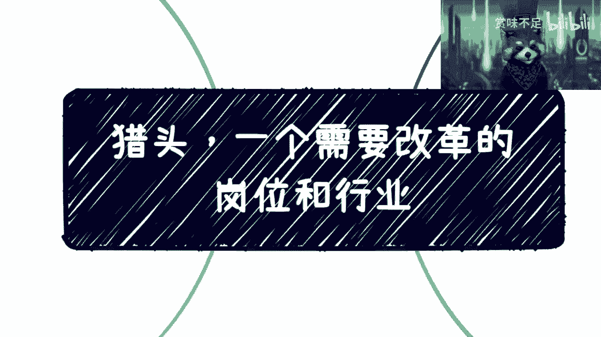
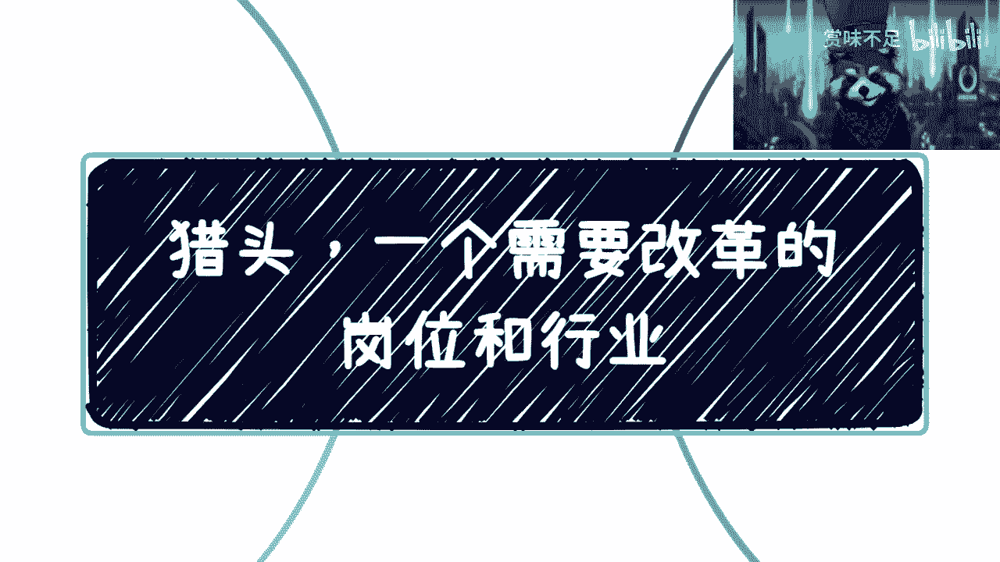
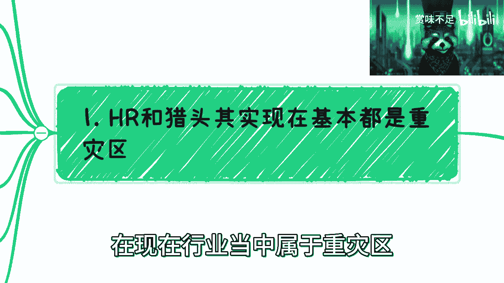
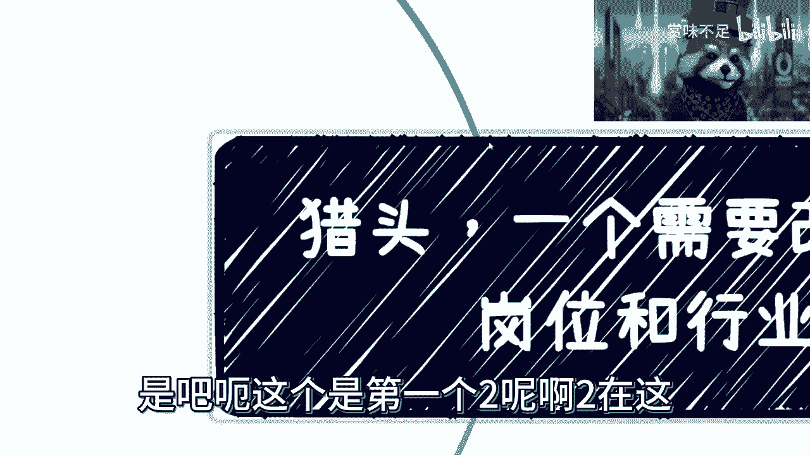
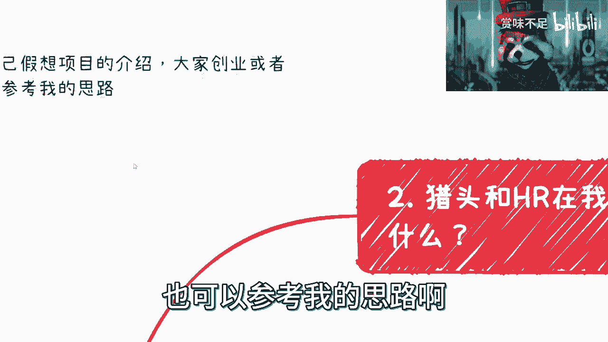
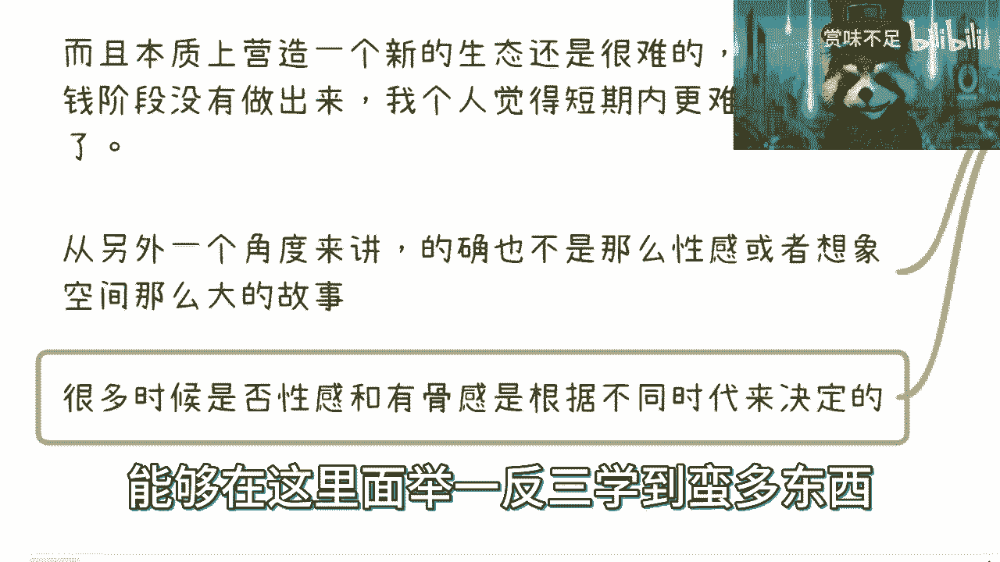

# 猎头和招聘是一个需要提升和改革的领域---P1---赏味不足---BV1Rh411E7AD







在本节课中，我们将要学习猎头与招聘行业的现状、存在的问题，并探讨其潜在的改革方向。我们将从行业痛点、专业要求、生态构想等多个维度进行分析，旨在为初学者提供一个清晰、全面的认识。

---

## 行业现状：重灾区与问题根源 🚨

上一节我们介绍了课程概述，本节中我们来看看猎头与招聘行业的现状。目前，人力资源（HR）和猎头领域被认为是“重灾区”。

这种现象的主要原因在于从业者数量庞大，但真正专业、优秀的人才却非常稀缺。同时，专业人才的薪酬越来越高，而行业整体并未跟上“长江后浪推前浪”的发展步伐。许多新入行者只是在“浑水摸鱼”。

以下是当前行业中存在的主要问题：

1.  **HR职能的局限**：许多HR仅停留在简单的招聘和面试层面，缺乏在人力资源管理、资源寻找与分配、团队与业务支持等方面的专业能力。真正的HR应懂得如何寻找和合理分配“人力资源”。
2.  **猎头行业的变质**：理论上，猎头应帮助企业寻找人才，同时帮助人才寻找合适的企业。但如今，许多猎头行为已偏离本质。
3.  **信息滥用与职业道德缺失**：部分HR和猎头之间存在私下买卖简历、甚至传播不实信息的行为，严重损害了求职者的隐私和权益。
4.  **专业性严重不足**：大量猎头从业者缺乏基本专业素养，其表现甚至不如一些房产中介。他们对企业端（B端）和求职者端（C端）都不了解，沟通话术不专业，仅以促成交易、获取佣金为目的。


---




## 专业猎头与HR的核心要求 ⚙️

上一节我们剖析了行业乱象，本节中我们来看看一个专业的猎头或HR应该具备哪些核心能力。这不仅是改革的方向，也是从业者提升的目标。

以下是三个关键的专业要求：

1.  **具备人才培养与管理体系的知识**：从业者需要掌握一套关于人才如何培养、如何管理的系统知识，并能将其应用到不同企业和领域中去。不能仅仅停留在面试层面。
2.  **深入理解业务**：HR需要深入理解公司的团队和业务。猎头则必须拥有自己专注的垂直领域（如医疗、金融、科技），并对该领域内不同层级岗位的职责、成长路径、团队协作方式有清晰认知。全领域专家是不存在的。
3.  **提供深度建议而不仅仅是撮合**：专业的猎头应基于对B端和C端的深入了解，为双方提供关于过去、现在和未来发展的建议。他们需要理解企业各种岗位的发展路径和企业的运营逻辑，从而给出更有价值的匹配建议。其价值在于提供超出简单撮合的深度服务。

**核心价值公式**：
`专业价值 = 深度行业知识 × 业务理解能力 × 定制化建议能力`

仅仅完成信息撮合 (`if candidate.hired: get_commission(20%)`) 是远远不够的。

---

## 行业生态改革构想 🌱

上一节我们探讨了专业标准，本节中我们来看看如何从更宏观的生态层面进行改革。招聘领域的整体生态需要改变，这里提出一个假想的改革项目思路，供创业或副业参考。

改革的核心是建立一个更透明、高效、可信的招聘生态平台。以下是该构想的两大支柱：


1.  **个人职业履历的完整溯源与社交化**：建立一个平台，记录个人从毕业后的完整职业履历。通过一定的激励与惩罚机制（如信用体系），鼓励用户提供真实信息，并将真实度纳入个人综合评估模型。
2.  **多维度的个人能力综合评估模型**：建立一个类似企业“360度评估”的系统，综合评估个人的硬技能、软技能、证书、岗位级别、年龄、开源项目贡献等多维度信息。平台可以引入相互打分机制，形成更立体、更可靠的个人能力画像，方便企业进行评估。



**解决信息真实性的思路**：
```python
# 伪代码示例：综合评分计算
def calculate_comprehensive_score(user_profile):
    base_score = assess_skills_and_experience(user_profile.hard_skills, user_profile.soft_skills)
    authenticity_weight = verify_work_history(user_profile.employment_history) # 真实性验证权重
    social_proof = get_peer_reviews(user_profile.id) # 同行评价
    final_score = base_score * authenticity_weight + social_proof
    return final_score
```
如果用户提供虚假信息 (`authenticity_weight` 降低)，会直接影响其最终评分，从而抑制造假动机。

---

## 构想落地的挑战与未来机遇 🤔

上一节我们描绘了一个理想的生态蓝图，本节中我们理性分析其落地面临的挑战与未来的可能性。任何改革构想都需要面对现实。


以下是实现上述构想的主要挑战：

1.  **用户习惯与现有生态**：大众已经习惯了现有的招聘平台（如Boss直聘）。推出一个新模式，需要改变用户习惯，这非常困难。
2.  **痛点感知不一**：对于新平台解决的“痛点”，不同人的感受差异很大。可能只有部分人认为它是强需求。
3.  **构建新生态难度极高**：在互联网烧钱扩张的时代都未能成功构建此类生态，在当下及短期内难度更大。
4.  **故事与想象空间**：此类项目在现阶段可能不是一个足够“性感”或具备巨大想象空间的投资故事，难以吸引大规模资本。

然而，机遇存在于未来。随着数字经济发展、基础设施建设完善、大众职业发展观念升级，以及可能出现新的国家战略方向，**天时地利**的条件可能会在若干年后成熟。届时，一个整合个人数字资产（职业履历数据）、提供精准能力评估与匹配的平台，可能会成为一个极具价值且可行的方向。

---

## 总结 📝



本节课中我们一起学习了猎头与招聘行业的现状、问题与改革思路。我们认识到当前行业存在专业性不足、生态不透明等问题。一个专业的从业者需要**深入业务**、**具备体系化知识**并能**提供深度建议**。从生态层面看，改革方向在于建立**可信的职业履历溯源**和**综合能力评估体系**。虽然实现路径充满挑战，但在未来的技术与社会发展背景下，这仍是一个值得思考和有潜力的方向。希望本课内容能帮助你更深刻地理解这个领域。