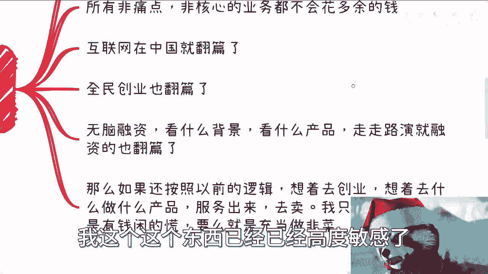
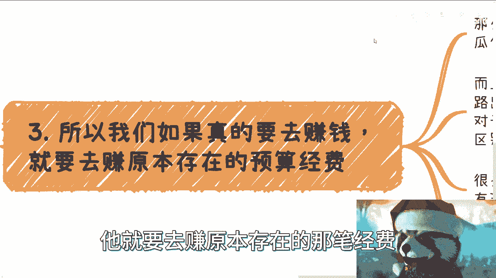
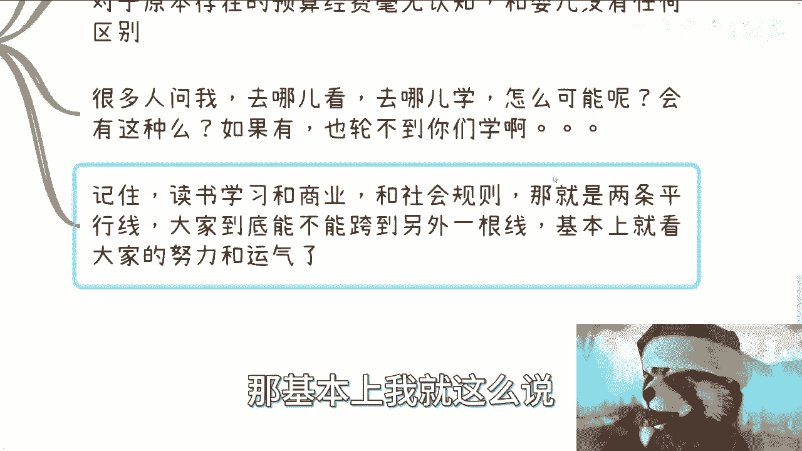
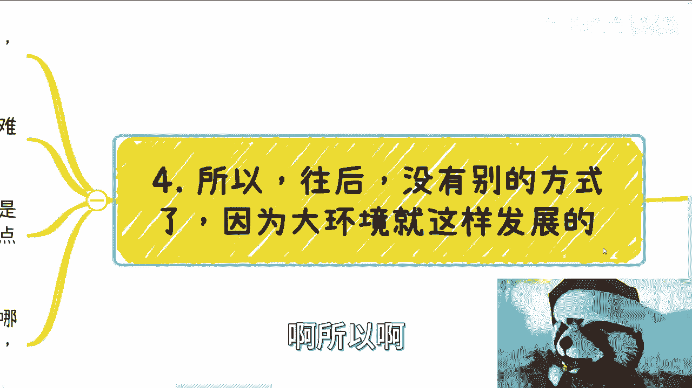

# 现在往后，你要么赚原本就存在的经费，要么就抓住快钱机会，别的几乎没有可能了 - P1 - 赏味不足 - BV1qQ4y1b7A9

好借着这个机会呢，我在充电这边把这个问题索性挑明白一点啊，呃首先现在往后呢，我觉得大部分人啊，大部分人大部分人可能90%，95~98吧，我觉得基本上呢就是说我们真的要赚钱啊，我指的不是那种温饱。

就如果真的要赚钱。

我们只可能去赚那些已经存在的预算经费，或者韭菜的钱啊，当然这里韭菜的钱指的就是快钱啊，不是说你们一定要去割或者怎么样，这个也不是一码事啊，别的几乎就没有可能性了，这就是个定论，我可以这么说。

这就是个定论，首先先来说别的有什么东西啊，比如说所有那些别的在我看来都是博概率赚钱，比如说打工打工就是博概率，你博概率就是下一批或者明天你继续能打工，而不是被辞掉，那个结束了，你就博概率啊。

公务员更是博概率的，有什么区别呢，没有区别的，你们明白吗，就是不明白的，我觉得就是对整个中国，对整个大框架不了解，就这么简单对吧，我以前就说过，如果还觉得打工是稳定的话，那我觉得基本上就没希望了。

自我抛弃吧啊那这是第一个，第二个呢，比如说你去找别人合作，做点什么业务，但是呢你们可能不知道流量在哪，用户在哪，这也是博概率，第三呢，还有非常多人非常天真的幼稚的觉得，我可以做产品，做服务来卖。

这也是博概率啊等等，所有的一切，无论在产品上还是在用户上，也就是说无论在上上游还是下游，如果只要一只要有一方不太确定的话，在未来基本上都很难做，当然啊呃咳咳，我不是说你们不能做啊。

我也不是说你们做了一定不赚钱，我指的就是说你们做可以赚到一些辛苦钱，就像很多人跟我咨询的时候，就跟我说啊，我一个人赚三五百，一个人赚两三百对吧，怎么样子，我说不是你赚到也可以赚，但是这种事做了。

我实在不明白你能赚到什么钱对吧，就是你搞吧，搞得很辛苦，到最后就跟我说啊，我可能赚了一两千两三千，那这个东西搞它干嘛呢对吧，就当下你可能觉得心里面蛮开心的，但是你往后看呢对吧，一两年两三年后呢。

你有什么积累呢，毫无积累，对不对啊，但是呢投入产出比呢，嗯你真的从后面来讲啊。

我觉得大概率都是负的，嗯然后呢我们从标题这边啊。

从标题这边呢我们可以得出一个反向的结论，就是说可能这些方法以前是可以的啊。

接下来不行，那为什么接下来不行，那总跟我们说啊对吧，首先啊CBGU对吧，就是说散户企业政府大学啊，那么都没有钱啊，这个是现状啊，我也都问过，这个就是现状啊，呃其所有非痛点。

非核心的业务都不会花多余的钱啊，明白了啊，好然后现在往后互联网在中国也就翻篇了啊，全民创业也翻篇了，你问我全民创业为什么翻篇，对不对，好，你们自己去查查看全民创业是谁提的好吧。

我这个这个东西已经已经高度敏感了。

不能再讲了啊，呃无无脑融资，看什么背景啊，看什么产品啊，走走路演啊，融资我跟你讲也不会存在了啊，也翻篇了啊，好那么如果还按照以前的逻辑想着去创业，或者你们想的去做一些什么事情啊，做些什么产品。

做些什么服务去卖啊，那我只能说什么呢，你们要么就是有钱闲得慌啊，要么就是呃这个挤破头想要去做韭菜，想要去被割。

否则我实在想不出来为什么对啊，那么这是第二点。

第三点啊，所以我们如果真的要去赚钱啊，他就要去赚原本存在的那笔经费。

那当然这个问题就来了对吧，这些钱呢，基本上呢从以前或者说这种呃赚钱的路径啊，基本上从以前到现在就被瓜分的很干净啊，一个萝卜一个坑，而且这还不是重点，重点是我可以说所有读书这条路出来的人啊。

中国正常的9年制义务教育，教育加高等教育出来的，正常的人，无论学历多高啊，对于原本存在的预算经费毫无认知，那我就这么跟你们讲，到今天为止找我咨询的起码应该有三个北大，十个交大的啊，呃一样毫无认知。

和婴儿没什么区别，我不管你们是谁都一个道理啊，那包括很多人问我，他去哪看，去哪学，问出这种问题的，就是对中国，对整个从上到下，包括社会，包括政治，包括商业毫无认知的人，你但凡有那么一丝认知。

你也不会问这种问题，为什么你觉得会有吗，我就反问你，你觉得会有吗，如果有互联网如此发达的今天，你们都活了20多年了，你们可能连一点缝都不知道吗，我可以打赌，你们是一点缝都不知道的，那意味着什么。

意味着不是真的没有，而是就是故意不会让你们知道，你明白吗，那如果有他也轮不到你们来学，对吧，那咱就退1万步来讲，这也是为什么我不能直接来跟你们讲，同时我还要放到充电里面，为什么，因为这个东西讲了，我。

但凡这个话如果公开讲，那回头又要被举报了对吧，那所以你记住啊，读书学习跟商业和社会规则，这就是完全两条平行线永无交集的两条平行线，那大家到底能不能从这根线跨到另外一根线，或者说能否窥探出那么一丝。

那基本上我就这么说。

就看大家从现在开始往后的努力跟运气了。

没有别的办法，啊所以啊我们说往后你没有别的方式。

因为大环境就是这样发展的对吧，你大环境经济不好，美国加拿大，澳大利亚，日本对吧，你们但凡有朋友在外面呢，你们自己去问嘛，一塌糊涂对吧，商场里人很少，物价各种上涨对吧，打工本身也是不稳定的，你怎么赚呢。

你怎么赚，当然你也可以选择说找一些人去抱大腿，但你要明白，现在就我们聊下来，所谓大腿都是自身难保的，泥菩萨过江对吧，他为什么让你报呢，对吧啊，标题里面说的韭菜的钱呢，它就像我说的，并不是说一定要去割。

指的是那种快钱，因为快钱在每一年每个时代肯定都会有，但是如果有这种机会呢，我觉得大家就好好把握，你别想这么多，能赚一点是一点，你明白吗，就是我今天还在跟一个就是50多岁的人聊嘛。

就我们得出的结论是这样子的，你们要明白，不要老是去问有什么办法，也不要老是去问政府，为好像政府一定会想办法或者怎么样的，我就告诉你们一个结论，结论就是以前中国的老百姓日子过得太好了，没有过过苦日子。

你懂吗，就是不要再去拿前面的10年，跟前面20年再去想了，然后以那个基准在那边想哎呀，我应该怎么办，我应该怎么样，你越是这么想，越是没有结果，为什么，因为那种日子叫做好日子。

你不能拿一个七八十分的日子在那边衡量啊，那么就像我说的，很多人都想问怎么办，但事实上是什么，事实上没有，怎么办，你只能靠你自己，尤其是我们老百姓本身就没有办法。

就跟我前两天说的，那个说35岁找不到工作是一个道理，那你就是找不到工作，你说我35岁了怎么办，怎么办啊，你找不你就去找呗，你该该该打工打工该不该该该流水线，流水线，该去开开雾，开滴滴，开滴滴。

该送外卖送外卖呀，更是有什么怎么办的了，对不了，我就告诉你，就正常工作就是不要你，剩下就是你要去赚，你你就去去去好好去去去想办法赚钱就可以了，对社会没有不给你机会，只是这些机会你不想要，那么还有一点呢。

我在这地方也可以跟你们说一下，就是我不关心什么，大家觉得哎呀好像就是有很多层级对吧，就像什么阿里巴巴或者百度啊，这个包括你们打工对吧，从一个初级到中级到高级对吧，造造总裁造什么东西，我跟你讲。

在我眼里只有两类人，一类是拥有社会地位和政治地位的，一类就是除了拥有社会地位和政治地位的，垃圾啊，那么不客气的讲，我跟你们都是这种跟垃圾，为什么，因为没没有，为什么你要非要问为什么。

就这个社会就是这么定的，而运作规则就这样子，在他们眼里，我们就是垃圾，就这么简单，没有什么为什么啊好吧，所以说就是你们可以理解为，其实方式方法很多，但是我说实话，我觉得大部分人。

其实从现在往后的方法真的很少，因为浪费了太多时间在读书上面，好吧行吧。