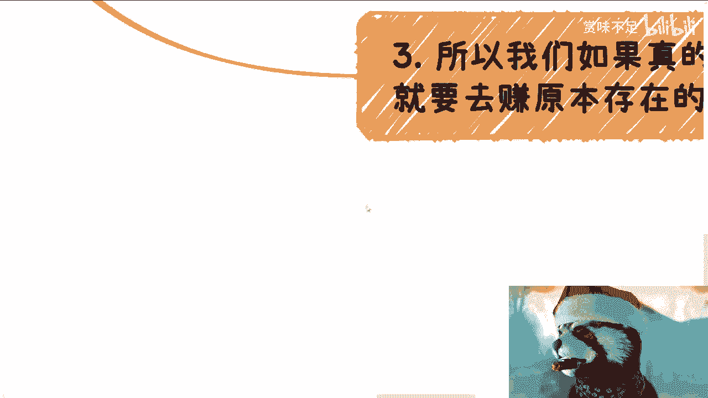

# 现在往后-你要么赚原本就存在的经费-要么就抓住快钱机会-别的几乎没有可能了---P1---赏味不足-

在本节课中，我们将探讨一个核心观点：在未来的经济环境下，个人赚钱的路径将高度集中于两种模式。我们将分析为何传统方式变得低效，并理解这两种核心路径的具体含义与逻辑。

## 概述：赚钱路径的定论 💡

首先，现在往后，大部分人若想真正赚钱（指超越温饱的赚钱），只可能有两种路径。

我们只可能去赚那些已经存在的预算经费，或者赚取“韭菜的钱”（这里特指快钱机会）。别的几乎就没有可能性了，这是一个定论。

## 为何其他方式近乎无效？ 🚫

上一节我们介绍了核心定论，本节中我们来看看为何其他常见的赚钱方式被归类为“博概率”，并难以成功。

以下是几种被归类为“博概率”的常见方式：

1.  **打工**：打工就是博概率。你博的是下一批或者明天你继续能打工，而不是被辞掉。
2.  **公务员**：公务员更是博概率的，与打工没有本质区别。
3.  **无明确流量的合作**：去找别人合作做业务，但不知道流量和用户在哪，这也是博概率。
4.  **做产品或服务来卖**：天真地认为可以做产品、做服务来卖，这也是博概率。

所有这一切，无论在产品端（上游）还是用户端（下游），只要有一方不确定，在未来都很难做。我不是说你们不能做，也不是说做了一定不赚钱，而是指这样做只能赚到一些辛苦钱。

这种事做了，投入产出比从长期来看，大概率是负的。你搞得很辛苦，可能赚了一两千、两三千，但一两年后回头看，毫无积累。

## 时代背景的转变：为何“以前行，现在不行”？ 📉

从标题可以得出一个反向结论：这些方法以前或许可以，但接下来不行了。为什么接下来不行？

以下是几个核心的时代背景转变：

1.  **资金现状**：CBGU（散户、企业、政府、大学）都没有钱。所有非痛点、非核心的业务都不会花多余的钱。
2.  **互联网与创业热潮翻篇**：现在往后，互联网在中国翻篇了，全民创业也翻篇了。
3.  **融资逻辑改变**：无脑融资，看背景、看产品、走路演融资的模式也不会存在了，也翻篇了。

如果还按照以前的逻辑想着去创业，或者想着去做一些产品、服务去卖，那么要么就是有钱闲得慌，要么就是挤破头想要去做韭菜、想要去被割。

## 核心路径一：赚取“原本存在的经费” 💰

所以，如果我们真的要去赚钱，就要去赚原本存在的那笔经费。当然，问题来了：这些钱从以前到现在就被瓜分得很干净，一个萝卜一个坑。

重点在于：所有通过中国正常教育体系（九年制义务教育加高等教育）出来的人，无论学历多高，对于原本存在的预算经费毫无认知。这意味着不是真的没有机会，而是这些机会被有意地设置在了常规认知之外。

读书学习跟商业和社会规则，是**完全两条平行线**。大家能否从这根线跨到另外一根线，能否窥探出一丝机会，基本上就看从现在开始往后的努力跟运气了，没有别的办法。

## 核心路径二：抓住“快钱机会” ⚡

因为大环境如此，你没有别的方式。标题里说的“韭菜的钱”，并不是说一定要去割韭菜，指的是那种快钱。快钱在每一年、每个时代肯定都会有。

如果有这种机会，大家就好好把握，别想太多，能赚一点是一点。不要老是去问有什么办法，或者期待政府一定有办法。结论就是：以前中国的老百姓日子过得太好了，没有过过苦日子。你不能拿过去七八十分的日子来衡量现在。

很多人都想问“怎么办”，但事实上没有“怎么办”，你只能靠你自己。社会不是不给你机会，只是这些机会（如送外卖、开滴滴）你可能不想要。

## 社会层级的现实认知 🏛️

最后，分享一个现实认知。我不关心公司里的层级（初级、中级、高级、总裁）。在我眼里只有两类人：

*   一类是拥有**社会地位**和**政治地位**的人。
*   一类是除了上述人之外的其他人。

不客气地讲，我和你们都是这“其他人”。在这个社会的运作规则里，在他们眼里，我们就是如此。方式方法或许很多，但说实话，我觉得大部分人从现在往后的方法真的很少，因为浪费了太多时间在读书上面。

## 总结 📚

本节课中我们一起学习了未来赚钱的两种核心路径：**赚取原本存在的预算经费**和**抓住市场中的快钱机会**。我们分析了传统方式为何失效，探讨了时代背景的深刻变化，并指出了认知跨越的难度与现实社会的运行规则。理解这些，是思考个人未来出路的第一步。