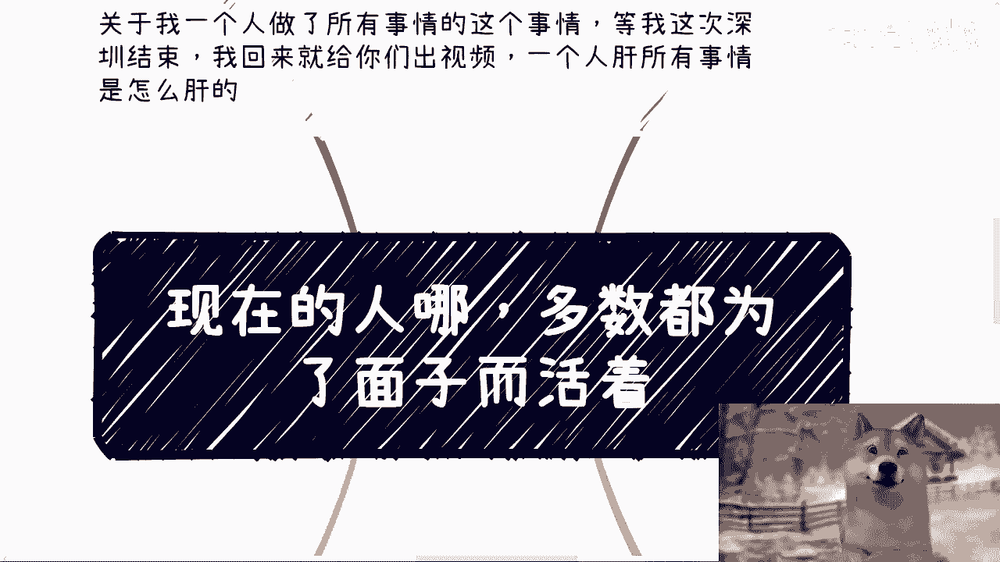
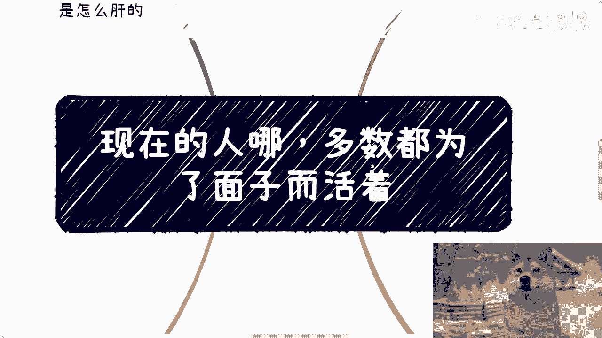
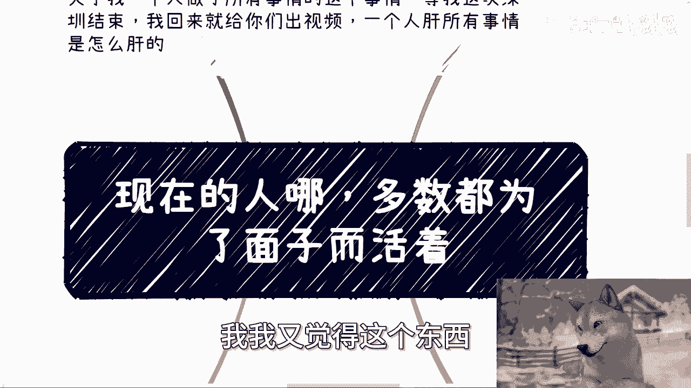
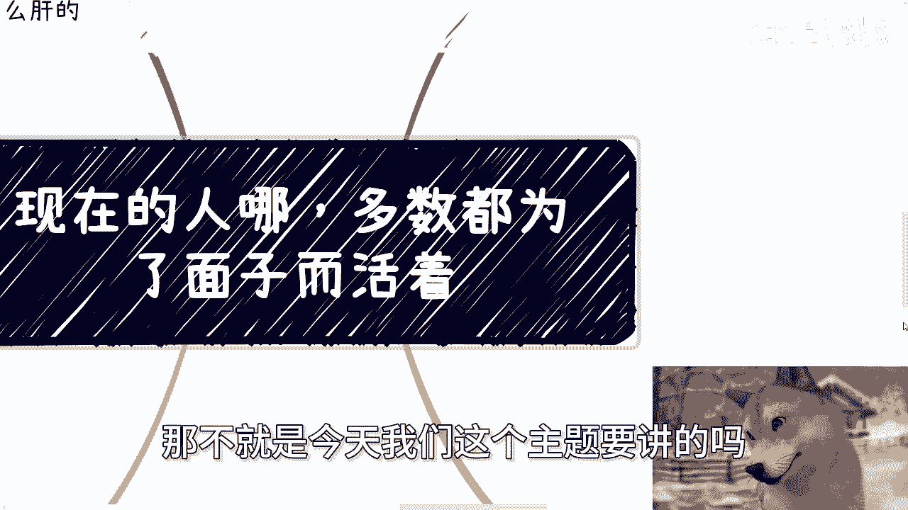

# 现在的人呐-多数都是死要面子活受罪---P1---赏味不足---BV12r421F7xd






## 概述
在本节课中，我们将探讨一个普遍存在的社会现象——“面子”问题。我们将分析“面子”如何影响个人的决策、导致内耗，并最终阻碍个人的成长与幸福。通过剖析几个典型的生活场景，我们将学习如何识别并摆脱“面子”的束缚，将生活的重心回归到自我成长与内心平静上。



---

## 一、 “面子”引发的常见困境
上一节我们概述了课程主题，本节中我们来看看“面子”在现实生活中引发的具体困境。以下是几个典型的对话场景，它们都指向了同一个核心问题。

*   **关于学业**：有人觉得读书很没劲，但仍在坚持。问其原因，回答是为了“顾及父母的面子”，因为家庭里没有高学历。
*   **关于工作**：有人工作得很抑郁，甚至健康出现问题。问其为何不换工作，回答是“同学工作都不错”，或者工作是“父母托关系找的”，核心仍是“面子”。
*   **关于复读**：有人已复读两年，担心复读后工作更难找。明知前景不明朗，却仍要复读，原因是“面子上挂不住”，因为同学都上了更好的学校。
*   **关于留学**：有人计划出国留学，家庭为此花费巨大甚至贷款。问其留学的具体目的，回答是“家里没有一个硕士”，家人抱有期望，这背后依然是“面子”。
*   **关于婚姻**：当被问及为何要结婚时，很少有人回答是因为“爱”。常见的回答是“年龄到了”或“父母催得紧”。为了“面子”而进入一段关系，对双方都可能是一种伤害。

这些场景的共同点是：当事人的行为并非源于内在的真实需求或热爱，而是为了迎合外界的眼光——即所谓的“面子”。

---

## 二、 “面子”带来的双重后果
上一节我们列举了“面子”引发的具体问题，本节中我们深入分析“面子”会带来哪两个主要的负面后果。

1.  **导致自我迷失**：因为你追求的是“面子”，而不是自己真正想要的东西。长此以往，你会越来越不知道自己究竟要什么，陷入迷茫。
2.  **陷入无限攀比**：“面子”的本质是与他人比较。你会不断将自己置于与他人竞争的焦虑中，但这场竞争没有终点，也没有真正的赢家。

**公式：面子 = 自我迷失 + 无限攀比**

这两个后果最终会指向同一个结果：**无限的内耗与时间浪费**。你既在迷茫中消耗心力，又在无谓的攀比中消耗情绪，无法专注于真正能带来成长和积累的事情上。

---

## 三、 活在他人眼中的困境
上一节我们分析了“面子”的内在后果，本节我们看看它在人际关系中的表现——过度在意他人的眼光。

许多人无限地活在别人的评价里：担心别人觉得自己不行、无法融入群体、因为别人的看法而自我否定并不断调整。

从理性上讲，无论你多么优秀或平凡，总会有人支持你，也总会有人贬低你。试图让所有人都满意是不可能的。

从感性上讲，过度在意他人眼光，说明你的内心不够强大，没有建立起以自我成长为中心的价值体系。别人的一句话，你奉若神明，自己累到半死，对方却可能早已忘记。

**核心逻辑**：人活着，追求的目标无非两种——**获取财富**或**获得内心平静**。如果为了“面子”，既赚不到钱，也得不到平静，那这样的行为就毫无意义。




---

## 四、 “面子”的连锁危害：害人害己
上一节我们讨论了在意他人眼光的弊端，本节我们来看“面子”问题更严重的延伸危害——它不仅害己，还会害人。

最典型的例子是婚姻。如果仅仅因为“年龄到了”、“父母催促”而结婚，这种缺乏感情基础的决定很可能伤害伴侣，未来也可能伤害下一代。

在商业合作中，也有人为了“面子”而造假。例如，为了让同学看得起，在关键数据上欺骗自己的团队。这种行为浪费了所有人的时间和信任，最终只会“竹篮打水一场空”。

为了一个虚无缥缈的“面子”，在自己都不知道想要什么的情况下奉献青春，甚至拖累他人，这无疑是双重的损失。

---

## 五、 破除借口：从“没办法”到“尝试过”
上一节我们看到了“面子”的危害性，本节我们来破除一种常见的、为“面子”行为辩护的借口——“我没办法，大家都这样”。


很多人用“大部分人都这样”来为自己不愿改变找借口。这本质上还是一种“面子”思维：因为害怕与众不同，所以用“从众”来寻求安全感。


当面临具体困难时，这种“不行动”的思维模式也很明显：
*   **关于找对象**：抱怨找不到合适对象，但除了相亲，几乎没有主动社交。
*   **关于找工作**：抱怨工作难找，但两三个月只投了二三十份简历。

**代码描述这种状态**：
```python
if situation == “difficult”:
    action = “complain” # 只抱怨，不行动
    excuse = “everyone_is_like_this” # 借口是“大家都这样”
else:
    action = “none” # 其他情况也不行动
```
归根结底，很多人是“压根不想做”，然后“张口就来说做不到”。改变的第一步，是承认自己“没有真正尝试过”，而不是用“没办法”来掩盖惰性和恐惧。

---

## 总结
本节课中，我们一起学习了“面子”这一社会陋习如何深刻影响我们的生活。我们分析了它引发的学业、工作、婚姻等困境，指出了它导致自我迷失、无限攀比、活在他人眼中以及害人害己等多重后果。最后，我们拆解了为“面子”行为辩护的常见借口，强调改变始于真正的行动而非抱怨。


记住，人生只有一次，为自己而活，关注自身的成长与内心平静，远比追求虚无的“面子”更重要。抛弃不必要的枷锁，才能轻装前行，活出属于自己的精彩。