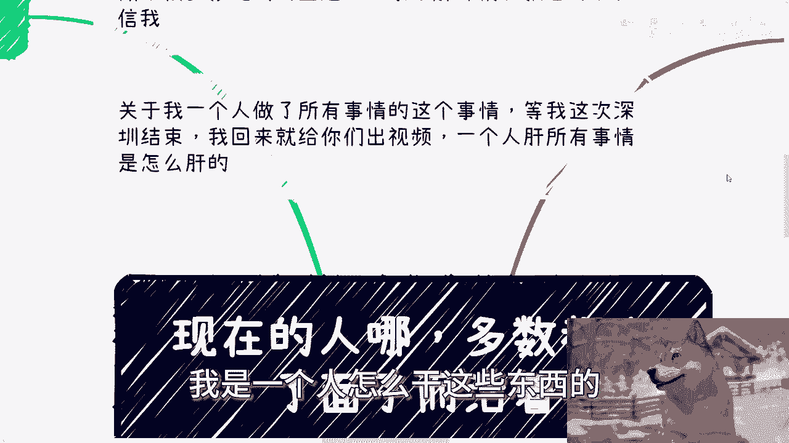
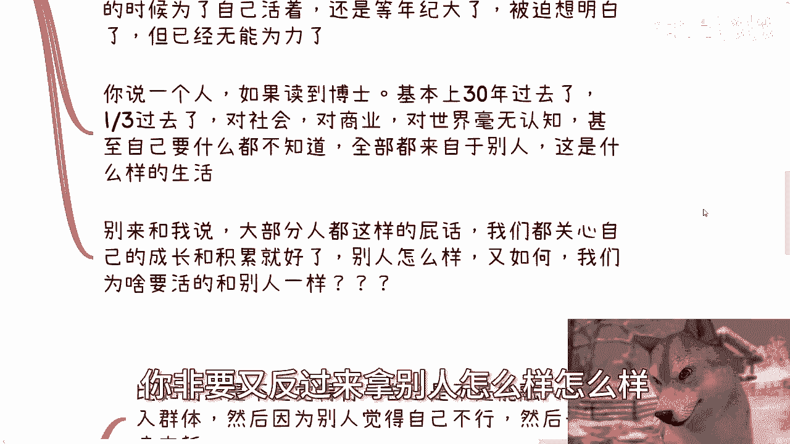
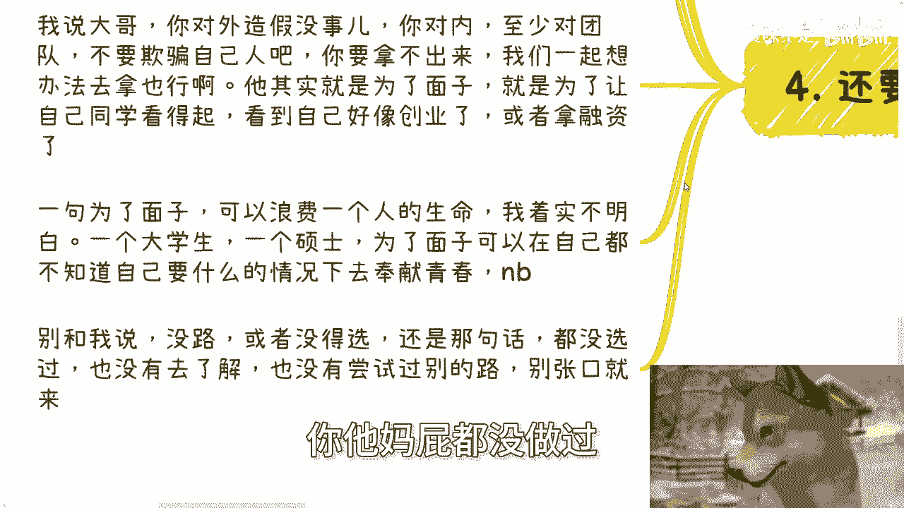
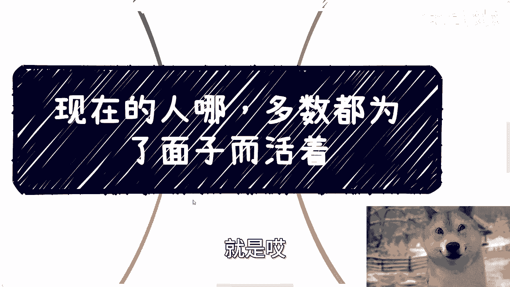

# 现在的人呐，多数都是死要面子活受罪 - P1 - 赏味不足 - BV12r421F7xd

哈大家好呃，今天哼今天我是狗哥啊。

我是狗哼啊，呃首先啊这个深圳活动定了好吧，30号下午也就是本周日啊，然后本次活动完全按照这个数字经济的大会规，模去做好吧，邀请了很多嘉宾嗯，也做了很多接地气的这个主题好吧，大家反正要报名的话。

或者了解详情的，你们可以继续私信我啊，嗯然后关于昨天说的一个人，就做的这个很多事情啊，等这次深圳结束了啊，我回来给你们出出一个吧，或者若干个吧，我跟你们说一下，我是一个人怎么干这些东西的对吧。

这这其实很好干，真的很好干，我觉得很多人嗯嗯怎么说呢，就是没有实践，你们但凡实践过你就知道其实也也也也不难啊，呃然后今天这个主题呢，也跟最近这个聊的话题比较有关，就是嗯很多话题啊他都是围绕面子。

而且呢我我我又觉得这个东西可能又有种。

嗯你你们看啊，今天这个内容讲的会比较多啊，首先咱就说最常见的这个对话是什么，他说陈老师啊，我觉得现在这个读书读着很没劲啊，呃然后其实他还还会有很多这个这个辅助的，这个内容啊，我就我就不不说了。

或者我也可能不记得了啊，然后呢等他讲完我就会问我说，那为啥你要读呢，对吧，哎就是我其实问问题啊，我其实我我说实话，我每次问问题，我都是很期待大家能跟我讲，就是你们怎么觉得的，你们怎么想的。

因为你们怎么觉得怎么想啊，对不对，它本身不重要，重要的是你们自己要有想法对吧，因为你有想法，比如说我们在这里面在讨论啊，你这个想法对，或者你这想法不对，你其实是听得进去的。

但是如果你这个想法不是来自于你自己的，你都是来自于别人的，其实我跟你讲半天没有用，嗯对吧，因为你你相当于本来你就没想法，那我跟你讲这么多，这这你听得进去吗，听不进去对吧，我就问他了。

那我我说那你读的这么苦，读的很没劲，那你为啥要读嘞啊，然后他就跟我说的啊，家里面因为就是父母这个包括他自己对吧，就整个家庭都没有高学历啊，然后呢那我说那那那你想干嘛呢。

他说呃这个我为了顾及父母的面子对吧啊，然后还有呢他说陈老师，我这个工作呢做的我很抑郁啊，然后呢，也也有些小伙伴，其实在医院里面已经查出有这种，比如轻度抑郁啊，中度抑郁啊。

那他说我觉得我这个已经得病了或者怎么样，那我也问了，我说你活着不就为自己活嘛对吧，你你你自己第一，那你为啥还要做呢，啊咋滴了，你你没工作，也不是说没工作吧，你找个轻松点工作怎么了呢对吧，然后他就会说啊。

因为同学工作都不错对吧，因为因为这个工作呢可能最早是父母这边掏通，通过关系找人介绍的对吧，那那核心还是因为面子，那那你要我说我怎么说呢，我我说我我这道理其实都懂啊，难道你父母介绍的。

或者你同学是这个这个工作都不做，比你命重要吗对吧，比你身体健康，比你心理健康重要吗，那也不是啊啊，然后还有说陈老师我想读，我想复读啊啊他说我已经复读两年了啊，但我又担心就复读之后啊，出来工作不好找。

那我说首先你工作不好找，这就是个事实，你两年后肯定更不好找，因为两年后一定是满地牛鬼蛇神的啊，这个事情我跟你们讲，我我我可以给你们担保票啊，然后他再说呢，我也跟他说，我说再说啊。

你复读也不确定就一定有你预料得到的结果，对吧，咱咱不是说悲观嘛，对吧你事实也是这样子的啊，那我说你何必呢对吧，那他说因为面子啊，面子上挂不住啊，或者怎么样子，那他说啊这个父母啊对吧，同学啊对吧，都是啊。

比如说好的学校，那自己，而且我跟你们讲很很好玩的，他们也不是说就大学没考上，他可能比如说就是个二本，然后非要去搞个一本这样子啊，然后还有呢他说陈老师，我要我要去日本留学两年，那当然啊，这不一定日本啊。

你们你们随便这个替换名词都可以啊，替换国家都可以啊，然后我就问我说，那你为什么出去留学呢，他说家里面花了很多钱，甚至卖了一些资产，也有些家里面贷款的，那我就问我说，那那那你要是花了这么多钱怎么样子。

那你你做事情得要一个目的性吧对吧，那他的目的性是什么啊，因为父母因为家里，因为这个呃家里面没有一个硕士对吧，但家里面对他抱有期望啊，那那那目的是啥呢，我就不明白目的是啥呢，对不对啊。

那说实话我呢能理解大家看重面子，因为中国人本身啊，包括呃我这一代，你们这一代对吧，就就家里面父母都这样子的，但是同样我也不理解，就是我作为一个老年人对吧，我我觉得我要是怎么样怎么样也就算了。

那你们作为一个2024年的一个新兴人类，我就不明白为什么大家都2024年了，还这么看重面子，就是就是理论上我理解，就是大家作为一些年轻人，就应该抛弃一些呃腐朽的东西。

或者抛弃一些就是说这种这种错误的理念对吧，这那那社会才有进步，人才有进步，那你说上一代因为一些有的没的对吧，就是已经是嗯叫什么呢，叫做浪费自己的这个生命，或者说呃浪费自己的很多机会啊，就为了攀比啊。

为了就是说活在别人眼中，那你们就不应该再这样子了啊，然后我这个地方写到这个地方呢，我我忽然发现我还漏了一个特别重要的东西，所以我又补充了一下，我说我说那他妈的还有一个东西很重要，就是结婚啊，尼玛绝了。

真的绝了，这就结婚有几个人，然后我我问他，我说我我真的我跟你们讲，我最近聊的这种结婚的话题也很多，我就每次我都问他，我说那你为什么要结呢，我跟你们讲，真的我跟你们讲啊，从来没有一个人跟我说，陈老师。

我想结婚啊，或者我就是爱这个人，没有的，我跟你讲一个都没有的，一个都没有的，你知道吗，他们永远啊回答我的事哦，我年龄到了，我父母绝对我要结我操你真的你知道吗，你妈要是在我面前。

我就想他妈的抄起我那个拖鞋往他脸上拍啊，这我错就是你知道吗，就那就有以前有个段子叫什么，就是我们一直在判断好跟坏对吧，但是好好就是就是呃怎么说呢，就是呃好说歹说，反而你知道吗，这些人最后选择了什么。

他既不选择好，也不选择坏，他选择了好坏，真的我妈也是对吧，就是我真的我给你们讲，同学们就是为自己活着不好吗，就大家都活一次，为什么要活这么累呢，我真不明白呀，就是呵呵。

就是你我不是说大家一定要活得很通透，就是你但凡有个本科或者有个硕士的脑子对吧，或者但凡你活了20年，难道你就不应该明白，人活着开心是最重要的，你自己是最重要的，你为什么要关心别人呢对吧，你第二不不。

我们我们再去来来说，第二点就是面子这个事情啊，其实导致两个后果，一个就是你不知道自己要什么，因为你要面子，但是我问你面子是什么，你又不知道对吧，另外一个就是你会让自己陷入一个不停的攀比。

但是你不知道自己要什么跟不停的攀比，又会指向同一个结果是什么，就是无限的内耗跟浪费时间，为什么呢，因为你不知道自己叫什么，你就很迷茫，然后陷入攀比来攀比呢，你就永远会活在，就是说啊不如别人。

或者说跟别人去比较的，这种怎么说呢，这种这种这种呃没没有没有没有没有没有目标，没有呃边界的，然后没有没有止境的这么一个呃，错误的这个情绪里面，那说白了我觉得面子这事，其实就像我一开始说的。

这是一个陋习啊，这是一个就不应该传承下来的东西，那为什么我们年轻人要将这种嗯是陋习念，传承下来呢，我觉得没有必要啊对吧，你要我说的就是冠冕堂皇一点，就是不但害了自己，还要害下一代，何必呢。

哦2024年了，又不是1994年，你说对吧，就像就像我一里面说的这些问题，但凡你问他们为啥要去留学，为啥要去复读，为啥要结婚，为啥要谈恋爱，没有的，真的没有的，我我跟你讲，我也很诧异，就是就是男的也好。

女的也好，没有一个人跟我说爱陈老师，因为我喜欢他，没有的，我跟你讲，就他妈离谱啊，然后人这一辈子呢，其实我觉得活得通不通透呢，呃不是我们决定的，就是有些时候早晚你都会通透，就是也可能就那么一瞬间哎。

你突然想明白了对吧，但是你会你会发现一个点啊，就是只不过就是说你在年轻的时候想明白呢，你是为自己活着，你还有机会，但而反而呢就是说等到你年纪大了，或者某些事情让你想明白的时候呢。

你就会发现你是被迫想明白的，但那个时候已经无能为力了，那你说一个人如果读到博士，基本上已经30年过去了，我算他能活到90岁，你就1/3的人生过去了，你1/3的人生过去了，作为一个这个高等生物啊。

你你1/3的人生过去了，然后拿了一个博士的学历，但是你反而对社会，对商业，对自己，对世界毫无认知对吧，你你所有的认知来自于别人，我我觉得这就是一个呵，这就怎么说呢，这个笑话就非常的奥妙对吧。

那这是怎么样的人生呢，你而且另外一方面，就是你们很多人也别来跟我说，大部分人都这都是这样子的这种屁话，为什么，因为我们要关心的就是我们自己的成长跟积累，别人怎么样关我们吊事啊。

你你非要又反过来拿别人怎么样怎么样。

这种屁话来讲话的话，那你就跟别人活的一样好了，那那不就是今天我们这个主题要讲的吗。

你还是为了面子呀对吧，就是你为什么我跟你们讲啊，为什么很多人会说什么，哎呦这个大部分人都这样子或者怎么样子，为什么，因为他不能做改变，他只能拿拿大部分人这种屁话来掩盖，他不能做改变对吧，就这么简单啊。

然后第三点啊，面子还有一点就是无限活在别人的眼中，你比如说别人觉得是不是呃，呃比如说别人是不是觉得你行了对吧，自己是不是能融入别人了，融入群体了，然后呃然后因为融入不了别人，或者说别人觉得自己不行。

就就觉得自己不行，去调整，去内耗，咱就这么说啊，于情于理，咱先说于理，就是无论你多么优秀，或者你多么，总有人会支持你，什么意思，意思就是，这个社会本来八九十%的人就是对吧，你你你非要去在意的眼光。

那我还能说什么呢，对吧，就是你无论多么优秀，多么，也总有人会觉得你优秀，也总有人会觉得你不行，去贬低你，为什么，因为人类就是这种生生物对吧，那舆情呢就是如果你在意别人的眼光，那就说明你修行不够。

你自己的确不行，因为你在意别人，你没有以你自己为中心去关注你的成长，和叫什么这个这个积累对吧，但别人觉得你行不行，完全不能定义你，我们总不能一直活在别人的眼光里吧，你太累了对吧，那那句话怎么说来着呢。

别人不经意的一句话，你呢现奉若天神，自己累到死，那何必呢，哦那那我就不明白了对吧，那主要是大部分情况，你自己累到死呢，还没有所谓的成长，没有所谓的积累，因为和别人也就是那么一句话，你却觉得好像很重要。

他妈重要个屁对吧，而且更何况你用我的三观来讲，你妈又赚不到钱，你记就人活着，咱就说两种，要么你能赚到钱，要么你就能得到内心的平静，你既赚不到钱，也得不到内心平静，那你妈他妈图啥呢，对不对，图啥呢。

我不明白呀，嗯第四就是还要害人，还要害下一代，真的我跟你讲，你比如说谈恋爱结婚，为啥哦，回答我，因为家里人，因为父母因为年龄到了，卧槽那尼玛，那他妈你你你你这么一个心态，你这么个状态，你不就害别人吗。

那么奇了怪了，对不啦，那除非你俩都这样，那你俩都这样，我们有个成语叫什么卧龙凤雏，对不对，你卧龙凤雏到最后你还得害别人，对不对啊，那我们以前合作也碰见过，就是大家特别信任的，一起合作的，最后啊。

他在那种特别关键的合作点，或者说项目数据上造假，你知道吗，卧槽就他妈离谱啊，然后我说大哥，我说你造假没问题，你对外造假没事，你对内你至少对团队，你不要骗自己人吧，哦你造假，你把所有东西都骗进去。

我说你要真的有些东西拿不出来，我们一起想办法去拿，你告诉我们，我们想办法来来来，让你这个假的东西更稍微真一点，对不对，你然后我就问他，我说那你为什么要造假呢，对吧，他说就是为了面子。

就是为了让让他自己的同学看得起来，看看的自己好像在创业，好像拿融资了，唉我说何必呢，何必呢，你到最后不还是竹篮打水一场空吗，对不对，就一句，为了面子，你可以浪费一个人的生命，我着实不明白。

就是我我我说实话，我到今天我都不明白，2024年，一个大学生，一个硕士为了一种面子，所谓玄学的东西哦，或者说所谓一些什么什么什么父母的面子啊，或者家庭的什么什么别人的眼光，这种虚无缥缈的东西。

可以让自己在自己都不知道要什么的情况下面，去奉献青春，我只能给你们一个字，牛逼对吧，你我跟你讲，你别别来再跟我说，爱唱首我没有入，我没得选啊，然后我们这个这个也没有什么关系，真的啊，我跟你们讲。

你们选过没有啊，你们去了解过没有，你们有没有没有去尝试过积累关系，你有没有去做过，屁都没做过。

你就张口就来说，我们没有，那谁有过呢对吧。

那照你这么说，那大家都不要不要有啊，大家生下来是没有啊，那那有什么好争的呢，不要整的呀，那我你要我这么说，我就我就这么告诉你们，你们要是觉得就是没有对吧，那我也告诉你们。

每年1200万左右的应届生就在走独木桥，你们大部分人，80%的人到最后都要掉下这独木桥，那你们还争什么东西，有什么好争的啦，你们现在不就浪费你的青春，浪费你们父母的钱吗，干嘛呢，对不对。

就是唉就人活着就是。

就我我也知道大家不是想双标，但是你不会，你你们觉不觉得，就是很多时候你们讲就大部分人讲出来的话，他就前后矛盾对吧，就是在自己想要掩盖自己的一些东西上面，好极力寻找理由啊。

然后就是不想做的情况下面就不做啊，但是反而在那种就是说啊，这个这个想做的事情上面呢，哎他要他又要跟你呃，这个就开始辩论了啊，开始怎么样子的，那你有做过不了，就像有很多人跟我说，哎陈老师我们找对象。

我找不到合适的对象，我他妈就反问他们，你找过吗，大哥啊，除了家里面给你介绍，除了相亲，怎么教，怎么找过呢，你平时有社交吗啊，日常连晚上去蹦迪都没有，你怎么社交啊，你你连正常的社交都没有，你哪他妈去找了。

对不对，一样的道理嘛，张口就来啊，你包括很多很多人跟我说，哎陈老师，我们现在找工作很难找不到我，我说那怎么滴啊，我说你怎么找过来哦，我两三个月投了二三十封简历，气笑了，你知道吗。

我说大哥就现在这经济情况，你两三个月不得给我弄两三百个简历啊，对不对，就归根结底我就跟他们讲，我说你们就压根就不想做，然后张口就来说我找不到，这不了就这个样子，啊行啊，那就这么着啊。

然后本周日这个深圳活动继续报名好吧，呃然后那个胸卡啊，然后什么各种各样的东西我也帮你们都做好了，反正我应该做的也也充足，反正你们就尽量报好吧，也过来多聊聊，因为这次嘉宾也比较多。

然后另外一方面的话就是咨询啊，额商业规划，商业规划，职业规划啊，然后额合同啊，分润啊，分红啊，股权啊，期权啊，商业计划说啊，白皮书啊啊包括你们手上有什么牌，你们手上没什么牌啊，你们希望通过跟我的沟通呃。

能够让我能够从你们的这个背景情况，跟个人的这个情况能给你们一些更接近地气，更接近当下经济发展的一些这个规划，或者建议的话，那么你们就可以整理好这个具体的问题，和个人的背景好吧，然后我们再来做咨询啊。

你看我就说嘛。

