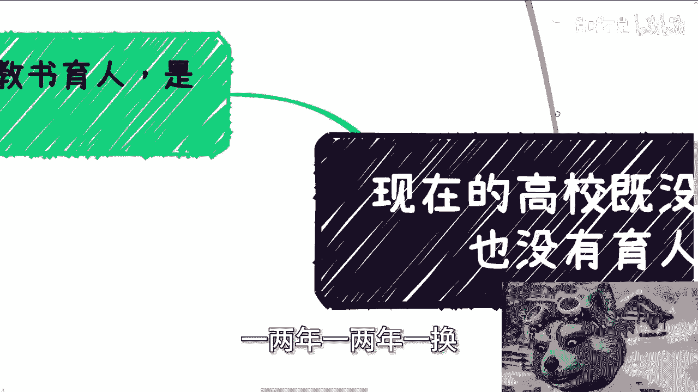
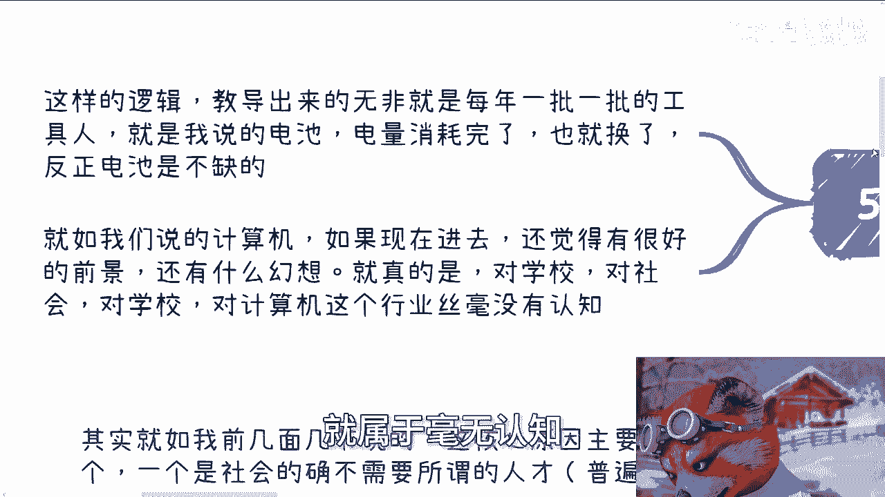
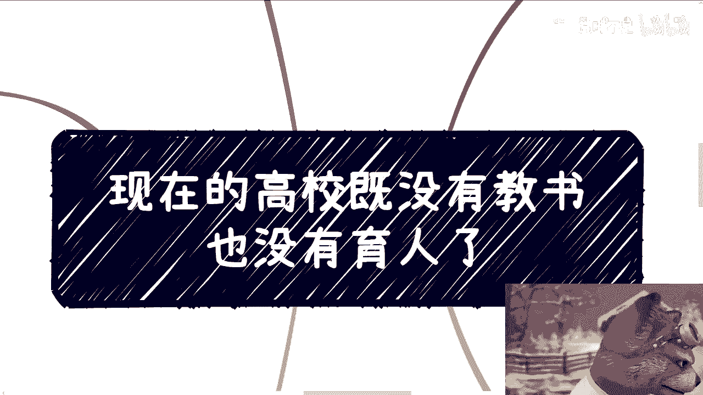

# 现在的高校既没有教书也没有育人 - P1 - 赏味不足 - BV1Ga1UYLEYq

好大家好，我们今天继续来讲这个高校教育啊，嘶。

呃今天这个主题呢叫做现在高校既没有教书啊，也没有育人啊，那现在到底有什么用呢，对吧，那很简单对吧，就按照我之前一直跟你们讲的，就现阶段也不是现阶段吧，尽可能45年六七年吧，就高校整个培养的就是电池啊。

就工具人，然后一两年一两年一换，一两年一两年一换这样子啊。

那么第一呢我们以前一直说教育育人对吧，是对老师的一种刻板印象。

那么呃其实就如我前面两节给你们讲的，核心原因就两个，一个是社会，它的确不需要所谓的人才啊，当然普遍来讲啊，你说要不要当然要啊，不需要没有这么多啊，可能1%都没有对吗，那另外一个呢，我跟你们讲。

还是那句话，我们呢可以讨论这件事情，但是我们也其实本质上没有资格批评这件事情，因为我今天也不是老师啊，你们也不是，那但凡我是那么一点，你们是那么一点呃，我们可能跟他们是一样的哦，可能还不如他们。

那么我我觉得呢就是说但凡我是呢，那么我也不会来跟你们说这些，因为本身它会影响到我的工作对吧，那我为什么跟自己过不去呢，啊你说我是那种圣人吗，那我肯定不是对吧啊那么你说那种为人呃。

这个为人不为己的好人还有没有，当然有，但是往往这种为人不为己的好人啊，maybe比你们今天听我这个视频的人啊，或者看这个视频的人也有这种为人不为呃，为人不为己的好人，但是往往这种人没有很高的格局啊。

我没有贬低或者歧视的意思啊，但是没有办法，你知道吗，这就是社会的客观规律，他往往没有一个很高的格局，也走不到一个相对高的港呃地位，为什么，正因为他为人不为己啊，这个就是人类社会发展的一种因果关系吧。

那么我们假设我们假设你们今天是老师，你们年复一年的只会浪费在高校里面，你除了卷你的工作，卷你的职场，为了你的晋升，贪甚至贪一些高校里的蝇头小利，拍拍领导马屁，你还会干嘛呢，对不对，但当然这个你还会灌嘛。

有两个两层意思，第一层就是说你为什么还会干别的事情，别的事情不影响你啊，跟你有什么关系呢，而我们刚刚说的这些卷工作卷职场贪蝇头小利，拍领导马屁，这是跟你工作有关系，跟你自身有关系的，你会去做别的吗。

不会另外一方面，你年复一年就他妈在高校里面，你还能会什么没了啊，所以这也是为什么近一些年以来啊，就是呃中国各地方高校，这种老师在外面做商业的人越来越多，在我们看来，就是这种老师出来拿着老师的名头呃。

就是就是把自己做成骗子的也越来越多，为什么，因为他们就这点格局，他们就这点认知，你指望他能什么，一个教授，一个老师能有什么格局，能有什么认知，你认为他有认，你觉得他有格局，你觉得他有认知。

这就是你的刻板印象，仅此而已对吧，因为他们都都是一个很普通的人，他只关注他的工作，而不是学生，更别说学生的发展啊，那么对老师来讲呢，很多要求其实都是道德层面的，简单来讲，你觉得应该要教书育人吗。

很多比如说你们现在还在读书对吧，你们作为学生或者你们的父母啊，作为家长都这么觉得，但你们怎么觉得没有用啊对吧，因为你从社会架构上面来讲，老师无非也就是个岗位，也就是份工作，你能对他要求什么啊。

这就好像今天你去做一个什么某某工作，对吧我就不不明说有什么工作怎么滴啊。

我他妈要求你哎，你明天就得给我牺牲，我有资格要求你吗，你会吗，对不对啊，第二你就拿计算机行业来讲啊。

你像从去年开始很多消息就放出来，国内很多高校大批量的这个扩招，计算机相关的学生对吧，那很多家长跟学学生呢还在自我安慰，意思就是说啊这个你说这个不好，你说这个呃叫什么行业，未来发展已经没有以前那么好了。

但是互联网行业依然相比别的行业来讲，是比上不足，比下有余的好，没有错没有错，但是你单纯说比上不足，比下有余有意义吗，这就好像我今天这么说吧，我今天给你们磕丹药，我说这颗丹药这颗丹药能长命百岁呃，百岁吧。

长命万岁对吧，然后呢你们父母也说的哎这个好呀，这个总归比别人别人死的早好吧对吧，然后呢你只听到这句话，我还没说完呢，那这颗药吃下去，99。99%的人当场毙命，你吃不吃嘛，对不对，就是永远看问题。

他只看一个点点，你问我这个点对不对，那对呀，但是你没说别的点啊，那怪谁呢对吧，你就像互联网行业生命周期越来越短，人也越来越不被当人，我们举个例子，你比如说我当年毕业的时候，计算机大家都是拼技术的。

拼真材实料的，大家工作相对还是稳定的，为什么，因为互联网在发展，互联网在高速发展，而且互联网有钱对吧，大家还能做比较长的时间，现在什么吊样子啊啊现在岗位这么少，人这么多，你做计算机有用吗。

来你整个社会岗位就那么些，而且互联网本身也已经，远远没有以前这么赚钱了，因为你们但凡去认识到互联网之后，你们就会明白互联网的产品他要赚钱，大部分的方式是什么，击鼓传花，现在没得传了，哪来这么多岗位呀。

哦你一下子扩招这么多，再往后两三年，34年人越来越多，完完全全就是个买方市场，老板可以，老板可以无限压榨，反正人多，毕业的学生每一两年每一两年就换对吧，换更便宜的更会吃苦的呀，怎么了呢，电池又不缺工具。

人又不缺，对不对，但是问题是那些一两年就被优化的人呢，两三年就被优化的人呢，你像最近我身边那些计算机硕士，被被裁掉的比比皆是，怎么啦，他们不是人，他们不要赚钱对吧，而且这些人随着你。

你现在2024年往后，他比例会越来越高，而且最神奇的是什么，就是这些人要说了啊，那那挤下去，那是他们的事情，关我什么事情对吧，他说我现在学了，我未来这个这个总归是有一席之地的，对吧好啊，那问题来了呀。

你把他们挤下去，那么两年后也有人会把你挤下去，他就整个市场就是个如此循环啊，你不觉得吗，对不对，第三啊，我们说过主题，你就像我我之前也一直在说，我说你们实在不知道学什么，自然就是学计算机跟金融。

我也是这么讲的对吧，为什么，因为一方面计算机是所有行业通用技术，交叉领域，交叉结合里面最强的，那另外一方面金融我们待会再说啊，但是但是你就这么想啊，除了我以外，市场上也有很多人是这么说的啊。

要学计算机对吧，就是就劝人一定要学计算机，学怎么样子是啊，但是问题是我们这样说的意思，难道就是说你去选一个计算机的专业，然后无脑去毕了业，你当然不是啊，你无脑学个计算机跟金融，然后呢有什么用呢。

我就不明白有什么用呢，你学了计算机跟金融，怎么滴了钱就印钞机打开，往你口袋里掉了，对不对，你所以本质上计算机这个学科，是为了更好的让你跟上时代，更好的能够去各行业去赚钱，赚那些真正怎么说呢。

热的钱新的钱对吧，你不管客户是谁，而不是说让你去仅仅学个技术，要是真的学个技术，还不如水电工对吧，完完全全不如水电工硬啊，你有什么技术啊啊一天到晚说一技之长，你有什么技术啊，用office吗，对不对。

那金融更别说了，金融就是为了让大家更好的了解，社会和金融运转的规律，它不是说老是学一些理论和名词对吧，我身边有些人有有些人沟通起来，理论一套一套的啊，这个什么什么什么以前什么金融学的理论对吧。

名词接连不断，但他赚不到钱了，有什么用呢，我请问有什么用呢，这就哎这就有点让我想到什么，就是古代以前人家说那种就是嗯很多秀才对吧，就是在那边啊吟诗作对对吧，就是动不动就背，你背有没有用，没有用。

你要理解对吧，第四啊，说回老师，咱一直这么说啊，老师其实是一个最好的目标，因为老师本身赚到过钱，有过什么成就，那至少你能蹦达一下，或者说你展望一下，你不是完全没有可能性对吧，但是老师如果没有相关经验。

你能学到什么呢啊那么网络上经常有人会说，他说讨论一个事物又不是自己一定要研究过，或者自己必须要经历过，这就好像我们讨论讨论今天一个空调啊，制冷不制冷，难道他妈的我得回去修会修啊，我得会组装。

我得会只知道他的这个制冷的原理是什么吗，我跟你们讲，对老百姓，大家作为老百姓，你想怎么讨论都可以，你只要不是故意的谩骂，故意的造谣，随便你对吧，你当老师不一样啊，你一个有自己经历的老师，那叫什么。

那叫能够把自己的经验和方法论传授给别人，当然他愿不愿意传授，那是另外一件事情，但至少他有这个能力对吧，但如果他没这个静音，那他最多教大家什么，教大家就是说啊这个空调怎么修怎么组装。

那大概是个怎么样的原理啊，比如说在这里面有有有过热啊对吧，有有有这么呃各种各样的问题对吧，那你说这个原理的核心技术是什么，有没有什么很大的门槛，以及你指望说唉我通过这个技术应该怎么赚钱，你觉得可能吗。

他自己都没这个理念，你觉得你可能吗，对不对，当然啊，就是而且老师本身跟我们还是不太一样的，你虽然我们说都是工作，但是他们的工作的确影响了很多人的很多年，甚至要影响一辈子，那你觉得这事儿能一样吗。

啊那么最后我们来说的，所以说你从源头上我们也能看得出来，就是这样的逻辑教导出来的，无非都是每一年一批一批的工具人，哎你要我说还他妈不如以前这个这个怎么说呢，就是流水线上的工人对吧。

你就是我说的电池电量耗完了，然后换对，反正电池整个社会上是不缺的，你就如我们说的计算机，如果现在进去，你还觉得很拥有很好的前景，还有什么幻想啊，那么对高对高校啊，对社会啊，对老师啊对吧。

就是对这个计算机这行业就属于毫无认知。

啊所以呢就是你像今天早上我在回评论的时候。

我也看到，就是到现在为止，还有很多小伙伴就是就是在那边纠结的是说，哎我做什么东西对吧，我大概比如说啊，这个东西应该怎么去获取这个资源对吧，应该怎么样子，核心点，核心核心的点是在于你一定要去想明白。

你的客户是谁，以及客户为什么买单啊，你我们我们打个随便打个比方，你今天手上有一串葡萄，我作为客户，我想买葡萄，对不对，好你说这个因果关系成立吗，不成立，为什么，因为我只想买葡萄，我凭什么买你的呢。

对不对，我买葡萄，我是什么目的呢，我是自己吃呢，还是送人呢，还是标榜起来做标本呢，对不对，你不能单纯以你有什么我你我要什么啊，然后他啪一下子连起来了，连连你个头，好吧啊行，那就这么着吧。

然后那个呃职业规划就工作上面商业规划啊，副业啊，或者跟别人一起赚钱啊，做些这个相关的一些业务啊，啊你们觉得需要跟我沟通啊，或者说呃讨论啊，或者希望能够从我这边得到一些，更接地气的建议的话。

那么你们可以整理好对应的问题跟个人背景，好吧。

