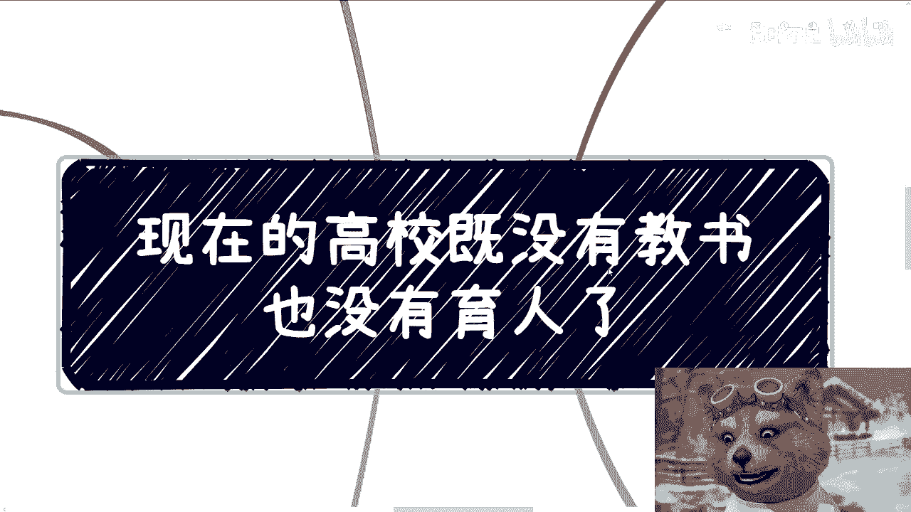
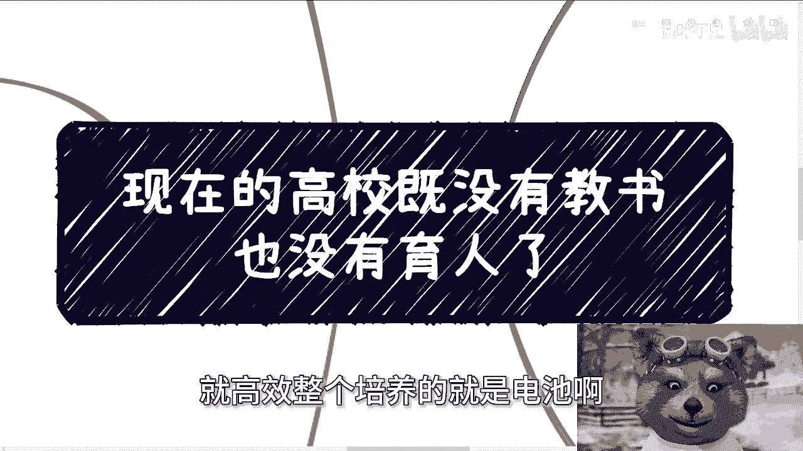
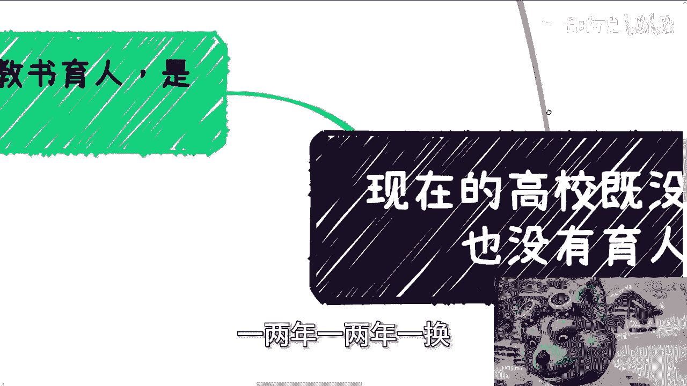
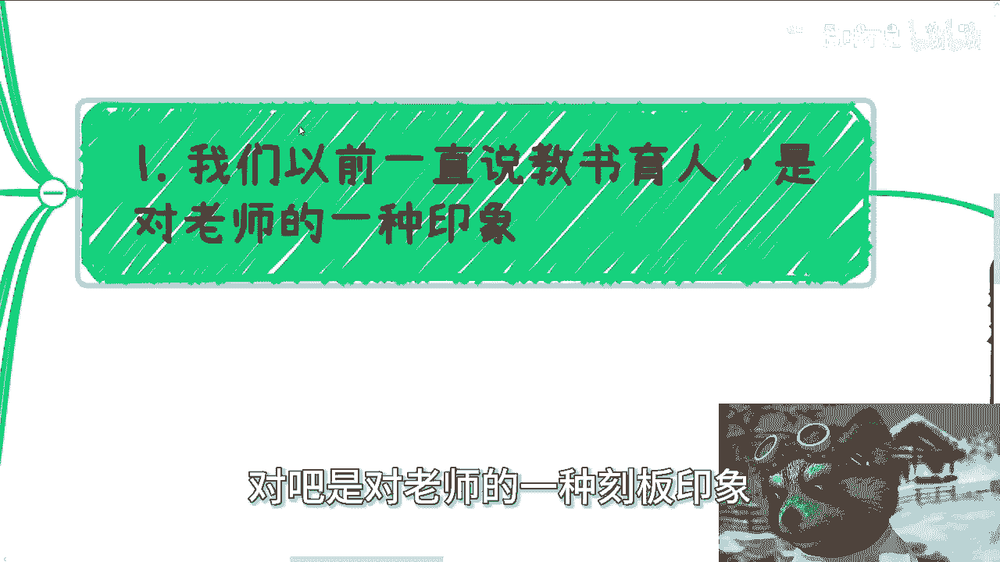
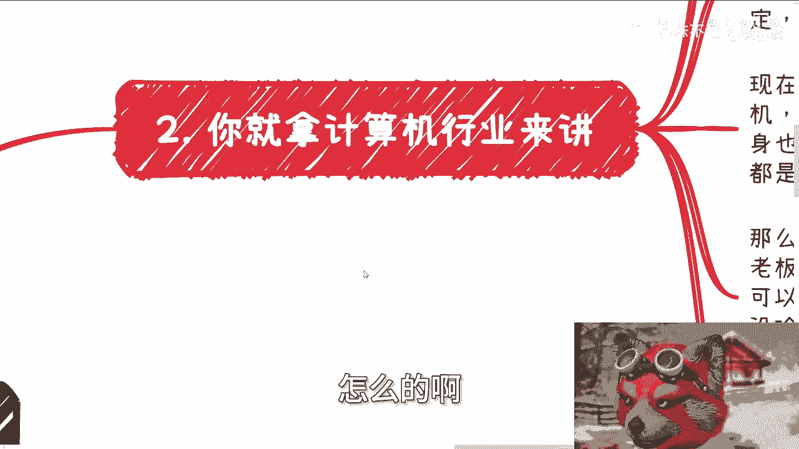
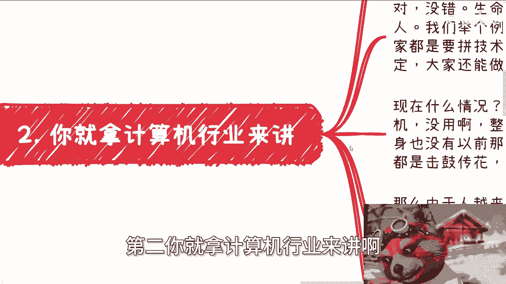
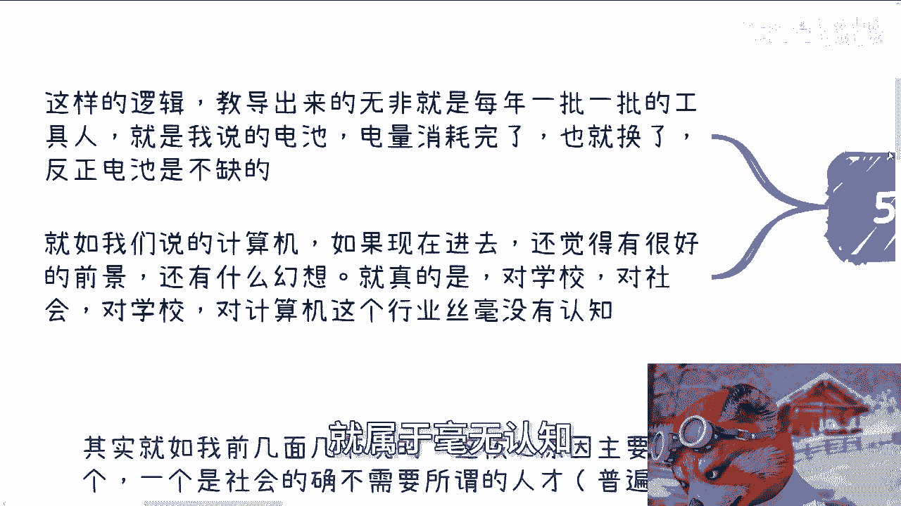
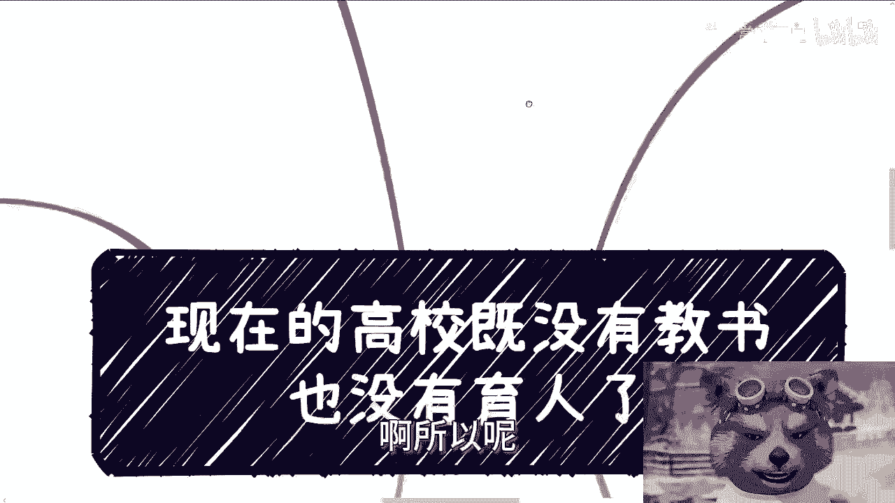
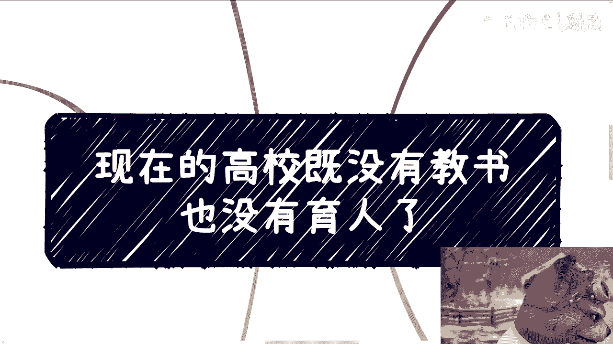

# 课程一：当代高校教育的困境与反思 🏫





在本节课中，我们将探讨当前高校教育体系面临的挑战。我们将分析高校为何被批评为“既没有教书，也没有育人”，并深入剖析其背后的社会、行业与个人因素。课程旨在帮助初学者理解复杂教育现象背后的简单逻辑。





## 概述：高校的功能转变

当前高校的核心功能已发生转变。按照近几年的趋势来看，高校培养的更像是“电池”或“工具人”。

**公式：高校输出 ≈ 标准化工具人**

这些“工具人”在一两年后就会被更换，循环往复。

## 第一节：对“教书育人”的刻板印象

上一节我们概述了高校功能的转变，本节中我们来看看“教书育人”这一传统期望为何落空。

“教书育人”常被视为对老师的刻板印象。其难以实现的核心原因有两个：
1.  社会普遍不需要大量所谓“人才”，真实需求可能不足1%。
2.  我们作为局外人，本质上没有资格批评老师，因为若身处其位，我们可能做出同样的选择。

## 第二节：教师的局限与困境

理解了期望与现实的落差后，我们进一步探讨教师自身的处境。



假设你是高校教师，年复一年身处其中，你的主要精力会消耗在：
*   卷工作和职场竞争。
*   争取晋升。
*   获取一些蝇头小利。
*   处理与领导的关系。



你不会去做与自身利益无关的事。同时，长期局限于高校环境，也限制了教师的格局和认知。因此，近年来出现部分教师利用身份在外从事商业活动，甚至行骗的现象，这与其认知局限有关。

教师本质上是一份普通工作，社会架构上无法对其提出过高的道德要求。这如同要求某个岗位的员工必须牺牲自我一样不现实。

## 第三节：以计算机行业为例的“电池”现象

从教师的微观视角跳出，我们以计算机行业为例，看看高校培养如何与社会需求对接。

从去年开始，国内许多高校大规模扩招计算机专业学生。许多学生和家长抱有“比上不足，比下有余”的安慰心态，但这忽略了关键问题。

**核心逻辑：**
*   **过去：** 互联网高速发展，资金充足，岗位多，重技术，工作相对稳定。
*   **现在：** 行业增长放缓，岗位减少，但毕业生暴增，形成“买方市场”。
*   **结果：** 企业可以无限压榨，并频繁更换更廉价、更能吃苦的“电池”（毕业生）。被优化的从业者比例越来越高。

这是一个恶性循环：你今天挤掉别人，未来也会被新人挤掉。无脑选择计算机专业并指望一劳永逸，是毫无用处的。

## 第四节：学科学习的本质目的

认识到盲目追热门专业的陷阱后，我们来澄清学习计算机和金融等学科的真实目的。

建议学习计算机和金融，并非指无脑报考相关专业。

*   **计算机学科**的本质是掌握一门通用技术和思维方式，以便更好地与各行业结合，赚取“新的钱”、“热的钱”，而不是仅仅成为一个可被替代的技术员。
*   **金融学科**的本质是理解社会和资本运作的规律，用于指导实践创造财富，而非死记硬背理论和名词。

## 第五节：经验对于教师的重要性

明确了学习目的，我们回到教育执行者——教师身上，探讨其经验的关键性。

教师若有相关领域的成功经验，至少具备将方法论传授给学生的**可能性**。若教师自身毫无经验，则最多只能教授书本原理（如空调的制冷原理），而无法传授核心技术门槛、行业洞察及如何借此盈利等关键知识。

教师的工作影响学生多年甚至一生，这与普通讨论截然不同。从源头来看，由缺乏实践经验的教师主导的逻辑，只能培养出一批批标准化的“工具人”。

## 第六节：给学生的核心建议

最后，我们为身处其中的学生提供最核心的行动建议。

核心在于想明白两个问题：**你的客户是谁？客户为什么买单？**



**举例：** 你有一串葡萄（产品），我想买葡萄（需求）。但需求并不直接导向购买你的葡萄。你必须弄清客户购买的目的（自己吃、送人、做标本），并证明你的葡萄如何更好地满足该目的。



**代码逻辑：**
```python
if 客户有需求:
    if 你的产品能精准满足客户需求背后的目的:
        交易可能成立
    else:
        交易难以成立
else:
    无交易基础
```

盲目连接“我有什么”和“你要什么”是无法成功的。

## 总结



本节课中我们一起学习了当代高校教育面临的困境。我们分析了高校培养“工具人”的社会逻辑，探讨了教师角色的局限，并以计算机行业为例揭示了盲目追热门专业的风险。我们明确了学习计算机和金融等学科的本质目的，并强调了实践经验对教师的重要性。最后，我们给出了最核心的建议：无论学习还是规划职业，都必须深入思考“客户是谁”以及“客户为什么买单”这两个根本问题。