# 课程名称：商业洞察与个人规划 第1课 - 羊毛出在羊身上的模式演变 🐑

## 概述

在本节课中，我们将要学习一个经典的商业逻辑——“羊毛出在羊身上”。我们将探讨这一模式的本质、它在不同场景下的表现形式，以及它如何随着社会发展而演变。课程旨在帮助初学者识别和理解身边常见的商业行为，避免因信息不对称而做出不明智的决策。

---

## 近期活动通知

下一期线下活动已经确定。时间是8月25日，周日。地点在西安，具体场地位于西安建筑科技大学李家村附近。

活动主题将围绕几个核心方向展开。首先是关于不同性质企业的职业选择，例如民营企业、中央企业、国有企业、外资企业以及大型互联网公司。其次，会探讨自媒体运营与跨境电商领域的机遇。最后，我会为大家总结当前的市场现状与未来发展趋势。

如需报名或了解活动详情，请通过私信联系我。

---

## 关于提问与沟通的建议

在深入主题之前，我想先分享一个关于有效沟通的建议。当你向他人咨询或描述一个项目时，需要提供完整的信息。

以下是几个关键点：
*   **信息完整**：你制作的宣传海报应包含所有必要元素，过于简略不利于传播。
*   **背景清晰**：在描述问题时，应主动说明已采取的行动，例如在哪些平台进行过宣传、邀请了哪些嘉宾。不要等待对方像“挤牙膏”一样反复追问。
*   **逻辑明确**：你需要讲清楚活动的目标客户是谁，以及你的方案如何精准解决他们的痛点。

总之，在寻求帮助前，请先完成你力所能及的部分，然后再进行沟通。此外，虽然我无法控制他人借鉴我的活动主题，但完全照搬、一字不改的做法并不可取。

---

## 核心模式：“羊毛出在羊身上”

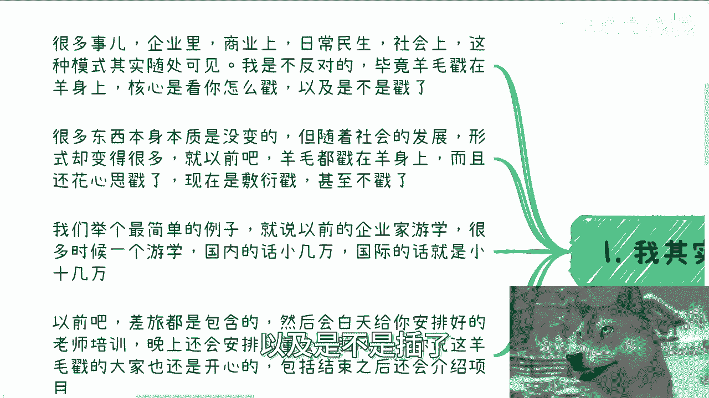

今天我们讨论的主题，其商业本质可以概括为 **“羊毛出在羊身上”**。

首先需要明确，我并非反对这种模式本身。就像曾经的P2P（点对点网络借贷）一样，模式本身并无原罪。问题的核心不在于“击鼓传花”的形式，而在于所传递的“花”是否具有真实价值。

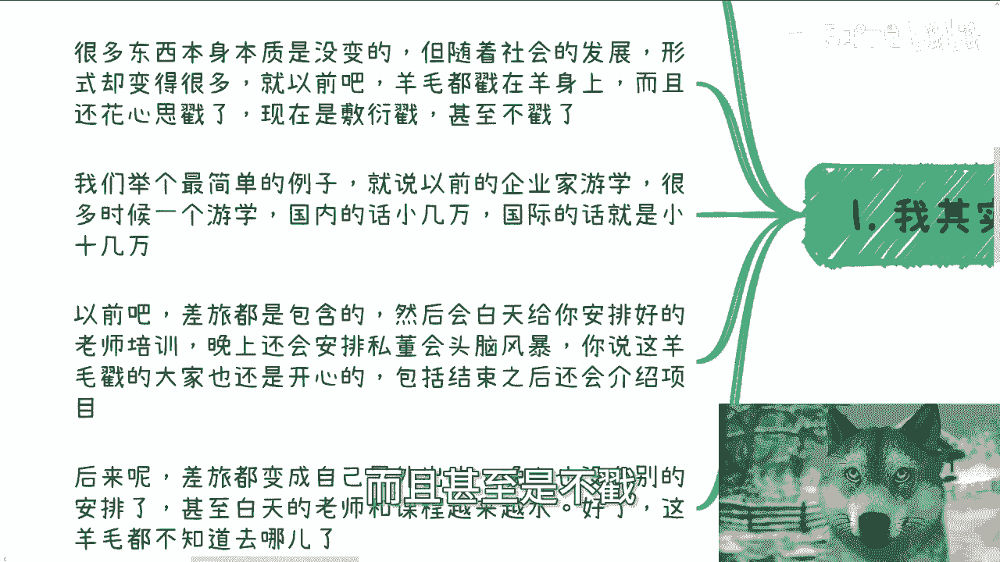

在商业、职场乃至社会声誉的构建中，“羊毛出在羊身上”的模式随处可见。我不反对它，因为能够实施这一模式的关键在于“如何操作”以及“是否真的操作了”。

**核心公式：价值转移 = 羊毛 (资源/价值) 从 羊 (目标用户) 身上 获取**

这个模式的本质没有改变，但其具体形式会随着社会发展而变化。过去，实施者还会花费心思去“剪羊毛”；而现在，这个过程变得越来越敷衍，甚至不再进行实质操作。

---

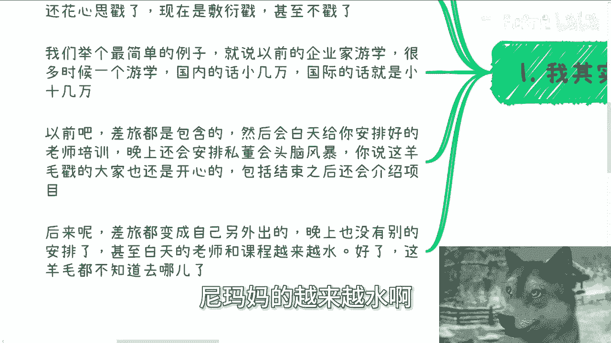

## 模式演变的实例分析

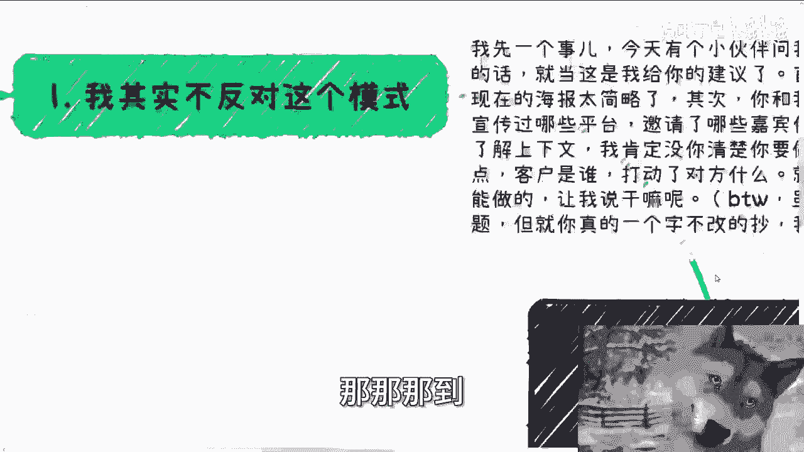

为了更直观地理解，让我们来看几个具体的例子。

### 实例一：企业家游学项目

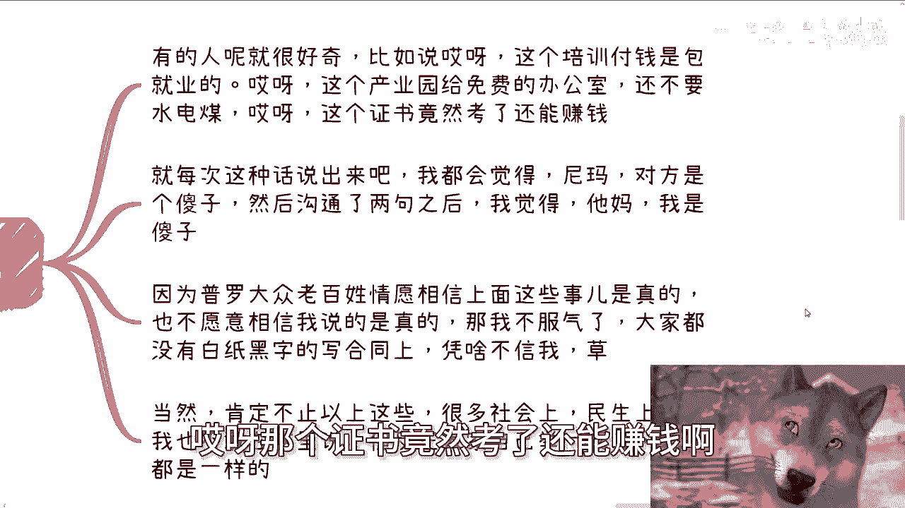

早期的企业家游学项目，无论是国内数万元还是国际数十万元的课程，通常提供完整的服务。

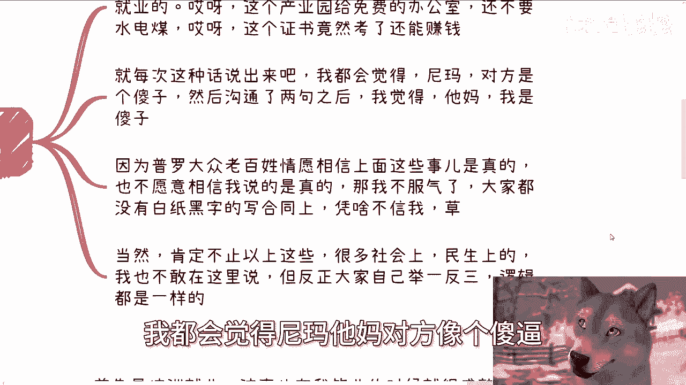

以下是当时典型的服务内容：
*   差旅费用全包。
*   白天安排优质讲师进行培训。
*   晚上组织社交活动或头脑风暴。
*   项目结束后还可能提供商业资源对接。

在这种情况下，虽然“羊毛出在羊身上”，但参与者获得了相应的价值，因此满意度较高。然而，近年来的变化是：
*   差旅费用需要参与者额外自理。
*   晚上的活动安排被取消。
*   白天的课程和讲师质量严重下滑。

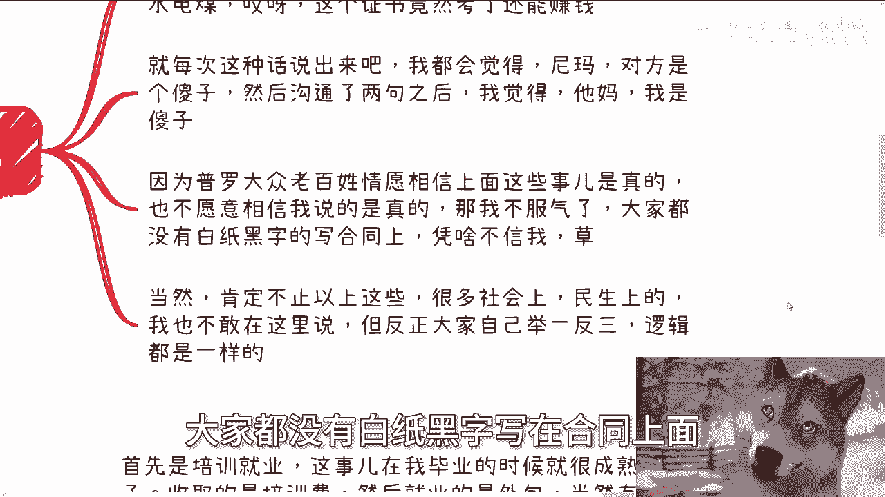

那么，参与者支付的“羊毛”最终去了哪里？大家心里都很清楚。

### 实例二：“培训+就业”承诺

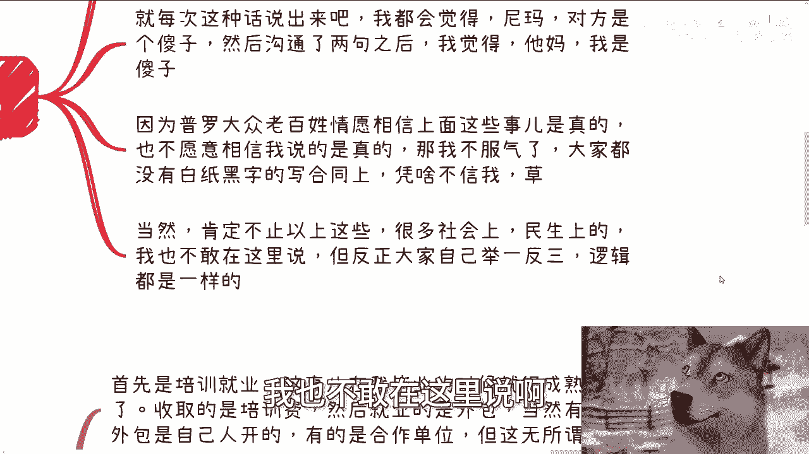

“培训后保证就业”是另一种常见模式。总有人会对一些表面上的“好处”深信不疑。

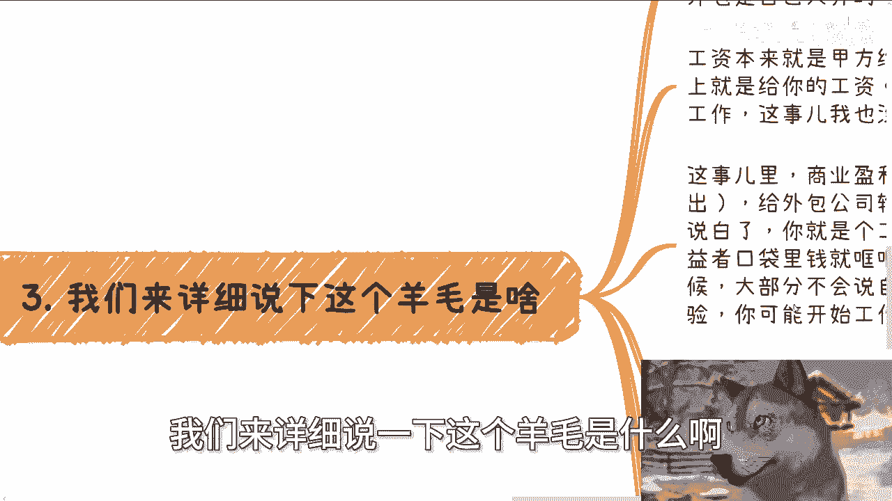

以下是几种典型的、需要警惕的说法：
*   “付费参加我们的培训，我们保证给你安排工作。”
*   “我们为你提供免费的办公场地，连水电费都免。”
*   “考取我们这个证书，还能帮你赚钱。”

每当听到有人相信这些说法，我都会感到困惑。大众往往宁愿相信这些口头承诺，也不愿相信基于逻辑的理性分析。关键在于，这些诱人的承诺**很少会白纸黑字地写入具有法律效力的合同**。

当然，社会中类似的模式远不止这些，其内在逻辑是相通的。

---

## “羊毛”的具体构成与盈利点

接下来，我们详细拆解一下，在这些模式中，“羊毛”究竟指什么，以及操盘方如何盈利。

### 1. 培训就业项目

以“培训+就业”为例，这个模式在我毕业时就已经很成熟了。

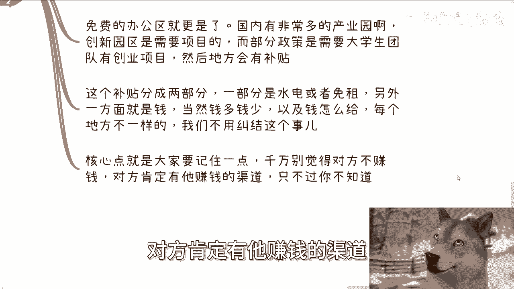

**盈利点分析：**
*   **培训费**：直接向学员收取的费用。
*   **外包人头费**：将学员作为外包员工派往甲方公司，从甲方收取的服务费用。
*   **人才输送介绍费**：向外包公司输送人才，可能获得约占学员年薪15%的推荐费。

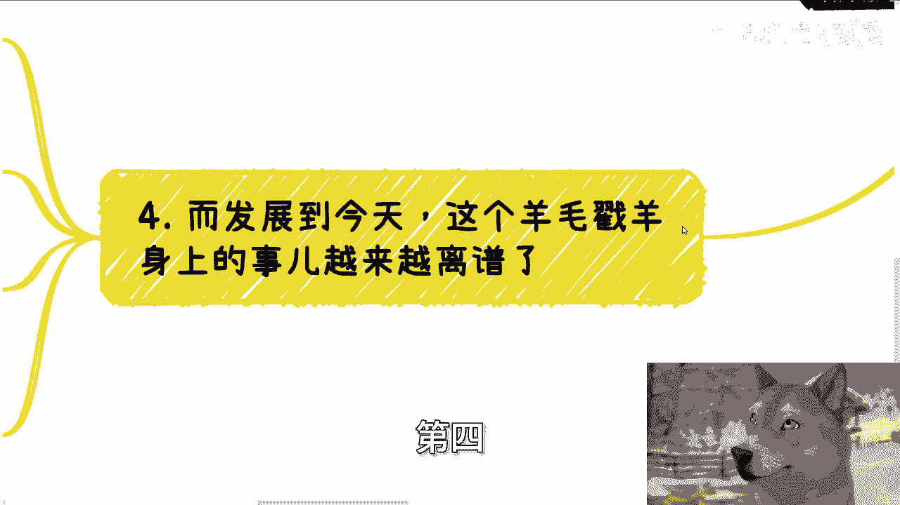

**本质**：你成为了流程中的一个工具。资金在你不知情或半知情的情况下，流入了组织者的口袋。在宣传时，他们大多不会明确告知这是“外包”岗位。缺乏经验的求职者甚至在工作后，都可能不清楚自己的外包身份。

### 2. 免费办公区项目

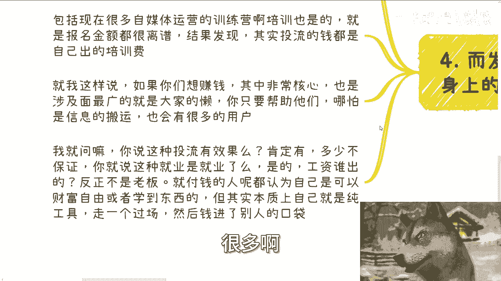

所谓的“免费办公区”背后也有商业逻辑。许多地方的产业园区或创新园区为了获取政府补贴，需要引入一定数量的项目或创业团队（尤其是大学生团队）。

**核心逻辑**：地方政府提供的补贴分为两部分：一部分是租金减免或水电补贴；另一部分是直接的现金奖励。操盘方通过招募团队入驻来满足政策要求，从而获取补贴。**千万不要认为提供免费场地的一方是在做慈善，他们一定有自己盈利的渠道，只是你不知道而已。**

---

## 当前趋势：模式越发露骨

发展至今，这种模式变得更加直接和赤裸。

例如，有些就业项目要求求职者缴纳高额“保证金”才能上岗。我曾见过保证金数额甚至超过一年工资的情况，这相当于“自己出钱给别人打工”，同时还为雇佣方创造了税收收益。这种逻辑令人费解，但相信的人却不少。

再比如，当前一些收费高昂的“自媒体运营训练营”。他们承诺培训后能获得多少粉丝或播放量，但实际上，用于推广（投流）的费用就来自你缴纳的培训费。这同样是“羊毛出在羊身上”。而且，**从来没有培训机构会就你的粉丝增长或收入，与你签订“对赌协议”**（例如：培训后你赚不到10万，我赔你20万）。

### 用户心理与市场基础

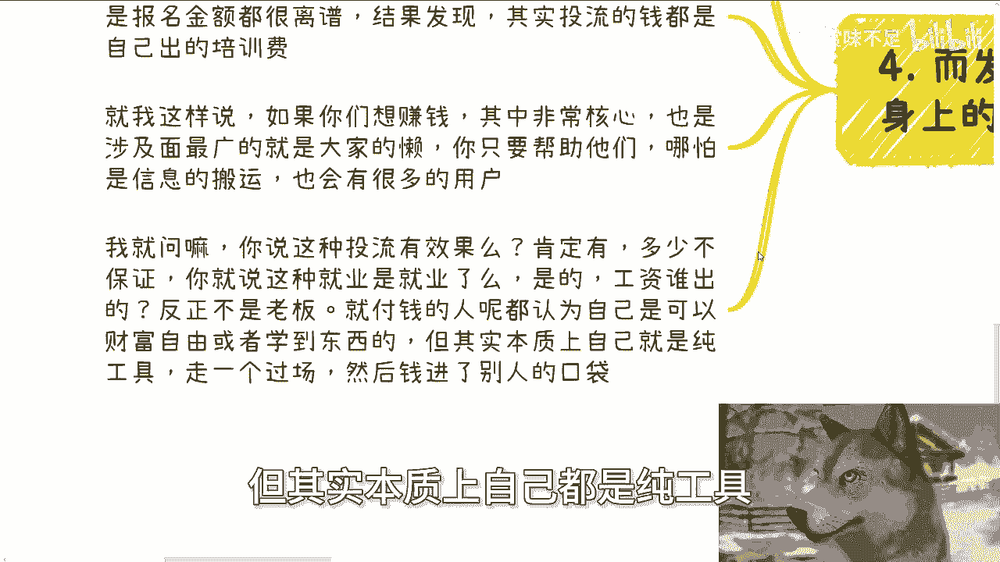

这类模式能存在，源于一个广泛的需求痛点：**人们的惰性**。许多人希望走捷径，不愿意亲自研究或操作复杂的流程。

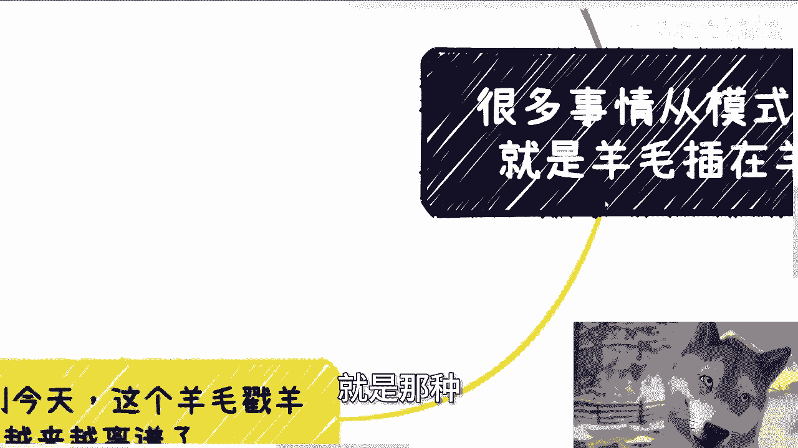

以下是两种典型心态：
*   **信息与操作惰性**：比如投流推广，他们不是不会，而是宁愿交钱让他人代劳，觉得这提供了“情绪价值”。
*   **风险与责任转移**：比如宁愿花30万让别人给自己发工资、安排工作，也不愿自己注册公司，用这笔钱为自己创造价值和收入。

付费者往往认为自己是在投资“财富自由”或“知识技能”，但本质上，他们只是他人商业流程中的工具，帮助他人完成“业绩”或“数据”，最终资金流入了操盘者的口袋。

即使你不需要直接付钱，你的参与（如作为项目成员入驻园区）也可能成为他人向政府申请补贴或资源的“工具”。总有人能从中找到“薅羊毛”的环节，只是你不知道而已。

---

## 总结与核心建议

本节课中，我们一起学习了“羊毛出在羊身上”这一商业模式的本质与演变。

**核心总结**：
1.  **模式本质**：价值从目标用户（羊）向服务提供方转移。模式本身中性，关键看提供的价值是否匹配。
2.  **形式演变**：从提供相应价值，演变为价值缩水甚至消失，过程越发敷衍和露骨。
3.  **识别关键**：对于任何商业承诺，尤其是听起来过于美好的事情，要追问其**盈利点**和**合同保障**。牢记 **“天下没有免费的午餐”**。
4.  **心理基础**：利用人们的“惰性”（怕麻烦、想走捷径）是这类模式盛行的重要土壤。
5.  **责任意识**：即使你不是直接的决策者或受益者，但若你的行为在不知情中成了伤害他人的一环，也需保持警惕和自省。

最后，请保持客观和清醒。在与商业相关的领域，轻易将对方认定为“纯粹的好人好事”是不现实的。要么努力从更宏观的视角去了解事物的全貌，要么就不要自我欺骗。

---

## 课程服务与后续

关于近期内容被抄袭的问题，大家无需在评论区过多争论，如果发现，顺手举报即可。

下期活动（8月25日，西安）报名或咨询请私信。

此外，如果你在**职业规划、商业规划、副业合作、合同协议（分红、股权）、商业计划书**等方面存在困惑，希望获得一些接地气的建议以少走弯路，可以整理好你的具体问题和个人背景，通过咨询来沟通。

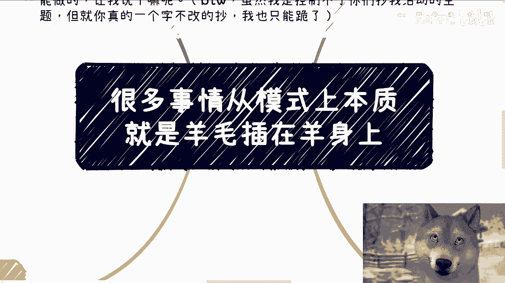

今天就到这里，我们下节课再见。