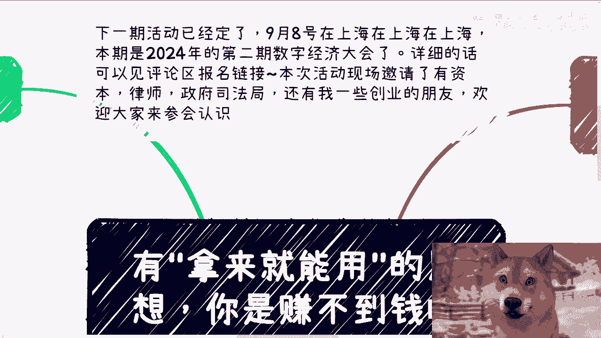
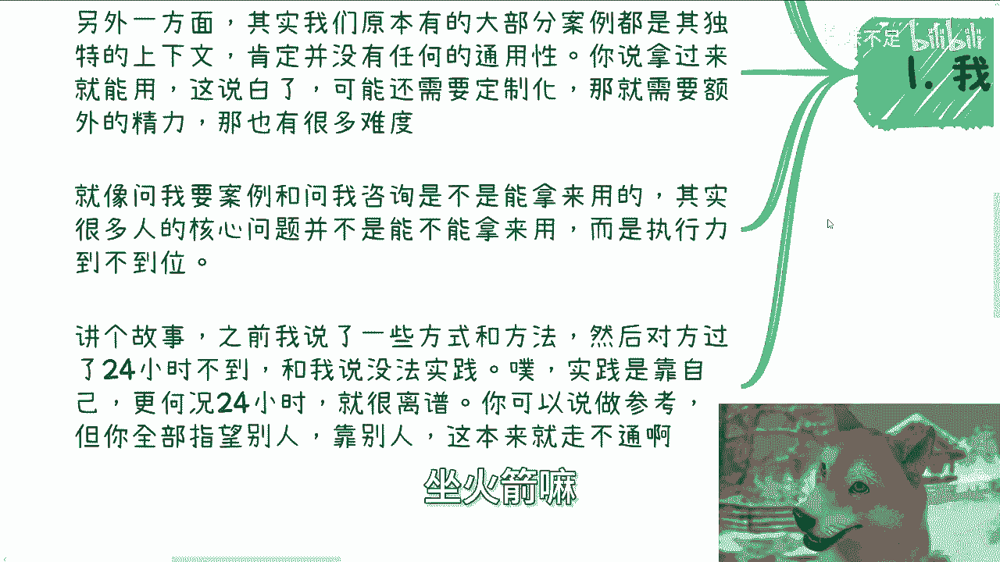
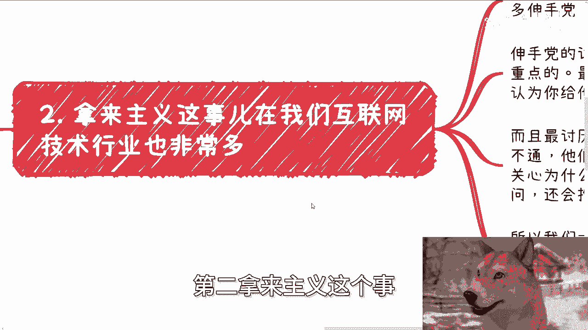
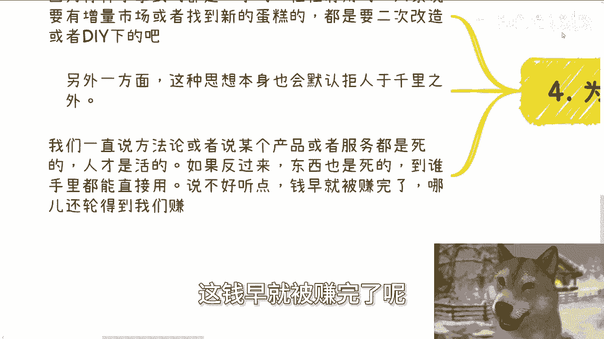

# 用-拿来就能用-的思想-你是赚不到钱的---P1---赏味不足---BV1EUsge7EHe_not

在本节课中，我们将探讨一个常见的思维误区——“拿来就能用”主义。我们将分析这种想法为何在商业和赚钱实践中行不通，并指出其背后的逻辑缺陷。通过理解“拿来主义”的局限性，我们可以建立更务实、更具创造性的商业思维。

---

## 活动预告 📅

下期活动已定于9月8日在上海举行，这是2024年第二期数字经济大会。详细信息和报名链接请查看评论区置顶内容。

本次活动现场邀请了来自资本、法律和创业领域的朋友。认识这些朋友可能对大家未来的工作、生活或商业发展有所帮助。

如有不清楚之处，可以私信咨询。

---

## 前情提要：什么是“拿来主义”？

“拿来主义”指希望不经过任何调整或思考，直接获取并使用现成的资料、服务或解决方案。

上一节我们介绍了课程主题，本节中我们来看看“拿来主义”的具体表现和问题。

很多人向他人索取东西时，期望“拿来就能用”。这种做法有时可行，但必须考虑付出的成本。不能指望仅付出极低成本（如1元、50元或100元）就能获得完全适用的东西。如果这种逻辑成立，那么世界上拥有这些钱的人都能做到，这显然不合理。坚持这种不切实际的想法，最终可能导致受骗。

“拿来就能用”的想法本质上是懒惰的表现，即希望不付出努力，由他人完成所有工作。这种心态延伸到赚钱上，就是希望别人替自己赚钱然后供自己花费。如果具备这种能力（如成为“捞女”或“捞男”），那也是一种本事。然而，缺乏个人想法会降低对方与你服务或合作的意愿，因为大多数寻求赚钱机会的人都希望合作伙伴具备自主思考能力。一个只希望他人劳动而自己不动的人，很难找到合作者。

---

## “拿来主义”的核心问题

以下是“拿来主义”在实践中面临的几个核心问题。

### 1. 案例的独特上下文

大部分成功案例都有其独特的背景和上下文。例如，一个案例可能基于金融、农业或社交领域的特定积累。当有人索要案例并希望直接用于寻找客户时，会显得很奇怪。因为案例的成功依赖于特定的环境、时机和条件。提供案例的人没有损失，但索要案例的人在缺乏目标的情况下，如同无头苍蝇，甚至不知道选择哪个案例。

许多人在私信中索要案例或咨询内容，希望直接使用。但核心问题往往不是内容本身，而是执行是否到位。有些人拿到案例后便没有下文，半年或一年都没有动静。更有人听取方法后，不到24小时就反馈“无法实践”。实践需要时间和努力，期望立即见效是不现实的。

所有的合作或方法都可以参考，但不能完全依赖他人。如果一切都能依赖他人，那么机会早就被别人占尽，轮不到后来者。

### 2. 互联网领域的“伸手党”

在互联网（尤其是过去的移动互联网和技术行业）中，存在大量“伸手党”。他们令人反感的地方有两点：

第一，他们认为你提供帮助是天经地义的，如果得不到帮助还会埋怨。
第二，当他们遇到代码运行问题时，他们不关心问题原因，只想要一个能直接运行的代码。下次遇到类似但不同代码的问题时，他们又会来询问，并抱怨你上次没有解释核心逻辑。实际上，并非不愿解释，而是他们当时不耐烦听，只想要现成解决方案。他们最希望的就是直接复制粘贴（`CTRL+C`, `CTRL+V`）。

因此，很多人不愿做C端生意，因为部分C端用户不愿为解决问题付费，要求却很多，并理所当然地认为自己是“上帝”。就像某些消费者在餐厅付费后，就觉得有资格对服务人员态度恶劣。这毫无道理。

### 3. “拿来主义”可行的前提

“拿来主义”有时可行，但需要满足特定前提：

第一，当你是甲方或掌握需求的一方，能够清晰描述需求时，可以要求“拿来就能用”的解决方案。
第二，“拿来主义”成立需要两个前提：一是双方社会或政治地位不同，地位高的一方可以直接提需求；二是付出的成本与期望匹配。

这就好比玩游戏时，你只愿付9.9元，却要求每次抽卡都得到SSR角色，否则就投诉。这显然不切实际。你的期望必须与付出成正比。你不能付出自行车的成本，却要求得到火箭。

### 4. 为什么“拿来就能用”赚不到钱？

如果你期望“拿来就能用”，那么你得到的一定是二手、经过验证的东西。而真正能赚钱的机会往往在于增量市场或新领域，这需要你将现有有用的东西进行二次改造或DIY，融入自己的想法和业务逻辑。拿着一个陈旧的东西就想赚钱，是不现实的。

方法论、产品或服务是固定的，但人是灵活的。“拿来主义”者却认为东西是死的，人也是死的。如果一个东西到任何人手里都能直接用，那凭什么钱让你赚？说得直白点，如果东西到你手里就能用，这钱早就被别人赚完了，轮不到我们。

以去年的GPT为例，很多人找我，希望有一个已经调好、对接好的GPT-4接口。这很可笑。即使我有这样的接口，我为什么不先卖给我的朋友或发小？等到你来问的时候，市场可能早已饱和。更何况，这种人往往听到别人用GPT-4赚了50万，就觉得自己拿到后也能赚50万，甚至更多。如果只赚了5万，他们可能还会怪你提供的接口不一样。这叫做“刻舟求剑”。赚钱的因素（产品、时代、时机、用户）都在变化，他们却认为只要拿到东西，在任何时间、任何背景下都能获得相同结果。这怎么可能？

---

## 总结与建议 📝

本节课我们一起学习了“拿来就能用”想法的弊端。我们分析了其背后的懒惰心态、对案例独特上下文的忽视、在互联网领域表现为“伸手党”的问题，以及它可行的有限前提。最重要的是，我们明白了这种思维为何难以带来真正的赚钱机会：因为它追求的是静态的、二手的解决方案，而真正的商业成功需要动态的、创造性的结合与改造。

如果你在职业规划、工作、商业规划、副业、合同、分润、分红、估值或融资等方面，希望结合我的认知和知识面，获得更接地气的建议或规划，请整理好具体问题和个人背景，再进行咨询。

---

*注：本教程根据提供的视频内容整理，删除了所有语气词，保留了每一句话的核心含义，并以Markdown格式呈现，旨在为初学者提供清晰、流畅的指导。*