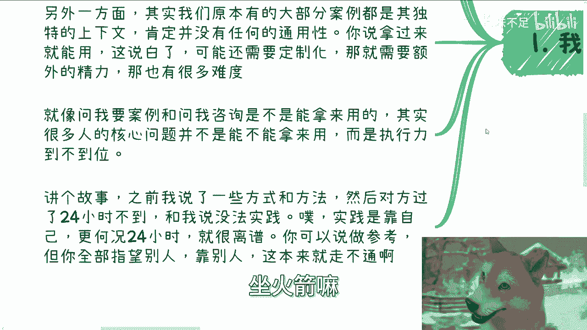
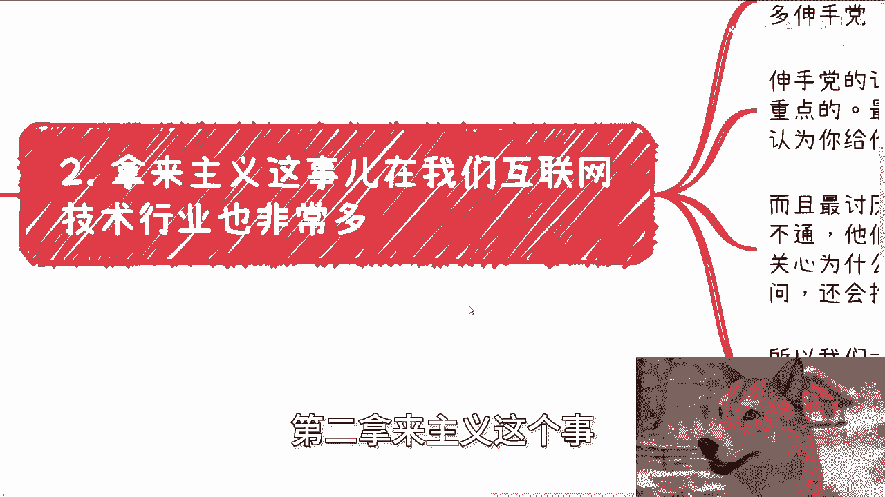
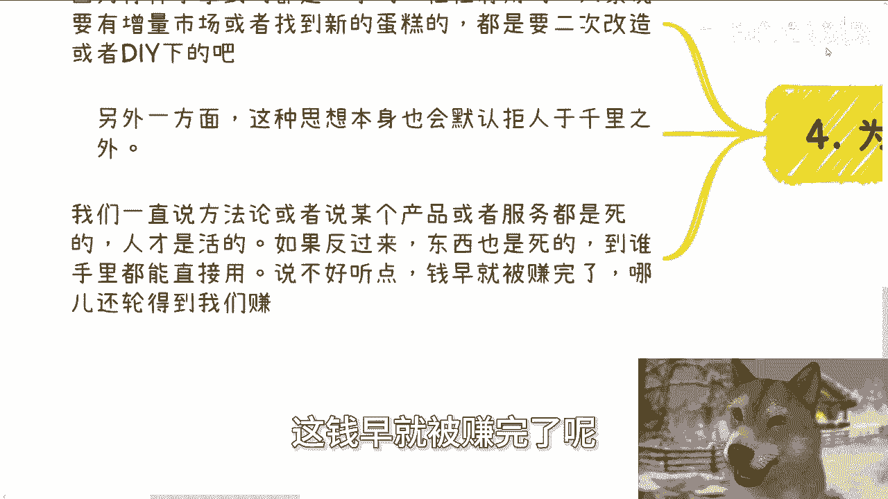

# 用”拿来就能用“的思想，你是赚不到钱的 - P1 - 赏味不足 - BV1EUsge7EHe

哈大家好，我是狗子是吗啊，还是最终发现还是这只黄色的狗子比较可爱啊，额首先今天这个在外面有点事啊。

所以就晚了晚了，我就只更新一个好吧，明天再说啊，呃我们今天讲的这个主题呢叫做拿来就能用啊，这个想法你但凡抱有这想法，我跟你讲，你是赚不到钱啊，虽然我们有另外一个那个专辑嘛。

叫做阻碍你赚钱的这个这个思想对吧，或者阻碍你赚钱的这个前提额，但是这个内容呢我觉得嗯一般啊，所以我就不打算放在充电视频里面啊。

那么首先先说一下下期活动啊，上期活动已经定了9月8号啊，在上海，那么本期呢是2024年第二期的，这个数字经济大会啊，详细的话呢可以进评论区报名的链接好吧，我我会置顶的啊，然后本次活动现场呢我也邀请了。

就是说我的一些朋友就做资本的啊，包括律师，做律师的呃，还有一些我创业的朋友啊，然后就欢迎大家可以过来多认识认识，因为这些人我觉得人都不错啊，呃我相信在未来大家不管是工作还是生活当中。

还是未来的一些这个商业当中，呃，商业当中多多少少应该对大家都会有帮助，好吧嗯OK啊。

如果你们有些这个不清楚的，你们可以私信再来问我啊，那么我们先来说一下前情，提前情提要啊，是这样子的，额就拿来主义这个事来讲啊，很多时候你比如说问别人要东西对吧，不管是资料还是服务。

你不能指望拿来就能用啊，当然我后面也会说你拿来就能用，行不行行啊，那你要要看出你付出的成本，对不对，你不能说啊，我他妈就付出一块钱啊，付出50块钱，付出100块钱，我什么东西拿来就能用，那那我奇了怪了。

这世界上是他妈的，只有你有一块钱，你有50块钱吗，对不对，就就很奇怪，就是这种逻辑本身走走不通，但是你非要指望他走得通，那那我说不好听的，你除了被歌，你还能干嘛对吧，那么先说一个逻辑啊。

我觉得嗯很多人你要想拿来就用，那就是懒啊，那就是说白了你就是什么都不想动，你就想别人帮你做好对吧，那那我甚至会觉得你不要自己赚钱，你不就你想别人帮你赚钱，赚完钱给你给你花呗，对不对。

那那你要是能做个捞女或者做个捞男的，那我觉得也是我也佩服你，也是你的本事啊，那同时就说白了你没有自己想法啊，那这个时候呢你会发现其实本身啊，对方跟你做服务，或者说跟你合作，这个意图也会小很多。

因为大部分赚钱的人来讲，都是希望能够有那种自我想法的，你单纯只是一个怎么说呢，就是一个只只希望别人劳动，自己不劳动的，那他妈谁来合作啊，对不对啊，那么另外一方面，其实我们原本有大部分的案例呢。

都是有独特上下文的，就比如说你今天已经积累了有金融啊，农业啊对吧，或者社交啊，其他一些案例，然后我就问你啊，我说那你那个案例能不能借我用对吧，能不能能不能拿过来啊，我直接就说去看看能有有没有哪些甲方。

其实你也会觉得很奇怪，为什么，因为你的案例肯定是有上下文的，肯定是有些特殊的，这种怎么说呢，就是说呃环境啊，包括天时地利人和，在的对吧，你把这个案例给我，对你来讲是没损失，但是我拿这个案例去找甲方。

其实我是一个无头苍蝇，那你你给不给我，其实你也会在那边打鼓对吧，你就会觉得其实我根本就找不到什么合适甲方，因为我在没有目标的情况下面，你你你你其实如果来说有比较多的案例的时候。

你甚至都不知道给我哪个案例，这就好像很多小伙伴啊私信来问我，说哎问我要案例，或者问我这个咨询的内容能不能拿来直接用，我也很就是有点很搞笑，就是你其实很多人的核心问题，他并不是拿不拿来用啊。

而是你这个案例我给了执行力到不到位呀对吧，你说有很多人我案例也给了，给了之后呢，哎我就跟你们讲，很奇怪的，给了之后没有声音的啊，半年一年都没声音了，哎呵那那你让我怎么说呢，对吧，讲个故事啊。

之前我说了一些方法跟方式啊，然后某一个人啊也很奇怪的，过了24小时不到对吧，跟我说哎没法实践，大哥实践是靠自己的，更何况你24小时不到，你想怎么实践坐火箭嘛啊那就很离谱啊对吧。

你说我们所有的合作或者所有的方法，你可以说参考，但是你不能全部指望别人，对不对，这逻辑本来就走不通啊，你要是能全部指望别人，那早就别人指早就别人都指望完了，还轮得到你来指望，对吧啊。

第二拿来主义这个事在我们互联网。

就我们我以前是在移动互联网嘛，在技术行业也很多，就是我们以前做移动互联网的时候呢，就一直吐槽过很多叫什么叫伸手党啊，当时我们取名叫伸手党，就伸手党的这个讨厌的地方啊，不是说伸手伸手本身并不是最重点的。

最重点的有两点，第一呢就是他们伸手难，他们还会认为你给他们，你回答他们是天经地义的，你不给吧，还要埋怨你，然后最讨厌的是第二点，就是比如说他们有段代码跑不通嘛，他们就来问你啊。

然后就问你爱程老师这个代码为什么跑不通，但是啊他要的是什么，就是你不要跟我说为什么跑不通，他要的就是一个能跑得通的代码，他不关心为什么跑不通，然后等到下次有同样的问题时候，但是不同代码他还会来问你。

然后他还会问抱怨你爱抽谁，你上次怎么不告诉我核心逻辑是什么，那他妈是我不想说吗，对不对，你也没问我，而且我跟你讲了，你也不耐烦啊，你你你你会发现你跟他们讲的时候，他会跟你说，你不要跟我讲这些。

我只想知道怎么跑的通，对不对，他最好就是CTRLCCTRLB啊，所以我们一直说啊，做C端生意很难，然后会有很多人不愿意做C端的生意，就是这个原因，就是你会发现C端的人就很奇怪，他就是就是说一方面。

他不愿意为自己解决问题去付费，而且还要求很多，同时呢他会天经地义的认为自己父亲就是大姨，就像我之前某一期视频跟你们讲的，就是很多人他尤其是在这种餐厅里面消费，他就会觉得哎我付了钱，我就有这种资格啊。

去对别人态度不好，或者说去甚至去欺负那些叫什么做服务业的人，有什么资格，对不对，奇了怪了啊，第三那么什么时候应该拿来主义啊，那我觉得是这样子的，拿来主义有时候也是走得通的，但是是有前提的。

第一那就是你是甲方的时候，或者说你握住需求的那一段的时候，你是能够写清楚需求的时候，那么你拿来主义没问题对吧，第二拿来本身如果要成立，本质上需要两个前提，第一是什么，就是大家社会地位或者政治地位不同。

比如说你比对方高，那没问题，你可以直接提需求，你就跟对方说，OK我只你我我不管你怎么做，你只要拿出来满足我需求就可以了对吧，这叫拿来主义对吧，另外一种是什么，就是衡量你付出成本。

这就好像你今天打个游戏啊，你说啊我我我想抽那个这个游戏里面的SSR，对吧好，就愿意付九块九，你说我必须这个九块九打出来都是SSR，打不出来SSR，我就投诉你，那他妈的啊，你想怎么滴，对不对。

那你你咋不去，你你那你咋不去，那个叫什么澳门赌博，直接就付一块钱，你说我必须他妈的给我刮出一个亿，不刮出一个亿，他妈我投诉你，对不对，这就离谱啊，这叫什么，这叫不接地气，这这这叫这叫不完全不符。

不符合逻辑啊，就是说你的期望跟你的付出要成正比对吧，你要自行车就自行车，你别付出自行车的成本，要火箭，对不对啊，那么第四就是说为什么我说赚不到钱，是因为你想想看，但凡你说你拿来就能用。

你肯定拿到的是个二手的对吧，一定是经过验证，那么往往真的有用的，大家说要有增量市场或者找到新的蛋糕的，你一定是拿一个比如说有用的东西来二次改造，或者DIY一下吧对吧，你有自己的想法。

或者有自己的一些业务逻辑，商业逻辑结合进去，那你才有可能赚到钱嘛，哦你拿到你拿一个老的东西说我就能赚到钱，那他妈的奇了怪了对吧，然后另外一方面，我们一直说某一个方法论或者某个产品，某个服务都是死的。

人是活的对吧，但是你拿来主义这种人他是反过来的，就是东西是死的，人也是死的啊，那么我就这么说，到谁手里都能用，那为什么凭什么这钱给你赚呢，对不对，所以我在这地方写了，说不好听点，你如果到你手里就能用。

这钱早就被赚完了。

哪还轮得到我们赚对吧，你就像去年GPT也是的。

有很多人我跟你讲啊，找我做什么事情啊，他说哎，创始人能能能不能有一个就是帮我们调好的，对吧，比如说对接好的一个JPD4的这个接口，我我当时我也是哭笑不得。

就是大哥，你有没有想过有调好的接口，我不对外卖哦，我朋友不对外卖哦，我我的一些这个发小不对外卖哦，我给你卖，咦对吧，那当然我会退1万步来讲，不是我不给你卖，我就算给你卖了，这当你来问我的那个时候。

你想想看是不是我如果啊我已经早有这个东西，那是不是说我的发小，我的朋友啊，我的我自己是不是已经早就把猪队卖过一遍了，到哪里去卖呢，对不对，而且你从整个市场来讲的话，如果我有了这市场上肯定很多人都有了。

那大家都卖了一遍了，你再去卖，有什么好卖的呢，是不是对吗，而且更何况啊你会发现有有怎么一个逻辑啊，就是你会发现这种人，他问你要JBT4的这个对接账号对吧好，然后呢，他可能听到雨就是就是风啊。

他就觉得就是说啊，我这个这个这个好像人家啊就用GP4对吧，一年比如说卖50万，等到他手上呢，他一年只卖了5万，他到时候还来怪你说啊，陈老师，你是不是给我这接口会跟别人不一样，那凭什么人家能卖50万。

我能卖，我只能卖5万呢，对不对，这叫什么，这叫刻舟求剑对吧，就是任何的钱，任何东西它都是在变的，产品也在变，时代也在变，时机也在变，他们不是这么觉得，他们就觉得哦，我只要拿到这东西，我不管什么时间。

不管什么时代，也不管用户是什么，人家赚了50万，我也能赚50万，我要是再投机取巧一点，说不定我能赚100万，怎么可能呢，对不对啊，唉我真觉得就是我还是那句感叹妈读书读傻，哎呀行吧啊，就这么着吧。

然后那个活动好吧，活动那个链接我会发在评论区的啊，然后那个呃有任何的不清楚的，你们可以继续私信咨询我啊，然后剩下的话呢就是说职业规划啊，包括工作上面，然后商业规划包括一些呃副业啊，包括合同啊，分润啊。

分红啊，估值啊，融资啊对吧等等等啊，你们希望通过我的一些呃认知，通过我的一些这个知识面，能结合你们现在的情况，给你们一些更接地气的建议，或者呃叫什么，就是规划的话，那么你们可以整理好对应的问题好吧。

和个人背景，我们再来做咨询好啊。

今天就这么着吧。