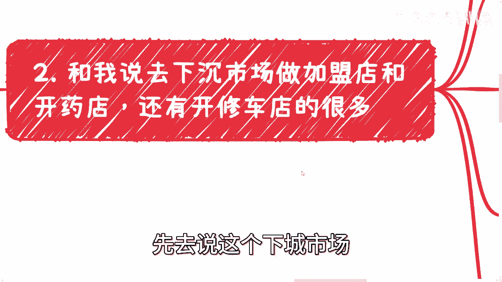
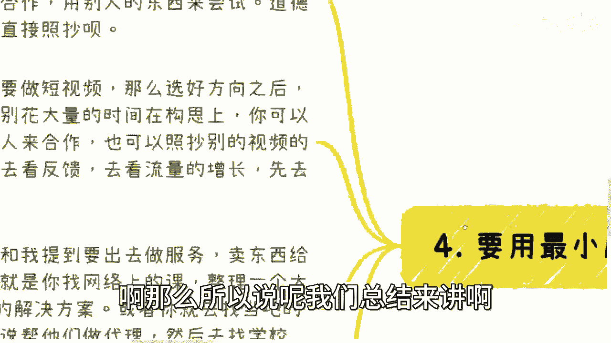
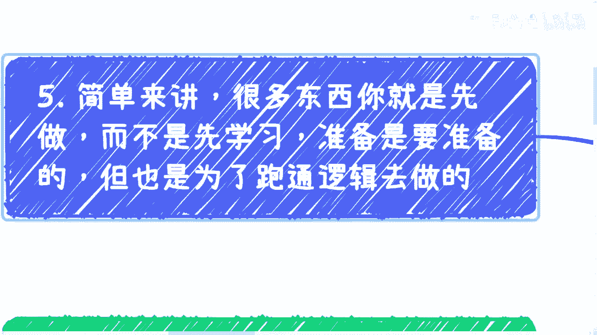

# 课程 P1：最小成本试错法 🧪

在本节课中，我们将学习一种高效的行动策略：**以最小的成本或模式进行试验，验证可行性后，再投入资源进行深入学习和准备**。许多人在尝试新事物时，习惯先做万全准备再行动，这导致了极高的沉没成本和试错成本。我们将探讨如何逆转这一思维，通过快速、低成本的验证来指导行动。

---

## 传统思维的问题：准备先行，成本高昂

上一节我们提到了传统“先准备，后行动”模式的问题。许多人受固有教育模式影响，在开始做一件事前，总希望把所有东西都学好、准备好。

这种做法存在两个核心问题：
1.  **沉没成本太高**：在不确定方向是否正确时，就投入了大量时间、金钱和精力。
2.  **试错成本太高**：一旦方向错误，所有前期投入都将付诸东流。

很多人认为普通人没有太多试错机会，但更准确的说法是：**大部分人不知道如何以低成本进行有效试错**，或者被误导而选择了高成本的试错方式。

---

## 案例分析：高成本试错的陷阱

以下是几个常见的高成本试错案例，它们通常源于对某些建议的盲从，而缺乏个人验证。

*   **加盟店/药店/维修店**：许多人听到“下沉市场有机会”的建议后，在没有现成资源、不了解当地市场、不清楚全部隐性成本（如时间、关系维护）的情况下，就投入数十万资金。这本质上是将商业逻辑、人际交往和资金投入等所有难题打包在一起，进行一场高风险赌博。
*   **国内外市场选择**：有些人在国内商业逻辑尚未跑通、对国情更了解的情况下，就考虑去海外开拓市场。商业逻辑本质相通，如果在具备“天时地利人和”的国内都难以成功，在陌生的海外环境成功率只会更低。
*   **盲目进入餐饮等行业**：例如想开烧烤店，但低估了消防、食品安全、地方关系打点等隐形成本与合规要求。尤其在越下沉的市场，地方性垄断可能越明显，切入难度反而更大。

这些案例的共同点在于：**在产出未知、隐性支出不明、市场不了解的情况下，就进行了重大的资源投入**。

---

## 核心策略：最小成本与最短路径

本节中我们来看看解决问题的核心方法。正确的做法不是“先学后做”，而是 **“先做后学”**，这里的“做”特指**低成本验证**。

其核心公式可概括为：
**行动策略 = 最小成本 × 最短路径**

### 1. 什么是最小成本？

最小成本是指将你的时间、精力和金钱投入降到最低。实现方式主要有两种：

*   **道德模式（合作）**：**借力打力**，寻找现有资源方进行合作。
*   **效率模式（模仿）**：**照抄优化**，快速复制已被验证的模式或思路进行测试。

**实践示例：**
*   **做短视频**：选定方向后，立即模仿同类优质视频制作1-2个内容发布。用一周时间观察流量、增长和用户反馈，验证方向可行性，而非花一两个月空想构思。
*   **提供企业服务**：先整理一个解决方案大纲或PDF，直接联系目标公司的销售或商务部门谈合作。在洽谈过程中验证需求真伪，而非先花重金开发完整课程或产品。

### 2. 什么是最短路径？

最短路径是指寻求最快、最直接的验证方式，核心也是 **“借力打力”**。

**实践步骤：**
1.  **构思产品框架**：明确你的产品、服务或想法。
2.  **寻找验证伙伴**：直接对接目标客户群的负责人（如企业商务、社群主理人）。
3.  **洽谈即验证**：以“谈合作”为名，在沟通中收集反馈，验证想法的市场接受度。
4.  **避免偏差**：多找几个（如3-5个）验证对象，避免幸存者偏差。

关键思维是：**让市场验证你的想法，而非自我感觉**。

---

## 思维转变：从“先学后做”到“先做后学”

上一节我们介绍了具体方法，本节我们来深化背后的思维模式。你需要准备，但准备的目的是为了 **“跑通逻辑”**，而不是为了“学会所有”。

**一个比喻**：
想象你要跨越一道悬崖。正确做法是先用手头材料快速搭建一个简易模型，测试其承重和长度是否足够，而不是一开始就耗费所有资源建造一座可能无法通行的完整桥梁。

**一个实例**：
假设你认为“在学校周边教乐器”有市场。
*   **错误做法**：直接租店面、装修、采购乐器、招聘老师，投入巨大。
*   **正确做法**：先与学校周边小店谈合作，以分成模式在其门口设点宣传、接收报名。用一两周时间测试人流、咨询率和转化率。这个过程中，你几乎零成本验证了核心商业模式。

市场机会和用户认知窗口是有限的。当你做好“万全准备”时，市场可能已经饱和或发生了变化。**速度本身就是一种重要的竞争力**。

---

## 总结与行动建议 🎯

本节课中，我们一起学习了“最小成本试错法”的核心思想：

1.  **逆转思维**：将“先学后做”转变为 **“先做后学”**，这里的“做”是低成本验证。
2.  **降低风险**：通过**最小成本**（合作/模仿）和**最短路径**（直接验证）来测试想法可行性，极大降低个人风险。
3.  **速度关键**：在快速变化的市场中，验证和行动的速度比完美的准备更重要。

**给你的行动建议**：当你有下一个新想法或副业计划时，不要立即陷入学习和准备的漫长周期。首先问自己：**“我可以用最低成本、最快的方式验证哪个最关键的核心假设？”** 然后，立即去行动、去交谈、去测试。

---

*有任何职业规划、副业发展或方向选择的具体问题，欢迎整理好思路后进行交流。*