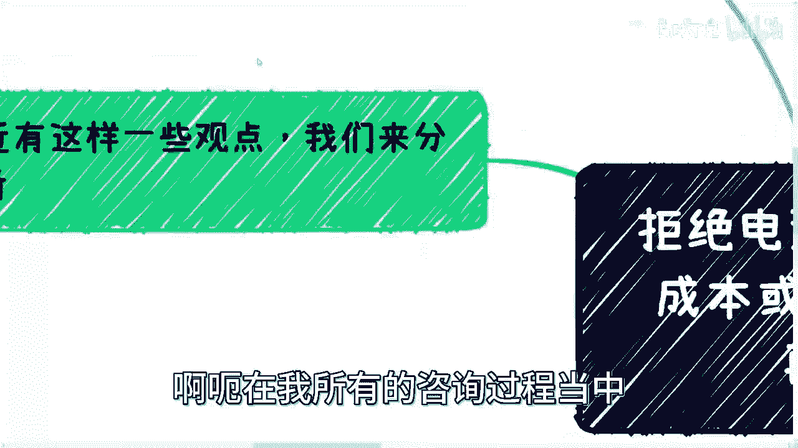
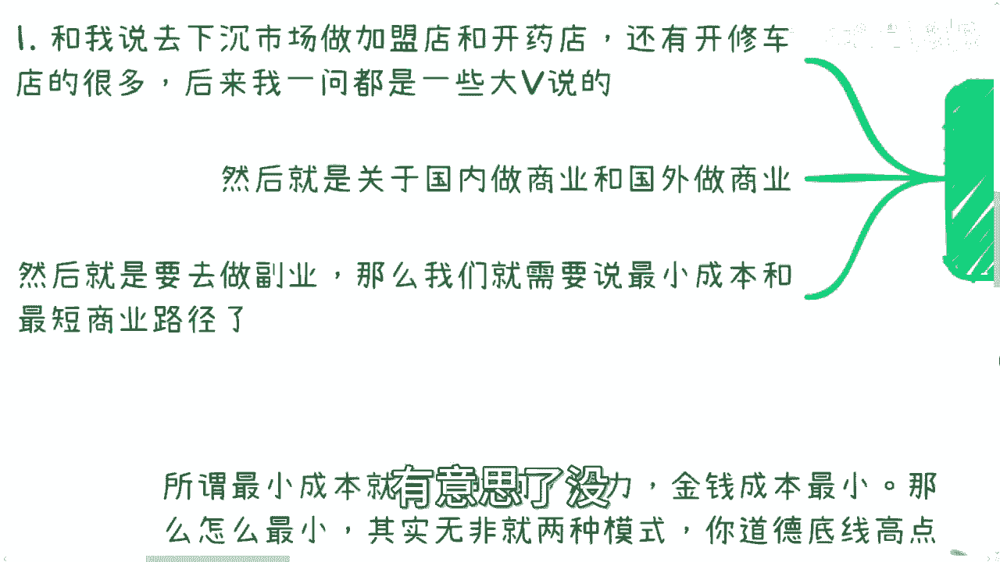
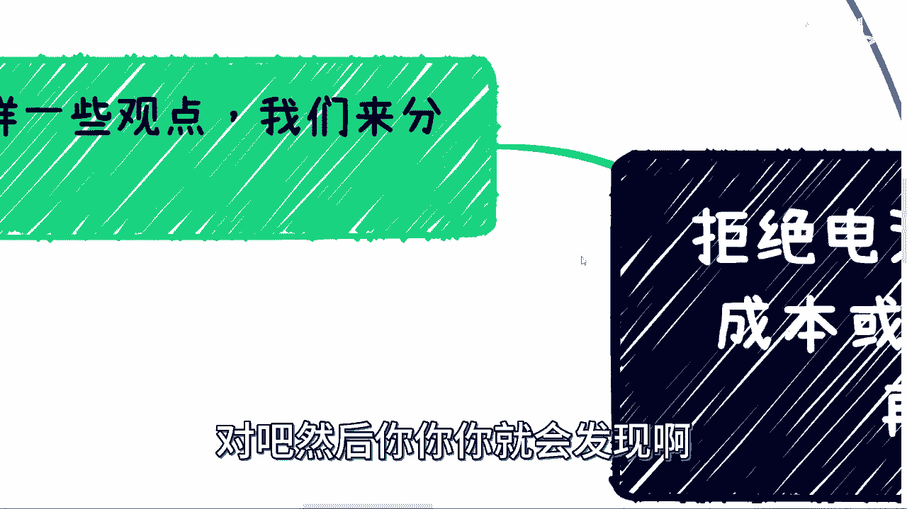
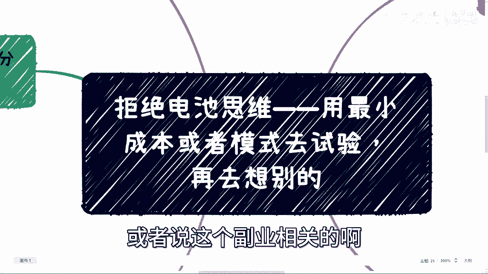

# 用最小成本或者模式去试验，再去做进一步的准备和学习 - P1 - 赏味不足 - BV1o94y1i79Y

好啊大家好啊，呃这个双休日没有更新是吧哈哈呃，最近其实聊下来呢问题比较多哦，所以呢我这边总结了一下，就是叫什么呢，叫做啊以最小的成本啊或者模式去做试验，然后做完了再去想别的，就我发现大部分小伙伴啊。

就是在做这个事情的时候呢，他是倒过来的啊，当然这个跟我们的教育肯定有关系，就是说他是先把所有的东西准备好啊，比如说我要去做一件事情，他把所有的东西准备好，然后呢把所有要学的东西学好，然后再去做。

那这个沉没成本太高，好试错成本也太高，那包括今天就是这个微博上我也看到有人说嘛，就说这个普通人，这个是嗯相对来讲没有这么多的试错成本对吧，没有这么多的试错的机会啊，但其实我后来想了一下。

不是没有这么多的这个试错机会，是可能大部分人不知道怎么试错，或者说被忽悠的呢，就可能一下子试错成本很高啊，嗯在我所有的咨询过程当中。

我发现就是有很多人跟我提过是什么呢，就说到下沉市场做加盟店啊，包括开药店，还有开维修店的啊，开修车店的很多很多，后来我一问呢，反正都是出自于一些大V啊，一些大V我就不点名了，反正懂得都懂是吧啊。

然后呢是关于这个国内啊，做商业和国外做商业啊，然后呢就是说要去做副业，或者做一些其他的这个尝试啊，我们就是要说要最小成本和最短时间路径，那这个东西呢，包括就是今天，其实还有小伙伴在B站私信我的时候。

我也就是看到有这么个问题，就是说大家想做一些事情啊，没问题，然后呢就是啊我在这个地方准备这个，我在那个地方准备那个啊，然后呢我要学习这个学习，那个就是其实在我看来，就是说呃你就把它想象成什么。

想象成就是你今天啊要这个从啊，比如说啊这个前面有个悬崖对吧，你说好这个我要从这里啊到悬崖那个地方啊，那么这个时候呢我们就说啊，你可能有很多这个零件啊，或者很多道具，你可以用对吧，那么你去搭这个道具。

你说搭座桥出来对吧，那么你是不是首先得要先目测，或者先能够确定你手上的这些材料，能搭出一个桥吧，啊，同时就说这个桥的长度，是能够大于这个悬崖的长度吧对吧，你说不是说我今天哦什么都没有啊，什么都没有。

然后呢我就在那边想说啊，我也不确定对吧，搭出来这些东西，这个能不能人人能不能走过去对吧，我也不确定我搭出来这个东西，长度是不是大于这个悬崖啊，我现在就开始搭，那这个有意味了没有意义啊。

你回头对吧，花了三天三夜大碗，你发现你走不过去对吧，然后你你你就会发现哦。

我可能要饿死了对吧，或者怎么样子的，这个就做事情逻辑不是这样子的啊。

那么我们一个个来说，首先你说先去说这个下沉市场。

做加盟店和开药店，还有这个修车的这个事情啊，首先啊先说这个事儿，这事儿呢我大概问了一下，基本上呢大家都是没有现成的资源和关系的，也就是说啊没有什么非常硬的啊，这个东西在这个地方。

就是大家相当于是听了一个建议，然后发现哦这个你有我，我可能有部分闲钱啊，然后也就几10万啊，也可以做，但是你要说从普通人角度来讲，你说这个钱真的闲吗，其实在我看来也不闲对吧，也就是说你可能有一部分积蓄。

但是这个积蓄也就是真的就是积蓄，就是说如果今天碰到了一些问题对吧，你要应应急的，那你这个积蓄可能也就没有了对吧，所以说呢这个逻辑我的看法就是说，首先啊你要金钱投入对吧，那么你要去想产出的是什么。

对你不能产出是问号吧对吧，然后隐形的付出有什么对吧，因为很多东西你就拿开店这个东西来讲，也许你今天得到的消息是投入20万，但是你投入的东西真的只有20万吗，那肯定也不止啊对吧，那么大家呃怪啊。

还有另外一点，就是你说一直都说要到下沉市场去做啊，那你了不了解下沉市场呢对吧，就是说你感觉对吧，就是啊这个叫隐形的付出支出是什么，你也不知道产出，也不知道是什么下沉市场，你也不了解对吧。

然后包括开实体店对吧，你要准备些什么，你也不了解对吧，那么也就是说你啥也不了解的人，你就要投了啊，那么我跟你讲，这不是大冤种是啥对吧，而且另外一方面是你再往下想想看啊，去开店对吧，本质上是什么。

你去开一个店，无论是加盟店还是什么东西，本质上都是商业逻辑的一个整理，是人际的一个交往，是金钱的一个付出对吧，就是这几个你是逃不掉的，你别以为就是说加盟店啊，我就是这个钱一副，我就什么都不管了。

那怎么可能呢，对不对，你还要你，你可能就是嗯比如说有些人做加盟店，有些人不做嘛，那你可能还得要去陌陌生的城市，对一些新的东西要有了解，那么我们就说啊，既然都是从零开始对吧。

就是我们也没有什么很大的资源对吧，很什么样的积累对吧，既然都是从零开始，而且我们也必须要去面对的是，就是说啊商业逻辑整理啊，人际的交往啊，金钱的付出啊对吧，那既然我们有这个能力，或者需要有这么一个付出。

那你做啥不能做呢对吧，你今天做一件事情，一定是就是我跟你们这么说，在中国我是主张高举高打的，就是你要真的修车，那也可以啊对吧，那电动车这么多企业缺售后，你要去对这些，这些你可以去对接这些企业的销售。

然后对接一些做售后的散户或者职业学校对吧，你这金钱上也没有什么投入啊，最多就是一些车费对吧，或者一些应酬的费用没有了呀，对不对，而且关键是什么，你要先去试，你比如说问问看，你直接去问你哎。

你们是不是缺售后啊对吧，售后需要怎么样的人啊对吧，人需要什么样的技能啊，你把它列下来，你把它记下来，对不对，然后呢你再跑到你再去找一些散户，或者找一些啊，或者找一些这个职业学校，你也去问啊。

你说哎我可能现在这个有这些资源对吧，学校要不要啊对吧，要的话我帮你们对接啊对吧，那既能帮你们这个产生一些呃，实习的这个这个作用，又能够帮你们解决一部分就业问题，对不对。

那你金钱上远远没有这么多的金钱的投入啊，对吧，而且你也可以去试试看这个市场，了解了解到底靠不靠谱对吧，而且最终你还可以高举高打，说自己是做新能源的啊，而且你还能跟别人说，你说哎你是那个呃。

跟一些高校或者跟一些职业学校合作的，你何乐而不为呢对吧，也就是说本质上不是说你今天付了一笔钱，你就托管了对吧，你其实有很多都是付出的，那你与其这样做，你不如高举高打对吧，那当然咱也不是说这些不能做对吧。

就是比如说你前十代多啊，拿个10%，比如说你有个300万，你拿个30万出来配置一下，可以的呀，没问题呀对吧，但是问题是你就算如此，我也不建议你在当下这种经济情况下去做对吧，就是你要知道是这样子的。

很多事情不是说不好哦，很多事情不是说不能做，只不过对吧，就是那句话怎么说来着对吧，这个大人啊，时代已经变对吧，其实是这么个逻辑啊，就是就是你要这么就还是回到刚刚那句话，就是我们做事情嘛。

我们一定要从金字塔上层往下想，你不要从下层往上往上想对吧，你下层啊，你上层往下去想呢，你做很多东西，就是你相当于是搭完对吧，高举高打之后，你可以往下去辐射哦，你可以往下去招生，你可以往下去做生意。

但是你从下往上打多难啊，啊你们想想看对吧，啊然后这个是一方面啊，然后呢就是说之前说这个出国的问题啊，国内国外其实呢这个事儿啊，你说国内的一线市场跟下沉市场是一个道理，你知道吗，因为首先你就这么想。

你说我要去国外做东西对吧，很多人说我要去国外读个研，读完研之后，我留下来可能做点生意或者做点什么东西啊，但是你们就想想看一个逻辑嘛，就是说所有的这个人类啊，你去做商业逻辑的时候。

商业本身的逻辑其实是互通的，只不过有些地方可能由于国情啊，由于各个东西它的一些细节上面是不一样的，对吧，但是从商业合作角度或者从商业逻辑角度，它其实是本质上是不变的对吧，那么你想想看啊。

你在国内语言是通的，国情是了解国情是了解的呃，你去找合作方也很好找对吧，但大家天时地利人和，就相比国外啊，你是天时地利人和吧对吧，那在天时地利人和的情况下面，你商业跑不通对吧。

呃海你你如果商业国内跑不通，你海外就更跑不动了对吧，没有说你国内跑不通，海外跑不通，这很难很难的，几乎是没有的啊，只有说你国内跑通了，海外还还有可能去复制粘贴，你知道吗，当然啊。

当然啊这个逻辑是什么意思呢，是说你先在国内去跑啊，然后你国内国外认知都一样，都是零哦，那么你去跑，而不是说今天你拿过来跟我说，哎吕老师，你说的这个逻辑不对对吧，海外的确有很多商业跑得通的。

但国内是跑不通的对但是你要看背景的呀对吧，我们先说大前提，大前提就是你大部分人啊国内经验也是零，国外经验也是零对吧，然后就想着说好，我国内都还没跑通呢，我就想着国外做生意的，那你做个啥呀对吧。

然后国内一线城市刚下沉市场，其实也是一个道理，什么意思呢，就是说你在越靠近一线的城市去商业尝试，商业逻辑，创业模式，你都能走通，那么往下其实就很容易走通，或者很容易复制复制粘贴啊，那么反过来说啊。

一样的道理，用户画像越下沉的商业模式，或者说你在下沉市场的那个摸索过，那能走通的商业，能走通的商业模式，那么你越往上的这么一些，越靠近一线城市就反而更难走通，这个其实一个道理你知道吗。

因为每个地方的确啊，就是说国家与国家之间，城市与城市之间啊，他的很多东西是不一样的，你们真的去往上走，往下做过就知道了，所以说呢在这个地方就是说还得还得说一点，是什么呢，就是我们刚刚说开店开店，对不对。

或者来说之前还有咨询人跟我说，他想去开烧烤店，我说开烧烤店这个逻辑是这样子的，你要开任何别的东西啊，尽量也别去开餐饮，因为开餐饮你包括消防通道啊对吧，包括各种地方打点啊，食品管理啊对吧等等等。

你要消耗的人力成本跟资源成本是很高的啊，而且另外一方面是什么呢，就是你要知道啊，在中国这个地方啊，月下沉的市场，他其实当地的垄断是越明显的啊，只不过就说你哎就我我我这么跟你们讲。

我最近我最近发现很多人是不接地气，哎我这我我回头最好讲一期，这个真的很多人不接地气啊，这个我回头再来讲啊，但是不管怎么样吧，就是说啊越下沉呢，其实越不好切啊，其实越不好切，那么在这个地方呢。

第四点就是要说的是，要用最小成本跟最短路径啊，所谓最小成本就是说你时间精力，金钱成本是最小的，那么怎么个最小法呢，其实无非就两种模式，你道德底线高一点的，那你就找人来合作，你道德底线低一点的。

那你就直接照抄对了，无非就这两个没来啊，一个叫借力打力，另外一个也叫借力打力啊，只不过一个是这个真的是正儿八经合作对吧，一个就是这不管别人对我这么拿来再说啊，那么举个例子，比如说你要做短视频啊。

哎呀我我要先记一下，以免我忘记了，对这个，哎呀写错了，我我先记一下啊，这个叫什么，我真的我发现大部分人真的不接地气，你哎那我跟你们讲，还真别说那些专家不接地气，我觉得大部分人也不接地气啊。

那个那你比如说做短视频啊，你选好方向之后呢，你就做个视频啊，你别花大量时间在什么构思啊，啊还要去想怎么做啊对吧，想什么东西你别想啊，就是你说我今天就想做个餐饮，你就做啊，你比如说你想做个什么什么。

我我我我觉得有个什么方向，这个方向很好的，那你就做对吧，你可以找别人现有的类似的这种方向的视频，你来合作，也可以照抄别人的视频思路对吧，你去做，你去尝试，就说你先做，比如说一个礼拜对吧。

然后看看流量积累啊，看看流量增长啊，看看用户反馈啊，看看评论，你再去看看这方向，对不对啊对吧，你说很多人做这个东西，好好先花那么一两个月在构思上面，你是不是吃饱了吃饱了撑的呢对吧。

你连市场怎么样都不知道，你就在那边试，你就在那边，已经已经已经积累了非常强的沉没成本，这个很何必呢，对不对，你包括前两天小伙伴跟我说，提出要出去做服务对吧，这个卖东西给高校啊。

那你最小成本就是说你到网络上去找些课啊，要找些免费的，收费的都可以的啊，整理一个大纲，再加一个有上限文的解决方案，就是一个PDF啊，对不对，或者你就去找当地的教育机构对吧，你问他们要东西。

你说我可以帮你们做代理对吧，然后你去学校谈，你就是你就看看大家的反馈嘛对吧，相当于说你先去试试看这路能不能走得通，走得通啊，你再去想接下来你自己怎么去积累你的资源，你自己怎么去积累，你手上的也有。

有这个能不能能不能交付的方案对吧，不要什么一开始说啊，你啊吕老师说了，要有个课对吧好，我现在认为找老师啊，这个老师找半天啊，然后让老师录课，然后让老师录课，我就得付钱吧，付个什么什么20万。

你是不是有大病是吧啊，那么还有呢就是我们关于说这个这个最短路径，最短路径呢其实也是借力打力，就是说去寻求最快的验证方式，要去呃去寻求最短的以及最快的验证方式，比如说啊你说做自媒体啊，做服务啊，做品牌啊。

做某个方向对吧，那你就先去验证市场，你就比如说就像我们刚刚说的，比如说你要以你今天要去做一件事情，对不对，这事儿你先别做啊，你先把你做的这个东西里面的产品啊，想法啊对吧，一些宏观的大框架的东西。

你先想好啊，不管是to c to b to g就是给散户还是给个呃，给给个人还是给政府还是给企业，无所谓啊，你想好之后呢，你立马去找一些企业和，比如说C端的这种社群对吧，这种和这种负责人合作。

你会发现找企业找怎么怎么找呢对吧，我发现很多人也不知道怎么找啊，这企业太好找了，所有的企业都有对外的商务和销售，你就去找商务和销售谈了对吧，其实你会发现这个地方啊，我们说说是说合作啊。

但是你你与其说合作，不然啊，不如其实叫做什么叫做谈谈合作，因为你和这个企业的销售跟商务，以及这个C端的，比如说这个社群的负责人对吧，你跟他们谈的过程当中，就是在验证你这个想法，靠不靠谱的一个过程对吧。

但凡你这想法不靠谱，别人也不会来跟你合作对吧，那么你比如说来去审视你这个东西对吧，你去来看全网靠不靠谱，当然啊你验证的时候，你也别找一个，因为这当中也可能有心心存的幸存者偏差嘛，对吧，你就多找一些。

你别找那么一两个，你起码找那么三四个四五个对吧，多试试看，那么这样的话，就是说你至少不会在一个事情上面，浪费太多的时间啊，然后就说呃在你还没有确定这个想法靠不靠谱，因为很多人做一个事情是这样子的。

他说我觉得靠谱，那你觉得靠谱没有用啊，你得市场觉得靠谱啊对吧，啊那么所以说呢我们总结来讲啊。

总结来讲是什么呢，就是说很多东西啊，你就是先做，而不是先学，先去学习对吧，因为我做很多东西，每个人做一个方向，他我相信大部分人做某个方向的时候，他一开始总归心里会犯嘀咕对吧，就觉得哎呀我好像不太懂啊。

我好像对这个行业也不了解对吧，我好像对这个东西也不知道对吧，你不用知道，你知道吗，就是你就先做，就是准备是要准备的，但是你这个准备只不过是为了跑通逻辑，是去做准备，你知道吗，那我再给你们举个例子。

这就好像什么，比如说我今天啊我随便说啊，我说这个啊音乐学院啊，门口教钢琴啊，很赚钱对吧，那有很多人肯定要反驳我，哎刘老师，你怎么知道的呢，你怎么觉得这是对的呢，哦哦我也不知道这是对的啊，对不对。

那怎么办呢，那很简单啊，我先跑到音乐学院旁边，我先跑到那些学校旁边，对不对，找个找个那个这个这个叫什么开小店的啊，然后呢我就跟他们讲，我说哎我想跟你们合作啊，你们这个地方我架个钢琴对吧。

或者架架个什么价格价格，什么钢琴的那个宣传啊，然后我收费打个比方，一个人1000块钱啊，然后交一个小时啊，有人来报名，我跟你们就是我相当于借用你们这边场地嘛，对吧，有人有人来报名了，我给你们五五开。

对不对，那我有什么损失了，我又没损失了，那钢琴哪里来，那钢琴我就记下来，或者来说别的东西对吧，不一定钢琴钢琴有点贵对吧，你可以是别的东西对吧，怎么样，那你就看嘛，有没有你你从每天的这个这个学校的。

比如说比如说这个呃，开就是上学下学呃，上上学放学的这些人流量，以及到你这边咨询的量，就是所谓的转换量对吧，转换率以及到你这边付钱的人对吧，你去试嘛，你花一个礼拜去试，你就知道这个逻辑到底怎么样子了。

然后你也别在一个学校是对吧，多找几个学校不同的学校对吧，理工科的，文科的音乐学院，艺术学院，你都去试一下嘛，对不对，你的想法就知道就知道结果了，而不是说什么，就是说啊我今天想了对吧，好，我又得去租房子。

又得装修，我又得自己去买点什么材料，这他妈投入得多少钱啊，更何况你投入这个东西，你还不知道这个逻辑能不能走得通。

对吧，我知道大家怎么想的，因为大众所从小接受到的教育，就是说哎呀我做一件事情就要有万全的准备，我做一件事情就要去理解他，我做一件事要教我懂，那还是那句话嘛，等你们做完完全准备，等你们懂了。

市场早就不知道去哪了对吧，钱早就被那些不应该，或者说比你们会玩的人赚掉了，而不是真正你们就是大家懂得，这些人赚掉的对吧，因为你们就大家一定要明白啊，就是说无论哪个行业，他市场的钱就那么多，你知道吗。

就所谓什么叫混蛋糕啊，就分掉一块就是一块啊，它它它不会再生了，你知道吗，没有了对吧，你就好像今天，你这个就像就像我们刚刚那个idea来讲，你就拿这个idea来讲对吧，你做好准备了。

可能这个方法真的可行啊，真的可行，但是你到时候去做了，唉就没人来报名了，为什么，是因为那些学生都已经被割了三次茶了，人家已经不想被割了，人家觉得这是个骗局，对不对，人家觉得不值得，对不了。

但是到你这边呢，你是可能做的很好的，你做了万全的准备，你是真的为学生着想了，但是最终呢你没赚到钱啊，然后你还会觉得哎呀，是不是我想法有问题，是不是商业模式有问题，很多时候没有问题，只不过因为你太慢了啊。

好吧哎呀行吧，那就这么着吧好吧，那个就这么着吧，大家反正有什么职业规划和职业规划相关的，或者说这个副业相关的啊。

或者未来发展方向相关的，反正整理好问题，你们可以私信啊。