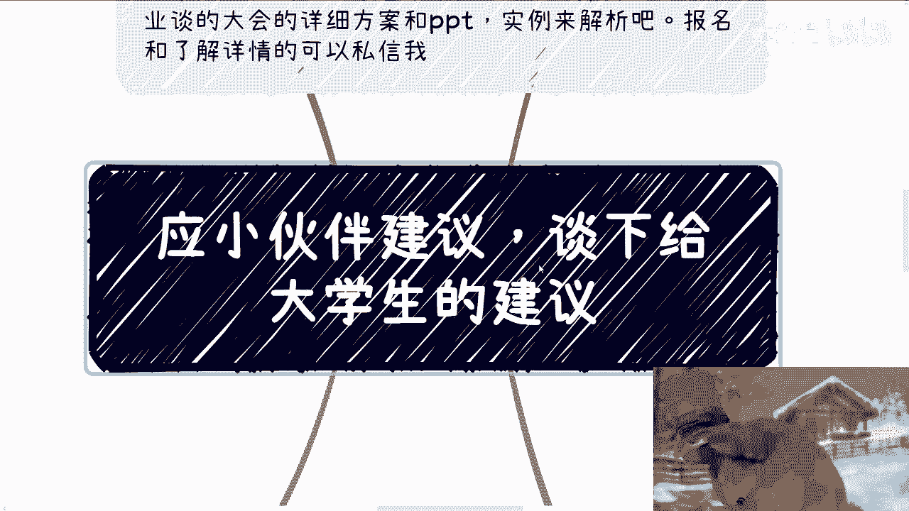
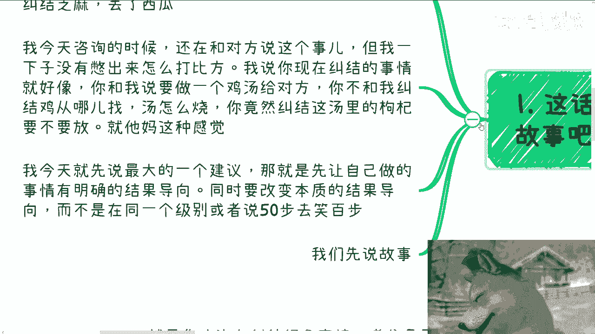
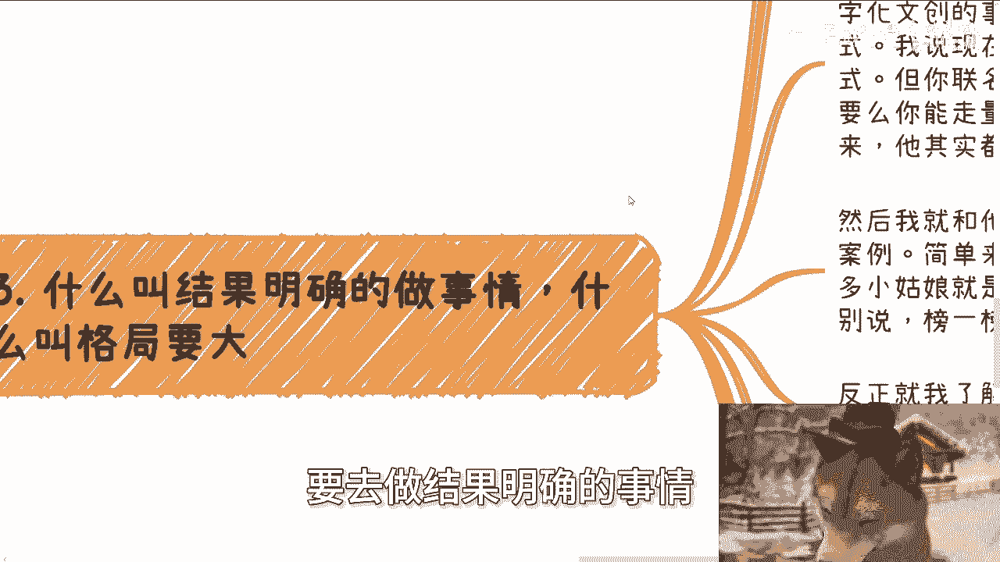
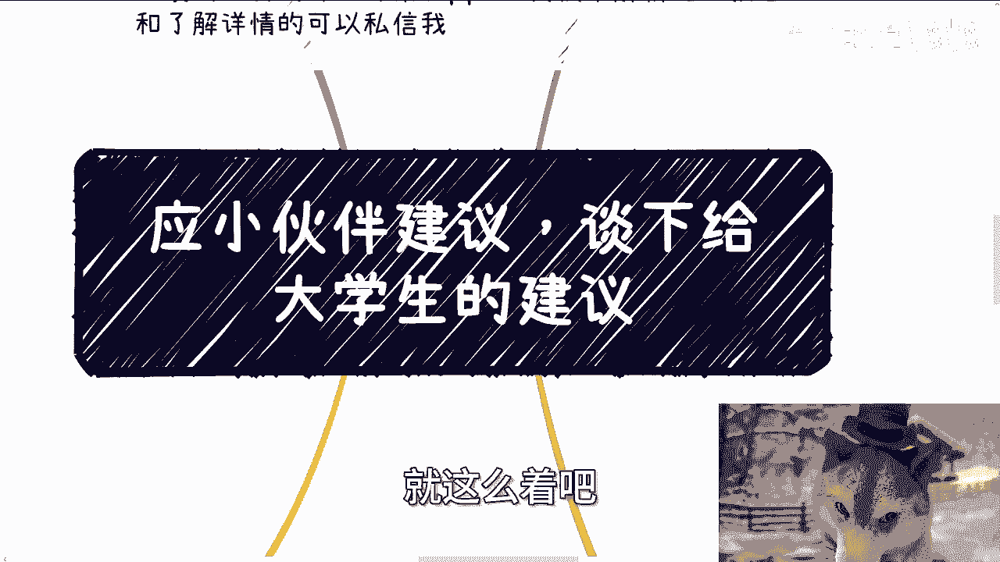
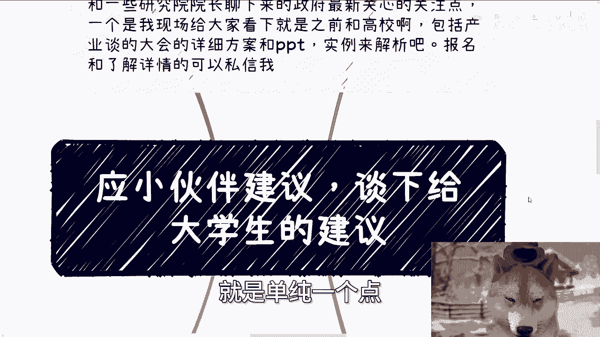
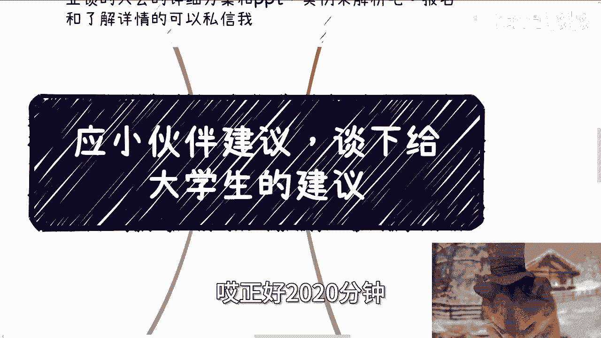

# 目标明确是第一步-我说的是真正的目标-不是pua出来的---P1---赏味不足---BV1M94Ue

在本节课中，我们将探讨一个对大学生乃至所有初入社会者都至关重要的核心议题：如何确立真正明确的目标。我们将通过具体的故事和分析，帮助你区分无效的内耗与能够改变本质的行动。

---

## 概述

许多人常常陷入纠结与内耗，但仔细分析会发现，他们纠结的往往是“芝麻”小事，却忽略了“西瓜”般的核心目标。本节课的核心观点是：**做任何事都必须有明确的结果导向，且这个结果必须能改变本质，而非在同一水平线上无效折腾**。

上一节我们提到了普遍存在的思维误区，本节中我们来看看如何通过具体案例理解并应用这一原则。

---

## 两个故事带来的启示

以下是两个真实的故事，它们清晰地展示了什么是“纠结于芝麻”以及什么是“追求改变本质的结果”。

### 故事一：纠结于宏观焦虑与微观薪资

一位咨询者向我表达了对人工智能影响就业、国家政策等宏观问题的焦虑，并担心这些会影响其薪资，可能造成上下1000元的波动。

**我的分析如下：**
1.  宏观趋势（如AI发展、政策案件）若与个人没有**直接、具体**的关联，则无需过度焦虑。这好比担心月球上的洞会影响地球气候，但尚未到毁灭性程度。
2.  纠结于1000元或即使上万元级别的薪资波动，属于“在同一水平线内折腾”。这无法改变个人生活的本质状况（如应对房价、物价）。
3.  核心矛盾在于个人收入阶层与社会成本的巨大差距。纠结于细微的薪资波动，就像在思考“鸡汤里的枸杞要不要放”，但现实中连鸡和汤都没有。这无法解决根本问题。

**核心公式：**
> **无效努力 = 纠结于非核心的微观变量**
> **有效努力 = 直指核心矛盾的本质改变**

### 故事二：商业逻辑与格局大小

一位31岁创业五年的朋友，从事数字文创联名业务，但模式是面向散户（to C），且客单价和销量均不高。我向他指出，一些在抖音做心灵鸡汤直播、解决大众焦虑刚需的博主，其商业闭环反而更清晰、盈利更强。

他的反应是觉得这种模式“很low”。

**我的分析如下：**
1.  **结果导向不明确**：他的业务既无法走量，客单价也不高，解决的也不是刚需，因此赚钱这个结果很难实现。
2.  **未改变本质**：即使他继续在当前模式折腾，也无法从“赚钱辛苦”的层面跃升到“财富积累”的层面。年薪200万以下的打工，本质上都是“辛苦钱”，而非利用资源杠杆获得的“财富”。
3.  **格局决定上限**：看不起能跑通商业闭环的模式（无论其形式），是一种局限于自我认知的“思想钢印”。这会导致错过积累原始资本的机会，而资本是未来捕捉风口、提升阶层的核心资源。

---

## 如何确立真正明确的目标

通过以上故事，我们可以总结出确立有效目标的核心要点。

以下是判断行动是否有效的三个关键维度：

1.  **积累核心资源**：你的行动是在积累**钱**、**权**还是**高价值圈子/关系**？这三者是改变个人处境的核心资源。应追求`资源A && 资源B && 资源C`（三者兼得）或至少聚焦其一。
2.  **实现阶层跨越**：你的目标是否致力于“在尽可能小的年龄，赚到别人年龄大时才能赚到的钱”？这要求打破“时间换金钱”的打工思维，寻找杠杆。
3.  **结果可衡量且本质**：你追求的结果是签下一份合同、获得一次能撬动后续资源的名声，还是仅仅得到一个“在大厂/国央企工作”的虚名？前者是**资产**，后者可能是**负债**（消耗你却不产生实质积累）。

上一节我们分析了错误的目标，本节中我们来看看什么才是应该追求的正确方向。

---

## 给大学生的具体建议

面对考公、考研、求职、出国等选择，请用以下框架进行审视：

*   **警惕“水平线内折腾”**：如果不同的选择路径，在10年后带来的结果本质相同（例如，都是普通职员、都是学术圈底层），那么选A或选B区别不大。这属于“战术上的勤奋，战略上的懒惰”。
*   **目标必须极端明确**：如果你选择学术，就要彻底了解学术圈的规则并决心遵守或利用它，不能中途抱怨“黑暗”而想退出。既要清高名声，又要丰厚利益，往往两者皆空。
*   **关注资源流向**：真正有发展的人，关注的是“资源和人如何利用”。不要陷入“有XX就有用，没XX就无用”的二极管思维。博士、院士头衔本身不直接等同于财富和美满生活，如何运用头衔背后的知识和资源才是关键。

---

## 总结

本节课我们一起学习了如何确立真正明确的目标。
1.  我们必须分清“纠结于枸杞”的微观内耗和“解决鸡和汤”的本质问题。
2.  有效的目标应以积累**钱、权、高价值圈子**为核心，追求**可衡量的、能改变自身阶层**的结果。
3.  在选择人生路径时，要警惕“在同一水平线内无效折腾”，并使目标清晰到可以指导每一步行动。

记住，**格局的大小决定了你目标的高度，而目标的清晰度决定了你行动的效率**。停止在芝麻小事上的内耗，开始思考如何为自己搬来真正的西瓜。

---

**下期活动预告**：9月21日（周六）下午1-6点，在杭州有线下分享活动，将涉及产学研方案、行业最新动态等实务内容。如需报名或了解详情，可私信咨询。

**个人咨询**：若在职业规划、商业合作、副业发展、合同融资等方面有具体问题，请整理好个人背景与详细问题后进行咨询。