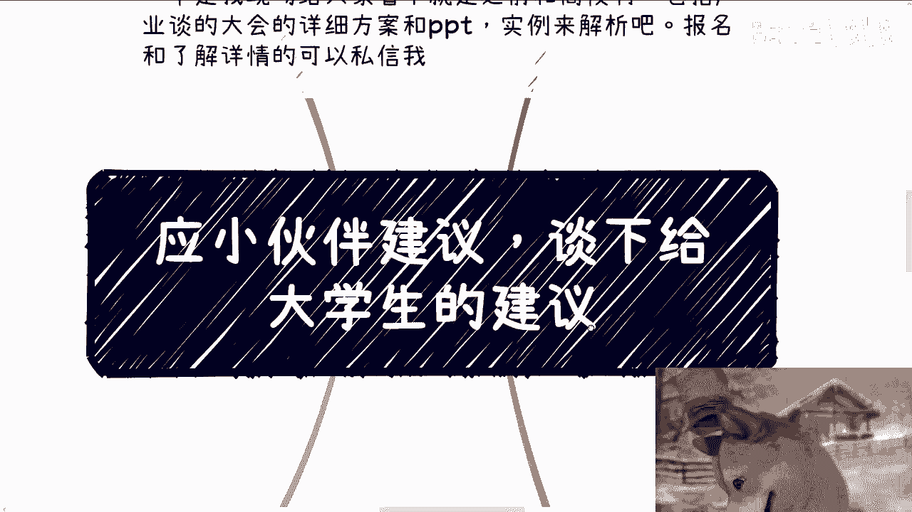
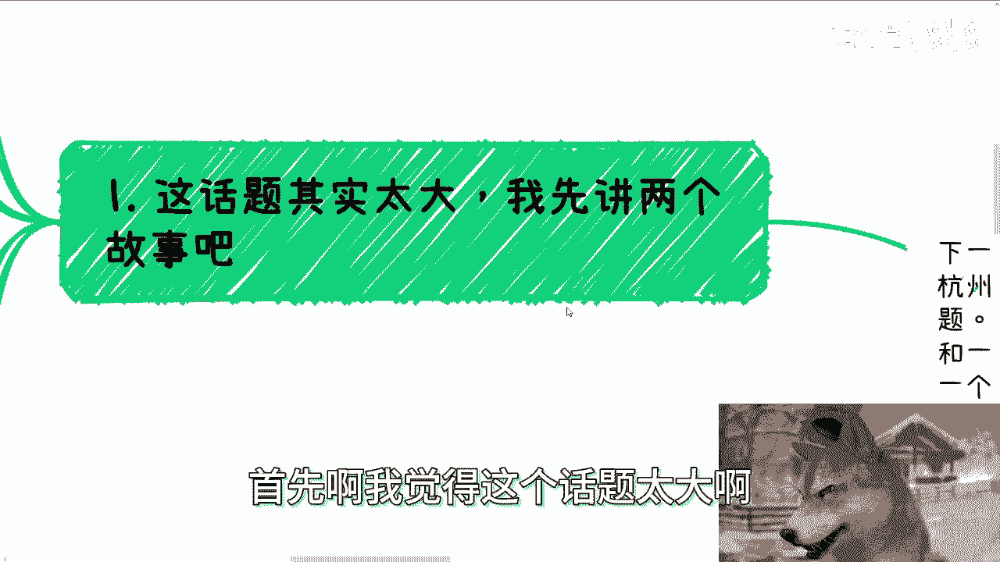
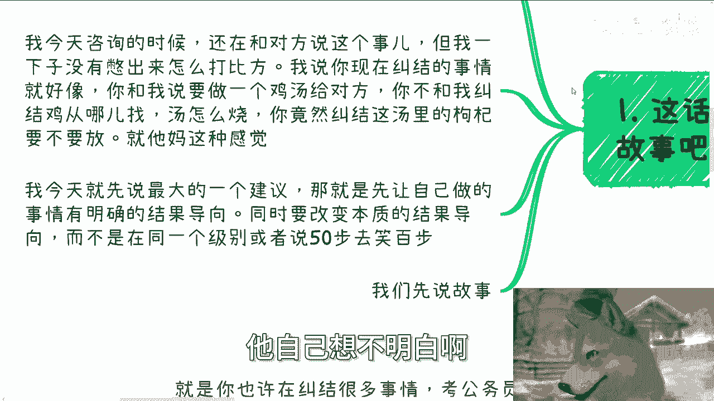
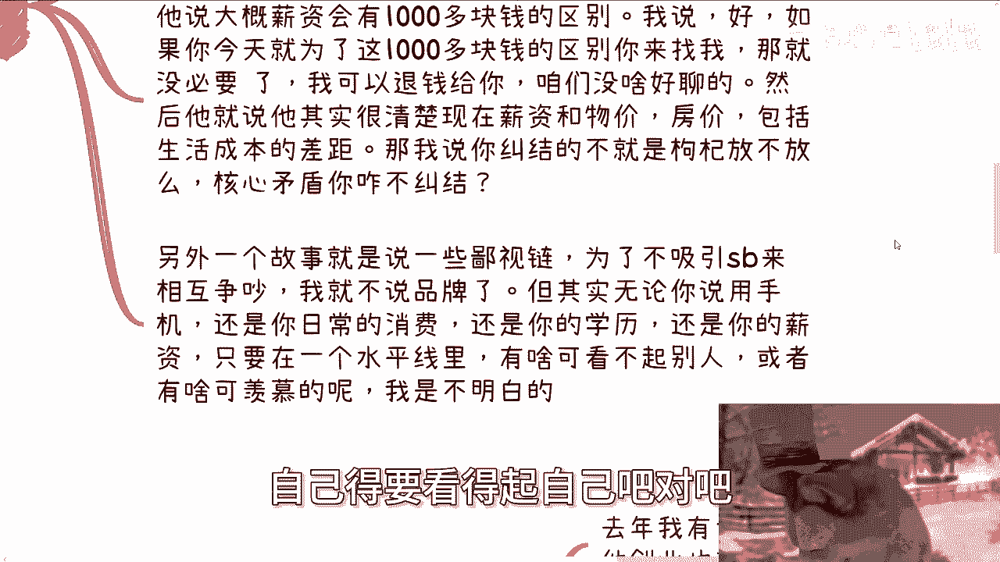
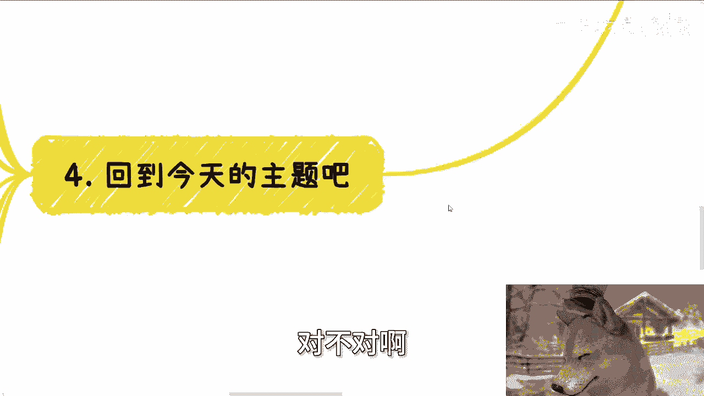
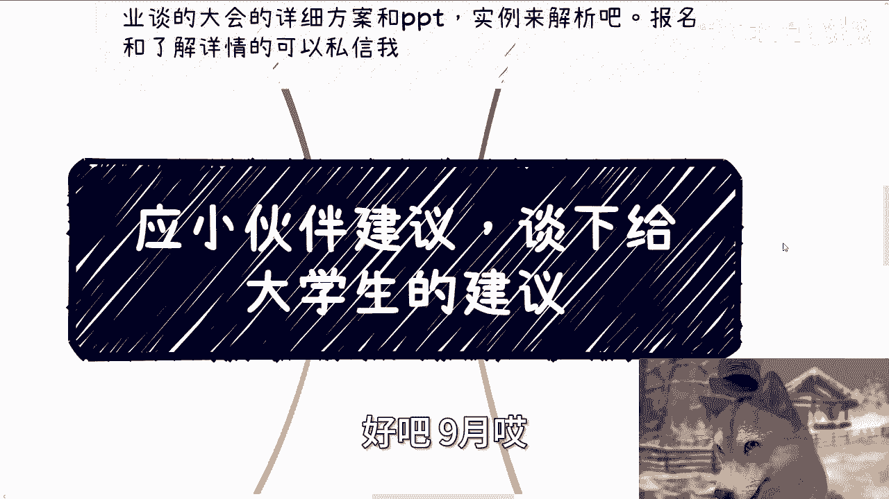

# 目标明确是第一步，我说的是真正的目标，不是pua出来的 - P1 - 赏味不足 - BV1M94UeLEVX

好大家好啊，这个节日快乐对吧，呃上海明天就要台风了。

我不是我，我明天还打算出去啊，看看明天到底什么情况。

呃，应大家的这个建议啊，就是说让我谈一下大学生建议是吧，呃有一说一啊，这个这个视频本身它肯定不能涵盖很多的东西，对吧，我打算可能每个视频就讲一点点啊，这个因为没办法，你讲不透啊是吧，然后我看了一下。

我上一期做给大学生建议是2023年，就去年5月份，哎呀想想时间过得也蛮快的嘛。

一年半过去啊，呃首先我先说一下，下期活动已经定了好吧，下周69月21号啊，在诶下周六对，9月是9月21号，在呃1~6点在杭州啊，在杭州，那么本期呢开始呢我也定了几个新的主题。

一个是我会私下跟大家分享一下，就是说我这次上海大会时候，跟一些研究院的院长啊，或者跟我其他的一些小伙伴啊，聊下来最新的一些关注点呃，另外一个呢就是说我现场会给大家看一下，就之前我跟高校啊。

或者跟这个产业园聊的一些方案啊，有这个产业产学研的方案，还有那个活动的方案好吧，然后呃实例就是我我到时候就PPT，直接给你们看嘛，一边看一边来解析一下嘛对吧，那么报名跟了解详情的可以继续私信我啊。

首先啊我觉得这个话题太大啊。

我先讲两个故事啊，呃因为你从你要说大学生角度来讲对吧，其实基本上我很清楚，就这个事情呢，你说是说大学生，但其实跟大学生关系不大，就我以前就说过，就所有跟呃这个社会只要没接过轨的，你现在是个大学生。

或者你工作十多年，其实没什么区别的，一点区别都没有的，你知道吗，就如果啊，我们就说今天有一个工作了十几年的人找我，跟一个大学生找我，这两个人的认知是一样的，但无非就是只不过就是说那个大学生更傻白。

甜一点对吧，然后这个另外那个那个工作十几年的人呢，已经就是说清楚了，可能有一部分啊，这个世界的恶和这个社会的恶是什么样子的，仅此而已啊，但是你要说两者的认知跟两者的一些思维方式，我觉得是大差不差的啊。

那么嗯大家的这种思维钢印呢，会让大家只关心做什么，不关心结果啊，然后这就是说各种来纠在那边纠结内耗，但是纠结内耗的呢都是芝麻啊，然后就说丢了西瓜啊哈我写错了啊，丢了西瓜对吧，那么今天你比如说咨询的时候。

我还在跟对方说这个事，我我一下子呢就没憋出来，怎么打这个比方啊，我说啧，我说你现在纠结的事啊，更像什么，更像就是啊你跟我说，比如说你你跟我说要做个鸡汤给对。

给对方对吧，呃我你不跟我纠结鸡从哪来，你不跟我纠结汤怎么烧，你在那边就是当下连鸡跟汤都没有的情况，下面跟我在纠结汤里面的枸杞要不要放，就他妈这种感觉有什么好纠结的呢，对不对，就是我说了无数遍。

就是大家纠结的东西跟他的目标完全没有关系，但这个事情我不说对吧，我不跟他就是说就是就像剥洋葱一样的，你不跟它一层一层往下剥，他自己想不明白哦。

我今天呢就先说最大的一个建议，就是你们要先让自己做的事情，有明确的结果导向，同时要改这个结果，必须是要改变本质的结果导向，而不是说在同一个级别里面在那边折腾，或者说就50步笑百步的那种方式。

那当然说到这，你们可能肯定肯定不理解嘛对吧，那我们继续往后说啊，两个故事啊，第一个呢，就比如说这两天聊的小伙伴和我说工作啊，然后他们就说啊，人工智能发展到现在啊，可能会对自己的工作呢有所影响啊。

然后说什么国家呢貌似会有些政策上的打压啊，然后由于这些打压呢也已经有了呃，就出现了一些案件啊，或者相关的啊，那大概给了我个数量，说全国到现在可能有80万个案件对吧，相关的啊，听到这种话，我他妈就来气。

对不对，这就是你这话说出来，你真的就是我一直说，你你们啊可能自己觉得你们很接地气，你知道吗，但是你们这说出来的话，对我来讲，我我一直很一直跟对方说的是什么，我说你们他妈接点地气，什么意思。

你不要老是跟我说空话对吧，我就问我说，那你说人工智能发展对你有什么影响，你到底说啊，你直接告诉我有什么影响，你别就来跟我说一个宏观的说，对你有什对，对你有影响有什么用呢，对不对，你不能在那边看短视频。

看各种东西，听风就是雨啊对吧，就算咱就退1万步来讲，他妈的现在月球上面下雨跟你吊关系啊，诶奇了怪了对吧，那另外你说国家案件，哎我操我就这么说，你也就是80万件呀，80万件对不对，你哪天要是8000万件。

8亿件了再说，而且更何况这案件跟你有什么关系啊对吧，对你有什么影响呢，哎呀妈呀，奇了怪了，是不是，这就好像现在比如说月球上啪出了个洞啊，你跟我说，卧槽他妈的呃，跟我很有关系，是他可能比如说叫什么。

在这个天气气候对吧，在这个黑昼夜交替是有关系的，但是他妈的还没有影响到把地球戳穿吧，没没影响到，马上他妈的毁灭了吧，对不对，就是你得想好跟你有什么关系对吧，或者来说跟你有什么直接关系，然后我就问啊。

我说那你想做出什么样的改变，以缓解或者来解决你的这个焦虑呢对吧，那么或者说我说你改变了之后，大概对你的影响是什么呢，他说大概薪资会有1000多块钱的区别，我说好啊，我说如果今天你就为了这1000多块钱。

你别说1000多块钱，你就后面加个零，你如果为了你别加个零，加两个零吧对吧，我说你就是为了这些钱的区别，你来找我，那就没必要了，我说我可以把咨询的钱退给你，我们没什么好聊的，为什么，因为很简单。

你要是就纠结在这1万块钱或者10万块钱，这种级别，那有什么好纠结的，能改变你生活吗，不能能改变我吗，不能你对我有价值吗，没有那有什么好聊的呢，对不对啊，那么然后他就说啊，他其实很清楚。

就是说现在的这个薪资对吧，跟整个整个社会的物价啊，房价啊对吧，包括生活成本的差距，那我说你纠结的不就是枸杞放不放吗，核心矛盾你咋不纠结呢，对不对，你纠结这些东西改变核心矛盾吗，不改变呀，你现在纠结。

比如说他现在我举个例子，比如说他现在22岁，那你纠结这些东西，你到32岁你还纠结这些东西啊，有什么意义吗呢对吧，然后另外一个事情我顺便提一点啊，不是另外一个故事啊，另外一件事情就是说了一些鄙视链啊。

当然为了不吸引一些相互过来炒对吧，我就不说什么品牌啊，一些名字了，妈的免得他妈到时候他妈过来吵，没什么意思啊，但其实无论啊我就这么说，无论你说手机平板还是你日常的消费，还是你的学历，还是你的薪资。

我还是那句话，只要在一个水平线里面，有啥看不起别人的呢，或者有啥可羡慕的呢，我不明白呀，对不对，就是我就告诉你们，在我看来，只要是打工，只要是牛马的，就大家都是，那我说句不恰当的比喻。

大家都是在地上乞讨的，大家都是问资本家跟政治家去提起乞讨的，干嘛还要相互看不起啊，哦这个人跪舔的好哦，那个人跪舔的钱多，哎我操哎，嘿真的我我有时候觉得钱能不能赚到不重要啊，这个是看天看大家实践啊。

有一定的运气成分，但你不能连尊严都没有吧，你自己你你你别人可以看不起你，自己得要看得起自己吧对吧。

啊第三我们来讲第二个故事啊。

什么叫做结果明确做事情，什么叫做格局要大，对吧啊，什么叫做，就是说我第一第一点里面提到的叫做结，要去做结果明确的事情。

以及叫做这个结果本身得要改变本质，什么意思啊，去年我有个31岁的朋友来上海玩啊，国庆节的时候，他创业5年的时间，但是没怎么赚钱，我晚上请他去了半岛啊，在外滩，这是上海停车费top one的地方啊。

一个小时60块钱啊，我停了两个小时，我给他点了个气泡水，我自己点了个白葡萄酒，然后一一份薯条大概300多块钱，328吧，大概啊，然后我停了两个小时车对吧，加起来差不多四百四百五十左右对吧啊，我问他。

我说你这次找我什么事情啊，然后他就说啊，他说他想跟我聊聊，就是说啊一些数字化文创的东西，因为毕竟我之我之前也做了那个数字啊，文创啊，或者博物馆的一些东西嘛，联名啊，或者说线下活动相关合作的一些方式。

我说现在经济情况不好，联名的确是个很好的方式，但是你本身没有积累你本身联名的这个逻辑，因为他跟我讲了他的逻辑嘛，我说你联名的逻辑本质上还是面向C端的，你不是面向那种，比如说什么VIP客户啊。

或者法拉利这种这种对吧，就是说它有点像b to b to c嘛，就是企业to企业to to to他的客户，但是他不一样，他的合作更多的只是说我找别人联名，然后就像卖给散户啊，那么我说你卖给散户的东西。

我我说的很清楚，卖给散户的东西，你要么走量，要么就是客单价高没了，你就两个东西啊，你们记住，只要你们以后卖给卖给散户的，要么就是量能起来，就是我我指的是你要找到合作方，能保证量能起来。

要么就是你能保证你的客户能接受，你的高客单价，就比如说别人买1000块钱，能卖1万块钱，5万块钱对吧，那么聊下来他说他其实都是跟小品牌合作，没有什么太好的进展啊，然后我就跟他讲，我说我上半年呢了解了啊。

有一些小姑娘啊，也没什么学历的，都在抖音那边做心灵鸡汤啊，我说简单来讲呢，就是因为现在大众很焦虑啊，其实很多小姑娘呢就是在抖音上做直播，直播干嘛呢，给评论区里面讲鸡汤啊，还真别说啊。

榜一打榜一榜二大哥啊，甚至榜十大哥都很给力啊，那么我说你从逻辑上来讲，这些小姑娘的商业逻辑是成立的，为什么呢，因为他们的受众是固定在那边啊，都都是有的啊，就是或多或少，然后他的单价也会很高。

同时它解决的问题是现在普罗大众，尤其是二线到五线城市，或者三线到五线城市这些人的刚需对吧，那反观你呢，我说你做的这些数字文创是刚需吗，不是你甚至收的还很低对吧，那你你也没有这个叫什么。

就是散户的这个受众，那我说你的商业闭环远远还不止这些小姑娘，商业闭环啊，当然具体多少钱我就不说了啊，这个没什么好提的，我跟他说完了，他他呢跟我表示就是他和他的合伙人啊，觉得很low啊很low。

这是他的原话啊，很low，我说兄弟啊，我呢至少现在还当你是朋友啊，一般呢我也不会把别人叫到半岛来对吧，我说我愿意多说两句，就是你做的这些事情，在我看来你赚不到钱，你明白吗。

这就跟很多人在那边做学术考学历对吧，在那边就那个那个那个叫什么，就是卷论文，卷那些有的没的在我看来都是赚不到钱的，因为你你但凡就像我刚刚说的，你但凡是365天打工的，你跟我谈什么赚钱呢。

你就算年薪200万也不叫赚钱，这他妈叫什么叫辛苦钱，对不对啊，我说你都31了，你能折腾几年，对不对，当然你要愿意，当然这句话不仅仅是我跟他说啊，我也跟你们讲，如果你愿意，你觉得你就想去赚辛苦钱。

随便你爱咋滴，跟我他妈吊关系，对不对啊，然后我就跟他说，我说当然你要是愿意随便，但是你要明白一点，你对我来讲没有价值，也没有意义对吧，我说中国每一年都会有很多风口，我随便说啊，我说3年后，5年后。

这些小姑娘可以砸钱去追这个风口，可以雇团队去追这个风口，可以投资去追这个风口，让自己可以成为让就是呃去提升，让自己在这个风口里面成为猪的概率对吧，因为我们都说风口猪都能起飞嘛对吧，我说但你呢。

我说你除了到时候再来上海跟我抱怨，或者还说你赚不到钱，纠结这些枸杞放不放的问题，你还能干嘛呢对吧，我说当然这话可能有些刺耳，但是事实不就这样子吗，我说你31了，大家也不是也不小啦对吧，我们不能活在梦里。

啊啊那么我我我我后来还跟他这么说，我说我不希望我们以后还是这样子的，一个一个一个怎么说呢，一个一个一个方式，或者一个一个相处的一个模式，因为我说朋友我不缺，而且我也我更不缺的是值得我花钱的人对吧。

但你要是这样子，下次你找我，可能我就不见你了，因为你不值得，你值得什么呢，对不对啊。

那么第四我们回到今天这个主题啊，出来啊，我说就是呢你也许今天啊在纠结很多事情，比如说考公啊，考编找工作对吧，出国读全日制，非全日制的各种各种各种啊，怎么你们可能纠结很多很多问题啊，但是呢你要分清楚。

哪些是在同一个水平线里面的折腾，哪些是不改变本质的折腾啊，这就好像很多人问我专业，问我学校，问我什么方向对吧，我一般都是就一句话，你如果都是牛马的级别，你随便怎么折腾，10年后的结果都是一样的。

有什么区别呢对吧，这就是在商业上，我们说的叫做战术上的勤奋，战略上的懒惰，现在很多人他妈的都不是战略上的懒惰啦，根本就是思想钢印，他想都不想去想啊，那么另外呢就是说做的事情呢，结果要明确。

我给你们两个结论，记住记住啊，你要积累的是钱，你要是在尽可能年龄小的时候，赚到别人年龄大的时候的钱，这叫赚钱啊，这叫赚钱，不是那种说啊，我他妈365天打个工赚钱，不是的啊，你要这种方向。

你就是永远就是牛马的级别啊，另外你要积累的是关系，是那种是那种无论你在社会上面碰到好的事情，坏的事情还是有些生老病死对吧，还是说涉及到各个机关部门的事情的时候，他能够通过关系能帮助到你。

能帮你解决问题或者缓解问题的这种事，你要去积累的，而不是那种就是能够给你提供情绪价值，或者所谓的闺蜜或者酒肉朋友，就像我跟这个来上海来找我的这个人，也是一样的，我说如果下次你再来找我，我跟你出来。

那我能得到什么呢，我已经知道我从你身上赚不到钱，我已经知道你没这个能力了，那干嘛，我是缺说话的人吗，还是缺能提供给我情绪价值的人，对不对，我有我你你们知道吗，我有时候跟他们说的还很很直白。

我说你们有些男的啊，你们去国央企，去一些别的地方，你们能穿黑丝吗，对不对，你们甚至都没有天生的优势啊，的想那些有的没的啊，同时呢你追求的理论上啊，我跟你这么说，三个东西，钱权圈子。

当然你要是是就是and的关系，那最好啊，那么否则的话就是你哪怕追求其中一个也行啊，那么你现在比如说正在寒窗苦读，或者正在复习，或者正在付出自己的生命啊，付出自己的生命时间在积累这个东西。

你要自己去仔细想想，跟这三个有没有直接关系啊，那我先给你们一个结论，我认为大概率是没有直接关系的啊，你们可以仔细想想看啊，比如说你们会跟我说啊，我这样子去做，能够去什么国央企，去什么大厂。

跟什么好的导师，那我就问就算这些国央企很牛逼，就算这个大厂很牛逼，就算这个导师很牛逼，跟吊关系啊啊诶奇了怪了，有什么关系啊，有合同吗，那还是你你你是他干儿子，对不对，这叫什么，这就叫就是说自己感动自己。

狐假虎威，但是你事实上能得到什么呢，nothing对吧，就是你要是说啊，反过来说，你说爱陈老师，我今天做了个事情啊，我和我的导师，我和某某某人合作了啊，然后呢就是合同也签了，或者然后呢。

我也很清楚我在里面的角色是什么啊，虽然可能这次没有太多钱啊，但是这个合作我自己能获得怎么样的一些名，而这个名后续我也想好了，能够给我带来哪些东西，或者我利用这个名，可以去撬动更多的一些相关的组织。

或者怎么样子啊，获得哪些钱，然后这个项目可能下一期什么样子的诶，那我就觉得你脑子是很清楚的，你的目标是很明确的对吧，就是如果你们某些人啊非要得出一个结论，叫做学历有用或者没用，大厂有用或者没用。

国央企有用或者没用，或者说你们的某些专业有用或者没用，那我没啥好说的，因为真正能赚到钱，真正在未来有发展的人，他永远会懂得关心资源和人是怎么利用的，而不是说二极管的就去认为哦，我有什么东西就有用。

没有什么东西就没有用，唉那我就问了，如果按照你们这个说法哦，那你们可能觉得博士已经很牛逼了，对不对，好你们可能觉得院士也很牛逼了，对吧好，那么按照你们这个逻辑，按照二极管的逻辑。

那中国所有的博士跟所有院士过得都很好了，都财务自由了，都他妈的生活非常的美满了是吗，是不是嘛，对不对，就事情永远不是二极管去去去定论的啊，也不是说我们手上有什么东西就能得到，什么都推不出这个结果的。

你觉得现是什么啦，对吧，啊，所以我觉得今天啊就是就是你要说第一个建议，就我是，我就是觉得就是说呃你们做什么东西继续做啊，你们想做什么也继续做，但是目标要非常的明确啊。

就是我们以前说的就是说你定好这个目标，你就朝着目标去走，你说我想做学术的，就做学术没问题啊，你不要做到一半，比如说做了两三年，发现哦陈老师啊，我发现学术他妈的非常黑暗噢。

这个圈子里面也他妈的争名夺利对吧，然后呢我我不想做了，那我告诉你怪谁啊，怪你啊，为什么，那你做的时候你咋不了解清楚呢，诶那奇了怪了对吧，那你这些成本你付出的成本你自己得吃掉啊啊。

所以说就是说你就是我们就说啊，就是说不要既要又要你不要，就是说表面上装的好像很清高对吧，觉得就说哎呀我就是要个学历，我就是要找个工作对吧，我就是要那种就是说哎名声好一点的，或者怎么样子的好嘞。

等你真的得到了，真真的到那个地地方了，然后你说哎呀不行了，我他妈钱这么少对吧，我说哎呀，我是要赚钱的，别啊真的就是你越是这样子，你越是不会有太大发展的，因为你的格局就这么大，好吧啊行吧啊，就这么着吧。

那个后面有些什么，想想想就是我还想到什么建议的，我到时候再给你们提好吧，反正今天我就先想到这么一个点，因为你看嘛就是单纯一个点。

你要讲明白也比较难啊行吧，那么那个活动好吧，9月哎几号啊。

9月21号对吧，哎21号好吧，在杭州你们要报名的，继续报名，那么剩下的话呢就是说呃职业上面啊，包括你们工作啊，商业，包括你们做副业啊，跟跟别人一些合作啊，就职业规划商业规划，包括你们里面一些估值啊。

合同啊，融资啊对吧，包括一些业务方向啊等等等啊，你们觉得啊需要跟我沟通的，或者需要就是说呃聊通过咨询聊聊清楚的，你们可以整理好对应的个人问题跟个人背景，好吧，我们再来详细做咨询啊，行吧，就这么着吧。

诶正好二十二十分钟诶。

