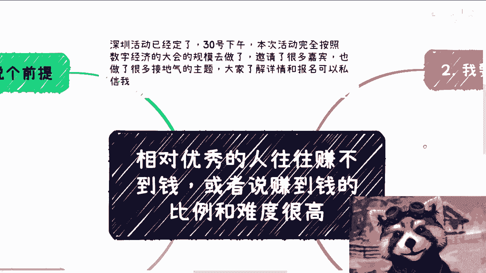
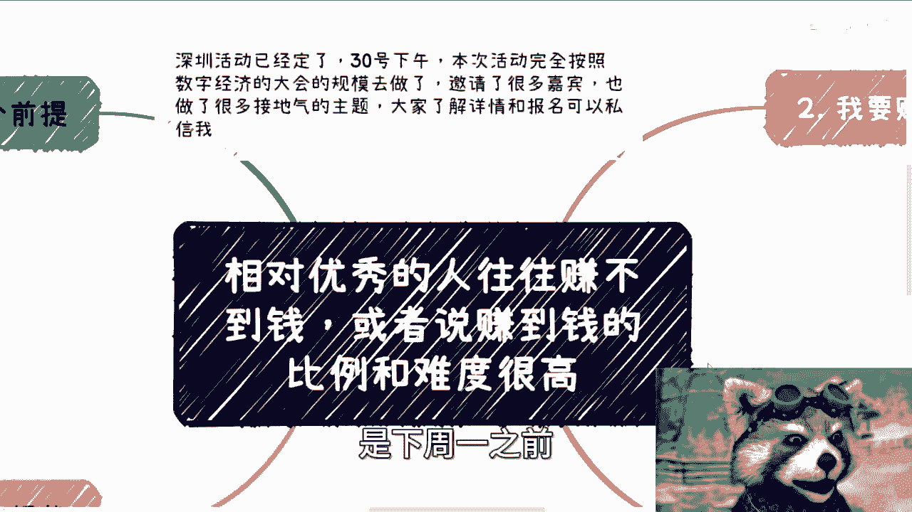
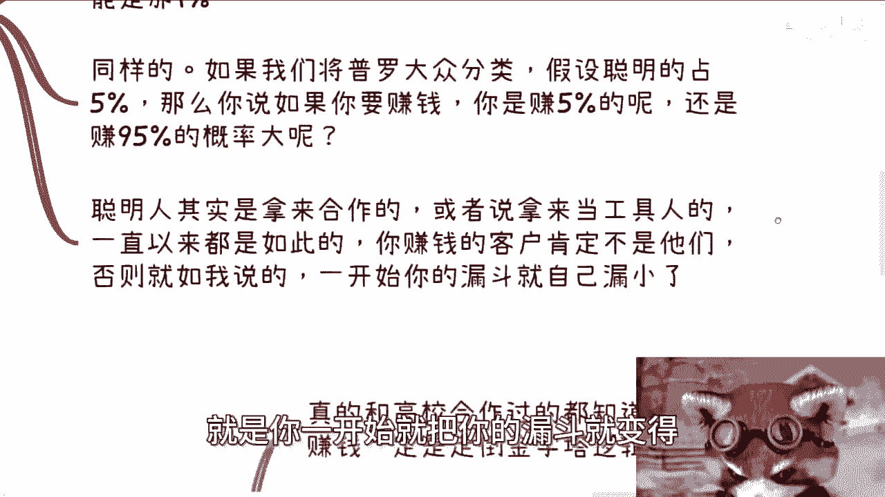
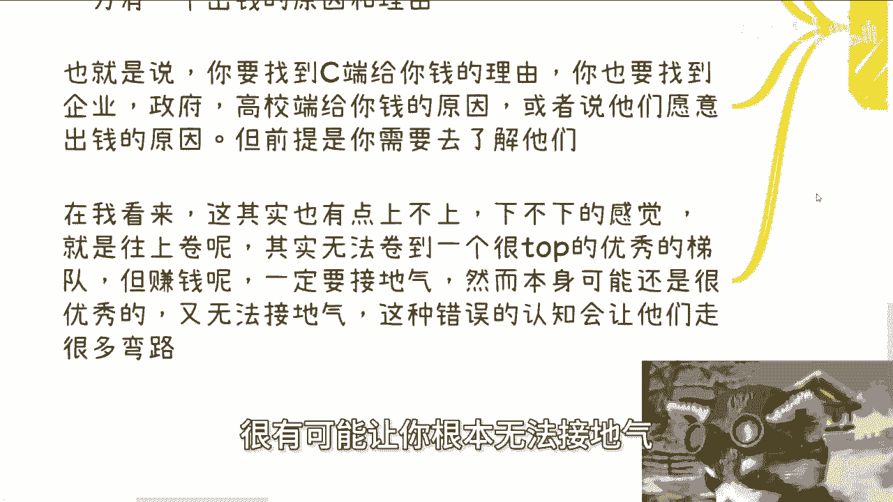
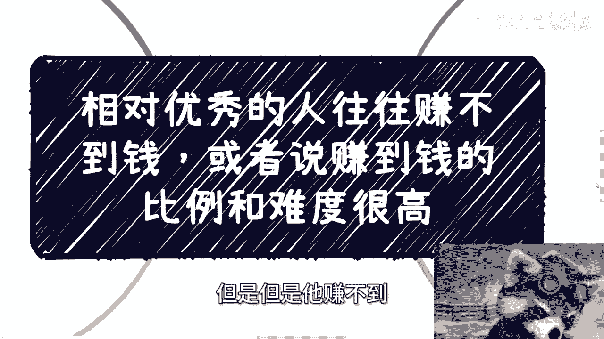

# 课程01：为何相对优秀者常难致富？💰


在本节课中，我们将探讨一个普遍现象：为何在年轻时相对优秀的人，往往难以赚到钱，或者说赚钱的比例低、难度高。我们将分析其背后的认知偏差与商业逻辑，并提供清晰的思路。


---

## 前提界定 🎯



首先，我们需要明确讨论的前提。

这里所指的“优秀”或“高”，是**相对优秀**，并非指突破到社会前1%的顶尖精英。这个范围界定是我们讨论的基础。



---


## 核心困境：认知偏差 🤔

上一节我们界定了讨论范围，本节中我们来看看核心问题：为何相对优秀的人赚钱很难？

主要原因是他们对社会的认知，以及对普通大众的认知存在**过高估计**。他们常常将自己及身边优秀圈子的情况，错误地等同于整个社会和老百姓的普遍状态。

当然，有人会反驳：优秀的人工作好、薪资高。但需要明确：所有依靠**打工365天**赚取辛苦钱的，无论薪资多高（即使是年薪200万），在本次讨论的语境中，不被定义为“赚钱”。这个话题我们不再深入讨论。

---

## 案例分析：赚聪明人的钱？💡

在今天的咨询中，一位小伙伴提出了一个有趣的问题：他想赚聪明人的钱。

这引出了一个根本性问题：**聪明人为什么会让你赚这个钱？**

以下是分析逻辑：

1.  **自我学习倾向**：对于聪明人而言，他们认为99%的东西可以通过自己的摸索和学习获得。
2.  **付费意愿极低**：即便有1%或0.1%的东西可能需要付费，但由于其聪明和优秀，他们也会怀疑这极少数的价值是否真的存在于你这里。
3.  **结论**：综合来看，他们**压根就不会轻易付钱**。

---

## 目标客户选择：比例与概率 📊

上一节我们分析了聪明人的付费逻辑，本节我们基于此进行更广泛的市场选择思考。

如果将普罗大众分类，假设优秀的人占5%，那么你要思考：

*   你是去赚这**5%**的人的钱，还是去赚**95%**的人的钱？
*   赚哪一部分人的钱**概率更大**？



答案显而易见。虽然你可以选择服务那5%的顶尖客户，但**95%与5%的市场比例差距**是客观存在的。选择小众人群，就意味着你的潜在客户漏斗入口从一开始就变得非常小。


```
潜在市场大小比较：
大众市场 (95%) >>> 精英市场 (5%)
```

---

## 优秀者的正确用途：合作而非客户 🤝

既然赚聪明人的钱很难，那么优秀者和聪明人应该用来做什么？

答案是：用来**合作**。

我们常说的“向上社交”，其意义就在于此。与优秀者合作，可以帮你过滤掉许多低效、低质的沟通与麻烦，为你创造更多赚钱的可能性。因此，聪明人和优秀者是**合作伙伴**或**高效的工具人**，而非你赚钱的主要客户画像。

如果你的核心客户定位是他们，那无疑是自己将赚钱的道路变得异常狭窄。

---


## 实例延伸：高校市场的赚钱逻辑 🏫

这个逻辑同样适用于其他领域，例如与高校合作赚钱。

在国内，做高校业务若要赚钱，必须遵循 **“倒金字塔”逻辑**。

以下是具体分析：

*   **顶尖高校（如985/211）**：合作赚钱难度极高。
    *   **资金不足**：其经费多集中于科研，用于校企合作的资金有限。
    *   **姿态较高**：客观上说，他们可能看不上普通商业项目。
    *   **学费低**：越顶尖的公立高校，学费通常越低，缺乏付费操作空间。
*   **职业院校**：才是更理想的赚钱切入点。
    *   **数量多**：院校基数大。
    *   **经费足**：学费相对较高，有更充裕的预算。
    *   **意愿强**：有更强烈的与企业进行实践合作的意愿。

因此，赚钱需要找到有**支付能力**和**支付意愿**的切入点，而非一味追求“优秀”标签。

---

## 优秀与赚钱的因果关系断裂 ⛓️

这是最关键的认知突破点：**个人的优秀与能否赚到钱之间，没有直接的因果关系。**

你可以非常优秀，身边也人才济济。但只要你的优秀尚未转化为如攻克光刻机、火箭技术等具有垄断性的“屠龙之技”，你本质上仍然需要思考如何赚钱。



钱不会因为你的学历或证书自动掉进口袋。钱之所以流动，是因为付款方有一个**合理的支付原因和名目**（无论是C端消费者，还是B端/G端客户）。

所以，你需要研究的不是自己多优秀，而是：
1.  **C端老百姓**在什么情况下愿意付钱？
2.  **政府、企业、高校**每年预算支出的原因和项目是什么？

他们的付款逻辑是固定的，但**绝不会**单纯因为“你优秀”而付款。许多优秀者处于“上不上、下不下”的尴尬境地：既未跻身顶尖科研梯队，又不愿或无法放下身段去接商业地气、了解普通大众的真实需求。这种认知错位会导致他们走很多弯路，付出巨大的沉没成本才能醒悟。

---

## 悖论与总结 🔄



本节课中我们一起学习了相对优秀者常难致富的深层逻辑。最后形成一个核心悖论：

> 他们自身优秀，因此很难把钱掏给别人（消费谨慎），同时也很难赚到别人的钱（因为不屑或不懂大众市场）。他们知道真正的赚钱逻辑，可能对此嗤之以鼻，但他们自己又需要赚钱。这种矛盾的状态，导致了赚钱的高难度和低比例。

**总结来说**：赚钱是一门关于**理解支付方逻辑**和**选择正确市场**的学问。个人的优秀是很好的杠杆，但绝非直接兑换金钱的货币。将优秀用于与合作者共创新价值，同时面向更广阔的大众市场寻找需求，才是更可行的路径。

---
*（注：文末关于深圳活动及咨询服务的推广内容已根据教程要求省略，仅保留核心课程部分。）*