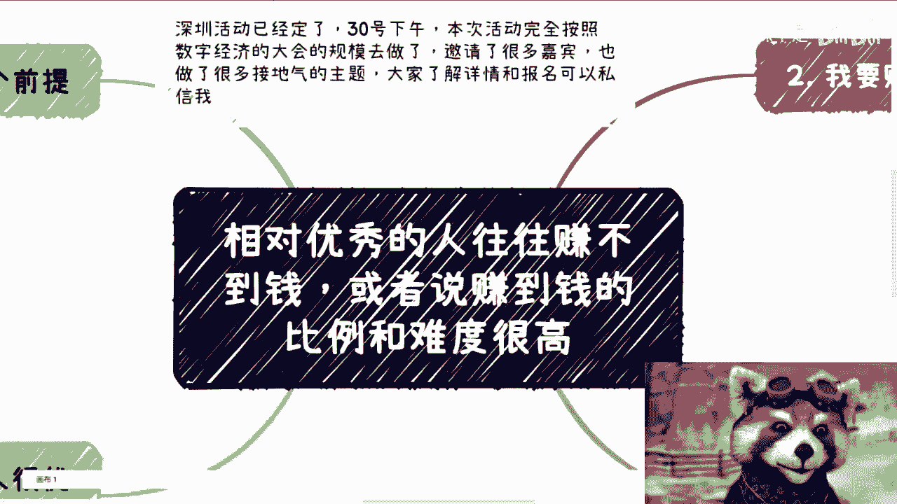
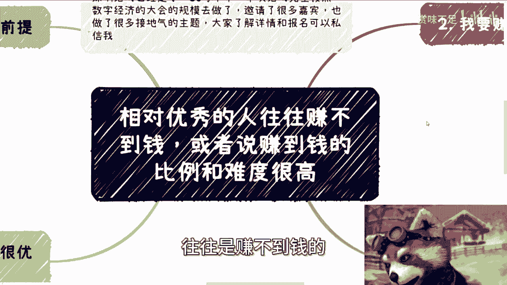
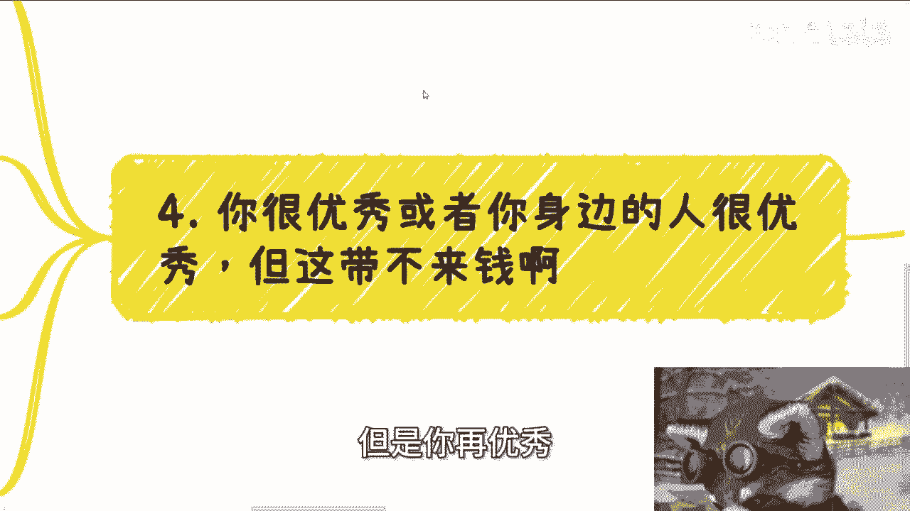

# 相对优秀的人往往赚不到钱，或者说赚到钱的比例低，难度很高 - P1 - 赏味不足 - BV1gH4y1w7y7

好大家好啊，这个呃今天我们来讲的呢叫做我本来啊，这个主题上面写的是学历高的，但我后来想了一下，好像也不一定是学历高的，就是我觉得就是相对年年就是年轻的时候啊，相对优秀的时候呃。

优秀的人啊往往是赚不到钱的。

或者说赚到钱的比例跟难度很高啊，我觉得今天这个主题是这样子的啊，首先啊深深圳活动已经定了30号下午好吧。

本次活动我完全按照数字经济大会的规模，去做的呃，邀请了很多嘉宾啊，然后也做了很多接地气的主题，好吧，大家可以私信我来了解一下详情啊，然后也可以看一下报名，反正现在报名的话呢是下周一之前。

下周一之前是优惠的好吧，约下周一之后就原价了啊。

首先我们先来先说个前提啊，就这里指的相对高难只是一个啊，这里指的高或者说优秀，只是相对优秀啊，并不是说特别特别，你说突突破到前1%或者怎么样子啊，这种不在我们的讨论范围内啊，首先这是第一个啊。

然后第二个是诶，等一下啊，我看一下哎，哎我就知道每次这个东西都会有问题，第二个就是为什么相对赚不到钱，或者说赚到钱很难呢，是因为他们对社会的认知，跟对老百姓的认知过高啊，也就是说他们往往把身边的这些人。

或者身边自己的优秀和身边的这些优秀的人，错认为了是整个社会面和整个老百姓，当然啊也有小伙伴说了，也也有也有小伙伴说了，就他们工作好啊对吧，这些优秀的人薪资高啊对吧，那还是那句话啊。

所有打工的做365天的啊，走这种辛苦钱的，无论薪资多高，他他妈就算年薪200万，在我认为也不是赚钱啊，这种事情我们以后就不要讨论了，好吧啊，那么好，我们继续来讲今天这个故事啊，首先呢呃今天咨询的时候呢。

碰到这么一个问题啊，也讨论了一会，蛮有意思的，所以我拿出来跟大家分享分享，就今天咨询这位小伙伴呢跟我说，他想赚聪明聪明人的钱啊，那么问题来了，为什么聪明人会让你赚这个钱呢对吧，因为我们仔细分析一下啊。

对于聪明人而言，99%的东西，他们会认为通过自己的摸索跟学习，是能够获取得到的对吧，或者说怎么样，但是至少有一定参考性，我国内找不到，我找找海外的，对不对，好，那么可能还有那么1%或者，0。1%的东西。

可能会让他们去付钱，或者来说让他们有意愿去掏钱，但是由于他们很聪明以及很优秀啊，所以他们也会觉得，这0。1%或1%的东西，他不可能在你那边，对不对，那么综合来讲就是他压根就不会给你付钱啊，同样的啊。

我们再往下讲，如果我们将普罗大众分类，假设其优秀的人占5%，那么我就问你，你如果今天要去赚钱，你是去赚这5%的人，还是去赚95%的人，你赚哪一部分的人的概率大，你自己去想，对不对，那当然了，当然了。

你也可以跟我说，你赚那5%的人没有问题啊，但是这个比例跟95%的这个比例多大，你自己知道啊，那么同样的优秀的人跟聪明的人，其实是用来干嘛的，是用来合作的啊，我们一直说叫做向上社交，向上社交，为什么。

因为你只有向上社交，你才会避免掉那些非常低级啊，非常无语，非常让你觉得莫名其妙的，或者说莫名其妙的人，你这样的话，你才有更多的可能性去赚到钱，这个叫做我们叫做上向上社交，所以说聪明人跟聪明人。

聪明人跟跟优秀人是干嘛的，是拿来合作的，或者说这些人是给你来当工具人的，因为什么，因为他们好用对吧，一直以来都是如此的，你赚钱的客户肯定不是他们啊，如果你的赚钱客户画像是他们的话，那他妈的你真那是你哦。

这种就像我说的，就是你一开始就把你的漏斗就变得。

这个漏斗的口就变得很小，然后你怪谁呢，赚不到钱，你怪谁呢。

对不对啊，第三我们今天还讨论了一个问题，就是赚高校的钱啊，真的我跟你讲啊，但凡在这个社会上跟高校合作过的，都知道，在国内做高校业务要如果要赚钱啊，一定是走倒金字塔逻辑逻辑，什么叫倒金字塔逻辑。

就是说你要但凡赚钱，不要去找一本，不要去找985211，不要去找清北，为什么，因为说实直白一点，他们的校企合作，他们没有钱哦，因为他们大部分的批下来的这个钱，可能都在科研经费上面。

对吧哦可能都是科研经费上面，但跟但是呢跟我们做校企合作是没有关系的，更何况他们很傲，他们看不上我们啊，这个也是事实啊，不不是说对跟错啊，我只是表达个事实啊，不要不要不要觉得好像我我觉得他们不好啊。

我觉得他们没问题啊，客观的说他们看不上我们啊，然后另外一方面，越往上的高校啊，越朝上的高校其实学费收得越低，你仔细去看一下啊，他们哪来的钱，或者来说我们再说直白点，他们哪来的这个付钱当中的操作空间。

如果来说没有付钱的操作空间，那他妈你跟我怎么赚钱，对不对啊，职业院校一方面数量多，另外一方面钱也多，他们的学费也高，而且另外一方面，他们也有非常强烈的意愿跟企业合作，这才是我们赚钱的逻辑啊。

这才是我们说能够赚到钱的切入点啊，对吧好，第四，你很优秀，或者你身边的人很优秀，但是你再优秀。

你带不来钱，你明白吗，这就是我一直举的那个例子，就是你今天不可能因为你优秀，所以你赚到钱，这两者是没有因果关系的，你明白吗，一点因果关系都没有的，这就好像你今天很优秀，你整个人散发着光芒哦。

你把你的清华北大，把你MIT的学历挂你脑门上，站在路障中，钱会掉下来吗，不会的对吧，就我们说啊，你也许很优秀，你身边的人也许也很优秀，但你的优秀还不足以让你有屠龙之技啊。

也不足以让你们能够在光刻机或者火箭，或者其他的一些当中，包括生物医疗等等等所一些领域有所突破，那么再优秀，本质上你只要突破不了这种层面，本质上你还是要想办法去赚钱的，那么这个时候问题就来了。

钱这个东西不会因为你一般的优秀啊，也不会因为你有什么学历，或者有什么证书而直接掉下来，钱之所以会到你的口袋里，一定是因为出钱的那一方啊，我不管是叫甲方还是叫什么啊，就出钱的那一方。

一定会有个出钱的原因和名目或者理由啊，那么也就是说你要去赚钱，你先别说你多么优秀，你也别说你你你你身边人怎么样，你要找到的，你要明白的是，C端老百姓为什么给你付钱，你也要找到政府企业高效端。

他到底由什么原因出钱，因为他每一年出现的原因都是一样的，但是他并没有说因为你优秀，所以把钱出给你，你明白吗，这因果关系是不成立的哦，所以你得去知道他们愿意出钱的原因，但是前提是你得去了解他们。

所以说在我看来，这其实也有，就是这些人也有点上不上下不下，也就是说你真的往上卷吧，你也无法卷到一个很top的一个优秀的梯队，但是你真的去赚钱呢，你又是一定要去接地气，接商业地气，接老百姓，接地气。

接这个社会底气，而你的这个优秀很有可能让你根本无法接地气。

那么这种错误的认知就会让他们走很多的弯路，对吧，也就是说如果没有人跟他们去讲，那么他们很难认知，那如果来说他们要撞南墙去任职，那他们可能已经付出了非常大的沉没成本，这个其实也是很大的一个问题哦。

所以说就是说，尤其是在这个时代或者这么一个社会上面哦，我是觉得就是说这种难度是很高，比例是很高的，还是那句话，因为跟他同样优秀的，或者像他们这样类型的人，他们是很难把钱掏到别人口袋里的哦。

他们也很难让别人赚到他们的钱，但是同样相相对的，他们也很难赚到别人的钱，因为他们并不知道真正赚钱人赚的是谁的钱，以及赚的用户画像是谁，他们不知道，或者说他们知道，他们也不屑一顾，因为他们很优秀，哼。

但是问题悖论就在这个地方，就是他优秀吧，但是他也要赚很多钱，但是但是他赚不到。

但他又嗤之以鼻啊，好OK啊，那么深圳活动好吧，报名或者需要了解的继续，我们继续走私信啊，然后同样的职业规划，商业规划啊，股权期权商业计划书白皮书啊，或者来说分红分润啊，或者你手上有什么牌。

你们手上没有什么牌，你们希望通过跟我的沟通，通过我的一些视角和视角跟视野，能够给你们一些，更接近于地区的一些规划跟建议的话，你们可以整理好个人的问题跟背景，我们再来走咨询，好吧啊，OK啊好。

