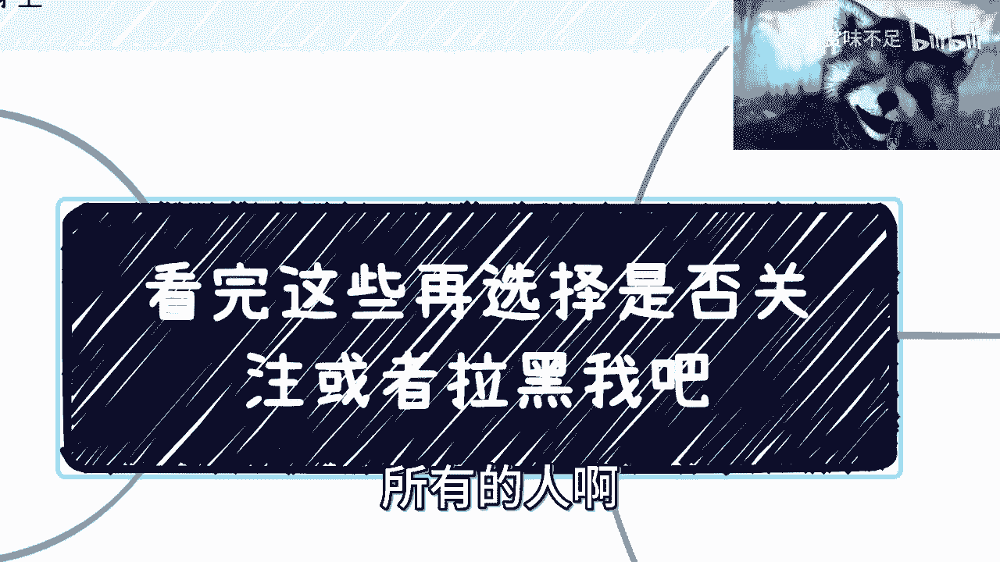
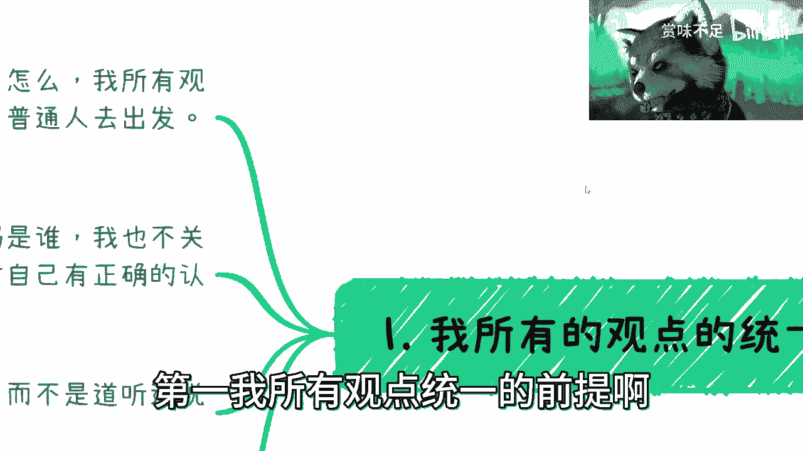
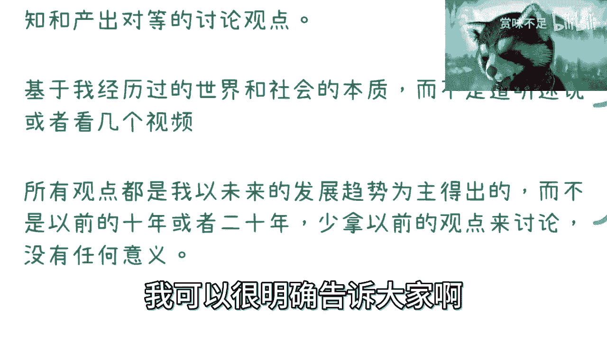
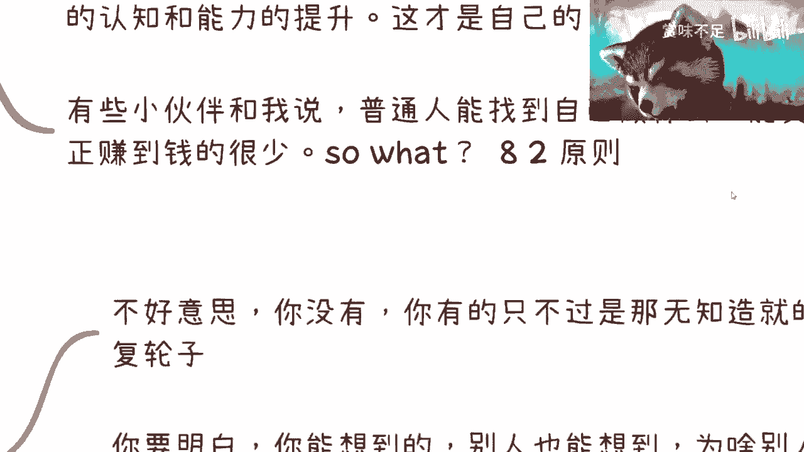
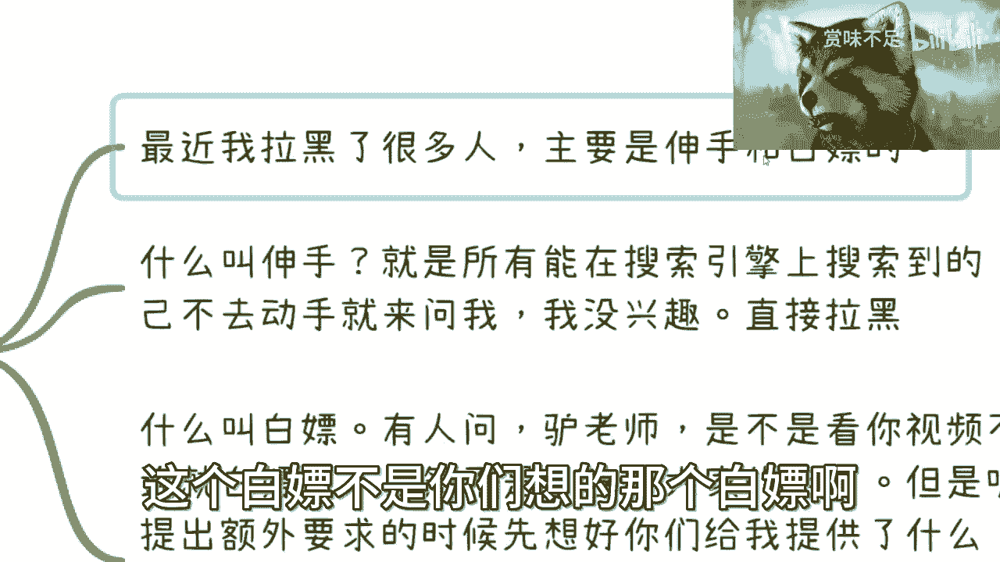
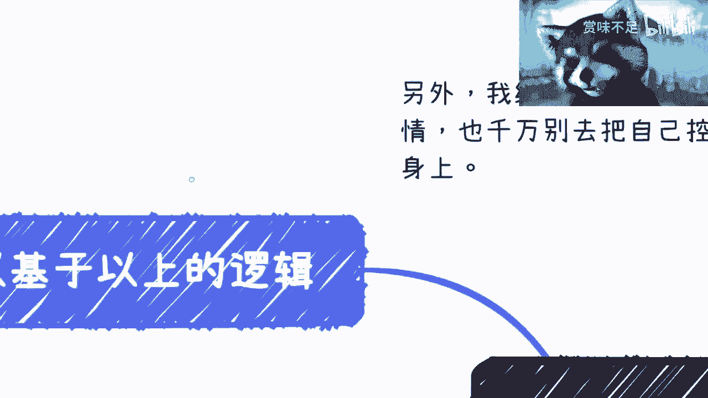
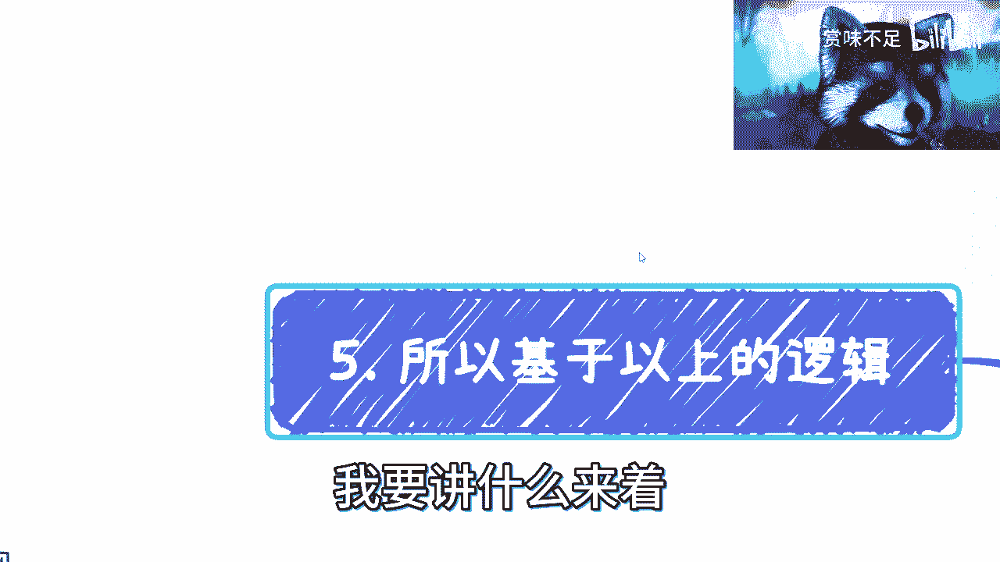
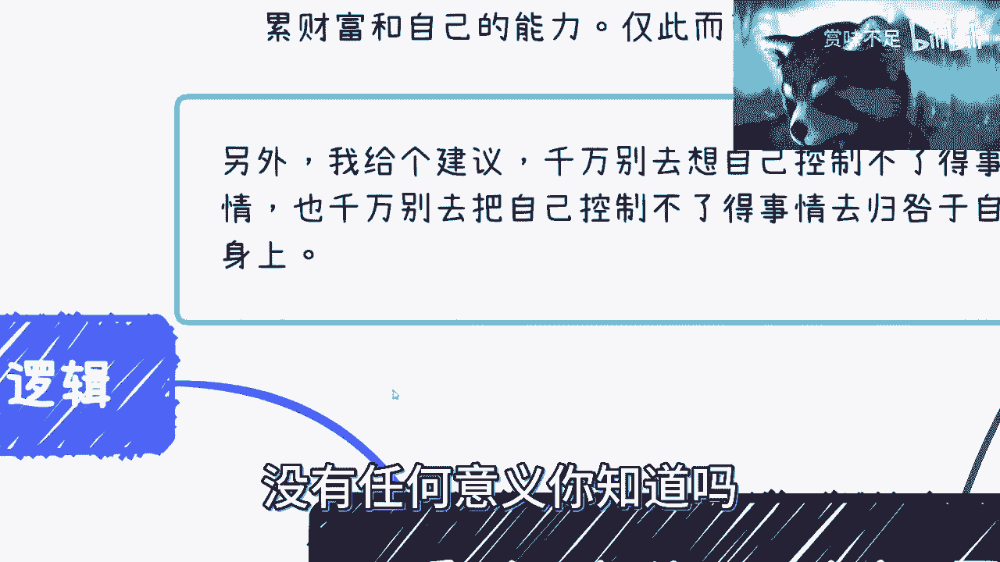
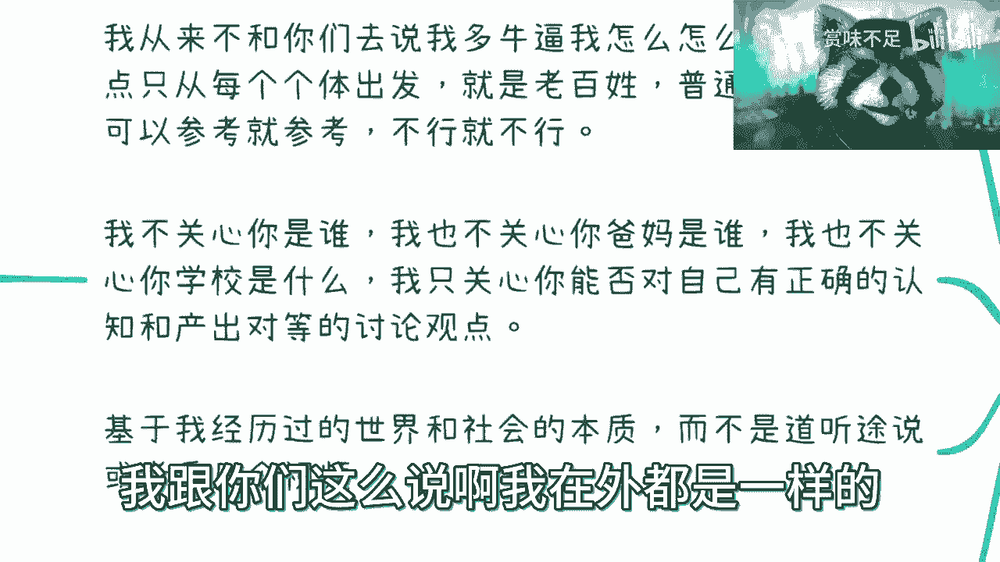

# 看完这个视频再选择是否关注或者拉黑我吧 - P1 - 赏味不足 - BV1dM4y1h7JC

好大家好啊，呃基于前两天我说了那个楚门的世界是吧，有我想了一想，我也的确应该出这么一期内容是什么呢，就是说啊跟大家说一下所有问题的前提啊，所有问题的前提包括我所有观点的前提啊，所有的人啊看完这些呢。

你们可以选择是否关注或者是否拉黑我啊对吧，首先啊先说大的前提，首先最大的前提是我们我所有的视频的观点，以及我在外面啊，不管线上线下，我的所有的对外的观点都是一致的，是什么呢。

就是我们要去了解这个社会跟世界，原本的样貌以及框架啊，我是一个探索者，我也希望更多人能够跟我一起一样去探索，并且分享出来，如果来说啊，你不能你看到了很多东西，虽然只是表面的对吧。

如果你不能改变这个社会跟原本的样貌，跟规则或者框架，那么你别抱怨，至少你别到我这边抱怨啊，抱怨谁都会抱怨，没有任何意义，你明白吗对吧，这是第一点啊，啊这是第一点，第二点是什么呢。

那么有很多小伙伴就要说了，他说那那吕老师他说啊，你这个说别抱怨，但是我很难过啊，我很难受，我看到了一些东西呢，我怎么样怎么样啊，那他说我们能做什么，对吧好，我告诉你们，我们能做的只有一个是什么呢。

尽可能的了解和看清我们能看清的一切啊，尽可能的去了解整个这个世界跟规则的啊，跟社会的规则跟框架以及各种各样的一些东西，我们能做的是什么，去follow对吧，就是在这样的规则和框架之下。

去积累你们的财富和你们的能力，仅此而已，没了还能用干嘛呢，你想改变这规则吗，不好意思哈，你没这个能力啊，我也没有啊，谁都没有对吧，另外我再给个建议啊，千万别去想自己控制不了的事情啊。

也千万别去把自己控制不了的事情去，归咎于自己身上，因为我发现太多的人的抑郁对吧，或者说难过，或者说这种叫做丧的情绪，很多的时候不是因为这些，就很多时候并不是外界给你们的，是你们自己给你们的，你明白吗。

就说就说很简单，我给你们举个例子，就比如说你说今天有人不关注我，那不关注我是跟我有什么关系呢，我能控制你关不关注我吗，哦有一个人不关注我，我很难过跟我有什么关系是吧，然后你说啊这个合作对吧。

比如说今天你去谈了个合作对吧，你说他不跟我合作，那我就问你，他跟不跟你合作是你能控制的吗，你不能控制，那你难过些什么东西呢，对吧对吧，就是说所有的人啊，我跟你们讲，所有的人去想事情，你们只要去想。

你们自己能改变什么，你们自己不能改变的，都不要去想，有什么意义呢，没有意义的对吧，你就像刚刚我们说的，就是说你说这个合不合作，那你先审视你自己的东西，你觉得你自己这些东西还有哪些是可以不足的。

哪些可以提升呢，这个是你要去想的，你不要纠结在别人能不能跟你合作，这不是你能控制的，还有什么工作里面对吧，有很多人说哎呀，他看我不开，说看我不顺眼，他就背后举报我，怎么了怎么了，别人举报你，你能控制吗。

我就问你能不能不能，那不能你去纠结它干嘛呢，对不对，就是所有的事情，只要你们不能控制的，一律不要纠结，有什么好纠结的，你知道吗，没有任何意义，真的只有浪费时间，唉，是吧好，那我们开始正题啊。

第一我所有观点统一的前提啊。

统一的前提是什么呢，我从来不跟你们去讲，我怎么样怎么样，没什么好讲的对吧，我所有的观点都是从个体出发的，也就是说，我所有的观点都是从我们是一个老百姓，是一个普通人出发的啊，你们可以参考就参考。

不可以参考就无所谓，不参考啊，不要来跟我去争论对和不对，没有意义，你们可以阐述你们的观点，但是没有必要去争论对和不对，因为我所有我几乎所有的东西我都会说，我自己都不去判断他对和不对，我只是来跟你们讲。

我所看到的东西，没有任何东西是绝对对和绝对不对的啊，这个世界不是零和一只不是只有黑和白的，没有任何意义，这件事情你知道吗，是吧，那这是第一个，第二个呢就是说我在网上也好，我在线下也好。

包括我去谈商务也好，都是一样的，我不关心你是谁，我也不关心你爸妈是谁，我也不关心你的合作方是谁，我也不关心你学校是什么是谁，我也不关心，我甚至都不关心你专业做的是什么，我什么都不关心。

我只关心的是说你跟我在交流当中，你是否能够对自己有正确认知，以及产出对等的讨论的观点，也就是说你讲出来的话啊，你讲出来的内容是不是符合一个正常人，如果不是，那我不想沟通啊，我直接拉黑，没什么好说的。

你明白吗啊包括我在外面商业也是一样的，就是说如果今天你比如说前天昨天早上对吧，我去数交所，包括前两天我出去我们谈对吧，谈就说对方只要来跟我，让我觉得你在画饼，或者让我觉得你在跟我绕圈子，或者让我怎么样。

我直接就会打断，我就直接说我过来谈，就是要赚钱的，你要么就好好谈，你不想谈，拉倒我就走了，就这么简单对吧，地球圈了，你又不转，是不是无所谓啊，who care对吧，怎么样呢对吧，第三点啊。

基于我经历过的世界跟社会的本质啊，就是说所有的观点，所有的前提我都是一步一步走过来的啊，而不是说我只听别人去说，或者我看了几个视频啊，你们一定要记住啊，所以说并不是说你们听我讲或者去看几个视频。

就能够明白很多东西，你们明白不了，该去踩的坑还是要去踩的啊，所有观点都是我以未来的发展趋势为主，而得出的，你们一定要记住，就是所有的观点，我虽然不能把很多的事情去讲出来。

但是我可以把这些事情所得出来的结论，跟大家去分享好，但是你们去看这件事情的时候，千万不要用以前10年或20年的东西来去看，为什么，因是因为所谓的天时地利人和，现在的情况跟以前也不一样。

未来的10年发展跟以前的10年，20年肯定也不一样，没有任何参考意义，你知道吗啊，这就是好像有很多人跟我说，哎呀我这个主业对吧，主页我要好好提升能力，主页我要好好提升技术对吧。

哎呀那个那个什么什么叉叉叉对吧，那铁饭碗怎么样，没有任何意义，为什么，因为对我对我来讲，在未来的整个发展趋势里面是不存在任何的，你主业能很稳定，或者你叉叉叉是一个铁饭碗不存在的啊。

我可以很明确告诉大家啊。

对我来讲，反正你爱信不信是吧啊，这是第一点，第二点啊，我从来不去说职场的事情，我之前也说过。

那为什么，因为在我看来，只要你不是金字塔底层的人，不好意思，我觉得你不是，我也不是对吧好，只要你不是，那么只要你不能在35岁左右退休，甚至30岁或者更早啊，无所谓啊，按照现在的趋势啊。

我认为大家早晚都是会主动跟被动被优化掉的，我不管你们焦不焦虑，也不管我自己焦不焦虑，这并不重要，因为我们焦不焦虑，我刚才已经说了，我们的焦不焦虑根本不会左右大势对吧，我们能控制吗，我们能控制吗，不能。

那我们焦虑它干嘛呢，没有意义，你知道吗，所以说我们要去了解更多的事情，而从而关注自己认知和能力的提升啊，而不是说就是去跟风，然后不停的去刷那些有的没的东西对吧，这个是你们自己的工作，这件事情随缘啊。

随缘能，你们要是能卷就卷，不能卷拉倒没有必要，何必呢，我说不好听的，有很多人问我，他说陈老师啊，这个考研怎么要不要考啊，我观点很简单，你要有天赋，你学习能力强，你就去考，你要觉得没有天赋。

你就是跟大家去卷的，非要卷的学历你就别考，因为你没有这个能力，你在这上面浪费两年，而浪费几年时间，浪费两年的费用干嘛呢，没有用力啊，你明白吗，就是好像你24岁面临一个问题，到30岁你还是面临这个问题。

因为你没有改变你的本质，有意义了，没有意义的，然后有些小伙伴就跟我说，他说哎普通人能找到自己什么，普通人能找到自己做的方向吗对吧，那根本找不到对吧，能找到真正赚钱的吗，也找不到。

但是我就问你又如何呢又如何呢，人活着不就是这样子的吗，哦你在做之前，你说哦我明白了，我是个普通人对吧，我是个这个这个OK对吧，就这样一个正常的人，普通人对吧，宇宙尘埃是吧，但是问题是你要找到能做什么。

真的能赚到是很少是很少，但是你要去做啊对吧，你不能，所以你说大部分的人不可能得出个结论说啊，因为我自己我觉得我找不到，因为我觉得我赚不到钱，所以我索性就不去了，我就躺平，可能吗，不可能的呀，对不啦。

就是就是就是就好像我们以前说八二原则，对吧，八二原则好，有很多人说啊，八原则什么概念，就是20%永远是少数，80%永远是多数，对吧好，那么你知道这个逻辑，你知道这个道理是对的，对的，没错啊没错哈。

但首先这个道理从我的三观逻辑来讲，我不认为它是一个一定正确的事情，他只是个参考对吧，这一点第二点是我就是这么叛逆的对吧，就是我不我，你要说让我让我认清楚，我自己什么都做不了对吧。

我能赚到我能赚的钱也很少，那OK但是前提是我已经用过了我所有的方法，用过了我所有的实践，能够做到力所能及里面的事情，那么我认可这件事情，否则你单纯跟我说啊，这个这个老师说的是什么，这个up主说的是什么。

这本书说是什么，跟我有什么关系啊，我关心我跟他有什么关系啊，他讲的东西跟书上讲的东西，跟这个所谓的道理就能够左右我了吗，啊搞笑了，我就搞不懂了，是不是啊。

那么还有呢第三点是什么呢，就别人动不动就跟我说。

你有个id啊，不好意思，你没有id啊，我现实里写的很清楚，不好意思，你没有啊，你有的只不过是那些很无知造成的，重复的轮子对吧，这是第一点啊，你要明白一点，我以前就说过，我们我们每一个人头上都不长角啊。

你也不是买了彩票就一定会中奖的是吧，你要明白你能想到的，别人也能想到，为啥别人赚不到钱，是你头上长角了吗，别人赚不到钱，或者说别人不想去赚这个钱，为什么，因为一定得有它背后的道理，你不是来跟我讲的。

是别人一定想不到，卧槽陈老师，我很牛逼，我就想得到，而是你要去了解这背后，水下为什么别人不愿意去赚这个钱，或者赚不到这个钱，你懂吗，你不懂我懂吗，我也不懂，但是我很清楚，我就不会跟人家。

所以我从来不会跟人家说，哎我有一个id，这id从来没有人想到过，我很牛逼，不会的，对吧，是吧好这第二点，第三点呢就是你要找我聊商业，我很欢迎大家一起搞钱，谁不想搞对吧，但是我跟你讲，你想清楚就很简单。

包括我出去，我出去谈任何伤，我刚已经说的很清楚了，很简单，你给我说清楚流量哪里来，产品业务是什么，盈利模式是什么，解决什么痛点，你想清楚再找我对吧，如果我都觉得不行，我告诉你，没人会投资的。

也没人会没人会合作的，你的项目只会坑了你自己，跟你的合伙人结束over，明白吧，的老师觉得自己好像头上长角，第四点呢就是别伸手，什么叫谁别伸手呢，最近我拉黑了很多人啊，主要是伸手跟白嫖的啊，不要激动啊。

这个白嫖不是你们想的那个白嫖啊。

还是不太一样的啊，什么叫身手呢，就是所有能在搜索引擎上面搜索的，你们自己不去动手就来问我，没有兴趣直接拉黑啊，不好意思，真的没有兴趣啊。

我又不是GPT是吧，你们该去问问GPT去，是不是啊，那么对我来讲也很简单，没有不会自己去搜索引擎引擎上面搜的对吧，或者说就直接百度知道不会不会知道的，我还指望他能探索什么东西啊对吧，白白的明白啊对吧。

这是第二点，第三点，什么叫白嫖，有人问啊，然后吕老师是不是看你视频不三连就白嫖，哎不是为什么，因为我说了，这是你们的自由对吧，而且我能控制你们三连吗，不能吧对吧，那就像我说的，我既然不能控制。

我就不会纠结这些，有什么好纠结的呢，对不对哦，我我我回头发个视频，你们必须三连，他妈的不三连就白嫖，白嫖就拉黑，那有抑郁了，没有意义的呀，这这个叫什么，这个不叫一个正确的三根，这个叫霸权。

而且更何况我跟你们，这，本来我我跟你们就没有任何地位上的，这个这个差别，我我怕个屁啊，你是不是对吧啊，然后但是呢如果你提出额外的要求，你得想好你们提供给我了什么啊，从本质来讲，我是一个商人或者资本家啊。

没有同等的利益，我为啥要去做对吧，这种提出来的人说明了也是个白嫖成性的，我直接就拉黑了，我给你们举个例子，因为前两天呢是这样子的啊，有一个之前也是互动蛮多的，然后呢他在评论区一直在一直在说。

一直在引导我，或者一直在PUA我哈啊搞得好像我不知道一样，我跟你们说，我还有一一丝仁慈啊，不要觉得我的一丝仁慈好像就是我不知道啊，啊很多的话想引导我，我也不是不知道对吧。

包括就是说前两天评论区有人跟我说啊，这个陈老师啊，有些东西比如说你讲不了的，那你可以出书啊对吧，你可以怎么样怎么样啊，哼我也是觉得搞笑的，第一你知道出书多少成本吗，出书得要花我多少时间吗，你给我多少钱。

这是第一点，第二点是你要知道纸质出版物比网络上的安全，信息安全掌控都要严格，在搞笑吗，对不对，就我真的不想再听到这种很无知的言语，搞得好像自己很牛逼，有意义了，没有意义的呀，这种无知让我恶心，真的。

对吧好，这个是四对吧，好我们最后啊，最后第五点基本上基于以上所有的逻辑啊。

嗯我是没写吗，我要讲什么来着。

不重要好吧，哼忘了OK好，基于以上所有的逻辑啊，我希望你们所有的人啊，我就说了，就说世界上并不是所有的人都能改变的，但是我希望你们所有的人都能够让自己。

别的我不关心啊，我觉得有两点式的，第一点就是说，千万不要让自己不能控制的事情，去影响你们的情绪，从而浪费你的时间，没有任何意义，你知道吗。

第二是什么，就是就是我这边说的这一点就是什么呢，就是所有的人不用去关心很多的虚的东西，虚的东西没有任何意义啊，也不要被需要的东西所PUA什么哎呀，今天这个人是个老师，那个人是个教授对吧。

这个人是个什么什么研究院的，那个人是个什么东西，不重要，重要的是他的三观和他的谈吐啊，和他所要表达的观点，别的都不重要啊，我跟你们这么说啊，我在外都是一样的。

我根本就不关心的啊，以大概只要你比如说只要在我面前对吧，有任何的这种画饼啊，绕圈子啊，我不管他是谁，他今天是个有编制的老师也好，是个教授也好，怎么样也好，我就是指他名字骂人骂的，就这么简单，因为为什么。

因为你就是个对，因为他就是个对吧，我骂他是一个事实，别人没有骂他，是因为别人觉得碍于他的身份，碍于很多所谓的三观的枷锁，但不好意思，我没有就这么简单好吧。

