# 看完这个视频再选择是否关注或者拉黑我吧---P1---赏味不足---BV1dM4y1h7JC_not

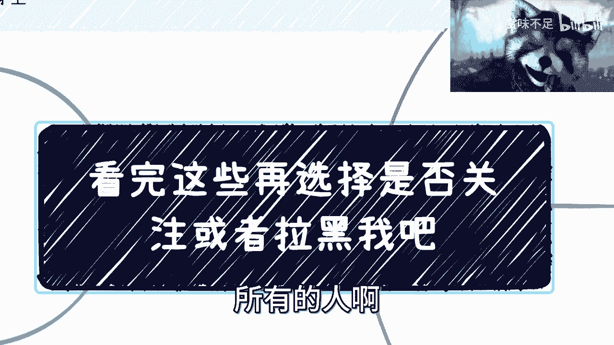

在本节课中，我们将梳理并明确我所有内容输出的核心前提与个人原则。了解这些基础观点，将帮助你决定是否要继续关注我的内容。

## 概述

我的所有观点都基于一个统一的探索者视角，旨在了解社会和世界的原本样貌与框架。我希望与更多人一起探索并分享见解。如果你无法改变社会的规则与框架，那么抱怨是无意义的，尤其不要向我抱怨。抱怨人人都会，但它不产生任何价值。

上一节我们概述了课程的核心精神，本节中我们来看看面对现实困境，我们具体能做什么。

## 我们能做什么？

当面对无法改变的现状感到难过时，我们唯一能做的就是：**尽可能了解和看清一切**。我们需要去理解这个世界的规则、社会的框架以及各种运行机制。

以下是我们的行动指南：

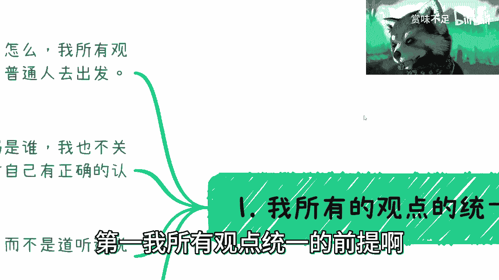

*   **在规则内积累**：在现有的规则和框架下，努力积累你的财富与能力。
*   **接受无法改变之事**：不要试图去改变你无力改变的规则，任何人都没有这个能力。
*   **管理你的关注点**：千万不要为那些你无法控制的事情焦虑或归咎于自己。许多负面情绪并非外界强加，而是自我施加的。

例如，他人是否关注我、是否与我合作，都不是我能控制的。我能控制的，是审视并提升自身的不足。工作中被人背后举报，同样非我所能控制，纠结于此毫无意义。

**核心公式：关注圈 vs 影响圈**
我们应将精力聚焦于“影响圈”（你能控制的事），而非“关注圈”（你关心但无法控制的事）。纠结于后者纯属浪费时间。

## 我的观点前提

基于上述我们能做的事，我所有观点的输出都遵循以下统一前提。

### 1. 个体视角出发

我所有的观点都从一个普通老百姓、个体的角度出发。你们可以参考，也可以不参考。我不与任何人争论绝对的对错，因为我只是分享我所观察到的事物。世界并非非黑即白。

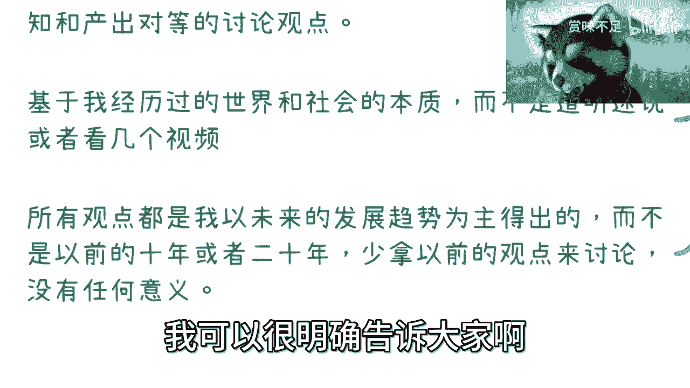

### 2. 对事不对人

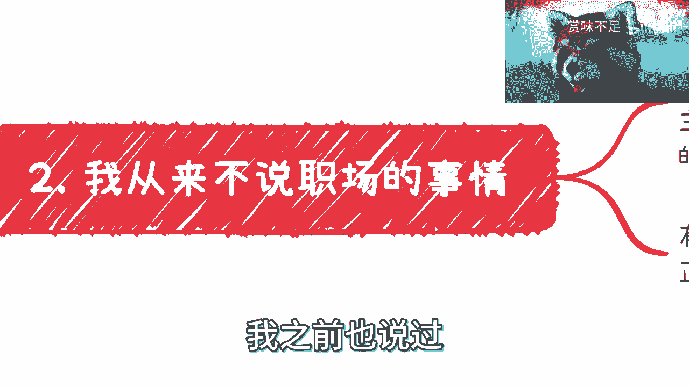

无论是在网络、线下还是商务场合，我交流的原则一致：我不关心你的背景、身份或地位。我只关心交流中，你是否对自己有正确认知，并能产出对等的讨论观点。如果不符合，我可能会选择停止沟通。

例如，在商业谈判中，如果对方绕圈子或画饼，我会直接打断并表明来意：**“我过来谈，就是要赚钱的。你要么就好好谈，不想谈就拉倒。”**

### 3. 基于实践与未来趋势

我的观点源于我一步步走过来的实践经历，而非道听途说或只看几个视频。你们必须明白，听我讲或看几个视频并不能替代亲身实践，该踩的坑依然要去踩。

同时，我的观点主要以**未来的发展趋势**为依据。切勿用过去10年或20年的经验生搬硬套，因为天时地利人和均已改变。例如，在未来趋势中，不存在绝对稳定的“主业”或“铁饭碗”。

## 对一些常见问题的看法

基于我的核心前提，我对一些普遍性问题持有以下看法。

### 关于职场与内卷

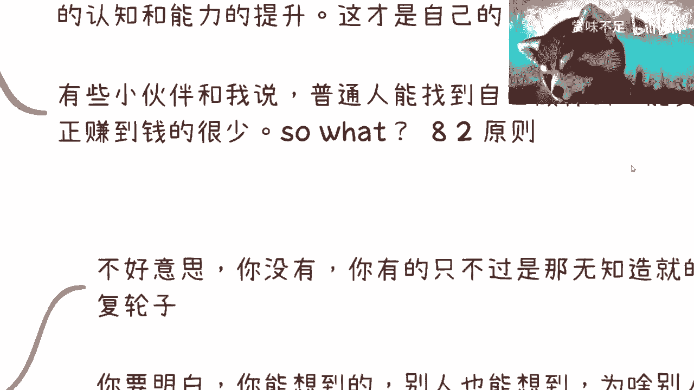

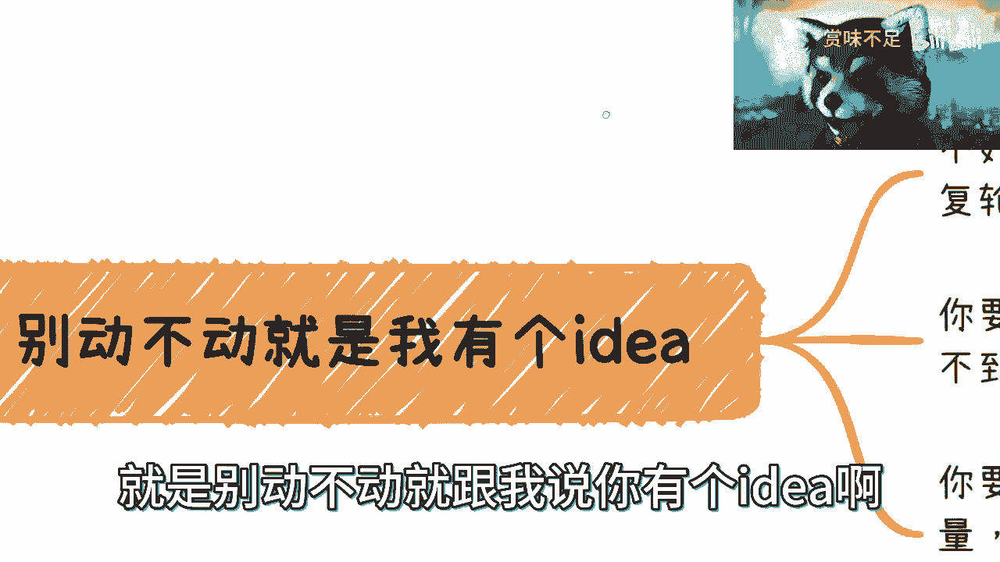

我很少谈论职场，因为在我看来，只要你不是金字塔底层，且无法在35岁左右退休，那么在当前趋势下，早晚都会面临主动或被动的“优化”。焦虑无用，因为它无法左右大势。

我们应该关注自身认知和能力的提升，而非盲目跟风内卷。工作之事，随缘即可，能卷则卷，不能则罢。

### 关于考研与方向

对于考研，我的观点很直接：如果你有天赋、学习能力强，可以去考；如果你只是为了卷学历而缺乏相应能力，那是在浪费时间和金钱。因为问题的本质（能力）没有改变，24岁面临的问题到30岁依然存在。

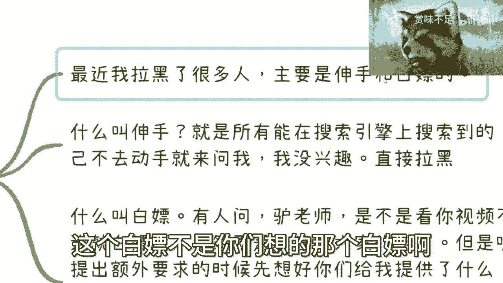

对于普通人寻找方向，确实很难，真正能赚到钱的路径也很少。但正因为如此，才更需要去尝试和实践。不能因为“觉得找不到”或“觉得赚不到”就索性躺平。**“二八定律”**（20%的人掌握80%的财富）或许是一个参考，但在我实践并竭尽所能之前，我不会轻易用这个“道理”来定义自己。

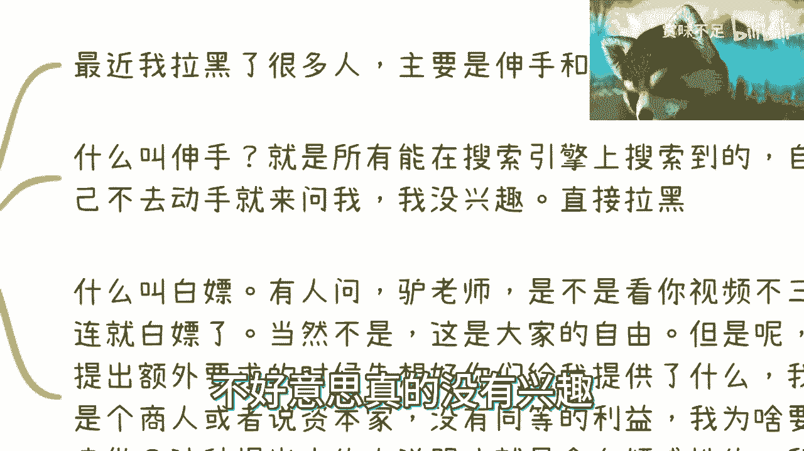

### 关于“好点子”与商业合作

我经常遇到声称自己有绝妙“ID”（点子）的人。但请明白，你能想到的，别人很可能也能想到。关键不在于点子本身，而在于要去了解“为什么别人没想到或没去做”背后的深层原因。

如果你想找我聊商业、一起搞钱，我很欢迎。但前提是，你必须想清楚并说清楚：**流量从哪里来？产品/业务是什么？盈利模式是什么？解决了什么痛点？** 如果这些基础问题都站不住脚，项目只会坑了自己和合伙人。

### 关于“伸手党”与“白嫖”

我坚持反对“伸手”和“白嫖”行为，并会因此拉黑一些人。

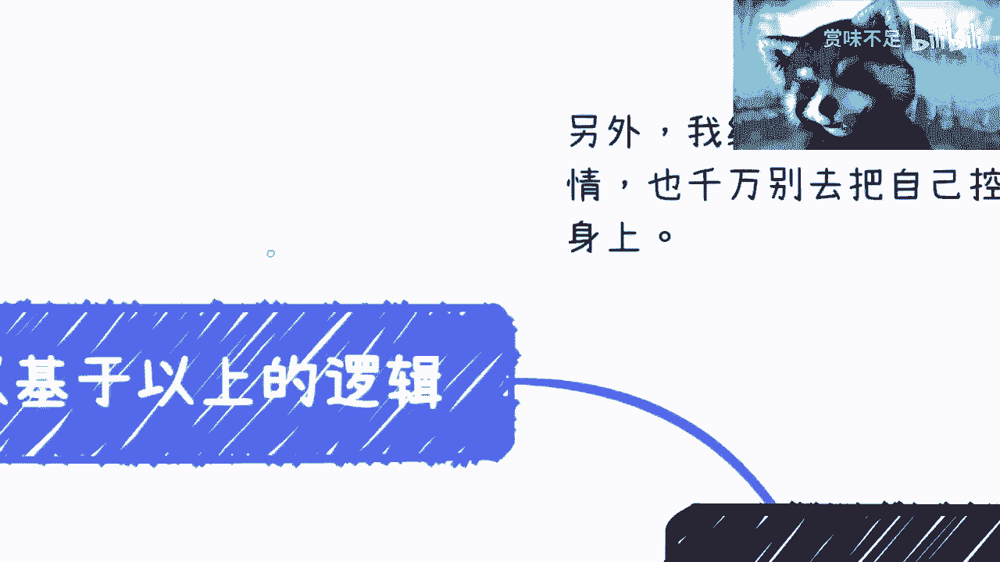

*   **伸手**：指所有能通过搜索引擎（如百度）自行找到答案，却不动手搜索直接来问我的人。我没有兴趣做别人的“人肉GPT”。
*   **白嫖**：这里不是指不“三连”（点赞、投币、收藏），那是你们的自由，我无法控制也不会纠结。我指的是那些提出额外要求（如“有些内容你讲不了可以出书啊”），却不想想自己能提供什么对等价值的人。从本质上讲，我是一个注重对等利益的现实主义者。出书需要成本、时间，且审核更严格，这种无知的建议毫无意义。

## 两点核心建议

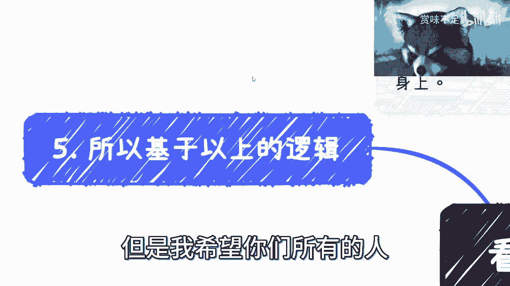

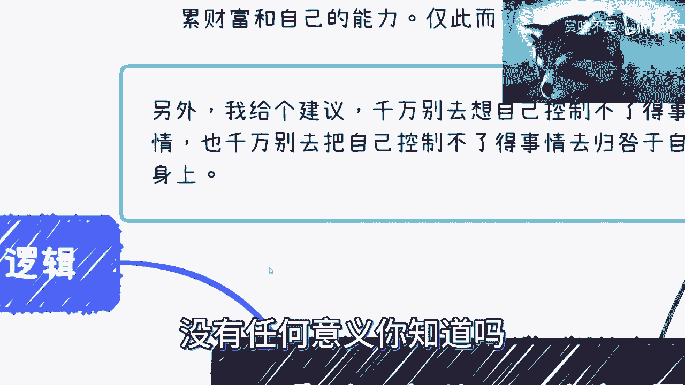

基于以上所有逻辑，我最后给大家两点核心建议：

1.  **情绪管理**：千万不要让你无法控制的事情影响你的情绪，从而浪费你的时间。这毫无意义。
2.  **去伪存真**：不要关心虚名和头衔（如教授、专家），不要被这些所“PUA”。重要的是一个人的三观、谈吐和所表达的观点。在任何场合，只要对方在我面前画饼、绕圈子，无论他是谁，我都会直接指出。别人不骂，是碍于身份或世俗枷锁，但我不在乎这些。

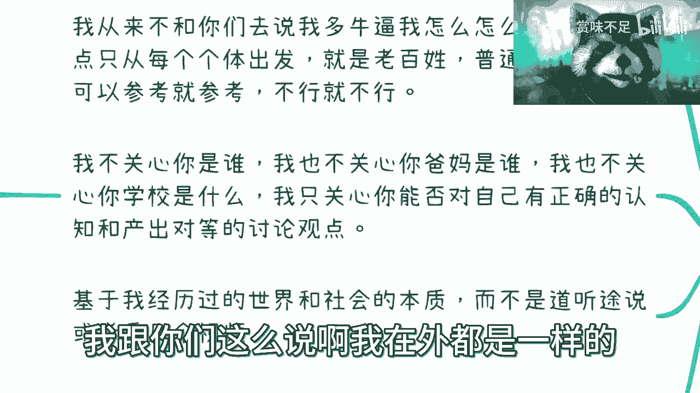

## 总结

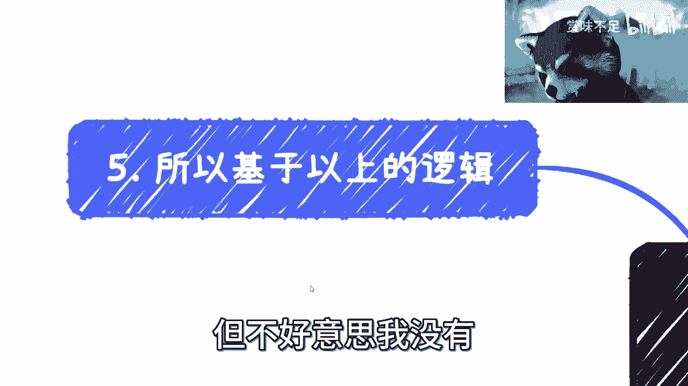

本节课中，我们一起学习了我的核心观点体系与沟通前提。我们探讨了在现实规则下个人能做的努力，明确了我从个体视角、对事不对人、基于实践与未来趋势的输出原则。同时，我们也审视了对职场、考研、商业合作等常见问题的看法，并强调了反对“伸手”与“白嫖”、专注于可控之事、剥离虚名关注实质的两点核心建议。希望这些内容能帮助你做出是否继续关注我的明智决定。