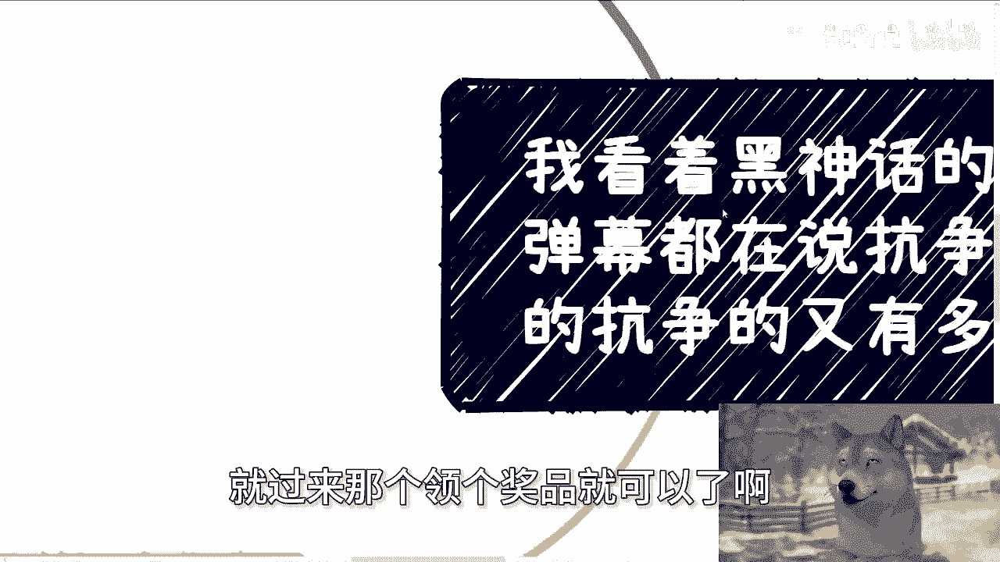
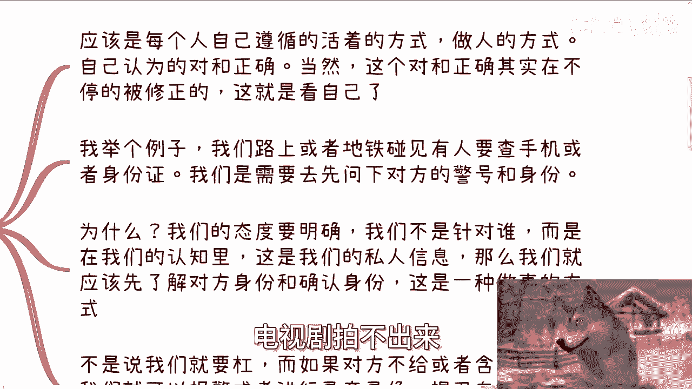
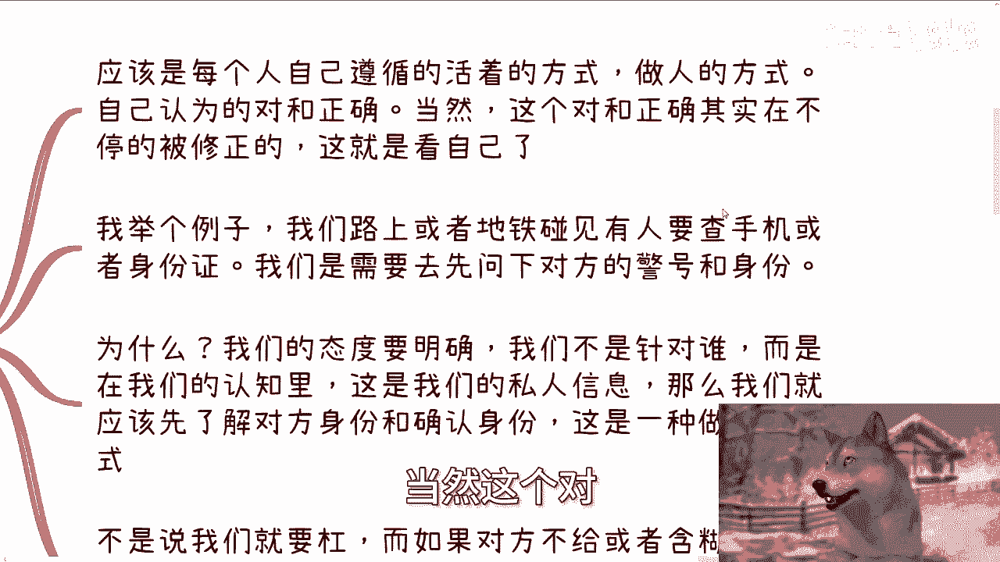
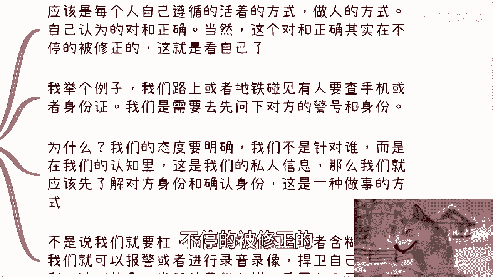
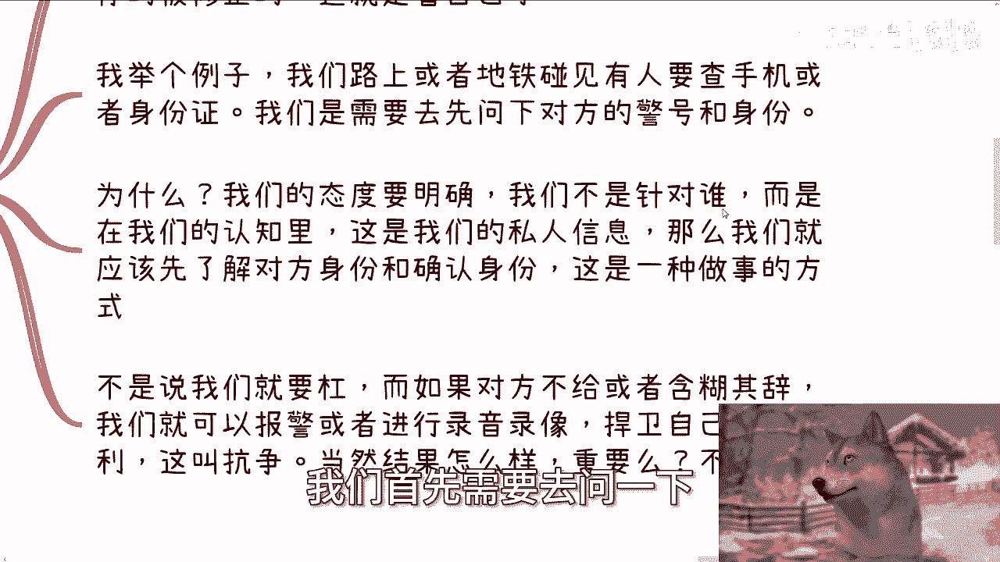
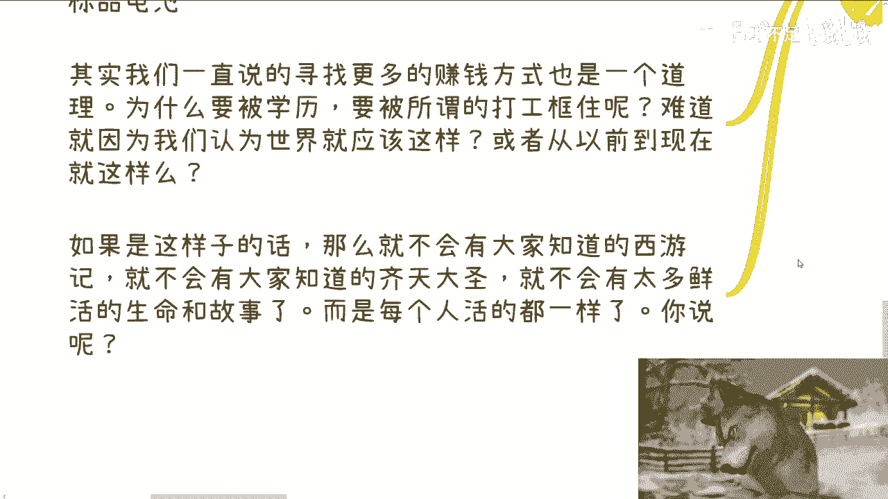

# 看着黑神话bgm弹幕都在说抗争-但真的抗争的又有多少呢---P1---赏味不足---BV1KPWye

在本节课中，我们将探讨一个常见的现象：人们如何在网络言论中表达“抗争”精神，但在现实生活中却鲜少付诸实践。我们将通过分析《黑神话：悟空》的弹幕文化，对比《西游记》原著与改编作品的差异，并深入探讨“抗争”的本质与意义。

## 活动回顾与预告

西安的活动非常成功，超出了我的预期。活动过程中一切顺利。

本次活动是2024年“数字经济赋能实体产业”系列大会的第二期。第一期于6月30日在深圳举办。第二期将于9月8日在上海举行。

我在上海找到了全国知名律所的场地作为活动地点。我邀请了从阿里离职创业、从事大数据与人工智能领域的前同事，以及来自常州、专攻政企业务的嘉宾。

感谢B站对本次活动的赞助。B站提供了各种周边礼品。

前35名报名者可在现场随机领取礼品。报名信息可在后台查看，届时凭报名二维码领取奖品。

## 游戏体验与“抗争”的思考

我近期花费了大量时间游玩《黑神话：悟空》。游戏确实好玩，制作、建模和Boss设计都很出色。

但请不要将玩游戏与“爱国”高度绑定。我只是在玩游戏，不涉及那么高的觉悟。

在B站观看游戏主题曲和《西游记》改编曲目时，我看到弹幕中充满了“抗争”二字。这让我陷入了沉思。

发弹幕说“抗争”的人很多，但现实生活中真正付诸行动的人能有多少？这就像许多人都想成为孙悟空，但有多少人能坚持本心，成为“齐天大圣”？又有多少人在外界（如“如来”）的安排下，最终走上了成为“斗战胜佛”的道路？

在我看来，每个人可能最初都是“孙悟空”，但只有少数人能秉持信念成为“齐天大圣”。更多人甚至不清楚自己是谁，或无法掌控自己的道路，最终沿着别人铺设的路径成为了“斗战胜佛”。

## 理解“抗争”的本质

上一节我们提到了“齐天大圣”与“斗战胜佛”的路径选择，本节中我们来看看“抗争”的本质究竟是什么。

**抗争的本质**，首先是弄清楚自己“要什么”，然后坚持去做自己。这意味着无论发生什么，都坚持自我。抗争注重的是过程，而非结果。

用公式可以表示为：
**抗争 = 明确自我目标 + 坚持行动过程**

这与商业赚钱看重结果不同。一个是过程导向，一个是结果导向。

## 童话与现实的差距

这就像我一开始提到的，童话与现实差别很大。86版《西游记》与原著就是典型的例子。

看过86版《西游记》（包括前后补充内容）的观众，对唐僧师徒四人都有一定的认知，但很多内容是被美化过的。

以下是原著中一些被改编或忽略的现实描写：
*   沙僧在流沙河与黄风岭之间，曾有一个国家。这个国家最终因沙僧和黄风岭的侵害而不复存在。
*   狮驼岭在原著中的描述极为恐怖，连孙悟空、猪八戒和沙僧看到都胆战心惊。这种场面电视剧无法呈现。

因此，我们可以将86版电视剧理解为“童话”，而将原著视为更复杂的“现实”。

## “抗争”的正确对象与方式

很多人一提到“抗争”，就会产生抵触情绪，或者简单地理解为“为了对抗而对抗”。其实并非如此。

抗争不应特指针对某个人或某个群体。它应该是每个人遵循自己认可的生存方式和做人准则。当然，这个“对”与“正确”并非绝对，它会在每个人的生命过程中不断被修正。

举个例子：当在路上或地铁上遇到有人要查验手机或身份证时，我们首先应该询问对方的警号和身份。

这不是为了“抬杠”，而是在我们的认知中，这是私人信息。我们愿意配合，但需要先确认对方的合法身份。这是一种处事的态度和方式。

如果对方拒绝出示或含糊其辞，那么我们就需要进行“抗争”——通过报警、录像或录音等方式捍卫自己的权利。

这个过程就是抗争。最终结果（是否被查验）并不重要，重要的是我们捍卫权利的过程。

## 现代职场与“觉悟”的缺失

现在，我们再来谈谈996、007工作制。

我始终认为，现代人很难真正“团结”。因为许多人的“觉悟”不够，只能看到表面现象，容易被煽动，而非基于清醒认知的团结或抗争。他们甚至不明白自己为何而活。

如果问任何人“你的时间和生命宝贵吗”，大家都会回答“是”。但为什么很多人依然接受996、007呢？常见的理由是“为了生存”或“生活所迫”。

但请思考一个问题：无论世界变成什么样子，人生总是充满无奈的。即使没有996、007，也会有其他形式的无奈。将一切归咎于外部环境，往往是借口。

如果每个人都能认清自己的价值，就会开始抗争。至于结果如何，则可以随缘。

一位现已出国的朋友曾感叹：“人活着的本质肯定不是为了工作。工作的本质也不是为了那几天年假。否则，如果你一次性休完所有年假、做完所有工作，是不是就可以去死了？”这当然不是正确的逻辑，但它促使我们思考：每个人活着的价值究竟是什么？

## “抗争”体现在生活的细节中

“抗争”不一定需要“大闹天宫”那样惊天动地的行为。它更多地体现在无数生活细节中，体现在我们“活过”的痕迹里，而不是活成一个“标准化产品”。

我们一直在探讨寻找更多赚钱方式，其道理与此相通。如果你是“孙悟空”，为什么要被“如来”安排好，必须走“取经”之路，最终成为“斗战胜佛”？你本可以为自由成为“齐天大圣”。

同样，我们为什么要被学历、被“打工”的框架所束缚？难道仅仅因为从小被教育“世界就是这样”，或“历来如此”吗？从来如此，便对吗？

如果所有人都安于现状，就不会有《西游记》，不会有“齐天大圣”，也不会流传下那么多鲜活的生命故事。正是因为不是每个人都一样，历史才如此精彩。

## 总结与行动呼吁

观看那些弹幕时，我感触很深。我们当然要为文学名著感到骄傲，为其中蕴含的精神所感动。但如果不将这种精神付诸行动，不从自身开始改变，那么一切都没有意义。

想想《楚门的世界》吧。活动报名链接会放在评论区与视频描述中。正式的介绍视频将于明天发布。

## 课后支持

如果你在职业规划、商业规划、工作或副业中遇到任何问题，包括股权、合同、分红分润或职业发展等，并希望借助我的认知与经验来更好地规划未来，你可以整理好具体问题和你的个人背景与我联系。

---

本节课中，我们一起学习了如何辨析网络言论与现实行动的差距，探讨了“抗争”的本质是明确自我并坚持过程，而非追求特定结果。我们对比了《西游记》童话与现实的差异，并通过生活实例说明了“抗争”如何体现在细节中。关键在于，真正的改变始于自我认知与行动，而非停留在口号式的感动。