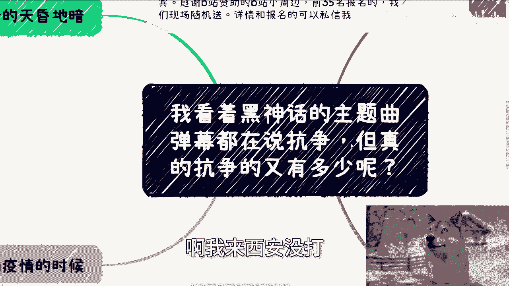
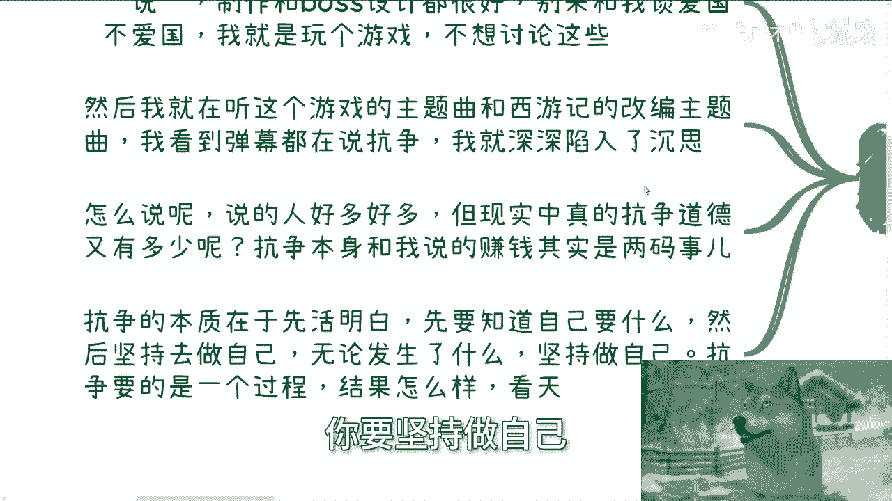
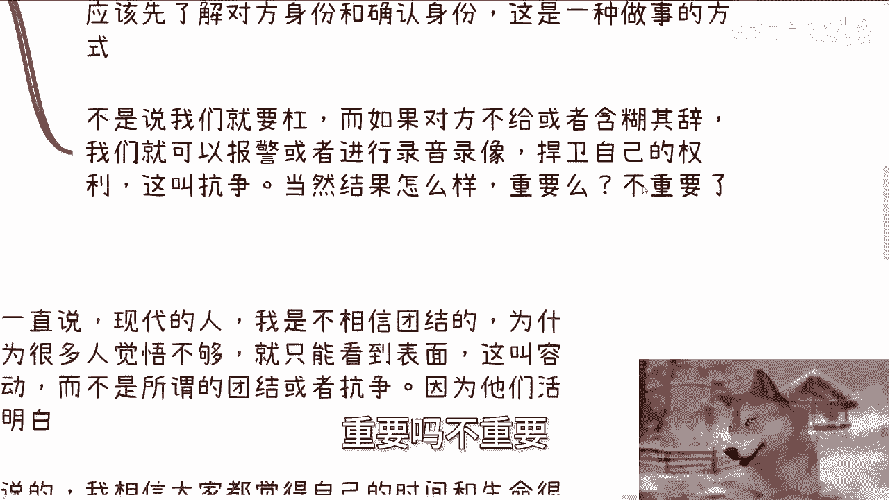
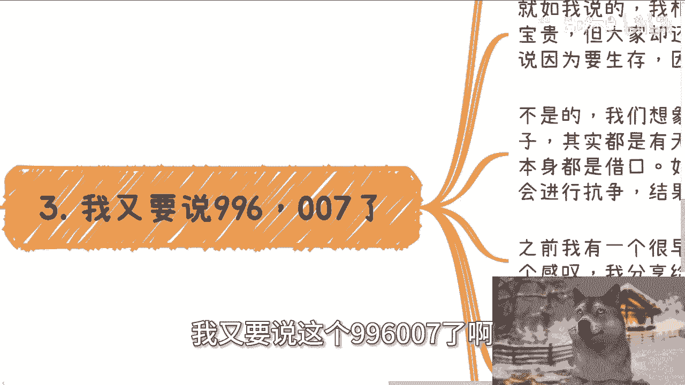

# 看着黑神话bgm弹幕都在说抗争，但真的抗争的又有多少呢 - P1 - 赏味不足 - BV1KPWyepEy5

好首先这个大家好啊，这个西安这个活动非常的成功啊，非常成功，我比我想象成功的多啊，我以为当中会有什么幺蛾子诶，我发现哎啥事没有啊，嗯然后这两天不是都在打黑神话吗，啊我来西安没打。

来西安就当旅游了，呃我先说一下那个今天主题啊，就是我看了一下B站上面的一些主题曲啊，弹幕啊，包括一些这个其他的一些音乐弹幕，都在说抗争啊，但是呢我看完了我就在那边想啊，就是真正抗争的能有多少人啊。

这就好像我们看八六版西游记跟原著差别很大，你可以认为一个是童话，一个是现实对吧，但是有多少人是被同化，就只记住了童话，没有记住现实呢，对不对啊，那么首先我先说一下下一期活动啊，下一期活动。

本次活动呢是2024年的数字经济，赋能实体产业的大会啊，也就是第二期，第一期在深圳嘛，6月30号，第二期呢在9月8号啊，在上海啊，9月8号我额，我在上海呢，是找了全国知名的一个律所的一个场地。

我找了阿里以前出来创业的那个呃，大数据的一些小伙伴，做人工智能的小伙伴，包括专门做政企业务的一些，从常州过来的嘉宾啊，那么同时呢感谢B站啊，感谢B站本次对于活动的这个赞助啊。

B站本次赞助了B站的各种小周边，好吧，前35名报名的现场，我随机给你们发啊，反正我这边后台都看得到啊，大家尽量报报了呢，我我那个你们拿自己的，到时候报名的那个二维码好吧，就过来那个领个奖品就可以了啊。

那么首先呢先说啊，我说我这两天呢玩呢都24小时在玩啊，好玩是真的好玩，那有有一说一啊，制作建模啊，包括boss的设计都很好，但是呢不要来跟我谈爱国，爱国不爱国啊，我他妈就玩个游戏，我不想有这么高的高度。

不好意思，我没这么高的觉悟啊，然后呢我就在那边听啊，就B站这边的这个游戏的主题曲，跟西游记的这个改编改编主题曲啊，我看到弹幕都在说抗争啊，我就深深的陷入了沉思，为什么呢，因为怎么说呢。

我觉得说的人好多好多，发弹幕的人也好多好多，但是现实生活当中真的抗争的能有多少人呢，对吧，这就好像很多人都觉得自己想成为孙悟空，你现在也许是孙悟空，但是能有多少人让自己去变成齐天大圣对吧。

又有多少人在被别人，就比如说如来的这种安排好的情况之下，去变成斗战胜佛对吧，就是在我看来，其实本质上你每个人可能都是孙悟空，但是能有多少人秉秉着自己的信念，去成为齐天大圣。

又有多少人连自己是什么都不知道，或者说都不受控制，然后跟着别人布下的道路去走，成了走成了斗战胜佛，对不对，那么我们说抗争的本质是什么，抗争的本质是先不活明白，先要知道自己要什么，然后坚持去做自己。

也就是说无论发生什么事情，你要坚持做自己抗争。

什么意思，抗争要的是一个过程，结果怎么样并不重要啊，也就是说抗争本身跟我一直说的，这个商业赚钱是两码事，一个是看重这过程，一个是看重结果啊，我说实话这个事童话就像我一开始说的，童话跟现实其实差别很大啊。

你就好像看过八六版西游记的，不管是前面还是后面补的对吧，就八六版西游记的，大家其实都都都对唐那个师徒四人，或者对其他的一些有一定的这种认知啊，但是很多东西是美化过的，有多少人能知道，比如说沙僧对吧。

在那个呃叫什么流沙河跟黄峰岭之间，他有个国家，那个国家最后不复存在了，有多少人知道，那个国家是被黄蜂岭跟那个叫什么，就是沙僧两边完全吃光的对吧，再加上狮驼岭灵山脚下对吧。

狮驼岭你们去看看原著对于狮驼岭的描述，那是什么，那是叫连悟空对吧，猪八戒和沙僧，包括其他的妖怪，看到都胆战心惊的那种场面是非常的离谱的，但是电视剧拍不出来。

没法拍对吧，那么你们就可以理解为这就是一个就是童话，一个就是现实啊，第二抗争本身并不是说一定要针对某个人，或者某个群群体，因为很多人对抗一说到抗争啊，他就会有种怎么说呢，有种就是抵触情绪。

或者说他就是那种，就是说我我他妈就是为了抗争，我就看他不顺眼，其实不是的，因为应该每个人是遵循活着的方式，做人的方式，也就是说每个人遵循的是自己认为的对和正确，当然这个对跟正确它不是绝对的。

其实是在每个人活的过程当中不停的被修正的。

这个就看每个人自己了，比我举个例子，比如说我们路上或者地铁上，碰到有人要查手机或者身份证，我们要去做什么，我们首先需要去问一下对方的警号和身份。

为什么，因为我们的态度很明确啊，我们不是不给你查，我们给你查，我们也不是针对任何人，而是在我们的认知里面，这是我们的私人信息，我们就是想要去先要了解对方确认信息，这是什么，这是一种做事件的方式。

这是一种做事件的态度，对不对，不是说我们要去杠，而如果对方不给我们或者含糊其辞，那不好意思，这个就是我们要抗争的过程，我们就是要去报警，或者就是要去进行录像，录音捍卫自己的权利，捍卫自己，这叫什么。

这叫抗争，当然结果OK我可能还是会给你查，OK无所谓啊，重要吗，不重要。

对不对，好我们再来说，我又要说这个996007了啊。

首先我其实一直一直都在说，现代的人，我是不相信团结的，为什么，因为很多人觉悟不够，他只能看到表面，他看到表面，他就认为这一切都是真的叫做这叫什么，这不叫觉悟，这叫什么，这叫容易被煽动啊。

而不是所谓的团结或者抗争，因为他们活的不明白，他们甚至都不知道自己活着干嘛对吧，就如我说的，我相信大家都觉得每个人都觉得你问他，你自己的时间和生命很宝贵吗，大家绝对回答你yes，谁会回答你，NO啊。

对不对，但他妈的大家不照样在996007吗，为什么呢，因为很多人说要生存，因为生活的无奈，但是你们有没有想过一个问题啊，我怎么这么讲啊，你们有没有想过一个问题，你们想象一下人活着，无论世界变成什么样子。

其实都是无奈的，今天就算不工作，大家他妈的，比如说整个社会他没有这个工作体制，你就算没有996007，你觉得呢不照样还是会有很多无奈吗，对不对，为什么，因为世界就这个样子的对吧。

只不过他无奈的表现形式不一样，所以本身都是借口，如果每个人都能认清自己的价值，就会进行抗争，结果怎么样呢，随缘啊，之前我有个很早的朋友，现在出国了啊，他发过一个感叹，我分享给大家啊，他说我不明白。

人活着的本质肯定不是为了工作啊，同时工作的本质肯定也不是为了那几天的休息，或者说一天多少的年假，对不对，那他说如果是这样的话，那么是不是说，如果你一次性把你的这些休息跟年假，全部休完了。

一次性把你的工作都做完了，大家可以去死了呢，他原话是这么说的对吧，那么我们每个人都知道，那结论肯定是不是嘛，对否则否则肯定不是这么个逻辑嘛，啊当然我不是说他说的这个观点是对的啊。

而是说我们的确是要去思考，我们每一个人这活着的价值是什么，对不对啊，第四你再比如疫情对，看过我微博置顶的都知道这叫什么，这叫抗争永久的结果怎么样呢，不重要，我在过程当中发发过的微博也被警察上过门。

OK是我的确删除了某些微博，但不重要，我抗争过了，这叫什么，这叫抗争，我捍卫了我的权利，同时我也希望帮助更多的人，而不是畏首畏尾，担心这个担心那个，或者来说就用那句说，他妈的很多人都是这样的来麻痹自己。

没有意义的呀，你说每个人活着，大家每个人都不一样吗，是不一样，但是每个人活着都活成了一个标品，有意义吗，对不对，很多时候抗争并不是要，就像像大家说，大闹天宫这种什么惊天地泣鬼神的行为，不是的。

而是体现在无数细节当中的，体现在我们活过啊，而不是一成为一个标品，其实我们一直在说寻找更多的赚钱方式，也是一个道理，为什么，因为为什么要就像我一开始说的，你如果是孙悟空，那么为什么要被如来去安排好。

去走这么一个取经之路呢，为什么最终要成为斗战胜佛呢，对不对，你明明为了自由要去成为齐天大圣，那么就像我这边说的，为什么要被学历，为什么要被所谓的打工框住呢，难道就因为我们从小被教育的时候说。

这个世界就应该这样吗，或者说从以前到现在就这样吗，那么我们就回到那个问题上面，难道我们认为这样子和以前到现在这样子，就必须这样子吗，啊哪个道理是这么讲的，所以说如果是这样的话，那么大家就不会啊。

那么就不会有大家知道的西游记，就不会有大家知道的，齐天大圣，就不会有这么多鲜活的，比如说我你们哪怕是我们说幸存者偏差，你们听到过那些生命功故事，为什么，因为每只猴都一样，每个人也都一样。

哪他妈会有这么多故事啊，没了你说呢。

对不对啊，所以我其实看那些弹幕的时候，哎我感触深也是蛮深的，你说大家要不要为名著所骄傲，要大家要不要为这种精神所，怎么说呢，感动要，但是如果不付诸于行动，不改，不从自己改变，嗯没有任何意义啊，对不对。

楚门的世界，好吧啊，那就这么着吧，然后那个活动报名啊，活动报名我就先放在那个评论区和那个嗯，那个叫什么描述啊，然后正式的那个介绍，我会在明天给大家发个视频，好吧啊行啊，就这么着，然后那个职业规划。

商业规划，你们在工作当中，和你们在一些副业当中有碰到任何问题的啊，包括一些股权啊，商额那个合同啊，额分红分润啊对吧，包括一些职业规划啊，你们希望通过我的认知，通过跟我的沟通，能够更好的帮助你们去啊。

做好未来的规划和做好一些商业规划的话，那么你们可以整理好对应的问题跟个人背景，好吧。