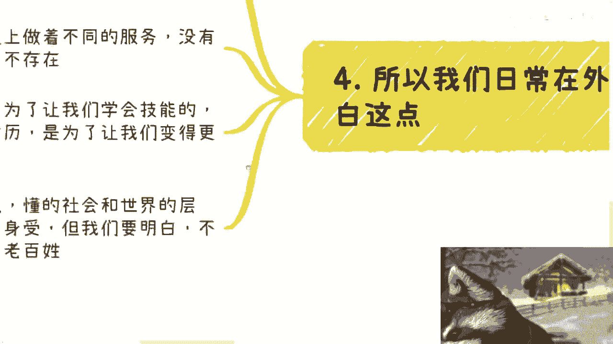
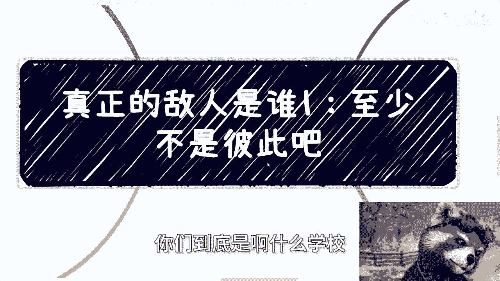

# 真正的敌人是谁1-至少不是彼此---P1---赏味不足---BV1Q4421S7AW

在本节课中，我们将探讨一个核心问题：在复杂的社会环境中，我们真正的对立面是什么？课程将结合现实观察与影视隐喻，分析个体认知的局限性与群体对立的本质，并引导我们思考如何避免陷入无谓的内部消耗。

---

## 概述：问题的提出

视频的标题提出了一个引人深思的问题：“真正的敌人是谁？至少不是彼此”。这引出了对当前社会环境中矛盾本质的探讨。

本节内容将分为几个部分，逐步展开讨论。

首先，这是一个系列的开始，后续内容尚不确定。

同时，预告了即将在深圳举行的一场活动，其规模参照数字经济大会，并邀请了一些嘉宾。

---

## 第一节：关于“举报”与认知局限的反思

上一节我们提出了核心问题，本节中我们来看看一个具体现象：网络上的“举报”行为及其背后的认知逻辑。

视频中提到一条评论，其含义是：“我先举报了，好好的环境被你破坏，想着赚钱把环境搅混了”。

面对这条评论，引发了以下思考：

第一，反思自己是否具备“搅混环境”的能力。结论是尚不具备此能力。

第二，质疑举报者的动机与目标。举报者不举报公务员或领导，而是举报普通人，这与举报“江平”的人没有区别。

第三，指出一个普遍的社会现象：部分经济条件有限或出身“小镇”的群体可能面临认知危险。

以下是具体分析：

*   **认知局限**：这部分人可能由于生活地域局限、信息单一、见识浅薄，缺乏分辨真伪与黑白的能力。
*   **自我认知错位**：他们往往自认为黑白分明、充满正义感，例如认为举报是正义行为。
*   **未来的蜕变风险**：当他们未来获得一定的社会地位、政治地位或财富后，其中很大一部分人可能会转变为真正的“博学者”（即他们曾经反对的人）。这就像“屠龙英雄最终变成龙”，但他们自身可能毫无察觉。
*   **被操控的正义**：双方都可能认为自己是正义的，如同《死亡笔记》中的基拉和L。他们容易被舆论控制。
*   **人性阴暗面**：另一部分人，心底可能本就存在黑暗与扭曲。

---

## 第二节：《饥饿游戏》的隐喻：虚假希望与内部消耗

在反思了现实中的认知对立后，我们借助一个著名的影视隐喻来理解更宏观的控制机制。

电影《饥饿游戏》描绘了这样一个世界：全国分为12个区，每年每个区抽选两名“贡品”，24人进行生死角逐，最终只有一人能存活并享受优渥生活。

电影中的统治者解释了举办“饥饿游戏”的目的：

**核心公式**：**控制手段 ≠ 威慑或恐惧**，**控制手段 = 给予（虚假的）希望**。

统治者认为，相比纯粹的威慑，给予人们一个“通过竞争获胜就能改变命运”的希望，是更有效的控制方式。当然，这种希望是人为制造的，且建立在参与者相互残杀的基础上。

由此映射到现实，我们值得思考：我们是否也陷入了某种“自相残杀”的竞争？仅仅是为了追求被他人定义好的物质生活吗？这是我们的主要矛盾吗？

---

## 第三节：疫情中的体悟：系统、执行者与同理心

从电影的宏观隐喻回到具体现实，个人的亲身经历能提供更真切的体悟。

2022年疫情期间，作者经历了物资短缺、工作受影响、与基层管理人员（警察、居委、卫健中心）发生争执等诸多困难。

在沟通中，对方反复强调：“我们也没有决策权，我们也是老百姓，我们没办法”。这让人意识到，在一个庞大系统中，能直接接触到的往往是没有决策权的执行者。即便为难他们，也无法改变结果。

因此，推导出一个日常处世观点：在日常生活中（例如餐饮、咖啡店等场景），不应咄咄逼人。

**核心逻辑**：**Office白领 ≠ 更高阶层**。大家都是在不同场景、不同岗位上为生活奋斗的普通人，本质并无高低之分。我们之间不应存在无谓的鄙视链。

那么，读书学习的意义是什么？不是为了掌握技能或获取学历（那如同在“饥饿游戏”中训练杀人技巧）。学习的真正目的，是让人变得更像“人”——一个能控制情绪、具备大局观、理解社会参差的正常人。我们需要的是同理心，是接地气，是不脱离普通民众。

---

## 第四节：成为“正常人”与识别真正的敌人

综合以上讨论，我们可以得出更清晰的结论：首要任务是完成作为“人”的构建。

无论个人取得何种成就、来自什么学校、拥有何种学历或技能，这些都不是最优先的。

优先事项是**成为一个正常人**。观察网络和身边，真正的“正常人”可能并不多。

由此，回到标题问题：真正的敌人是谁？它并非单一的“资本家”或“既得利益者”。世界不是一元模型，而是多元的。

**真正的敌人可能是**：
*   实体性的存在。
*   思想层面的桎梏。
*   多种形式的复合体。

关键在于，我们必须拥有分辨“谁是敌人”的能力。至少，彼此争斗的普通人，不应是对方的主要敌人。

---

## 总结与后续

本节课我们一起学习了如何通过具体现象、影视隐喻和个人经历，反思社会对立的本质。我们认识到认知局限的危害，理解了“虚假希望”作为一种控制手段，体会了系统内执行者的困境，并明确了培养同理心、成为“正常人”的重要性。最终，我们得出结论：真正的敌人是复杂多元的，但至少不应是我们彼此。

关于这个主题，是否会有第二部分内容，目前尚不确定。

因为该话题比较敏感。

最后，再次提醒深圳活动，并可报名参与。此外，作者提供关于股权设计、商业规划、职业规划、商业计划书及个人发展策略方面的咨询。

若有需求，需整理好个人背景与具体问题。