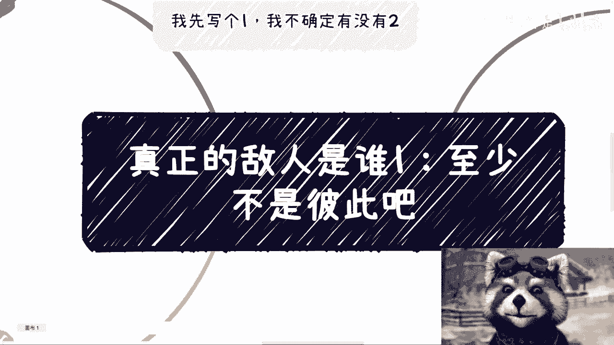
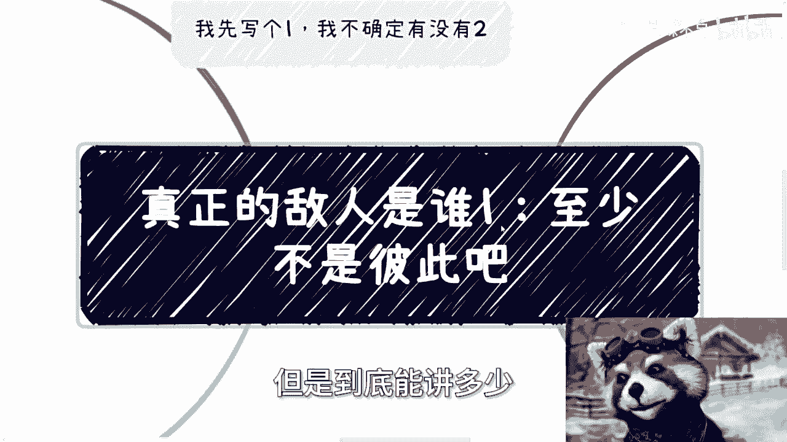
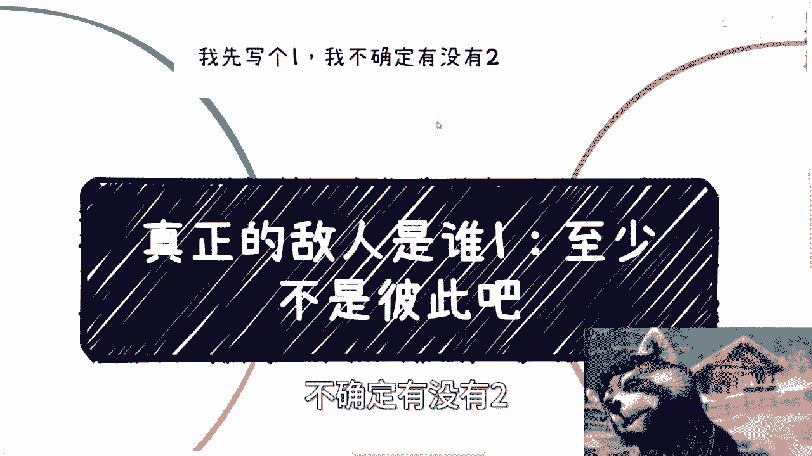
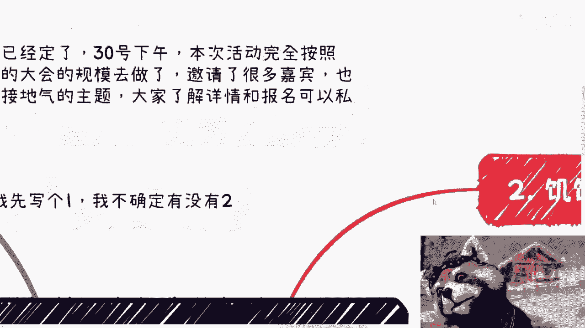
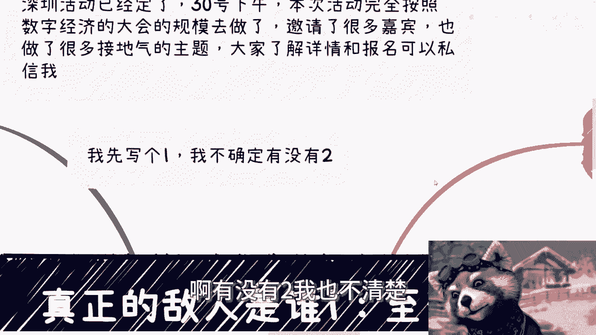

# 真正的敌人是谁1：至少不是彼此 - P1 - 赏味不足 - BV1Q4421S7AW

好啊这个标题嗯大家也能看到对吧啊，但是到底能讲多少。

我也不知道啊，额首先呢我就先写个一啊，不确定有没有二好吧。

呃深圳深圳活动额就后天好吧，礼拜天下午啊，然后本次活动按照数字经济大会规模去做啊，邀请了一些嘉宾。

还有啊一些主题好吧，然后大家报名的现在还能报啊，那么呃一样的，就跟昨天那个免费视频讲的一样啊，就先说先来说一下这个这个评论啊，那个评论的意思是什么呢，意思就是说啊我先举报了啊。

然后好好的环境呢就被你破坏了啊，想着赚钱把环境搅混了啊，呃就很好玩啊，首先呢我就那我看到这评论，我就在反思啊，第一就是我有这个能力吗，啊我好像我好像还没这个能力啊，我我觉得我很惭愧啊，我很惭愧对吧啊。

其次呢你说你们有这个能力吗，啊你说你放着这个公务员啊，领导不举报，你举报我啊，那跟举报那些江平的那些SB有什么区别呢，对不对，妈毫无区别啊，比他妈那些人还要啊，我一直说啊，我说很多很穷的人啊。

以及很多小镇做题家其实是非常危险的啊，为什么啊，你们仔细想想看，因为他们根本就不知道真假啊，他们也没有任何分辨能力，他们也不知道黑白，为什么，因为局限在一个地方太多了，洗脑太多了，见识太浅薄了啊。

那么这些人呢往往就自认为非常的黑白分明啊，就是说你你你会觉得这些人非常危险，但这些人自己不这么觉得，这些人自己会觉得唉自己好像很正义啊，很正义来举报，但是呢你们我就告诉你们这些人啊，等他们工作了。

等他们以后成为了公务员啊，呃我敢打赌，不是不说小概率吧啊至少有那么一大部分啊，拥有了一定的社会地位，政治地位甚至赚到钱之后，他们就会成为真正的博学者啊，也就是说这些所谓的自己作为呃。

叫什么屠龙英雄的人啊，最终会变成龙啊，但是呢他们自己还不自知啊，他们觉得他们就是正义啊，就跟死亡笔记里面啊，这个基拉跟L啊，双方都认为啊，我就是正义，那为什么呢，因为他们很容易被别人控制，被舆论控制。

那另外一方面啊，这些人啊有有那么一撮人啊，心底就很黑暗啊，就很扭曲啊。

第二呃饥饿游戏啊，我不知道大家有没有都看过啊，没有看过，可以这个电影可以再去回顾一下啊，呃饥饿游戏里面一共有12个区啊，每次每个区都会选出两个人啊，然后24个人进行大逃杀啊，也就是所谓的吃鸡对吧啊。

就相互干啊，最后只能有一个活人活着啊，作为胜出者，那么胜出者有什么好处呢，就是享受更好的物质啊，生活啊等等等，那么里面呢在这个电影里面啊，呃电影里面的领导啊，曾经说过这么一句话。

他说为什么我们要举办饥饿游戏，他说是为了对于这些民众进行威慑吗，不是那是为了让群众害怕吗，也不是因为卢主如果仅仅是威慑和让他们害怕，那么我们可用的方式多了去对吧，那举办饥饿游戏的意义只有一个啊。

那就是给人希望，为什么，因为希望相对那些纯粹的威慑跟害怕，更能够去怎么说呢，控制啊，那么当然这种希望是虚假的，为什么，因为OK这种希望是人为造成的，而且更何况要记要建立在大家相互残杀上面啊。

但是呢有这种希望能够更好的治理对吧，那么问题来了，从我们来讲，我们为什么要去自相残杀啊，就因为要过上别人所定义好的那种物质生活嘛，啊这件事情是我们的主要矛盾吗，对吧啊，那么把这个电影映射到现实生活当中。

你们再自己想想看啊，那么第三疫情的时候也是2022年啊，也就作为最后一年啊，我们没有外卖啊，楼里也没有消杀啊，甚至有一些人没有吃的啊，因为家里面没有这种呃明火啊，就所以他没办法做烹饪啊。

那么政府发的很多东西，也都是不是那种纯干粮啊，那么我当时呢因为疫情啊，要物资呃，包括就是说这个疫情不能出行，也影响了我的一些工作啊，那么我也被警察上过门啊，我也跟居委吵过架啊。

我也打打过无数的12345经营相关的，这个需求的表达啊，我也和当地的卫健卫生健康中心啊争吵过对吧，但是在沟通当中呢啊也出现这么个情况，就他们不停的向我表述了自己的身份啊，当然真假先不说啊。

但是我也可以明白，在一个庞大的系统系统当中，说白了我所能沟通到的，我所能接触到的肯定也不是什么有决策权的人，所以说他们不停的向跟我表达的意思，就是说啊我们也没有决策权，我们也是老百姓对吧。

你不要跟我们讲，我们也没办法啊，对吧啊，所以说我很清楚，我无论多为难他们啊，也不会得到我想要的结果，那么第四，所以说呢我们日常在外要一直明白这一点，就是你比如说啊前两天的咖啡的这个事情啊。

包括你们日常在外面的餐饮啊，不要咄咄逼人，因为为什么，因为大家都是一样的，有什么区别呢，你不要觉得你在office里面对吧，你就怎么样，你说啊我可能是个白领对吧，我可能是个怎么样子，有什么区别呢。

不都是为生活奋斗，被生活所迫吗，对吧，我们只不过在不同的场景，不同的岗位上做着不同的服务，你在这个层面上，你还要去孰高孰低啊，那我觉得他妈的你就是啊，至少我们之间是不存在这种孰高孰低的。

所以我一直觉得所谓读书啊，所谓学习是为了什么，不是为了让我们学会技能，也不是为了让我们有个学历啊，就像我们刚刚说的，你去参加饥饿游戏，不是为了把别人杀了哦，呃学习是为了让我们变得更像一个人啊。

更像一个正常人呃，懂得控制情绪，懂得大局观，懂得社会跟世界的参差啊，我们一定要明白就是感同身受啊，要这么说，我们不一定要不一定能够做到完全感同身受，但是我们要明白，我们不能不接地气。

我们要我们不能完全的脱离老百姓对吧。

我不管你今天是谁，你到底达成了什么样的成就对吧，就我所以我才说我不关心啊，你们到底是啊什么学校。

我也不关心你们到底什么学历，我也不关心，你们现在到底手上有什么样的技能啊，但是啊不管怎么样啊，我们得要先成为一个人，成为一个正常人，你们再去看看网上，再去看看你们身边彼此能有多少是正常人对吧。

那我就说了，就说不真正的敌人不是你们想的说啊，可能只是资本家，或者只是一些啊既得利益者不是这么单纯的，因为世界不是这么一个单元化的，一个一个一个一个模型，它是个多元化的，怎么样是真正的敌人。

真正敌人很多很多对吧，他有可能是呃实体表达的，也有可能是一些思想层面的都有可能，但是不管怎么样啊，我们得要明白，分得清楚谁是敌人对吧啊。

好那么这个就直接这么说吧，啊有没有二我也不清楚。

我也没想好，因为这个问题比较擦边对吧。

呃好吧，然后后天就是深圳活动啊，然后报名的咱们继续报，然后剩下的话就是股权，股权啊，就商业规划啊，职业规划啊对吧，呃商业计划书白皮书啊，啊分红分润啊，这个叫什么，就是股权啊，期权啊对吧。

包括你们手上有什么牌，你们没有什么牌，你们希望通过跟我的沟通啊，让我能够根据你们实际的情况，能给你们给你们一些更接地气，地气的，或者更接近于当下经济发展的，一些建议和规划的话啊。

那么你们整理好问题跟个人背景。

