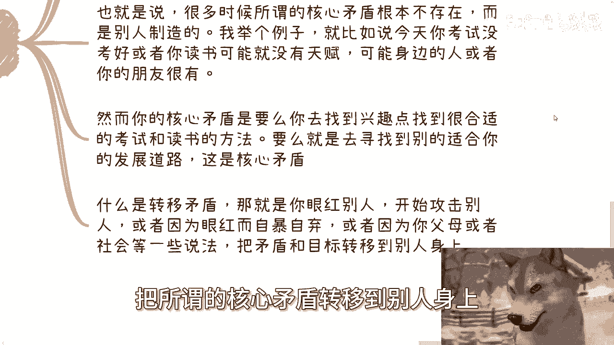
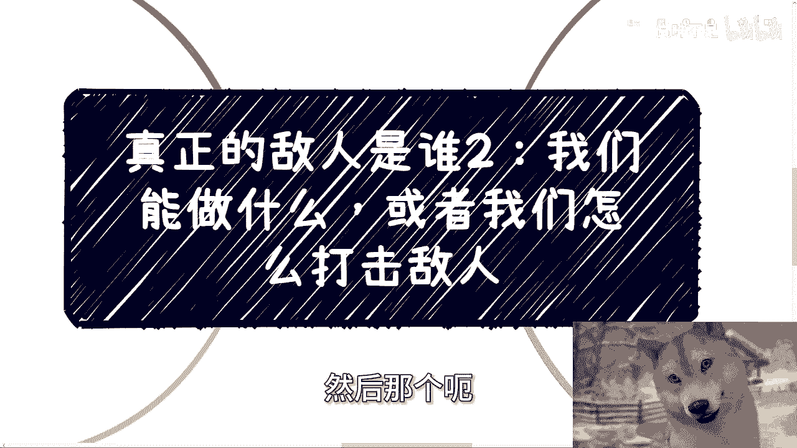

# 课程：真正的敌人是谁（二）—— 我们能做什么，如何应对？ 🎯

在本节课中，我们将探讨一个核心问题：面对复杂的现实环境，我们个人能做什么，以及如何正确应对所谓的“敌人”。我们将从提升自我和构建支持网络两个维度展开，帮助你建立清晰的行动思路。

上一节我们讨论了“真正的敌人”这一概念，本节中我们来看看具体的行动策略。

## 第一部分：我们能做什么？

个人能做的事情可以归纳为两个核心要点：提升思想认知与积累有效资源。

### 1. 提升思想认知与接地气

核心在于建立对物理世界的真实认知，而非依赖网络上的二手信息。

以下是具体做法：
*   **深入实践，了解真实运作**：主动了解社会、企业、组织的真实运作方式和目标。真正的认知来源于亲身参与和实践。
*   **摒弃空谈“道与术”**：在缺乏对物理世界基本了解和实践经验的前提下，空谈抽象的“道”与“术”没有意义。一切提升的前提是**接地气**。
*   **识别真实矛盾**：只有对真实世界有深刻认知，才能分辨哪些是真正的“敌人”或有害现象，哪些是虚假的叙事。

### 2. 积累有效资源：金钱与时间

目标是获取更多可自由支配的时间，为个人成长创造条件。

以下是具体做法：
*   **追求更高性价比的收入**：在年轻时，应致力于以更高的效率赚取收入。核心公式是：**收入 → 换取自由时间**。
*   **明确金钱的目的**：不必纠结于具体数字（如100万或1000万）。关键在于这笔收入能否为你**释放出更多的个人时间**，用于学习、思考和提升。
*   **避免本末倒置**：如果等到拥有财富时，身体和认知却已跟不上，财富的价值将大打折扣。

## 第二部分：如何构建支持网络？

在提升自我的同时，我们需要建立一个由真实合作过滤出的、多元化的支持网络。

上一节我们介绍了自我提升的方向，本节中我们来看看如何借助外部力量。

### 1. 筛选“一起打过仗”的朋友

通过商业或项目合作自然过滤出的伙伴关系最为可靠。

以下是具体做法：
*   **重视共同经历**：需要的是“一起打过仗”（即共同完成项目、应对挑战）的朋友。这种关系基于相互了解和信任。
*   **多元化网络的价值**：这个网络应尽可能涵盖不同领域和职能的朋友，例如：
    *   司法、媒体、医疗、教育机构从业者。
    *   金融（一二级市场）、创业者、传统行业（如土木、海关）人士。
    *   科技、农业等政府相关条线的工作者。
*   **网络的作用**：他们能提供一线真实信息、商业机会，并在关键时刻提供帮助。

## 第三部分：关于“打击敌人”的思考

在满足前两部分的基础上，才可能谈及应对策略。对大多数人而言，首要目标是避免被利用。

以下是核心观点：
*   **现阶段重点不是打击**：在未能完全实现自我提升和构建有效网络前，思考如何“打击敌人”为时过早。
*   **核心是“不被利用”**：更现实的目标是**避免成为被转移矛盾的工具**。不要眼红他人，不要落井下石，不要盲目凑热闹，避免成为“无辜的雪花”。
*   **识别矛盾转移**：许多你感受到的“核心矛盾”可能是被制造出来的。例如，自己读书成绩不好，核心矛盾应是寻找适合自己的学习方法或发展道路，而非嫉妒天赋好的同学。
*   **社会普遍现象**：大多数人（乌合之众）难以看清核心矛盾，常纠缠于次要矛盾或他人设定的议题。

## 第四部分：培养独立判断力

应对一切复杂情况的基础，是独立的判断力。

以下是培养判断力的关键：
*   **判断力来源**：判断力源于你的**认知、见识、实践、经济基础和圈子**，而与沉迷短视频等被动接收信息的行为无关。
*   **承认认知局限**：没有人是全知的神。我们只能判断自己能力范围内的事情。
*   **借助网络弥补**：对于能力范围外的事情，可以借助第二部分构建的**朋友与圈子**来帮助判断。
*   **专注自身成长**：最核心的是将全部注意力放在**自身的成长与积累**上。公式是：**注意力 → 投入自我成长**。避免任何内耗、眼红或过度关注他人。
*   **理解他人成就**：如果一个人获得了某些成就，必然有你看不到的能力或付出在支撑。可以不屑，但无法否定。

本节课中我们一起学习了个人应对复杂环境的行动框架。我们拆解了“我们能做什么”与“如何应对”这两个问题。

总结来说，我们能做的是：**在年轻时，将所有关注点放在自己身上，追求更高的认知、更多的自由时间（通过性价比更高的收入实现），并构建一个由共同经历过滤出的、多元化的支持网络。**

关于“打击敌人”，我们现阶段应追求的是：**拥有独立思考能力，避免成为被利用的工具，避免陷入被转移的矛盾中。** 只要能做到不人云亦云，不是非黑即白的“二极管”思维，就已经是一种超越。

如果你在职业规划、商业规划（包括股权期权、商业计划书撰写）或如何梳理自身资源方面需要更接地气的建议，可以整理好具体问题进一步探讨。