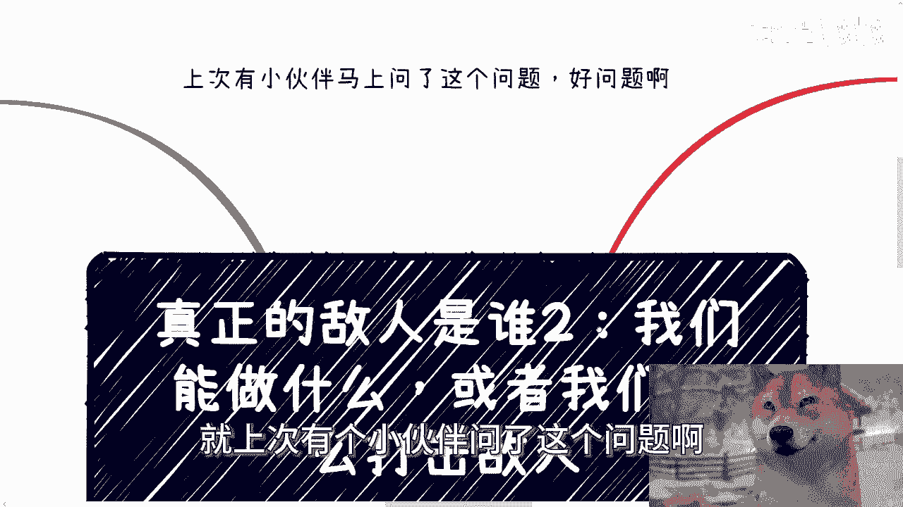
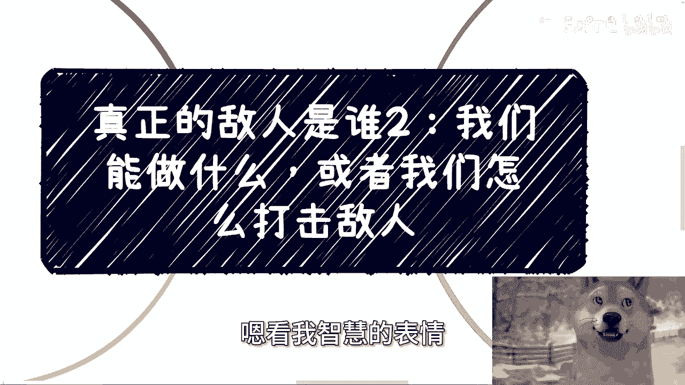
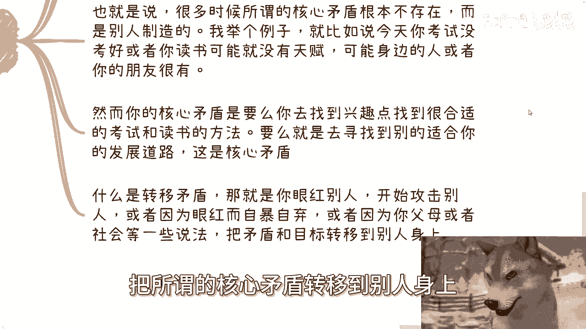
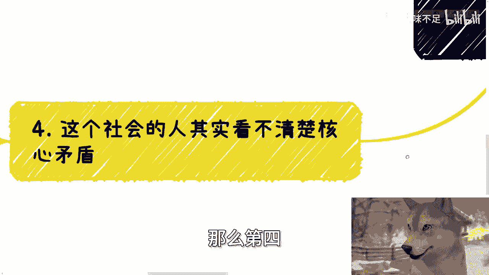
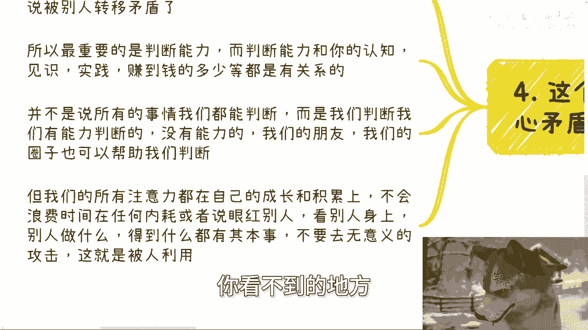
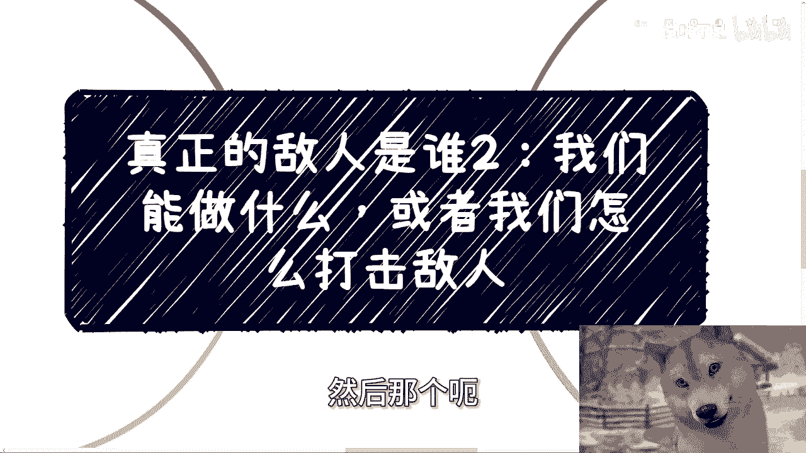

# 真正的敌人是谁2：我们能做什么，或者我们怎么打击敌人 - P1 - 赏味不足 - BV1kT421r7Sf

好啊这个感谢上次提问的，就是上次有个小伙伴问了这个问题啊。

感谢问了这个问题呢，所以有了这个二啊，我其实都没想好二到底讲什么东西，嘶嗯嗯看我智慧的表情。

对不对啊，好那么今天我们讲的呢是真正的敌人是谁，二啊，然后他问的问题呢叫做我们能做什么，或者我们怎么打击敌人啊，这个问题蛮好的，但有点大啊，首先第一点我们先做，我们能能做什么呃，很简单。

从两就我觉得就几点，第一点呢，就是从思想上让自己有足够高的认知啊，就比如我一直说的社会上各种组织，组织怎么运作的，一个企业从开始的时候具体怎么做，大家目标是什么对吧，那么你的了解是真正的参与进去了解。

而不是说从什么短视频或者网络上哦，否则你了解到的也是假的啊，当然了，这个呃，有些人呢非要跟我来讨论什么道跟数的问题，我跟你们讲啊，在我的认知范围里面没有什么道跟数的问题，为什么哎我就这么讲吧，就算啊。

你们未来所有的人都有道上面的什么什么，什么什么提升或者树上面的提升，它的前提也是，你一定得要先对这个物理世界得要有了解，你不要想着就是说哦你现在什么都没实践过，物理世界也不了解对吧。

各种各样的东西也没有实践过或者怎么样的，然后你说好，陈老师，我他妈要现在学术来，而且学道来学你个蛋啊啊好，那么我跟你讲啊，你其实只有思想上有了足够高的高度跟认知，就是我说的接地气，对于真的事情啊。

对于所有物理世界里面发生的真的事情，而不是说大家什么啊莫名其妙什么什么短视频，这边不播，那个说了个八卦，那边说了个八卦对吧，那就对真的事情有真正认知之后，你才会明白敌人是哪些或者是哪哪一类现象啊。

那么另外一方面，就是我们要让先自己先赚到多一点钱，这事儿其实也简单啊，你先别管这个钱，所谓多点钱的定义是多少，有很多人非要去纠结啊，100万1000万一个亿对吧啊，我跟你讲没有意义的，你要做的是什么。

就是去要在年轻的时候以更高的性价比赚到钱，你不要去管这个钱多钱少，这个钱的目的是为了释放出更多的，你自由的时间啊，这个跟每个人的情况，跟每个人所要消费多少，跟每个人想要多少，和每个人具体情况都有关系的。

你不要去管他妈的这个钱多多少，只要它能够释放出来，你更多时间就可以哦，否则你想想看未来，就算你有了钱，你有更多时间，你身体啊，你的认知都跟不上，有卵用啊，对不对，这是第一点啊，第二点。

社会上过滤下来足够多的呃，商业上过滤下来足够多的朋友，商业上过滤出来的朋友真的就是一起打过仗的，就虽然我们现在说的打仗，跟以前说的那种战争不一样，但是你要的就是这种打过仗的朋友，呃，其实除了钱以外。

我们需要的是各种不同的组织，不同级别的当然不用多啊，不同类型不同组织的就更好，比如说我跟这边给你们举个例子，比如说司法法院，媒体医疗学校，各种K12成人教育机构，一级市场，二级市场创创业者对吧。

包括传统行业的，比如说土木对吧，海关对吧等等，各种地方跨境的你都得用啊，当然包括就是说各地方包括什么公信，公信啊，科技厅啊，农业厅啊，龚庆这条线啊，科技这条线啊，啊科创啊，包括夹克当当中。

你要尽可能多的那最好对吧，包括公务员，那最好啊，那么这些人不但能够提供给你真实的一线信息，帮助你获取到更多的商业机会，也能够在你碰见问题的时候救你一命啊，说严重点就建议救你一命，或者说能够帮助到你的人。

但是前提是什么，前提是你们要一起打过仗啊，就是一起赚过钱或者一起做过项目，大家是相互了解的好，那么第三点关于我们怎么打击敌人对吧，我觉得啊打击敌人有点过了啊，打击敌人肯定是满足了一跟二的所有事情之后。

你再来考虑的事情，而且就算了，你能够百分之百满足一跟二，你能否打击啊，我都另说啊，所以我觉得我们大部分人，现阶段不是想着怎么打击敌人，更多的是怎么不被敌人利用，或者说不要被别人去转移矛盾，你明白吧。

我这边所说的不要转移矛盾，就是不要去眼红别人，不要去落井下石，不要去凑热闹啊，你不要成为，那就是就是所谓的那个什么无辜的雪花，就可以了，那么也就是说，很多时候所谓的核心矛盾根本就不存在，而是别人制造的。

我举个例子啊，就比如说今天你考试没有考好，或者你读书可能就没有天赋啊，那么而我们就说一个世界，在人类这个世界里面，总有人某些东西做得好，总有人某些东西做得好，那我就这么问你，你今天读书读得不好。

或者你今天读书没有天赋，你觉得这是核心矛盾吗，哦我他妈我天生没有天赋，或者我天生某个东西不擅长，这他妈就有矛盾了没有啊，对不对，就是对你来讲，你不是叫核心矛盾啊，就是你的核心的注意力应该是。

你要么去找到读书的兴趣点，你要么就是去找到合适你自己的，考试和和应试教育或者读书的方法对吧，你要么就是说确定了，你说啊，我觉得我就不是这块料啊，那么你就去寻找别的合适你的发展道路对吧。

这个是你要去寻求的东西好，那么我们就说什么叫转转移矛盾，转移矛盾就是你老是把眼光放在别人身，你老是觉得卧槽他妈的，别人为什么读的这么好对吧，然后他也不复习对吧，他也不看书，他他妈一天到晚在那边玩对吧。

然后啊这个我我非要去告诉他父母，非要告非要举报他对吧，说他不这个不务正业对吧啊，你开始眼红别人，开始攻击别人，或者还是说因为眼红而自暴自弃，或者来说你因为你身边的父母人，因为一些社会等一些舆论方式。

把所谓的核心矛盾转移到别人身上。

这个就是你已经被利用了，对吧好，那么第四这个社会人其实是看不清核心矛盾的。

当然啊我觉得从以前到现在其实都是如此，因为乌合之众嘛对吧，那乌合之众就是这个意思嘛，所谓乌合之众就是无法看到核心矛盾，他们永远解决的其实都是次要矛盾，或者来说把眼光放在别人给他们的矛盾点上面。

所以最重要的是判断能力，而判断能力跟你的认知，跟你的见识，跟你的实践，跟你赚多少钱，跟你的圈子都有关系，唯独没有关系的就是他妈的，你们每天都在那边看短视频，都肯定没关系啊。

当然并不是说所有事情我们都能判断啊，不是没有一个人是神啊，没有一个人能够知道所有的东西，所以说我们能判断的是我们有能力判断的东西，没有能力的，我们的你所通过刚刚我们说的这个二对吧。

就是这个商业上过滤下来的朋友，就是你通过二所积累下来的关系，我们的圈子，我们的朋友，我们的关系能帮助我们判断对吧，但是核心在于哪里，核心在于我们的所有的注意力，都得在自己的成长跟积累上面。

就像我们刚刚说的，你的核心矛盾就是你的成长没了，对吧不，你不要浪费在任何内耗，或者说眼红别人，或者跟这个把眼光落在别人身上对吧，别人做什么，得到了什么东西，都是他的本事，还是那句话。

你觉得这个人没有能力，如果他得到了一些东西，一定是因为他在别的地方，你看不到的地方。

他有一定的能力，当然你可能不屑于这些能力，但是你不能否定他，对不对，所以说你你不能因为把眼光老是落在别人身上，或者说因为一些别人的一些舆论，或者来说社会的这个大的这个媒体的导向。

让你去把一些啊核心的就是你自己成长啊，你自己积累啊，你自己怎么样东西都不关心啊，每天就在那边关心啊，这个八卦哎，那个人怎么样，这个人怎么样，没有意义的，对不对啊，所以说我觉得我觉得这个问题拆成两个。

你说我们能做什么，我们能做的就是在年轻的时候，尽可能的把关注点所有点都放在自己身上，你要的就是更高的认知和更多的钱对吧，或者更多的自由吧，应该这么说啊，而不是说每天在那边被被打工所牵。

在在在消耗消耗你的生命对吧，那你说我们打击打击，你先不要去考虑你能不被利用，我跟你讲，你你已经谢天谢地了啊，我已经谢天谢地了，就这么简单啊，你能够有自己的思考，有自己的判断，至于你这判断对不对，咱再说。

你只要有自己的思考，不是二极管，你已经超脱了啊，行好吧，就这么着，然后那个职业规划啊，商业规划啊，股权期权，然后商业计划书，啊股权期权商业计划书啊，然后那个职业规划。

商业规划啊，那个白皮书啊，包括啊你们手上有什么牌啊，你们没有什么牌，你们希望通过跟我的沟通，能够得到一些更接地气的呃建议，或者来说规划的话，那么你们再整理好对应的问题好吧。

