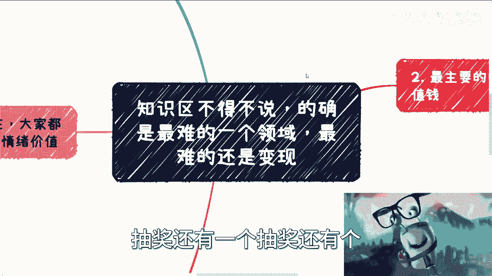
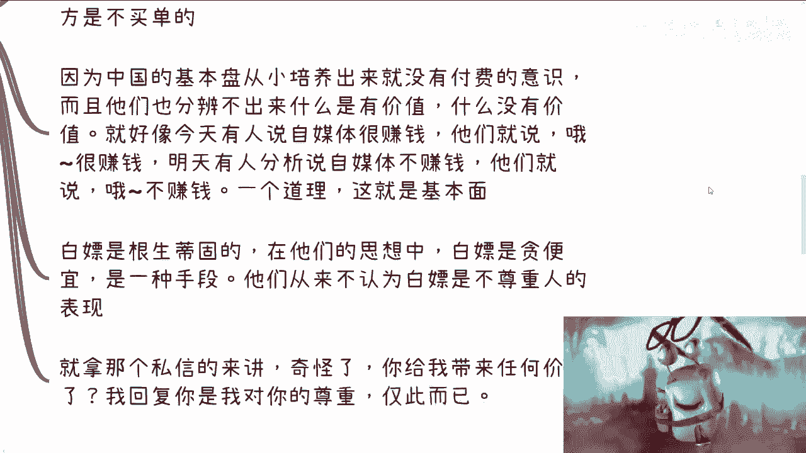
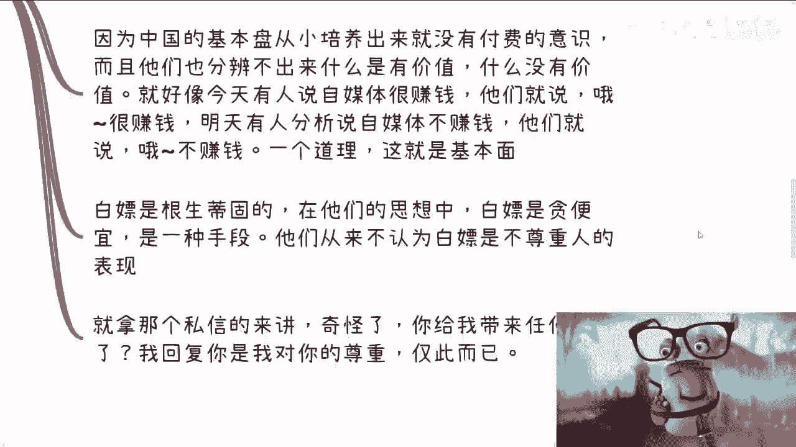
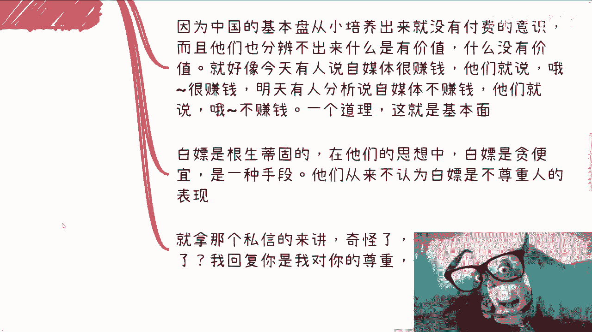
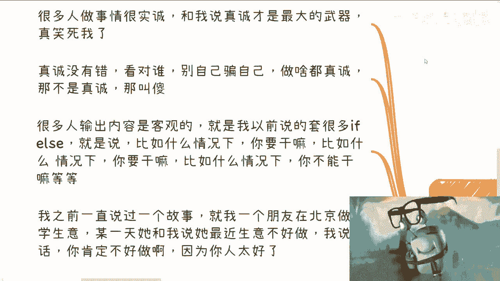

# 课程一：知识区为何是自媒体中最难变现的领域？ 💡

在本节课中，我们将深入探讨一个核心问题：为什么知识分享类自媒体（知识区）在众多内容领域中，被认为是创作难度最高、且最难实现商业变现的？我们将从市场基本面、用户心理和内容策略等多个角度进行分析。

## 前言与背景

国庆节已经结束。首页的抽奖活动仍在进行，包含一个20元、10个红包的抽奖，可以参与。

---

## 核心论点：知识区最难，变现尤甚

我认为，知识区可能是自媒体中最难的一个领域，而其中最困难的部分是商业变现。

上一节我们提出了核心论点，接下来，让我们通过一个具体的观察来切入分析。

### 来自同行观察的启示

B站最近将我拉入了一个新的万粉UP主群。出于好奇，我查看了群内一些同期达到十万粉丝的账号。

以下是观察到的普遍现象：
*   账号多在9月份达到十万粉丝。
*   普遍播放量不高。
*   通过“充电”（一种用户直接赞助功能）获得的收入极少。

这个观察引出了一个尖锐的问题：网上很多人说做自媒体赚钱，但具体到知识区，钱从哪里来？

---

## 知识变现困难的核心原因分析

基于上述观察，我们可以总结出知识区变现难的几个根本原因。

### 1. 知识本身在自媒体环境中“不值钱”

这是一个需要正视的现实。知识在自媒体这种放大镜下，其直接货币价值被严重稀释。

判断价值的标准是客户是否愿意付费。在中国市场的基本盘上，客户的首要特点是**深度习惯于“白嫖”**。

**案例说明**：曾有用户私信咨询非具体问题。在礼貌性回复几条，并建议对方先自行了解、明确问题后再来交流后，对方反而抱怨“说话真费劲”。这反映了部分用户缺乏为初步咨询付费的意识，甚至不认为占用他人时间需要尊重。

这种现象不仅存在于普通用户（C端），在商业合作乃至更高层次的合作中同样存在，只是比例不同。

### 2. 用户付费的核心驱动力是情绪价值，而非知识

当前知识变现的一个关键认知是：大众付费更多是为了获取**情绪价值**，而非纯粹的知识。

以知名考研导师张雪峰为例，他的业务非常接地气，直接关联考研与选专业。虽然能提供实际帮助，但存在局限性：
*   **信息不对称**：用户往往无法准确描述自身问题，导致导师获得的信息是“冰山一角”，给出的建议自然难以完全精准。
*   **执行偏差**：用户即使当面认可建议，背后也可能不执行或质疑。

因此，在自媒体领域，能够获得高流量和商业合作的，往往是善于**贩卖情绪价值**（如共鸣、焦虑缓解、爽感、认同感）的内容，而非单纯输出知识。知识本身在传播中变成了承载情绪的载体。

### 3. 流量偏好极端观点，中庸内容缺乏看点

从事网络营销的人都明白一个道理：**极端观点才有流量，中庸之道毫无看点**。

许多知识区创作者崇尚“真诚”，但需要对谁真诚、在什么场合真诚进行区分。在任何情况下都毫无策略地“真诚”，在商业传播中可能效果不佳。

**案例对比**：
*   **“真诚”但低效的方式**：在留学咨询中，为客户详细分析各种情况、潜在风险，苦口婆心。结果可能导致用户觉得复杂、不自信，转而咨询他人，甚至怀疑你低价是因为有问题。
*   **“极端”但高效的方式**：直接给出肯定结论和明确高价（如“100万，能搞定”）。用户反而可能觉得你专业、果断、有实力。

这是因为中国部分用户存在根深蒂固的怀疑心态，他们更倾向于相信简单、肯定、自信的断言。知识区创作者往往过于实诚和细致，反而难以抓住用户这种情绪痛点。

### 4. 创作者的个人定位限制

我个人的定位倾向于“中庸之道”，这源于我的认知和风格。若要追求极致流量，可能需要采用更极端的言论方式，例如全盘否定某些普遍选择。虽然我不认可这种一刀切的方式，但不可否认，在流量市场上，**博眼球的往往是极端和绝对化的观点**。

---

## 总结与建议

本节课中，我们一起学习了知识区自媒体变现困难的多重原因。

**核心总结如下**：
1.  **市场基本面**：知识在自媒体环境中直接变现能力弱，用户普遍付费意愿低。
2.  **用户心理**：用户深层需求是**情绪价值**，而非知识本身；且普遍存在“白嫖”心态和怀疑倾向。
3.  **内容策略**：流量青睐**极端、断言式**的观点，中庸、客观、细致的知识阐述在传播上处于劣势。
4.  **创作者困境**：知识型创作者往往在“真诚分享”与“迎合市场”之间面临两难。

因此，若想在知识区获得商业成功，创作者可能需要重新思考：你提供的究竟是“知识”，还是以知识为包装的“情绪解决方案”？理解并驾驭这种差异，或许是破局的关键。

---
如果有关于商业赚钱方式、个人职业规划或如何打好手中牌等更具体的问题，可以整理好详细的背景资料和问题清单，通过私信进行咨询。