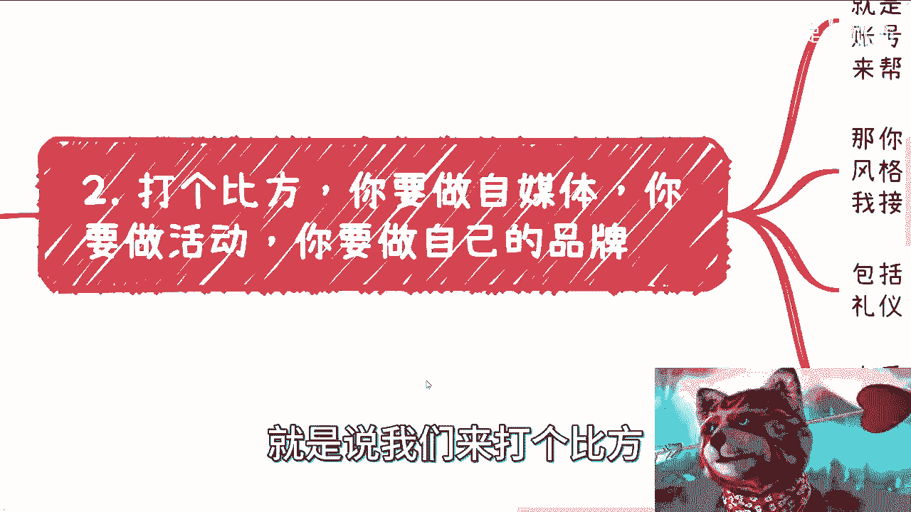
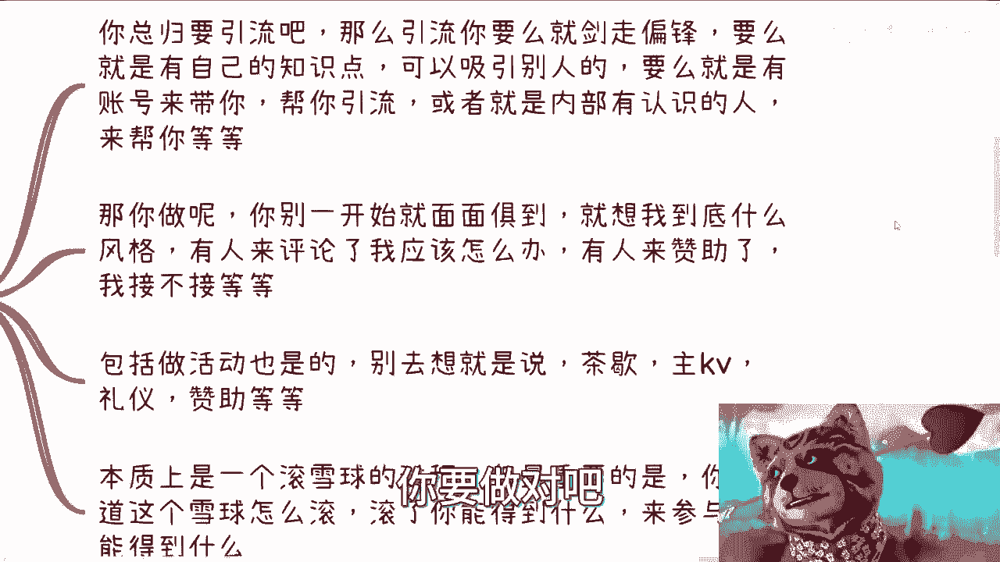
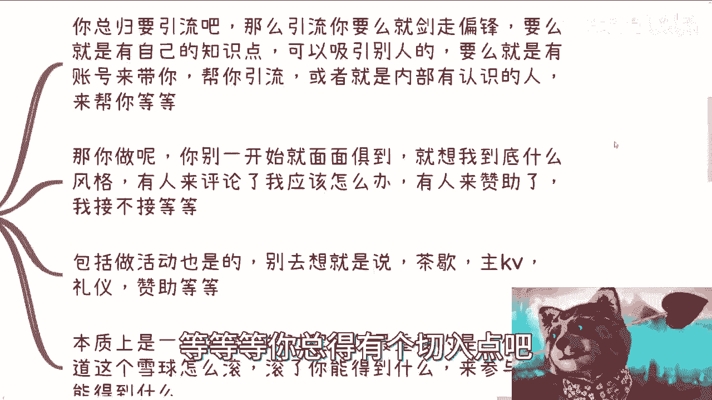
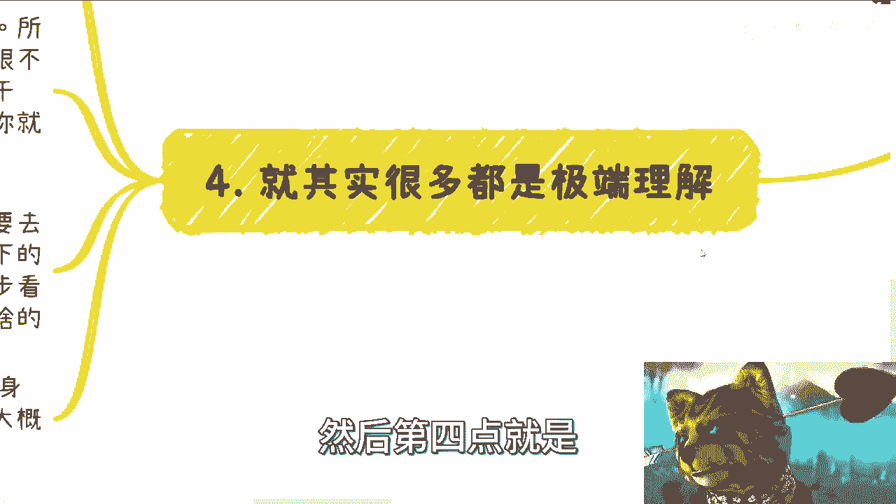

# 确定目标之后就别曲线救国，也别想太多，也别啥都不想 - P1 - 赏味不足 - BV1yw41187tT

好大家好，我唉我真的无语了，我真的无语了啊，首先啊有小伙伴跟我说，抖音上有这个账号啊，那不是我啊，我只能说他妈的的确不要脸啊，不愧是我说的普罗大众，就是我还套娃，你知道吗，就是他盗了我的视频。

然后呢到的还是那种不要大家不要被白嫖，那对吧，然后上面解释还呃这个这个这个著名还写着，这是唯一的账号哦，欢迎商业合作，唉他妈的我他妈也是无语无语了，真的是真的，中国商业就这个样子，我就这么跟你们讲啊。

咳咳言归正，言归正传啊，上海活动场地已经定好了啊，12月16号好吧，这次呢我也请了一个英国留学的小伙伴，给我们这个大家分享数据，数据治理和数字经济相关的东西啊，然后他会有一个topic。

我会有个topic，好吧，呃大家要报名的可以私信我好吧，北京活动已经满了，北京就别找我了，这个微软那边我沟通过了不行啊，就就限死了好吧，OK那么本期的内容呢是我们有个目标，就朝着目标做，别取钱救国。

别想太多啊，也也当然我这个标题写不下了，我的意思是你别想太多，你也别什么都不想啊，就是因为最近工作下来呢有这么几个点啊，你看啊，他说我的目标是办大会啊，但那我先从沙龙开始做对吧，我要积累积累对吧。

好这句话没有错，然而你要想明白，就是不是说我们这话说的有道理就有道理啊，就是你这个话没有错，但是你得自己想明白，你积累的是什么对吧，然后积累多久，这个东西积累了跟大会是什么关系，就是就是话永远是有道。

就是有道理的，但是这个有道理的是废话，你得想明白对吧，而且大概率都是我去问了吧，他都不知道啊，这是第一点，第二点就是说你包括工作和赚钱似的，他说呃有很多小伙伴跟我说，他说我先去某个公司工作几年啊。

然后呢开始自己搞点啥，这个逻辑也没错啊，也没有错，但是你干任何事情都是要铺垫的，它不是一个线性的，你明白什么意思吗，也就是说等一下我喝喝个咖啡，对吧，也就是说你说你现在工作后面去搞点东西，没毛病。

但是问题是你这个工作跟你后面搞点东西，这两者有没有因果关系，有什么因果关系，然后是怎么铺垫的，你自己要想好啊，你你明白吧，就是很多时候是这样子的，我比你们操心，但是这个心就是我比你们操心。

但其实本质上这个事情跟你们有关，但跟我没什么关系，你你你懂吗啊，然后就说我跟他们之前举过一个例子，就比如说你现在一年30万，对不对好，然后呢你跟我说，你的目标是10年后300万对，300万好，没问题啊。

那么同时呢你跟我讲，你的客户是希望从这个用户端变成，企业跟政府端，好吧好OK这个路线一点毛病都没有啊，你但凡跟我这么讲，我都是支持的，对不对，好，但是问题是什么，问题是这这个目标没问题啊。

问题是你细节呢对吧，也就是说你之所以能够10年后做到这个level，以及你10年后把C端变成B端和G端，你一定是有积累的，你一定是有铺垫的哦，你不可能说哦，我前面9年都是30万好到第一时间啪啊。

我从C变成B跟G了，然后我30万变300万不可能的呀，你说对吧。

你明白吧，所以说很多人他讲这个东西啊，我就有种感觉，就是说就说这讲呢，这句话是对的，但但但好像又不对啊，那么另外呢工作跟商业上，如果用那个游戏来打比方的话，我就跟你讲啊，工作跟商业或者跟你自己做点事情。

你等于就是来在两个野区啊，你甚至可能就在两个游戏，你怪都不一样，升级路线都不一样，它没有通用性，你懂吗，你不要说想着说啊，我在工作这边好，我从一级练到十级了，然后我十级呢可以平移到商业上。

你平移不过去啊。

哈哈哈啊，你懂吗，哎然后第二个呢就是说我们来打个比方。

比如说你要做自媒体吧，你要做活动啊，你要做自己品牌好，我们来看啊，你要做对吧好。

你总归要引流吧，你引流我们就说啊，你现在要去引流，无非就那么几种可能性，要么就剑走偏锋，要么你就有自己的知识点可以吸引别人，要么就是说你的账号有别的账号来带你，帮你引流，对不对啊。

要么就比如说这些平台内部有认识的人，来帮你等等等，那你总得有个切入点吧对吧。

那你看啊，那你做吧，你一开始你也别你做任何事情的时候，你不要一开始想的面面俱到，就是虽然你可能觉得哎我想着这么多东西呢，蛮牛逼的哦，我能够把这个问题考虑全，但是这个问题考虑全对当下没有帮助，你明白吧。

因为你比如说做自媒体，你你就在想，你说哎我到底是什么风格，有人来评论我了，我应该怎么回复，有人来赞助了，我到底接不接对吧，我接下来应该怎么做，你先不要去想为什么，因为你在最小单位里面，你都没有形成闭环。

你去想这些东西干嘛呢对吧，什么叫最小单位，就是比如说你做一个自媒体，你先去做，你做个半个月一个月，你来看数据啊，然后你比如说你找我或者找其他人，我们在聊这个东西，否则都是一场空啊啊包括做活动也是呢。

你不要去想，一开始说哎我查歇怎么定对吧，主KV是什么对吧，主视觉是什么礼仪。

我要不要赞助，要不要我跟你讲，你都不要啊，这个后面我会跟你们讲的。

那就是说本质上你是一个滚雪球的过程，但是最重要的是什么，你得一开始把这个雪球滚起来啊对吧，你说我今天雪球没有的，我就在那边想哦，比如说我连一毫米的雪球都没有对吧，我就在那边想啊。

我以后他妈的这雪球滚了10米应该怎么办，没有用的呀，你先去滚滚，看来万万一这雪球滚都滚不出来呢，对吧啊，然后第三就是0~1啊。

我觉得0~1呢很多人他压根就没做，就是你比如说啊我们再举个例子，比如说你要做电商对吧好，那么最小的逻辑是什么，就是你比如说你考虑好你怎么做，你是起个号呢，还是说你帮别人带货对吧。

还是说是应运营别人的号还是怎么样的啊，然后呢你得去看一个货能赚多少钱对吧好，那么你自己想想看，这个货比一个货是赚十块还赚一毛，还赚什么，你觉得O不OK，因为每个人判断标准不一样嘛对吧。

你觉得O不OKOK你就做，你先做两个月看数据啊对吧，然后我们来复盘啊，你比如说你找我，你找其他人后来复盘啊，啊不是说你今天来问我，比如说吕老师，你觉得电商好不好，电商这个方向好不好。

我怎么来跟你讲好不好呢，对不对，这没法没法去判断哪啊，就包括就是说你跟我讲金，因为今天还有小伙伴跟我说，他说我身边有人啊做的很好，一个月赚多少钱，那他妈他一个赚赚钱，跟你一个赚多钱有关系的啦，对吧哦。

那照你这么个说法哦，我看到我身边的人一个月赚20万，那好了，那中国老百姓看到只要看到他的，我眼珠子看到他，我知道他赚20万，那我也能赚20万，那他妈早就均富了，他不可能嘛，对不对啊，你比如说你要做个会。

那回到我们刚刚说的，那么你比如说做我会，那么你最直接的是什么，就是你得先看他是怎么，你这会是什么领域，这些领域的人的痛点是什么，你最对于你来讲，你最重要的是哪些点，你看啊，你的嘉宾是谁，来的人是谁。

你能否招到人，以及对方愿不愿意付钱，那么这些事情怎么来定呢，这些事情就是你先做第一期来看，能不能走通对吧，然后你别的那些什么赞助啊，礼仪啊，主视角啊，什么乱七八糟的鸟毛东西啊，你别去管他，以后再说。

你明白吧啊因为你今天就算做了，做不成，那也是一个结果啊，我们再来我们再来，就是我们再来讨论嘛，到底是因为你做的不好呢，还是你受众选的不对呢，还是你行业选的不对呢，还是你城市选的不对呢。

还是你合作方选的不对呢，对吧，你得有落地你才能知道啊，啊那么但问题是什么，但问题是你不能无脑做，你得先了解一下，假设我们打个比方，假设你要一个领域是100分对吧，那么你起码先通过网络也好。

包括线下沟通也好，找一些从业人员也好，或者来说在里面已经做的人也好，你大概问问看，比如说现在这行业大概什么情况啊，卷不卷啊，能不能做起来啊对吧，然后有多少人在做啊对吧。

大家坐下来每个月大概利润率有多少啊，你问问看嘛对吧，而且你问就像我说的，你不要二极管，你不要只问一个，你起码问那么五十五十个五个十个20个的，对不对，中国这么多人不难找的呀。

啊而且我发现大部分人其实他不了解，你知道吗，就是他没有去了解的这个意识，他没有这个sense，然后他就开始去做了，就是他会来跟我讲的，是我在做一个选择，哎哎陈老师，你觉得这个选择靠不靠谱。

你没有在做选择啊，大哥大姐，你你没有了解之前，你这叫选择吗，你这叫被迫往前走，你这叫被迫往前推，你做啥你都不知道你选择啥。

对不对啊，然后第四点就是很多呢。

我跟你讲都是极端理解啊，你就比如说做事情，我说别多想，先做了再说吧，或者说我说要有长远的计划，但是不是大家很多人这样理解的，我跟你们讲怎么理解啊，我们做任何事情你得先了解，对不对，不了解就是纯赌博嘛。

对不对，好，那么所谓做事情别多想的意思是什么，就是你当下这个事情可能不完善，可能有非常多的缺陷，也没有太多亮点，这都不重要，重要的是你要去先落地去试他能不能做，以及你干什么，对方能得到什么。

你觉得这个逻辑通对不对好，那么你觉得这个逻辑通，你就你就得靠市场去验证，那么你就要先做，然后用通过结果来调整，这个叫先做，对不对，好那么说长远计划也是一个道理，就是你做每一步的时候呢。

你同样的要去思考未来做什么，为什么，因为你做这个事情，是希望当下的行为能够为未来做铺垫的对吧，而不至于说真的我们就说你走一步看一步，你真的走一步看一步，你看到最后就是你做的所有事情没有积累，你懂吗。

就是乔布斯以前在MIT的那个那个，那个那个那个叫什么，就是呃嗯演讲上面就校庆，我记得是校庆还是毕业典礼什么他讲过的嘛，就是说我们要做的是什么，我们要做的是把我们人生当中的每一个点对吧。

在某些事情上面你要串起来，那你才有积累啊，对吧哦你所有的所有的事情都是点，你串不起来，那你告诉我能怎么办呢，那这就是这就像很多人就跟我问我嘛，他说哎我以前做设计做了两年，我后面做产品做了两年。

我后面做电商做了两年，他问我，他说那你觉得这些经验能能，你觉得我现在手上这些牌能做什么，不是你你哎对吧，你明白啊，就是说你说怎么了解，就是了解这个市场啊，了解的方式太多。

因为你你你你这个社会本来就是沟通出来的，我就一点就是不要太依赖于短视频，不要太太依赖于网上，真的你要去沟通去了解，你，就到线下去去去参加活动也好，去去找些人，线下沟通也好对吧。

你线下了解你多问问看现在行业什么样子，你多多少少就能就能有理解了啊，不要想着就是我们不要两边走极端，就是既想的太多对吧，影响自己落地，又在那边想的说，哦哦那我首先不想对吧，我我就在那边干盲干。

那也不行啊，好吧，就是说哎就是说我我我我觉得核心啊，就是人是活的事情是死的，道理也是死的，我们不要太去更多的去理解一些有道理的废话，没有用啊，然后不要就是说用那些东西去束缚我们自己。

我们要的就是靠真实的落地，靠真实的东西去验证我的想法，对不对不对，OK没关系，我们再下一步再弱吗，那你不就是不停的试错嘛，那怎么办呢，对不对啊，嗯行好，那就这样吧好吧，上海活动已经定了12月16号啊。

16号，然后呢我会定一些topic啊，然后详情我会在状态再发出来好吧，然后大家有什么呃那个就私信就私信我报名，然后大家有其他的，比如说要要要咨询的，或者这个啊商业规划，想知道想怎么走的。

或者你们觉得最近做一些东西，比如说你们做了一些业务，或者怎么样不清楚的对吧等等等，反正你们这个整理好就问我啊，如果简单嘛，你们就直接发好吧，我也都会回行。

