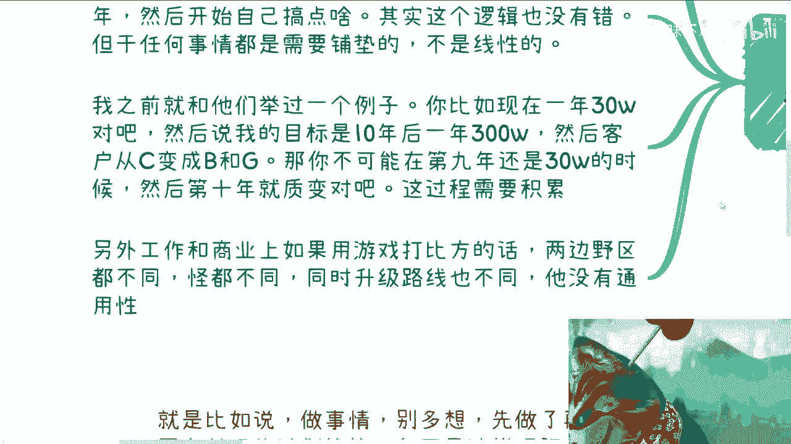
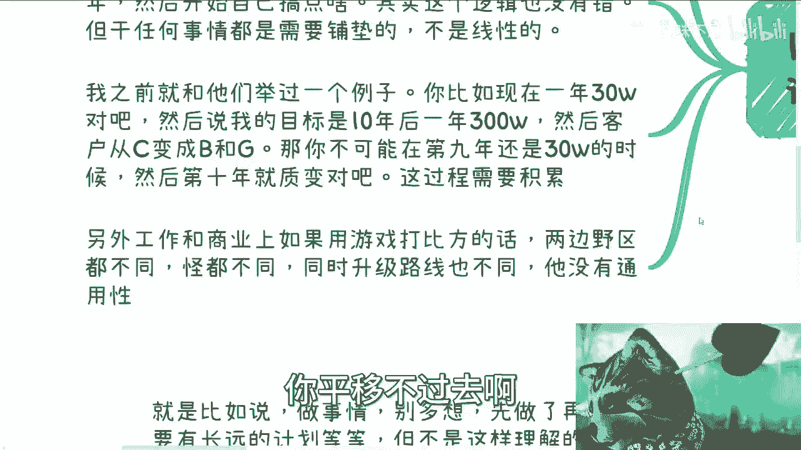
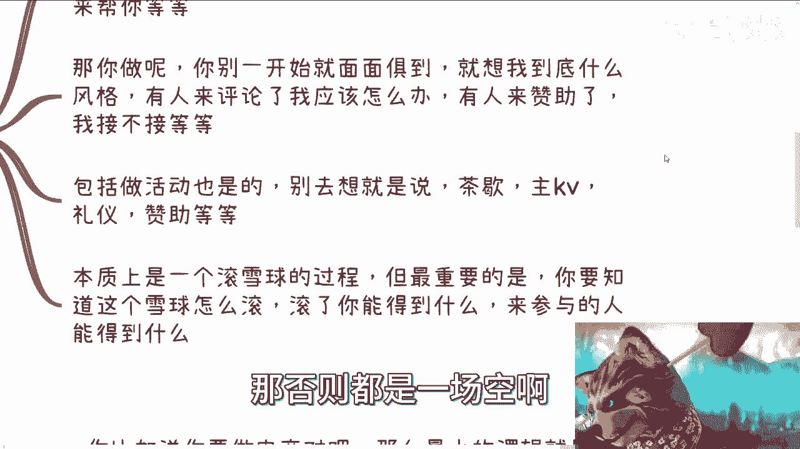
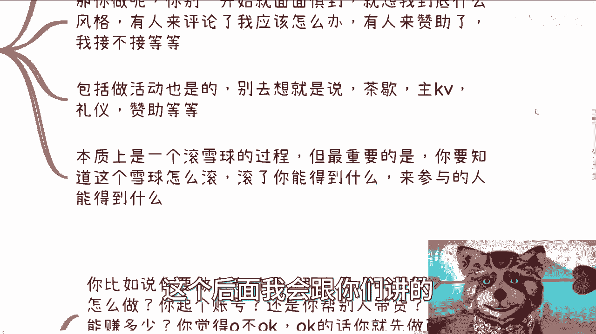
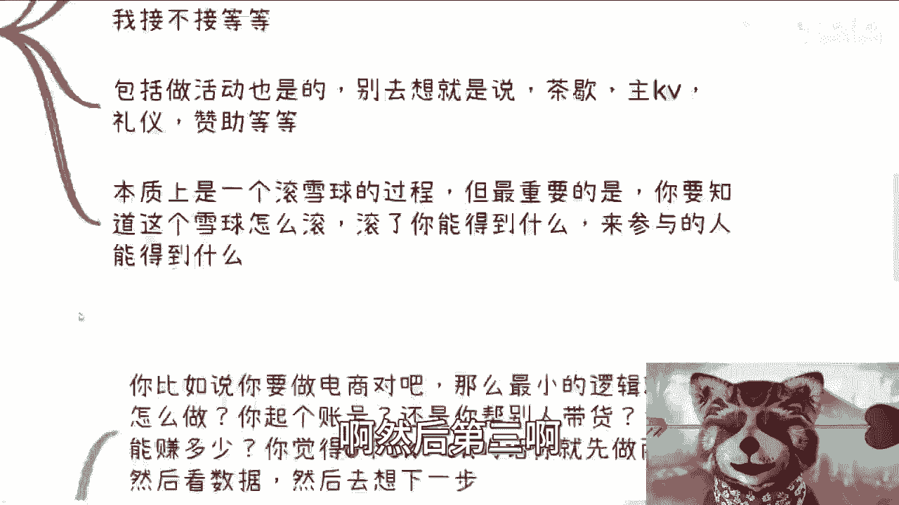
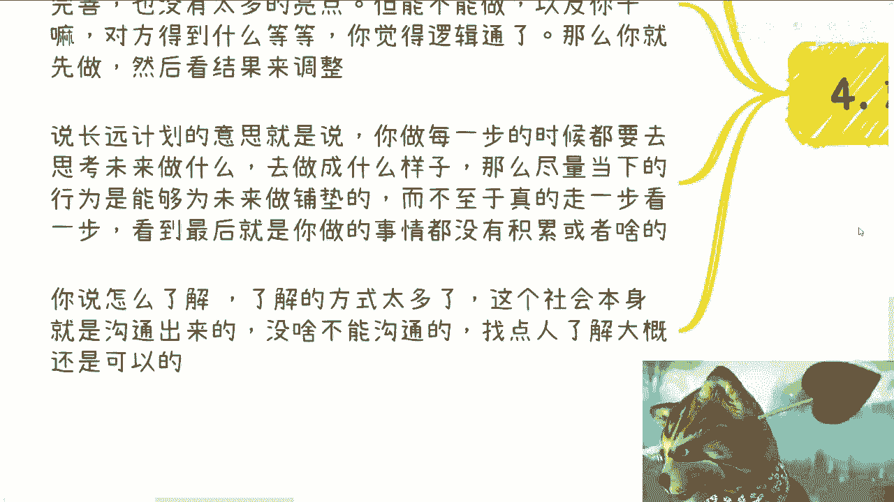

# 课程 P1：目标导向与行动指南 🎯

在本节课中，我们将学习如何确立目标并采取有效行动。核心在于避免“曲线救国”式的思维，既不空想过度，也不盲目行动，而是通过合理的规划和验证来推进目标。

---

## 概述

本教程将围绕一个核心观点展开：确定目标后，应直接行动，避免不必要的迂回和空想。我们将通过几个关键点来阐述如何将目标分解为可执行的步骤，并通过市场验证来调整方向。

---

## 1. 明确目标与积累的关系

上一节我们介绍了课程的核心主题，本节中我们来看看如何正确处理目标与积累的关系。

许多人设定目标后，会采取“曲线救国”的策略。例如，目标是举办大型会议，却计划先从举办小型沙龙开始积累经验。这个思路本身没有错，但关键在于必须想清楚积累的具体内容。



以下是需要明确的核心问题：
*   **积累什么**：具体积累的是人脉、经验、资金还是其他资源？
*   **积累多久**：这个过程需要多长时间？
*   **与目标的关联**：这些积累如何直接服务于最终的大会目标？

仅仅说“先积累”是一句正确的废话。必须将模糊的概念转化为具体的、可衡量的行动计划。否则，积累可能变得漫无目的，与最终目标脱节。




---


## 2. 工作与创业的逻辑差异


理解了目标与积累的关系后，我们来看看另一个常见误区：将职场经验直接平移到创业或副业中。

很多人计划先在公司工作几年，再开始自己的事业。这个逻辑本身成立，但关键在于两者之间需要有**因果铺垫**。工作经历必须能为未来的事业提供直接助力，例如特定的技能、行业认知或资源。

一个常见的错误类比是认为工作和创业像是在同一个游戏的“野区”打怪升级。实际上，它们更像是两个不同的游戏，规则、怪物和升级路线都不同。



**核心公式**：
```
职场经验 ≠ 可直接平移的创业资本
```
职场中积累的“等级”无法直接兑换为商业上的成功。必须审视工作内容与未来计划之间的**具体转化路径**。




---

## 3. 从0到1：最小闭环验证



认识到不同领域的差异后，我们进入最关键的实践环节：如何从零开始启动一件事。

无论是做自媒体、办活动还是做电商，在初期切忌追求面面俱到。过度思考风格、长远规划或次要细节（如活动主视觉、赞助），会阻碍行动。

最重要的是先构建并验证 **“最小可行闭环”**。

以下是构建最小闭环的步骤：
1.  **定义最小动作**：例如，做自媒体就先连续发布内容半个月；做电商就先测试单个商品的盈利模型。
2.  **收集初始数据**：关注最核心的指标，如阅读量、互动率或单笔利润。
3.  **分析与复盘**：基于初始数据，判断方向是否可行，并寻找优化点。

这个过程就像滚雪球，首要任务是把最初的小雪球（最小闭环）滚起来，而不是空想一个10米大雪球该如何处理。没有最初的滚动，一切规划都是空中楼阁。

**代码描述这一过程**：
```python
while not goal_achieved:
    action = define_minimal_action() # 定义最小可行动作
    data = execute_and_measure(action) # 执行并测量
    analyze_and_adjust(data) # 分析数据并调整方向
```

---


## 4. 市场调研：避免“二极管”思维

在开始行动之前，必要的市场调研不可或缺，但这需要方法，避免走向极端。


“别多想”不等于盲目行动。“有长远计划”也不等于空想。正确的做法是在行动前进行充分的**市场了解**，以降低纯赌博的风险。


如何进行有效调研？关键在于**多渠道沟通**，避免“二极管”式（非黑即白）的结论。

以下是有效的调研方法：
*   **线上结合线下**：不要过度依赖短视频或网络文章。应通过线下活动、行业聚会等方式与从业者面对面交流。
*   **扩大样本量**：不要只问一两个人。应尽可能多地问（例如5个、10个或20个），了解行业的普遍情况、竞争程度、利润率等。
*   **明确调研目的**：了解行业现状、痛点、机会与挑战，为自己是否进入以及如何进入提供决策依据。

没有初步了解就询问“这个方向靠不靠谱”，这不是在做选择，而是在被动冒险。了解市场是主动决策的第一步。

---

## 5. 核心理念总结

本节课中我们一起学习了如何以目标为导向展开有效行动。



最后，让我们总结核心理念：**人是活的，事情和道理是死的**。不要被那些“有道理的废话”束缚。我们的行动指南应基于两点：

1.  **真实落地验证**：通过构建最小闭环，用真实的市场反馈来检验想法。
2.  **持续迭代调整**：如果验证失败，没关系，分析原因，调整策略，继续尝试。这就是一个不断试错和优化的过程。

关键在于平衡：既不因想得太多而阻碍起步，也不因什么都不想而盲目乱撞。在充分了解的基础上果断行动，在行动中持续学习和调整，这才是通向目标的务实路径。

---
**行动提示**：上海线下活动已定于12月16日，将分享数据治理与数字经济相关话题。详情请关注后续通知。如有具体业务问题或规划咨询，可整理后私信交流。