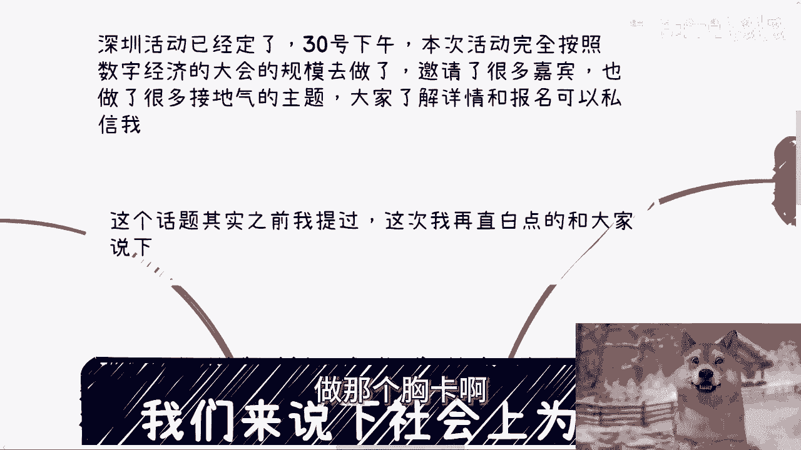
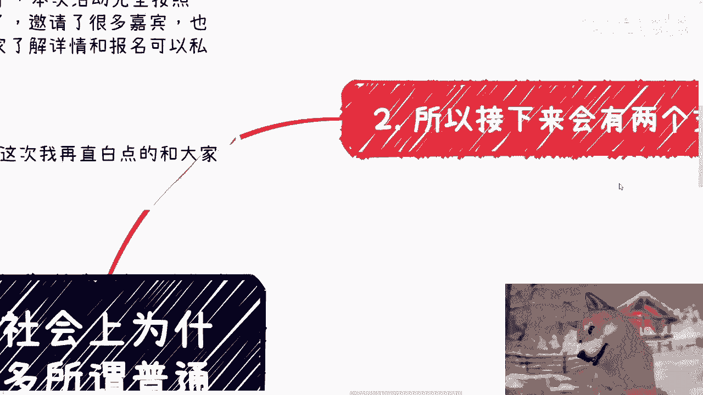
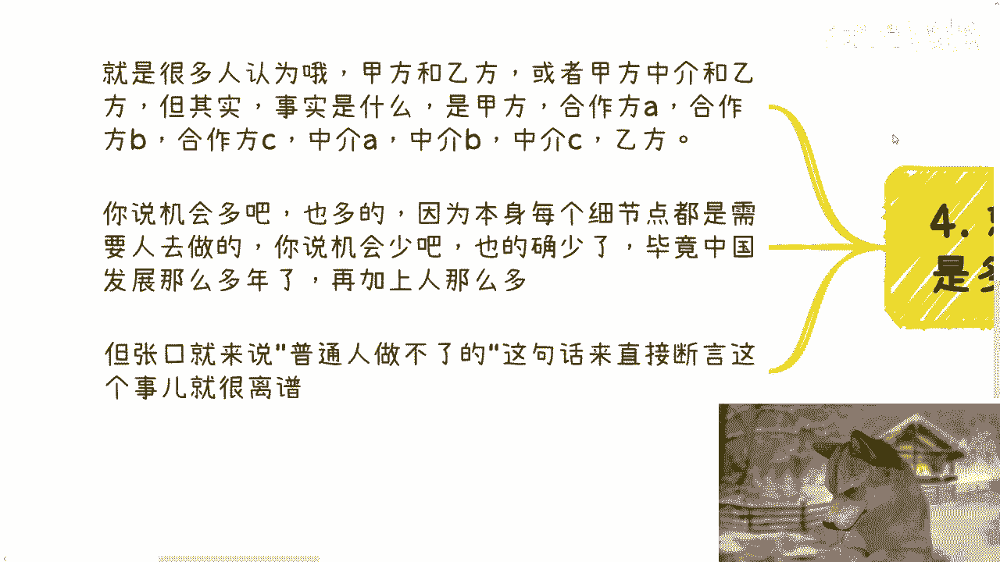

# 社会上为什么会存在很多普通人能参与的商业机会 - P1 - 赏味不足 - BV1VH4y1w78o

好大家好，咳咳，今天我们来讲的呢是社会上，为什么会存在很多所谓普通人能切的点啊，就按照大部分人的想法啊，说法就是说啊这个很多东西啊，说到政府，说到高校，说到别的东西啊。

就跟普通人没关系啊，我们切不动啊，切不动啊，好呃，首先深圳周活动定了好吧，本周日30号下午啊，然后本次活动完全按照，数字经济大会的规模去做了啊，然后呢我这两天在给你们做那个易拉宝，做那个胸卡啊。

然后呃大家反正要参加的了解详情和报名的，可以私信我啊，然后今天这个主题呢咳其实之前也提过啊，但是呢我今天想说的再直白一点，我们很多人还是没明白啊，首先啊你们说普通人对吧好，我们假设你是个二代。

或者呢你是一个位高权重的，或者来说你是一个政府的白手套，咋滴啊，或者你是既得利益者，那总行了吧，对吧啊，那总行了吧，不普通了吧啊然后就是说你有钱有背景，有地位，那总行了吧，对吧好，那么接下来啊。

由于你这个背景，你能认识很多的官员或者老板啊，你吃喝玩乐呃，吃喝嫖赌好吧啊，也就是我们说的直接甲方啊，那么你能认识很多这种人啊，那么中央到各地方每年有无数的单子啊，各地方有无数的单子啊。

肯定就是说上百亿的单子啊，有的单子走刀招投标，有的单子直接走采购服务，有的单子直接走技术服务啊，都有可能啊，那我就问如果啊，我们就说如果你不是那么一个普通人，你想赚钱没错，你是想赚，但是你只想躺赚。

为什么，因为你不是个普通人啊，你不会想着自己去干的啊，自己去干是普通人的事啊对吧，因为什么，因为你作为一个不普通的人，你会觉得这事太low，你看不上也看不起，更何况呢你如果去做了。

你就不如躺着，你觉得他妈你是个，你懂吗。

嗯第二那么按照这么一个逻辑啊，那么接下来只会有两根支线啊，第一根支线就是这个单子很大啊，很大，你想做，你觉得值得做，那么这个时候呢你就直接找人去干了，分点钱啊，比如说唉小陈啊，你给我去干个活儿啊。

帮我去找个能做这种单子的人或者团队，对不对啊，那如果你能找到啊，我给你封个500%分之三对吧啊，另另外一根支线呢就是小单子啊，那小单子完全看不上啊，太小的那种，那么这种事呢放在协会或者说阿里巴巴啊。

百度腾讯字节这种大公司也是一个道理，什么意思呢，意思就是说协会明明可以躺赚，他们是不会自己去干活的啊，真的要干活也会找别人干啊，那包括那个你放到自己阿里巴巴这种，也不会要小单子，为什么呢。

因为一个单子前前后后，售前加销售加落地都不够人家员工工资的，有啥可做的啊，有毛病啊啊，你自己自己去看看他们员工多少钱，对不对，那我就问怎么滴啊，那那那这种东西所谓的关系户，所谓的你们口中的那种啊。

不是普通人根本没人会干，怎么地啊，这事不干了，这事中国发展，中国互联网发展到现在20多年，怎么滴也没人干，是不是，那当然不是啦对吧，那不最终还是普通人来干嘛，机会多了去了呀啊那么第三对于很多人来讲。

赚钱的性价比，对于赚钱性价比啊，他真的没认知，觉得收入是看什么的，看额度的，你知道吗，你包括昨天评论区还有人在问我，哎你觉得赚多少钱算算赚钱呵，这跟赚多少钱没有关系，你懂吗，哎呦，我真他妈服了啊。

我之前就跟一些人讨论过，这国家这些竞争等级的事，我跟他怎么说的，我说一年一个企业可能能流水在小1000万，甚至几千万都是有可能的，但这个小钱人家看不上啊，然后他们都震惊了啊，说几千万啊，你说小钱。

程老师，你这个太夸张了，我说就是小钱，为什么我们来举个例子啊，你就拿协会来举例子，一个协会一年一般这样三件事，第一收会员费，第二办活动或者竞赛，第三要么就是当地的这种创新项目的申报，无非就三件事啊。

最多额外的再给企业拉拉皮条，对吧好，我们就这么说啊，会员费一般一年2万5万10万20万50万，这不是我说的，你们自己去看各个协会的这个这个会员的这个，红头文件对吧，就这个额度啊，好然后呢我们随便说啊。

比如说我们取个平均数，比如说10万啊，我们就就拿10万来说，一般一家协会啊对吧，50家会员单位，100家单位会员单位很正常，如果100家会员单位多少钱，1000万躺着赚不香吗，对不对，好。

然后活动竞赛拿补贴，我们就看地区，上海这种地方，比如说一个竞赛50万到150万不等对吧，然后再说申报申报，一般一个企业收小几千块钱到1万块钱不等，一般一次性在50家到1~6，十家到80家不等。

那么也就是说一一般来讲，这种这种申报一年两次，那差不多就在100万到大概160万左右，那么也就是说他们单纯做这些事情，一年不用干什么活啊，也不吃力，很轻松的就能赚到将近小1000万或者1000。

1000万到1500万，那我就问谁，他妈吃饱了撑的，没事情做，又要去做培训，还要做考试，还要做招生还要做，还还还还要去什么打理啊，还还要什么跟C端去去做客服，还要做问答对吧，还要怎么样子，你觉得会做不。

那是小钱吗啦，对不对，明白不啊，第四就如我以前跟你们讲的，商业它是多层结构，不是单层结构啊，也就是说很多人会认为，比如说商业的合作就只有甲方和乙方，要么就是有一个拉皮条的，就是甲方乙方中介。

但事实不是这样子的，所几乎所有的商业他都是什么，甲方合作方，A合作方，B合作方C中介，A中介B中介C，然后乙方你懂吗，这叫多层关系，就是我们能切入的点多了啊，因为项目很复杂，没有一个人能全部吃得下来。

每个人每个合作方可能只负责一块儿，懂不哦，那么你说机会多吧，也多，因为本身每一个项目的细节很多，需要有人去做哦，你说机会少吧，你发展到2024年，明年马上就2025年了也少，毕竟中国发展这么多年。

你再加上人这么多，你怎么敢说机会多呢，对不对，但机会多，机会少不得你们去做嘛对吧，你总比现在就是说跟我沟通下来，总比你们那那一种就是说张口就来说哎，陈老师这个东西普通人做不了的，那你还说什么。

你还做什么对吗。

对吧，你就像我在刚刚那个面子的那个视频里面。

跟你们讲的，就是所有东西都是属于那种哎陈老师，我觉得这个东西没路走啊，这个东西没得选，你选过吗，没有对吧，一样的道理都一样的，你包括做商业也是的对吧，我每次跟他们讲到，就是说高校啊，企业啊这些东西。

他说他就会跟你讲，爱创老师这种我没有积累，没有背景哦，做不了，你做过吗，你就做不了，对不对，你只是没有去沉淀下来，去去积累，没有没有去做，就是做过准备，也没有去尝试过，你怎么就知道做不了呢，哎呀妈呀。

我也奇了怪了，对吧。

对吧，所以说就是说我们先从逻辑上来讲，我们要去吃的就是这种小钱对吧，你我跟你讲，你不要来跟我说，不是是不是普通人，我就告诉你们不是普通人，人家根本就看不上你懂吗，哦你不你跟他讲个什么50万100嘛。

人家就会觉得你是个啊，行好吧，就这么着啊，然后本周日本周日好吧，深圳见啊，深圳见呃，然后那个职业规划，商业规划啊，股权期权合同啊，白皮书，商业呃白皮书，然后商业计划书啊，然后那个呃呃分红分润啊。

包括你们有什么牌，你们没有什么牌，你们希望啊通过跟我的沟通啊，能够让我给你们一些更接近于中国地区，更接近于呃这个整个全球的这个经济发展的啊，一些建议和规划的话，那么你们整理好对应的问题和背景好吧。

