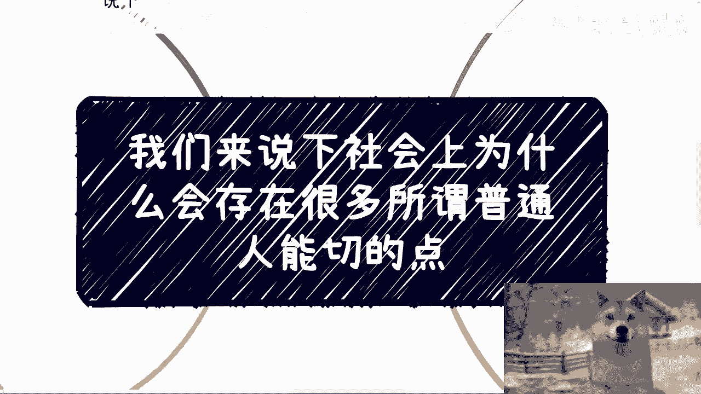
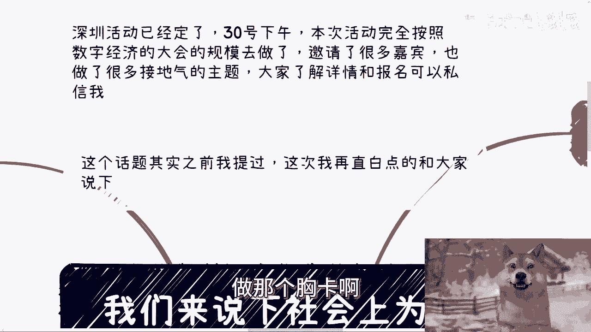
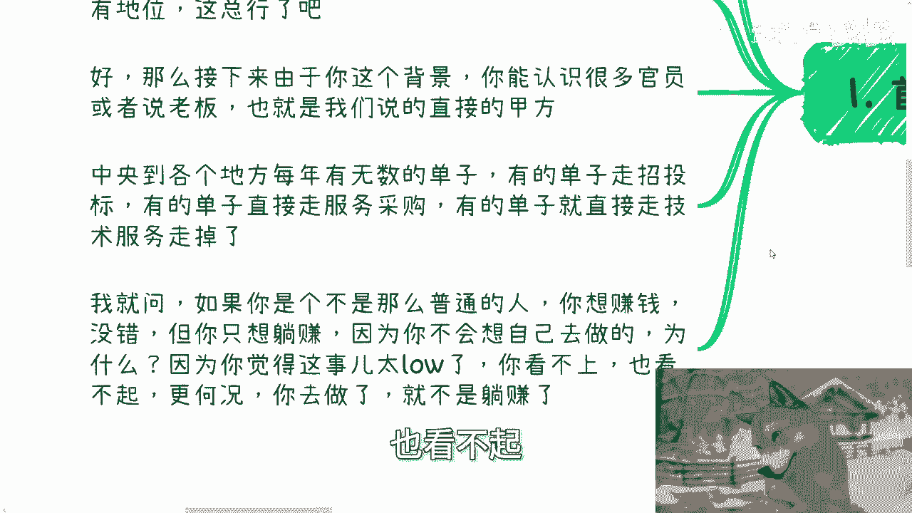
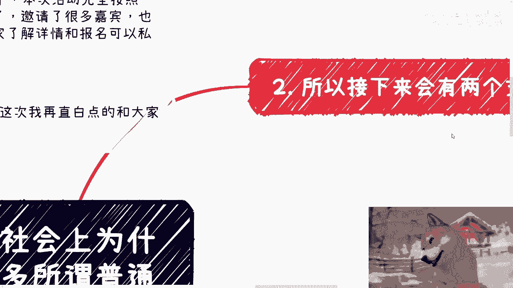
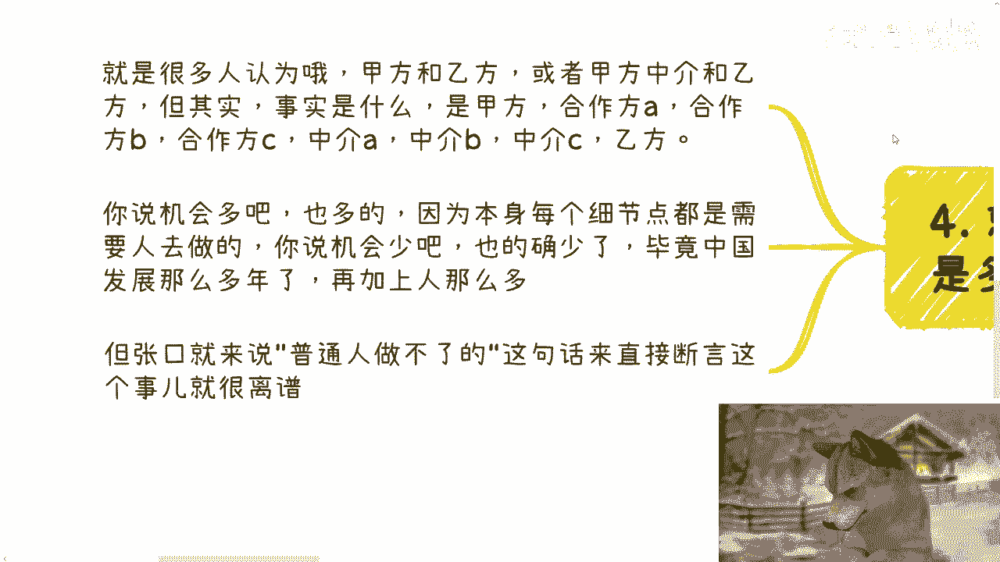

# 课程 P1：为什么社会上存在大量普通人能参与的商业机会？💡

在本节课中，我们将探讨一个核心问题：为什么社会上看似被“关系”和“大资本”垄断的商业环境中，依然存在大量普通人可以切入并参与的机会？我们将从几个关键逻辑层面进行分析，帮助你理解商业世界的真实结构。

---

## 商业机会存在的逻辑起点

上一节我们提出了核心问题，本节中我们来看看其存在的根本逻辑。许多人认为，好的商业机会都与政府、高校或大型机构相关，普通人没有资源和背景，因此无法参与。

这种看法忽略了一个关键事实：商业世界是分层的。并非所有参与者都对所有类型的“机会”感兴趣。

---

## “非普通人”的视角与选择

假设你并非“普通人”，你拥有财富、背景或特殊地位。你能接触到许多官员或企业老板（直接甲方）。中央到地方每年有无数项目，金额可能高达上百亿，形式包括招投标、采购服务或技术服务。

然而，作为一个“非普通人”，你的赚钱逻辑是追求“躺赚”。亲自下场操作在你看来是低效且“低级”的，不符合你的身份和资源效率最大化的原则。

因此，面对机会时，你的行为模式通常只有两种：

以下是基于机会规模的两种选择路径：

1.  **面对大额订单**：你认为值得做，但不会亲自执行。你会寻找合适的个人或团队来具体操作，并从中分润。例如：“小陈，你去帮我找能做这个单子的团队，做成后我给你3%的佣金。”
2.  **面对小额订单**：你完全看不上。因为从投入产出比来看，前期的销售、沟通、落地执行所耗费的精力，可能还不如你利用现有资源做其他事。

这种逻辑同样适用于行业协会或阿里巴巴、腾讯等大公司。它们有品牌和资源，但同样追求效率。一个需要组建团队、投入大量售前和售后精力的小项目，其利润可能还覆盖不了核心员工的工资，因此大机构通常会主动放弃这类“鸡肋”机会。

那么，这些被“非普通人”和“大机构”放弃的机会，最终由谁来完成？答案正是广大的“普通人”。中国互联网发展二十多年，无数细分市场的繁荣，正是由一个个普通人抓住这些“小机会”构建起来的。

---

## 重新理解“赚钱的性价比”

上一节我们分析了机会从何而来，本节中我们来看看普通人该如何评估这些机会。许多人对“赚钱的性价比”缺乏认知，错误地认为收入只与“额度”有关。

**收入 ≠ 项目总额**，而是 **净利润 / 所付出的总成本（时间、精力、风险）**。

举例说明，一个行业协会的盈利模式很能说明问题。其收入主要来自三块：

以下是行业协会典型的收入构成：

1.  **会员费**：单个企业会员费每年在2万到50万不等。假设平均10万/家，拥有100家会员，仅此项年收入即达 `100 * 100,000 = 10,000,000元`。
2.  **活动/竞赛补贴**：在上海等地，举办一场竞赛可能获得50万到150万的政府或企业补贴。
3.  **项目申报服务费**：帮助企业申报创新项目，每户收费几千到一万元。假设一次服务60家企业，每年两次，此项收入约为 `60 * 10,000 * 2 = 1,200,000元`。

综合来看，一个运作良好的协会，无需处理复杂的C端客服、课程培训或繁重运营，就能相对轻松地获得千万级别的年收入。因此，他们绝不会去亲自操办那些需要重度运营、客单价低、客户分散的“小业务”。

这对普通人的启示是：**不要用你的“生存逻辑”去揣测别人的“效率逻辑”**。被你视为“大钱”的生意，在更高维度的玩家眼中，可能只是性价比极低的“小钱”。这正是普通人切入的空间。

---

## 商业的多层结构：机会的切入口

理解了机会的来源和性价比差异后，我们来看看普通人具体如何切入。商业合作绝非简单的“甲方-乙方”或“甲方-中介-乙方”的单层结构。

真实的商业项目，尤其是稍具规模的项目，通常是**多层关系结构**：

一个项目可能同时涉及：**甲方、合作方A、合作方B、中介方C、执行乙方……** 每个角色只负责链条中的一环。

**项目复杂度 = 普通人切入的机会点数量**

因为没有人能吃掉所有环节。例如，一个大项目可能需要：总包方（资源整合）、技术提供方、本地化服务方、渠道推广方、售后服务方等。作为普通人，你不需要成为总包，你可以成为其中某个环节（如本地化服务或特定技术提供）的可靠执行者。

发展到2024年，机会既多也少。说“多”，是因为经济越发达，分工越细，细分环节越多。说“少”，是因为竞争激烈，对执行者的专业要求更高。但无论如何，机会永远多于那些只会说“普通人做不了”却从未尝试和积累的人。

---

## 行动指南：从逻辑到实践

本节我们将把前述逻辑转化为行动思路。普通人参与商业的关键，在于心态和切入点的选择。

1.  **瞄准“性价比洼地”**：主动去寻找那些被“非普通人”视为琐碎、麻烦、不够性感的“小钱”。这些正是你的舞台。
2.  **理解并融入多层结构**：不要幻想一口吃成胖子。研究你感兴趣的行业，找到产业链中的一环，让自己成为该环节的专家或可靠服务商。
3.  **用积累替代空想**：最大的障碍往往是“我觉得我没资源，做不了”。但资源是在行动中积累的。没有尝试过任何接触、沟通和微小实践，就得出的“做不了”结论，只是一种自我设限。

正如面子视频中所说，很多人觉得没路可走，是因为从未真正尝试去“选”过一条路并走下去。商业机会也是如此，它更青睐那些愿意沉淀、准备并勇敢迈出第一步的“行动派”。

---

## 总结与预告

本节课中，我们一起学习了社会上存在大量普通人可参与的商业机会的根本原因。

我们分析了“非普通人”追求“躺赚”和“高性价比”的逻辑，如何主动放弃了大量需要亲力亲为的细分市场。我们重新定义了**赚钱的性价比公式**，指出收入应与综合成本对比。我们还剖析了**商业的多层结构**，指出复杂项目中的每个环节都是潜在的切入机会。

核心在于转变心态：从“抱怨没有机会”转向“识别并抓住那些被忽视的机会”。你需要做的不是与巨鲸搏斗，而是在巨鲸游过时，找到那些它无暇顾及却营养丰富的浮游生物。

**行动是打破认知壁垒的唯一方法。** 本周日深圳将有深度线下活动，将围绕数字经济、职业与商业规划、股权合同等实际问题展开。如果你已整理好具体问题和背景，欢迎进一步交流，获取更贴近现实的发展建议。

---
**课程总结**：商业世界充满层级与缝隙。“大人物”的效率盲区与“大机构”的成本底线，共同构成了普通人广阔的生存与发展空间。关键在于识别价值洼地，融入分工链条，并通过持续行动积累属于自己的那片天地。