# 社会不关心你的原因和故事，只关心结果 - P1 - 赏味不足 - BV1cm421G7Xu

好啊，今天我们来讲的这个主题啊，啊对我首先先说一下，我回上海了啊，今天我们来讲主题啊，叫做社会不会关心你这个原因跟故事啊。

只看结果啊，呃首先先说两个事啊，就是嗯我没想到。

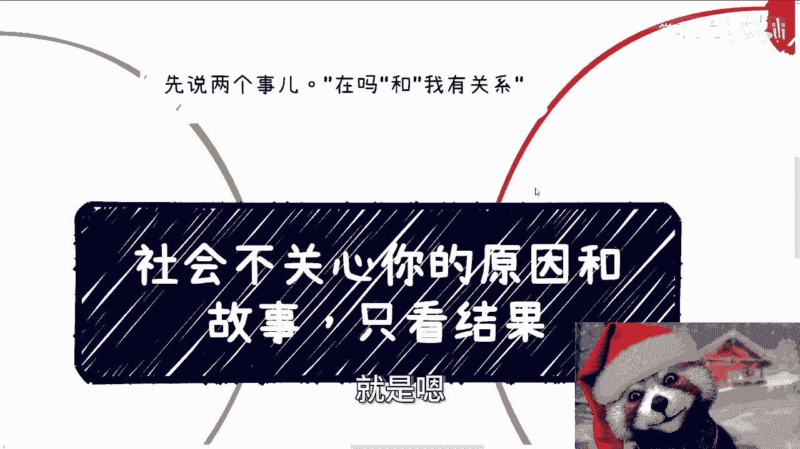

就2024年这个微信上还有人这个出现，说陈老师在吗。

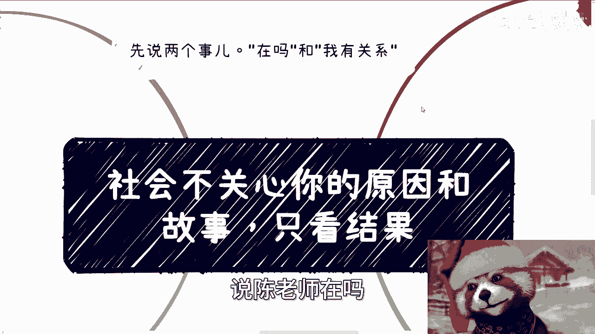

你我不管你在妈还是在爸对吧，你你有事儿说事儿，那你问我在吗，我怎么回呢，对不对，我回去在我是，哼我我我回不在，那我觉得我可能要进精神病院对吧，那那我怎么回啥呢，对不对，那然后还有一个啊。

就是你们要找我合作也好，找别人合作也好啊，你东西都要给清楚，你不给清楚你，我怎么帮你们找资源呢，对不对，你比如说前两天有个有个小伙伴对吧，找我合作，然后呢让我帮他找，找一些老师找，怎么样，你要这么想啊。

我帮你去找资源，我就算不来问你，别人要来问我呀，哦我来问你，你你知道吗，对方跟我说什么，对方跟我说我有关系，哎你我就想问，那我跟我的资源去说，人家问我爱，那那那个上位对吧，那他说你这个合作方对吧。

这个有些东西怎么保证，我怎么回答他哦。

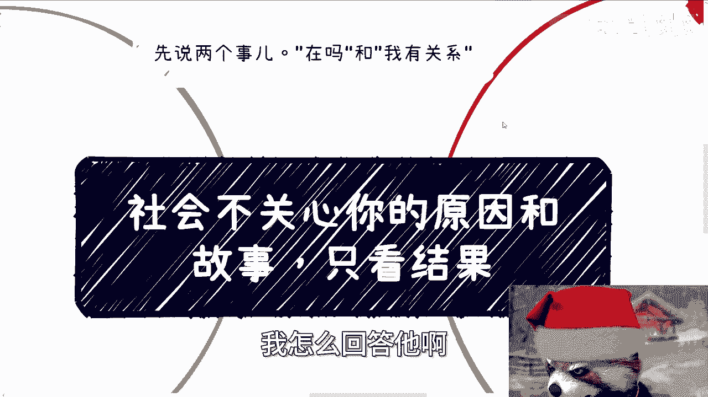

我说啊这个人说他有关系，不是哎呦，我真他妈也是服了，就是你要你真的你们做事情自己要明白啊。

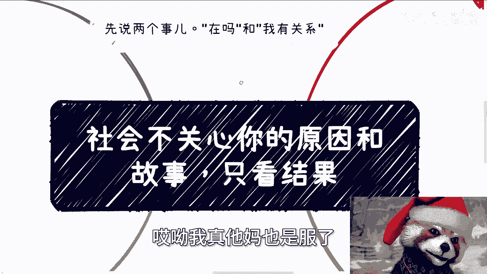

就是你不是你有没有关系，你有没有关系，不关我吊事，也不管别人吊事，大家只关心的是事情是不是就是就是怎么说呢，就是他得有一个有一个说法，他得有个法律上认可的东西，他得有个确定的东西，你说你有关系。

这事情我怎么确定呢，对吧，你包括你包括你们是不知道，之前还有一个就是要办会，然后让我去邀请嘉宾也是的，然后上来就跟我说，他说我们这个会是市级的，我说好，你你怎么证明你是市级的，就是我也不要你有红头文件。

对不对，你比如说你的值那个那个执行方指导单位对吧，包括主办方，哪怕是协办方，你有一个市级的政府的单位挂在上面，我也认啊，对不对，那你有不啦好啦。

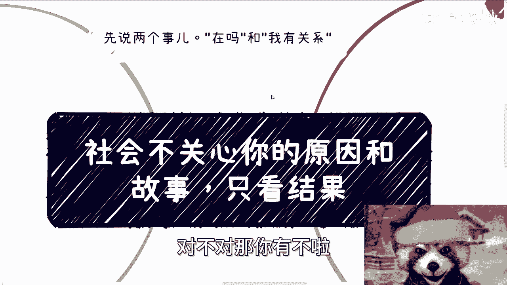

我问过去好了，就不回我了，哎我真的我有时候真的想想啊。

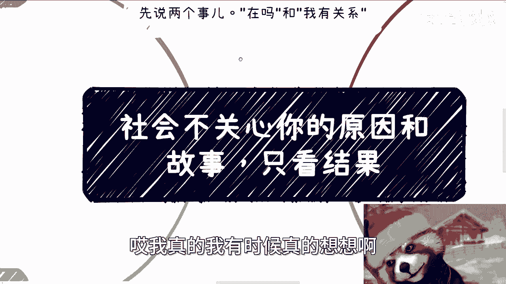

就是说唉我我我就前两天，我说那个视频就是做事情不要老是怪外面，你们先看看自己做的怎么样啊。

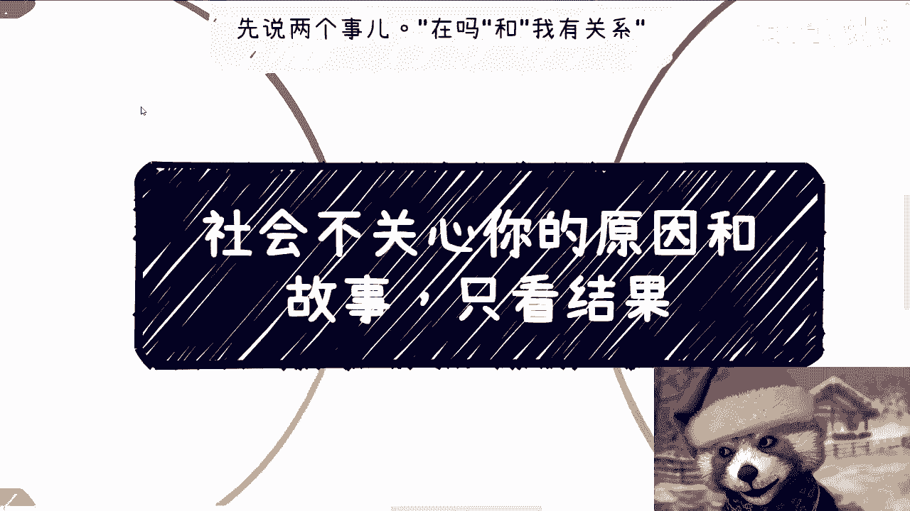

好然后我们先来说几个故事啊，第一一个是我朋友35岁了啊，创业5年没怎么赚到钱对吧，去年10月份来上海找我聊啊，大晚上的我我带他去半岛，我就这么说吧啊一瓶气泡水，一个一一瓶一一小杯白酒哦。

一小杯那个白葡萄酒，然后一个那个炸薯条啊，就这三个东西要了我288对吧啊，我也跟他聊了一下呢，这个拓展流量赚钱的方式啊，但是对方不屑一顾啊，我当时原话怎么跟他说的。

我说大哥啊啊我说我现在跟以前也是不一样的，我说我要是不是要不是我认识你好多年，我说我也直白一点，你根本就不值得我大晚上出来啊，你也不值得我为你出钱啊，我甚至还陪你聊这些对吧哦，我跟你们这么说啊。

不是说就你们听下来可能会觉得哎呀，陈老师怎么不讲情面对吧，怎么样子啊，不是说我跟他不能做朋友，主要是朋友我不缺啊对吧，而且另外一方面我要这么多朋友干嘛呢，哎我不明白了，我一天就24小时。

我要这么多朋友干什么，我不明白呀，对不对，那另外一方面主要是劝不动啊，不听劝啊啊那包括你们有很多人也是的，你劝不动啊，你知道吗，哦那么我有必要说这么多吗，我吃饱了撑的啊。

还有之前有个硕士小那个小伙伴也是的，跟我说，在学校里面折腾这个折腾那个啊，然后就是就是折腾了一大堆，你知道吗，然后我后来就打断他，我说我说我不关心你折腾什么东西，我只关心你告诉我你哪件事情有结果对吧。

因为你无论从我角度还是从别人的角度来讲，你只有有结果了，你才是积累，你才是对我们有价值的东西对吧，你或者说我才能看到你在这个事情当中，有价值的点，你没有结果，你说这么多干嘛呢，那故事会呀啊那谁关心呢。

主要是啊，然后你比如说今天还有两个故事啊，一个呢说自己觉得自己专业太垃圾了啊，要要想闯荡社会也没毛病啊，但是呢聊了很久啊，基本上就是就是我总结下来他就卡在一个地方，就卡在就是说自己害怕啊。

没有社会上面闯荡过啊，自己没有做过，然后呢你们想想看啊，那如果来说你们大部分人被这个原因所卡住，那这不就是个死循环吗，好你因为我没做过，所以我怕我怕了，我就不去做，那怎么办呢，那能怎么办呢，对不对。

我我跟你们这么说，有办法的，有的你被我割韭菜怎么办呢，对不对，你比如说你你我我就这么说，你一年给我10万块钱，我每天来催你可以不啦，其实我觉得缺就你就是缺一个鞭策你的人呀，但是你说有难度了。

没有难度的呀，对不对，就是这种思维哪里来的，其实无非就是被整个那个应试化教育跟呃，传统的很多的这种想法所PO出来呃，PUA出来的这个逻辑就就是觉得试错成本高，但问题来了，比如比如说我具体去问他。

你是什么错呢，你有什么成本呢，高在哪呢，他也不知道他妈的就他妈试错成本高，我妈又莫名其妙，你你是什么错，你就成本高了，对不对啊，但是这种被PUA出来的逻辑，他就会让自己害怕，然后永远的停留在害怕里面。

走不出去，然后不停的纠结哈，我就跟他说，我说人其实有一种想法，比如说你30多岁，你想出去闯了，这种想法绝对不是30多岁猛然出现的，往往是因为你十几岁甚至20呃，就是20多岁甚至十几岁。

更小的时候就有了这种想法，那只不过就是说碍于当时各种原因，比如说你你怕对吧，比如说你觉得啊你自己不够成熟对吧，你觉得怎么样，反正我不管你们什么原因啊，反正每个人都有每个人原因，对不对啊。

那么碍于各种原因，他没有去实施罢了，但是如果年龄大的时候，比如说到了30多对吧，40多你反而卖出去了，并不是因为你变得勇敢，也不是因为你变得成熟，往往是他妈的，因为你无路可走了，但是咱话又说回来。

你真的30多，40多，40多走出这一步了，又有又有卵用呢，对不对啊，然后我们再来说今天第二个故事就真的很离谱，故事是这样子的啊，他私信跟我这么说的啊，他说他看了我的视频啊，觉得呢。

要自己去尝试做一些社会化的商业行为啊，我我觉得我是很鼓励的对吧，然后呢他意思是跟别人聊了一下啊，别人跟他分析了一些一些具体的情况啊，说他呢什么都没有啊，肯定是做不了的啊，这个事情就有点痴人说梦啊。

就有点就是说上头啊，上头啊，我跟你讲这事就很好玩，首先啊我们一个个来分析，如果按照那个人的说法，什么都没有就做不了，那么是不是意思是什么意思，就是说必须生下来有才能做，是这个意思吧。

啊那那我觉得就过于极端了一点，难道社会上赚钱的能够做商业化的，都是靠上一代的，那总不是吧，对不对，那虽然他可能有个比例，但总不至于这么极端吧，你说哦因为你什么都没有，所以啪把你就否定掉，那不行吧。

对不好，那么另外一个问题是什么，就无论啊我说的对，还是那个人说的对，那对于这个来问我的这个人，当事人来讲，你无论去问了多少人，你本质上还是什么都没做，对不对，你本着没开始做，对吧啊，听就是公说公有理。

婆说婆有理对吧，那他他说他有理啊，狗说狗有理，对不对，那你就开始摇摆，那这个就是典型的不做事，在那边瞎他妈想对吧，瞎叉叉想这么一个属性啊，你我们就是话又说回来，就是你要真的觉得自己什么有呃，什么都没有。

那你就先让自己有，那你现在就要去做的，或者你要去思考的，就是怎么让自己有，而不是在那边纠结，就是说哎呀好像这个事情啊，陈老师说啊，要做啊，那那可能这个方向可以去做哦，那个人来跟我说，我什么都没有哦。

我做不了你，你觉得是卡在这个点上面的问题吗，对不对，就是你要觉得缺你就去补，而不是说你就在那边想啊，我现在没有啊，我做不了这个业务好啦，我就打打打打打退堂鼓了。

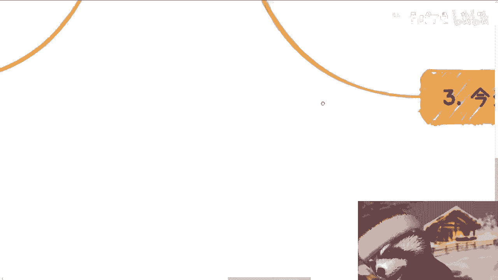

那那那有意义吗，对不对啊，然后最后一点就任何事情你不会。

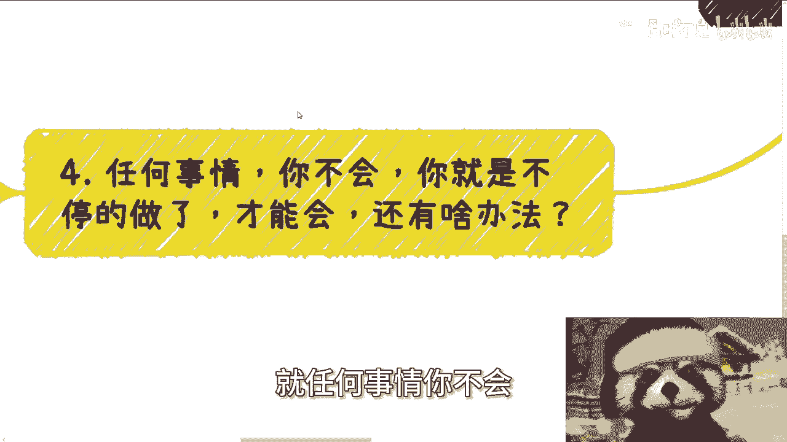

你就不停的去做，你才能会你还有什么别的方法呢，没有啦，就其实都会问我一个问题啊，就是说爱陈老师什么方式能让自己更好的沟通，能更好的讲PPT对吧，能更好的控控场，能更好的叉叉叉哦，在这里啊，我有一说一啊。

你们可以去问这次成都来线下的人对吧，就整个下午他们能看得出来啊，我哪怕是脱稿，我哪怕是没有PPT，我他妈一个人都能在下面讲四五个小时，怎么来的怎么来的，我被搞来的吗，不是吧，对不对，怎么来的。

你不能他妈的不是只能一次次练吗，怎么办呢，对不对，卧槽，我他妈要不是做了这么长时间的咨询，我要不是做了这么多的小小大大的呃，小小中中大大的这种活动啊，我要不是说他妈的几十人到上千人的这种活动。

我都去演讲过，能有现在的啦，对不对，我们活在地球上，我们不是活在科幻世界里面，你们问出来这种问题其实没有意义的，你有什么办法呢，你只能不停的锻炼，不停锻炼，不停锻炼，对不对，你但凡我告诉你。

就是无论是我也好，别人告诉你也好，如果但凡有人告诉你任何方式，你就等着被割，为什么，因为没有方法呀，对吧，你每个人不同的性格情况也不一样，怎么能有统一的方法呢，啊你说有什么演讲力。

演演演什么什么提升演讲力的能力对吧，演研提升什么东西的东呃能力对吧，然后你交过多少钱，怎么说呢，就是说你要问方法论，比如说我们怎么演讲，演讲的这个流程对吧，就是比如说第呃分成几个模块。

每个模块大概怎么样的内容，这个是有方法论的，但这个东西是没办法去提升你个人的，这个真正的能力的，你明白吗，对吧啊，那么还额最后再强调一点，这个事情我强调无数遍了，但是我还想强调一点，就是做事要坚持。

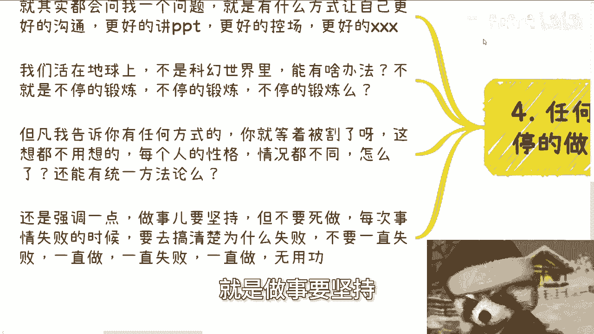

你不要死做，你每次事情失败了，你要去搞明白失败的本质对吧，你就像你今天跟别人去沟通啊，你说别人没有不愿意跟你沟通对吧，你说我今天去办活动，没人来对吧等等等，你要去明白失败的本质，你不要在那边，就是说啊。

因为没有为为什么没人来啊，因为这市场不行，而且怪外面啊，然后为什么那个人不跟我沟通呢，啊因为那个人他妈自己可能也没什么东西，你你永远把原因归结到外面，那你怎么往下走呢对吧，那那如果按这么个说法的话。

那那那就是说噢我们运气都很好，我们碰到的人都能合作啊，你运气就极差，你碰到的人都他妈不愿意合作，都是垃圾切，这逻辑也不成立啊，对不对，所以说啊我就跟你们这么说，为什么今天会有这个主题呢。

就是因为就是说我我我知道，每个人家家都有本难念的经，每个人都有自己的痛苦，也有额惨痛的过往，对不对，但这个东西没有人关心，你明白吧，就像昨天我说的，就是说只有你们对你们自己是负责的，别人不关心。

其实别人只关心结果啊，所以就是说你们自己在跟，就是在思考一个问题的时候，不要就是说自我感动的，把一些有的没的都往上加，哎呀什么哎么我家庭不好，什么我单亲家庭，什么我我我有抑郁症对吧。

或者或者说我以前好像学历不好，怎么样怎么样切没有意义，你明白吗，这些东西一点意义都没有对吗，你你你无非就是自己做了个牢笼，把自己框了起来，别人关心吗，别人不关心你，你就像有很多人他他自卑。

然后他非要在别人面前表现的很自卑，然后就得出一个结论，就是啊别人很在乎我自卑，觉觉得我不是个自信人，大哥是他妈，你先不自信的好吗，对不对啊，好啊。

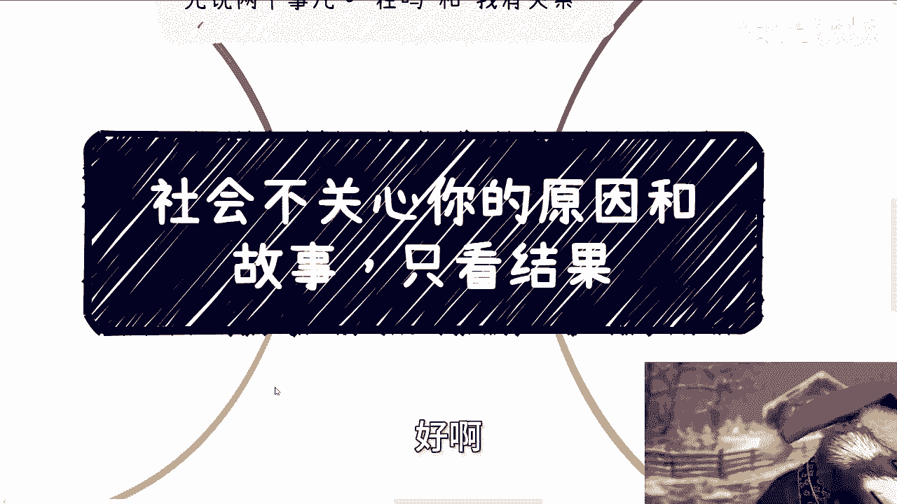

就这么着啊，然后那个职业规划，商业规划啊，股权合同分红分润啊，商业计划书啊，白皮书，包括你们手上有什么牌，你们手上没有什么牌啊，你们希望通过跟我的沟通，能够呃这个更理清楚接近。

更接近于当下真实社会的一些额这个方向，或者说一些规划的话，那么你们整理好个人的问题跟个人背景好吧，然后咨询我，我们再来走咨询啊好吧，然后另外一方面，就是说如果想着通过咨询一步登天啊。

或者想着什么通过就是这种很简单的咨询啊，能够有什么量呃，变成质变的或者怎么样的，那你们别来找我啊，好啊。

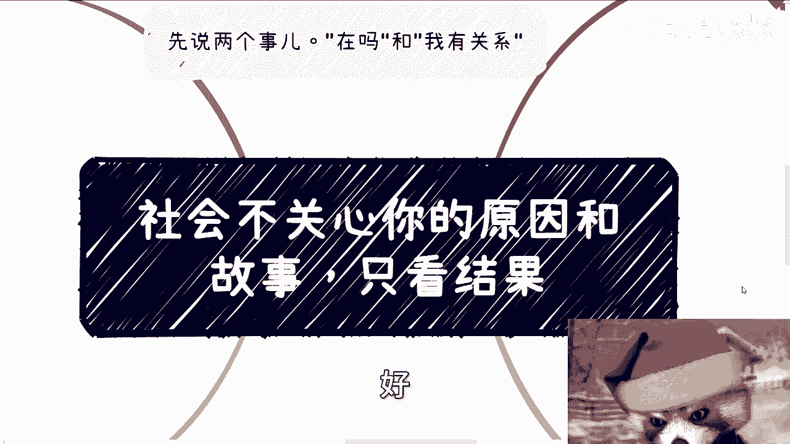