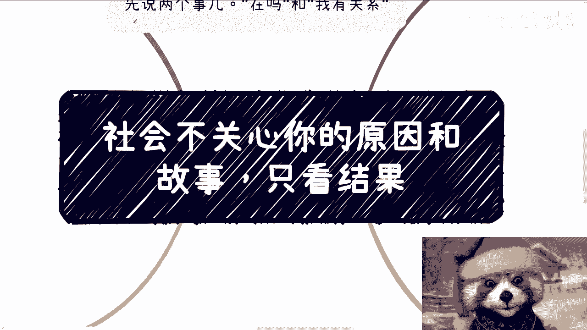
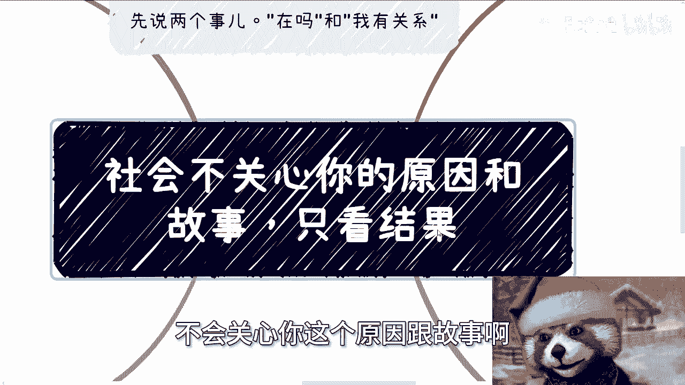
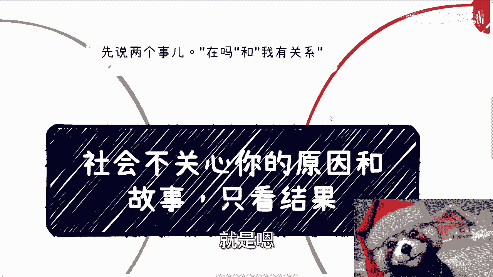
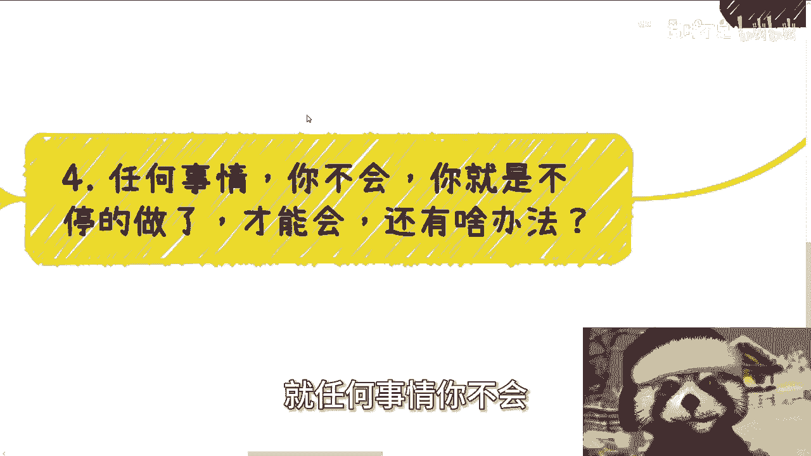
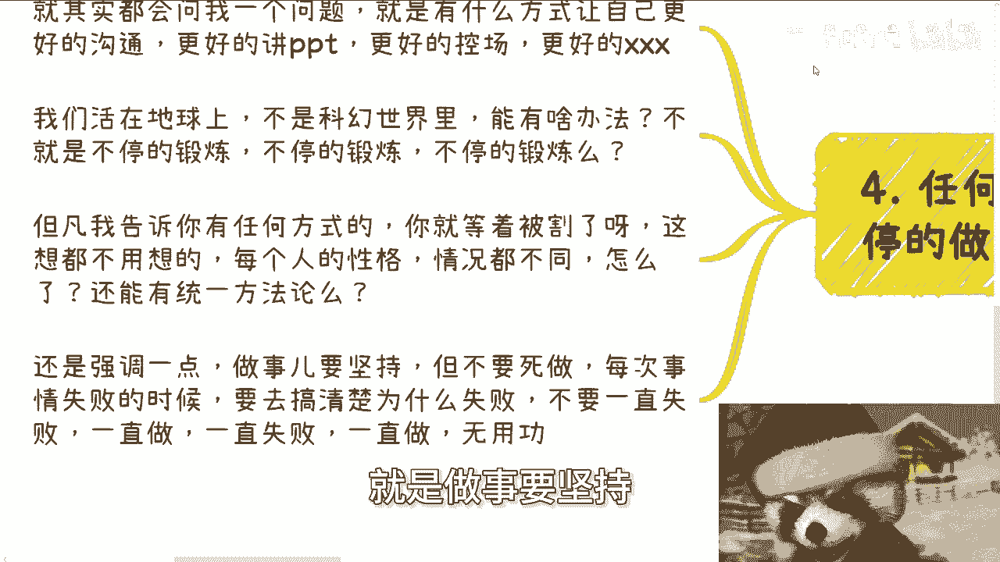
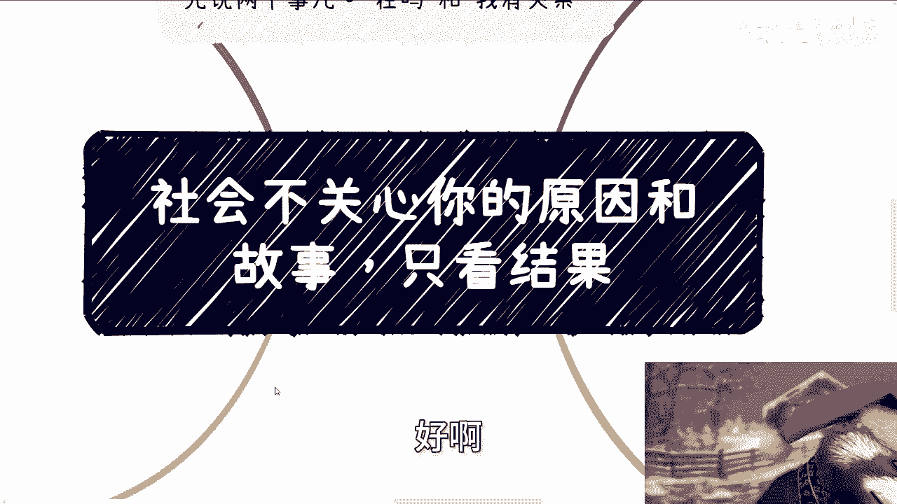

# 课程01：社会不关心你的原因和故事，只关心结果 🎯

在本节课中，我们将探讨一个核心的社会现实：外界评判个人时，往往只关注最终呈现的“结果”，而非背后的“原因”或“故事”。我们将通过具体案例和分析，帮助你理解这一逻辑，并学会如何调整思维与行动，以更有效地在社会中创造价值。

---

## 概述：核心观点与常见误区

社会运行的底层逻辑是结果导向。无论你拥有多么曲折的经历或合理的借口，在合作、求职或任何价值交换场景中，对方首要关心的是你能交付什么确定性的成果。许多人未能取得进展，并非缺乏想法，而是陷入了自我叙述或无效纠结的误区。

上一节我们概述了课程的核心观点，本节中我们来看看几个具体的沟通与思维误区案例。

## 沟通中的低效行为

有效的沟通应直奔主题，提供清晰、确定的信息。以下是两种典型的低效沟通方式：

1.  **模糊发起对话**：以“在吗？”作为开场白。这种问法迫使对方进行无意义的猜测，无法推动事务。正确的做法是直接说明来意。
2.  **提供无效信息**：在寻求合作时，声称“我有关系”却无法提供任何实质性证明（如法律文件、官方背书）。在商业语境中，无法验证的“关系”不具备沟通价值。对方需要的是能确保事情推进的**确定性要素**。

## 案例分析：思维陷阱与行动瘫痪

我们通过几个真实故事，来剖析常见的思维陷阱如何导致行动停滞。

### 案例一：执着于过往而无视新建议

一位创业五年的朋友，成果有限。当他人提供新的流量与变现思路时，他表现出不屑。关键在于，长期没有结果的“努力”本身不构成价值。社会评价体系是：**结果 = 价值**。没有结果的过程，很难成为有效的积累或谈判筹码。

### 案例二：被虚构的“高成本”吓退

一位觉得专业前景有限，想闯荡社会却始终害怕的伙伴。他的卡点在于“害怕没做过”和认为“试错成本高”。但这常常是一个被灌输的模糊概念，而非基于现实的分析。真正的思维闭环是：因为没做过所以怕 → 因为怕所以不做 → 永远都不会做。打破循环的唯一方式是**开始行动**，而非在想象中纠结成本。

### 案例三：在他人意见中摇摆，从不行动

一位受启发想尝试商业行为的朋友，因他人一句“你什么都没有，做不了”而陷入犹豫。这里存在双重问题：第一，将“现有条件”等同于“永久资格”是片面观点；第二，无论听谁的理论，**当事人始终没有行动**。正确的思路应是：如果缺资源，就去思考如何获取资源，即 `目标 -> 差距 -> 行动`，而不是用“没有”作为不开始的理由。

## 能力提升的唯一路径

对于如何提升演讲、沟通等软实力，常有人寻求捷径。但必须认清的现实是：

**核心能力 = 大量实践 + 复盘优化**

就像通过反复练习才能熟练演讲一样，任何技能的提升都依赖于持续的行动积累。市面上声称能快速提升“自信”、“影响力”的课程，往往忽略了个人特质与复杂情境，其效果存疑。可学习的是方法论框架（如演讲结构），但内化与熟练度只能靠自己历练。

## 坚持行动与有效复盘

行动固然重要，但切忌“死做”。每次尝试后，无论成败，都必须进行复盘。

以下是有效的复盘逻辑：

1.  **向内归因**：分析失败时，首先从自身找原因。例如“活动没人来”，应分析自己的宣传策略、内容设计或渠道选择有何不足，而非简单归咎于“市场不好”。
2.  **提炼本质**：找到导致问题的根本原因，而非表面现象。这能帮助你在下一次行动中进行针对性改进。
3.  **持续迭代**：将复盘得到的认知应用于下一次实践，形成 `行动 -> 复盘 -> 优化 -> 再行动` 的成长循环。

## 摆脱“自我故事”的牢笼

每个人都有自己的艰辛过往，但社会对此并无兴趣。沉迷于讲述自己的“困难故事”（如出身、学历、心理状态），往往只是构建了一个自我设限的牢笼。别人只会根据你**现在和未来能创造的结果**来评判你。自信并非来自他人的认可，而是来自于你一次次达成小目标所积累的自我认同。`真正的自信 = 过往成功经验的累积`。

---

## 总结

本节课我们一起学习了“结果导向”这一社会核心逻辑。我们探讨了低效沟通的弊端，分析了几个因陷入思维陷阱而无法行动的案例，明确了能力提升源于实践与复盘，并最终指出沉迷于个人叙事无益于发展。请记住，世界关注你的输出。整理好你的问题与资源，专注于创造可展示、可验证的结果，是前进的最有效路径。

---
**附：咨询服务说明**
若需在职业规划、商业策略、协议制定等方面获得具体指导，请务必提前整理好清晰的个人背景、现状与具体问题。咨询旨在理清思路、贴近现实，无法实现一步登天。期待与务实者同行。