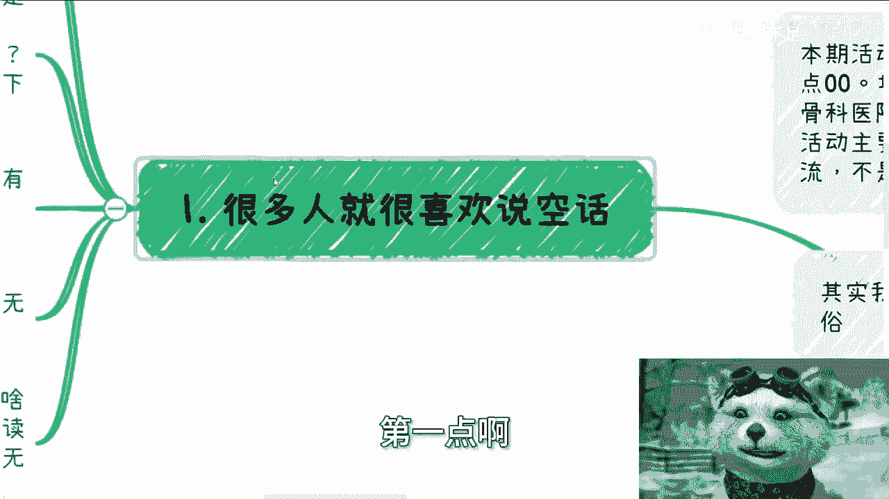
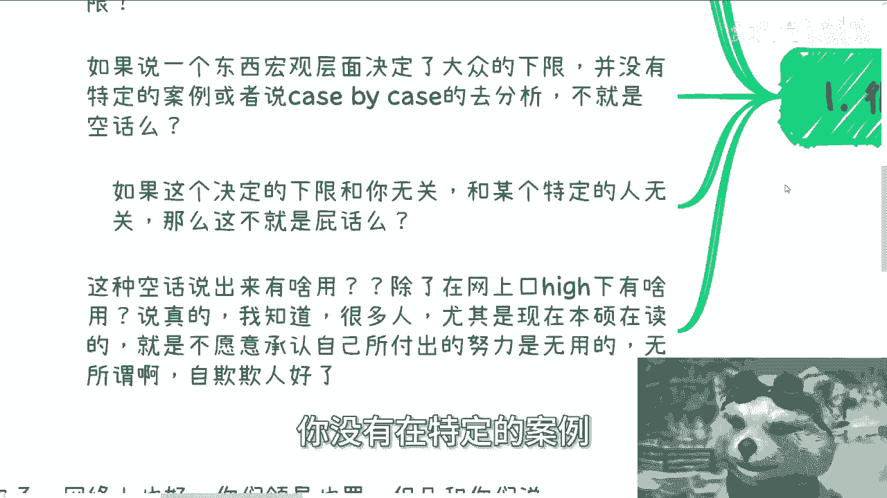
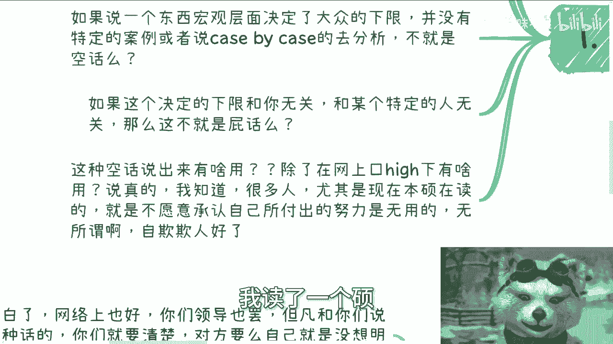
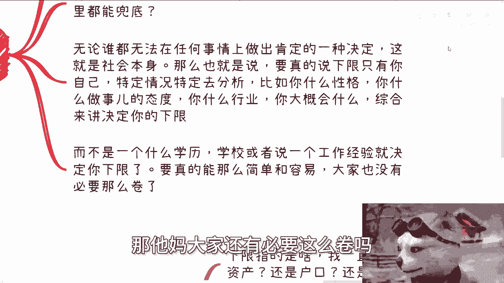
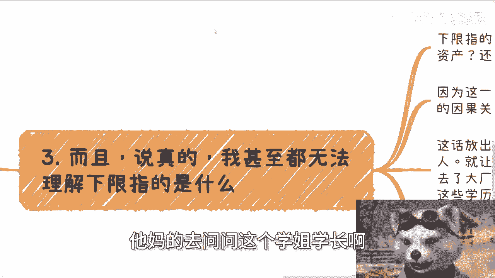
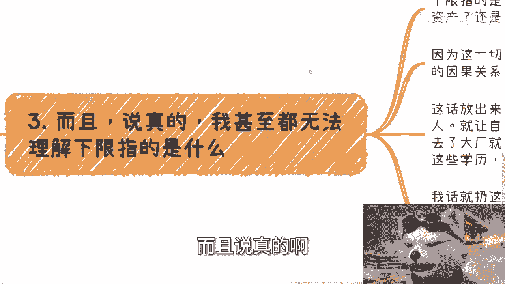
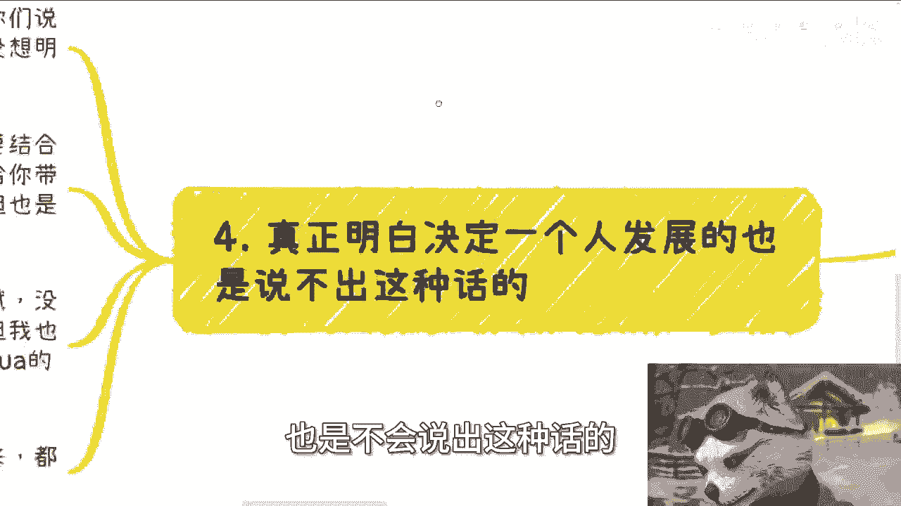

# 空话艺术课程1：单一因素决定下限的谬误 🎭

在本节课中，我们将要学习如何识别和剖析一种常见的“空话”模式，即“某某因素决定下限”的论断。我们将分析这种说法的逻辑漏洞，并探讨在复杂社会中，个人发展的真实决定因素是什么。

## 课程概述与活动通知

首先通知一项线下活动。成都活动定于6月16日下午1:30至6点，地点在青羊区神谷科医院附近。需要报名或了解详情，可以继续私信。

今天我开启一个名为“空话艺术”的新系列主题。本系列旨在剖析那些听起来正确但实际空洞无物的言论。

## 剖析“某某决定下限”的论断

很多人喜欢说空话，例如“学历决定下限”、“工作经历决定下限”或“大厂背景决定下限”。这种说法需要分开讨论。

### 第一点：下限的主体是谁？

首先需要明确，某个东西决定的是“大众的下限”还是“个人的下限”。

如果它决定的是大众的下限，那么需要追问：大众的下限具体指什么？是找不到工作，还是最低薪资？这个下限目前实现了吗？如果连这个下限都没有得到保障，那么谈论它决定下限就没有意义。

如果某个因素只是在宏观层面决定了大众的下限，这种说法就如同宣称“中国老百姓都很富裕”一样，是脱离具体情境的空谈。

### 第二点：普遍论断与具体个案

在缺乏特定案例或具体情境（KPI分析）的情况下，这种普遍性论断就是空话。如果这个所谓的“决定因素”与你无关，也与某个特定个体无关，那么它更是一句无用的空话。

许多人，尤其是在读的本硕学生，内心不愿意承认自己付出的努力可能效用有限。他们试图用“我读了个硕士，这很有用”来证明自己。这种自我安慰影响不了别人，最终影响的只是自己。

## 个人发展的不确定性

接下来提出几个问题：
1.  踏入社会后，你能决定自己去哪里工作吗？
2.  你能决定自己稳定工作到多少岁吗？
3.  未来会发生什么，你能决定吗？

事实上，个人能决定的东西非常有限。这就是社会和世界的本质。

因此，如果真的谈论“下限”，它必须基于特定情况具体分析。需要考虑的因素包括：
*   个人性格
*   学习能力
*   做事态度
*   所处行业
*   掌握的技能

**公式：个人下限 ≈ f(性格， 能力， 态度， 行业， 技能 ...)**

个人的综合情况决定其下限，而非某个单一因素。如果社会真如那句空话那么简单，大家也就无需如此内卷和辛苦了。

### 第三点：“下限”的具体所指

甚至无法理解他们所说的“下限”具体指什么。是指工作、收入、对象、资产，还是户口？以上所提的选项，没有哪一个与你所谓的“决定因素”存在确切的因果关系。既然没有确切的因果关系，这仍然是一句空话。

“某某决定下限”这种话，除了用于PUA自己、恶心那些不具备该条件的人之外，还能有什么用？它让有些人觉得“我有个学历、进了大厂，下限就有保障了”，同时告诉那些没有这些条件的人“你们不行，是下等人”。这非常荒谬。

在中国，对于30多岁的人而言，真正决定下限的往往是**关系与资源**。在除火箭、航母、光刻机等尖端领域外的大多数普通行业，仅凭所谓“牛逼”的技能是没用的。因为拥有同样技能牌的人太多了。如果按“技能决定下限”的逻辑，所有会该技能的人下限都应该一样高，这显然不符合事实。

### 第四点：明白人的做法

真正明白是什么决定一个人发展的人，不会说出这种空话。

网络上或领导对你说“努力决定你的下限”、“这个证书决定你的下限”时，你要清楚：对方要么对社会缺乏理解，要么就是在PUA你。真正理解个人生存发展之道的人，一定会结合你的实际情况，分析具体事物能带来什么影响。某些东西或许是加分项，但也只是一个浮动权重，而非固定价值。

俗话说，死也要死得明白。即使没有天赋、技能平平、下限很低，也要清楚这个社会的真实运作逻辑，而不是活在被人PUA的世界里。直到某一天发现现实与那些空话完全不同时，至少能明明白白。

## 总结与咨询服务

宏观正确的空话不要轻易说出。无论在什么平台，这种话除了PUA自己和误导他人，毫无用处。正确的空话谁都会说，比如“好好努力，都有光明的未来”，但事实往往并非如此。例如，曾经阿里P7、P8、P9级别的员工，他们的发展下限也是case by case，取决于关系、产业、业务线和个人积累。如果按空话逻辑，所有同级别员工下限都该一样高，这显然是可笑的。现实中，package下降、失业、创业甚至摆摊的，大有人在。

因此，这个系列叫做“空话艺术”。这类话很多，以后慢慢列举。它们的特点是：说它不对，似乎无法彻底驳倒；说它对，又分明是句屁话。

---

**本节课总结**：我们一起学习了“某某决定下限”这类空话的荒谬性。我们剖析了其逻辑漏洞，指出个人发展下限是由性格、能力、态度、行业、技能等综合因素（`f(性格， 能力， 态度， 行业， 技能 ...)`）共同决定的，而非单一因素。同时，我们认识到在普通行业，关系与资源往往是更现实的决定因素，并学会了警惕那些脱离具体情境的宏观正确废话。

最后，关于职业规划、商业规划、股权期权、白皮书等问题，可以整理好你的问题与背景列表私信我进行咨询。请注意，咨询旨在提供分析与建议，无法承诺带来质变、财务自由或根治个人习性。抱有此类不切实际期望者，请勿联系。