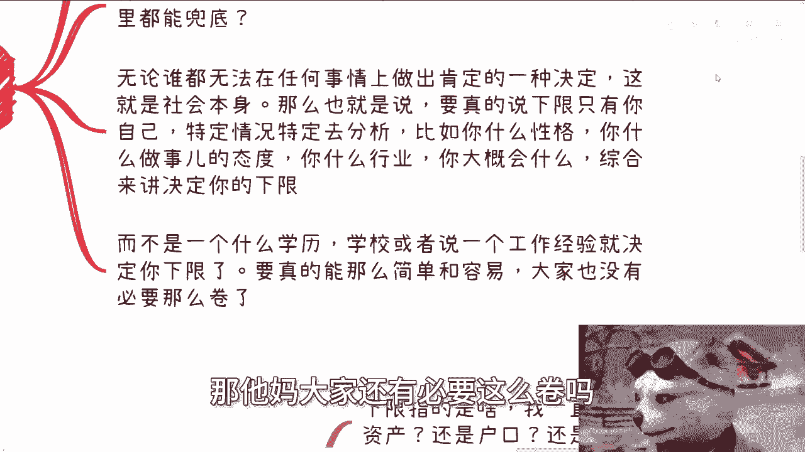
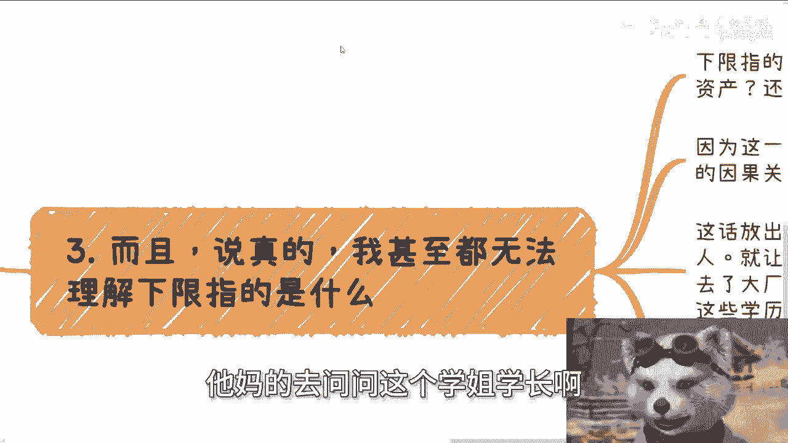
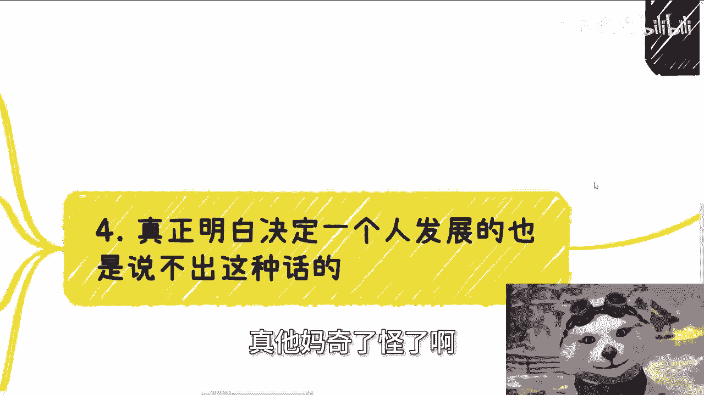

# 空话艺术1：xxx决定了下限 - P1 - 赏味不足 - BV14y411876T

好大家好啊，今天礼拜五了啊，明天明天我就去成都了啊，嗯今天开了个新的那个叫什么坑啊，待会再来说啊，首先成都的活动是6月16号好吧，下午01：30到六点啊，场地已经定了，在青羊区附近啊。

神谷科医院附近好吧，然后要报名的或者要了解详情的，可以继续私信我啊，然后呢今天我开了一个新的这个主题啊，大家可以看到叫空话艺术啊，我其实本来想叫屁话艺术，然后来想想算了，还是不要这么粗俗啊。

这个这么粗俗，粗粗一两次就算了，让大众一直知道我这么粗粗不太好啊，嗯啊那么今天我们讲的呢第一个啊叫什么呢，叫叉叉决定的下限啊，我本来呢也的确想写学历决定下限，我说想算了，唉他妈的引引容易引引来一帮啊。

那首先呢第一点啊。

很多人就很喜欢说空话，就是比如说啊什么什么决定下限，比如说什么学历啊，啊工作经历啊，大厂啊和谁谁谁合作啊，啊好像这个做了就决定下线，哎呀这话讲的啊，我们就分开来说啊，首先某个东西是决定了大众的下限。

还是说是决定了你的下行，如果来说这个东西决定了大众的下限，那么请问大众的下限是什么啊，如果是大众下线是找不到工作啊，还是最低的薪资，那请问哈，请问这个下限现在实现了没有，哎我就奇奇怪了对吧。

还是说现在是已经保障了这个下限了没有，那如果来说都没有保证这个下限，那的跟我谈什么下限呢，对不对啊，那如果说一个东西只是在宏观层面，决定了大众下线，这就好像我现在说人人中国老百姓都很富裕，这话有用吗。

来这不是脱裤子放屁嘛，对不对，哎妈的，我跟你讲，真的很奇怪的，就很多很多，我他妈一看详情啊，什么什么叉叉大学对吧，什么很牛逼的啊，看上去还985211，他妈跑出来说这种屁话对吧，你你这种屁话没有用的。

你你没有在特定的案例。

或者说K白K去分析情况下面，这他妈就是屁话，如果这个决定，那反过来说啊，如果这个决定额这个决定的下限跟你无关。

和某个特定人也无关，那他妈更是个屁话对吧，我跟你说这种空话说出来有什么用呢，除了在网上口嗨还有什么用啊，啊说真的我跟你讲啊，很多人尤其是现在本硕在读的他，很多人他就是内心不愿意承认。

自己所付出的努力是没用的对吧，他非要就证明哎，你看啊，我我读了一个硕。

读了个什么，我很有用对吧，无所谓啊，你自欺欺人好了，对不对，你又影响不了别人。

那么你最终影响不是你自己吗，啊第二点我问几个问题啊，第一你出了社会之后去哪儿工作，你能决定吗啊，你能很稳定的工作，几到几岁你能决定吗，那未来会发生什么事情，你能决定吗啊，或者话又说回来。

你能决定什么东西，你什么都决定不了，对吧啊，然后你对社会了解多少，还是你做不做，随便怎么做呃，随便你怎么搞，家里能兜底还是怎么样子对吧，你讲清楚啊，我们就说啊，无论谁都无法在任何事情上面做出一个。

就是这个怎么说呢，保证的决定啊，为什么，这就是社会本身，这就是这个世界的本身，那么也就是说，如果你真的要说下限这个现象是什么，只有你自己就是特定的情况，特定去分析，比如说你什么性格啊对吧。

你学习能力怎么样啊，你做事情态度是什么，你什么行业啊对吧，你大概会什么对吧，你你只有case by case，个人去个人的去分析，然后你的综合的情况来讲，它会决定你的下限。

而不是什么特定一个某个东西跑出来一句话，哎这个东西决定我们的下限，决定你个屁啊对吧，你单纯拿一个学校，拿一个学历，或者说一个工作经验，就等你决定你的下限，卧槽如果这个社会能有这么简单。

那他妈大家还有必要这么卷吗。

大家到今天还有必要这么苦吗，啊那奇了怪了，你们说出就是他们这种说出这种屁话的，他妈的去问问这个学姐学长啊。

他妈搞笑了，真的是第三啊，而且说真的啊。

我甚至无法理解啊，他们说的下限指的是什么，你下限指的是啥，工作吗，收入吗，对象吗，资产吗，还是户口，还有什么对吧，因为我们刚刚所提到的工作收入对象，资产户口，没有哪个东西。

跟你所谓的这个这个这个决定下限，这个东西是有因果关系的对吧，那既然没有肯定因果关系，这不还是个屁话吗，啊就是这种什么某某某什么决定下限，这种屁话放出来，除了PUA自己恶心，那些没有下限的人。

就就让自己感觉到哎可以了，反正我有个学历去了大厂就好了，然后就有了下线了啊，然后告诉那些没有这些学历，没有这些竞争的人，就是你们不行啊，你们就下等人，那奇了怪了，对不对，那我跟你讲，我这话就扔在这。

在中国，30多岁开始决定下线，只有关系跟资源，跟我扯，别的没卵用的，就这么简单，明白吗啊你要么就是造火箭，要么造航母，要么造光刻机光刻机，你但凡是别的各种各样的，普普罗大众的普世化的行业，逼逼啊。

再牛逼也没卵用，就这句话还下线呢，拉倒吧啊，为什么，因为拥有同样牌的人太多了，你会啥别人不会吗，你有啥会别人不会的，你告诉我啊，那照你这么说，反正他妈会你这个技能的，大家下限都一样啦。

哼真他妈奇了怪了啊。

第四真正明白啊，决定了一个人发展的，也是不会说出这种话的。

什么意思呢，就说白了网络上也好，你们领导也好，但凡跟你们说这种话的，什么什么什么，你们努力对吧，你们这个东西要决定你们下限的，你们就要想清楚，对方，要么自己压根就对这个社会没有理解。

要么就是PUA你没了，就这两个选择对吧，真正明白一个人怎么发展的，怎么生存的，一定是结合你的个人实际情况来讲，到底什么东西能给你带来什么影响，以及某些东西也许是加分项，但是其比也也就是一个加分的比例啊。

不是一个固定的一个加分，那么说白了俗话说得好，什么意思呢，死也要死的明白，就是我就算没有天赋，没有什么特殊技能啊，我就算下限很低，但我要也要清楚，这个社会其的确也就是这么一种运作。

我不想一直活在被别人PUA的世界里面，就好像人家跟我说，哎你你考了一个什么什么东西啊，怎么样怎么样，你就能提升我的下限，妈直到某一个时间点，直到某一天，我发现他妈的跟你们说的完全不一样。

那我死的死也死的不明白啊，对不对，所以我还是那句话，宏观的正确的这种屁话不要说出来对吧，你但凡讲出来，不管你在什么平台，你在网络上讲出来，除了PUA自己就是害别人，你还有什么用呢，这种话啊还有什么用呢。

正确的屁话多了去了呀，我也会说的呀，哎你们好好考啊，你们好好做对吧，你们去了都有美好的未来，谁不会说啊对了，但事实呢是这样的啦，对吧，我你你我们就随便打个比方，你们去问问看那些进了大进过大厂的人对吧。

你比如说以前阿里的那些P7P8，P9决定什么下行啊，卧槽决定了下限都是要case by case，看关系，看产业，看这个业务线对吧，看他积累的东西，这他妈才是要去看他未来走做点什么哦。

照照照这种这个说这种屁话的人来讲的话哦，那所有P7P8P九的这个下限都一样高，那么搞笑的，你们自己去看看啊，现在多少人他妈的啊，这个这个package往下走的，甚至找不到工作，自己出来创业的对吧。

甚至是创不了业，摆摊的也有的呀，你决定什么下限啊，真的，所以呢我才说叫空话艺术啊，这种话很多很多，我回头慢慢慢慢给你们列，就是你很搞笑的，就是这种话写出来哼你说的不对吧，好像你也不能批判他，你说他对吧。

他妈就是句屁话，妈也是搞笑的，妈我都不明白他妈的这么多人读到本硕读书，他妈读出来就这种吊样子啊，行好吧。

那就这么着啊，然后成都活动好吧，6月16号啊，6月16号下午啊，然后叫什么要报名的，就继续，我们继续私信啊，然后剩下就就是职业规划，商业规划啊，股权期权分红分润呃，白皮书，商业计划书啊。

包括你们在做一些别的事情当中，碰到一些什么问题啊，包括你们手上有什么牌，你们没有什么牌的呃，你们都可以整理好自己的问题跟背景的列表，你们可以啊，私信我再来走咨询好吧，然后如果来说。

你们指望啊这个咨询能够给你们带来质变，什么一下子财务自由了啊，或者说什么暴富，或者说什么什么改变你自己拖延的毛病。

那我跟你讲，你就别来找我啊，你们该这个钱该给谁骗，给谁骗啊，我没这个能力啊。