# 空话艺术2-我觉得工作实习都很忙-没空去学习和积累---P1---赏味不足---BV1kH4y1F7

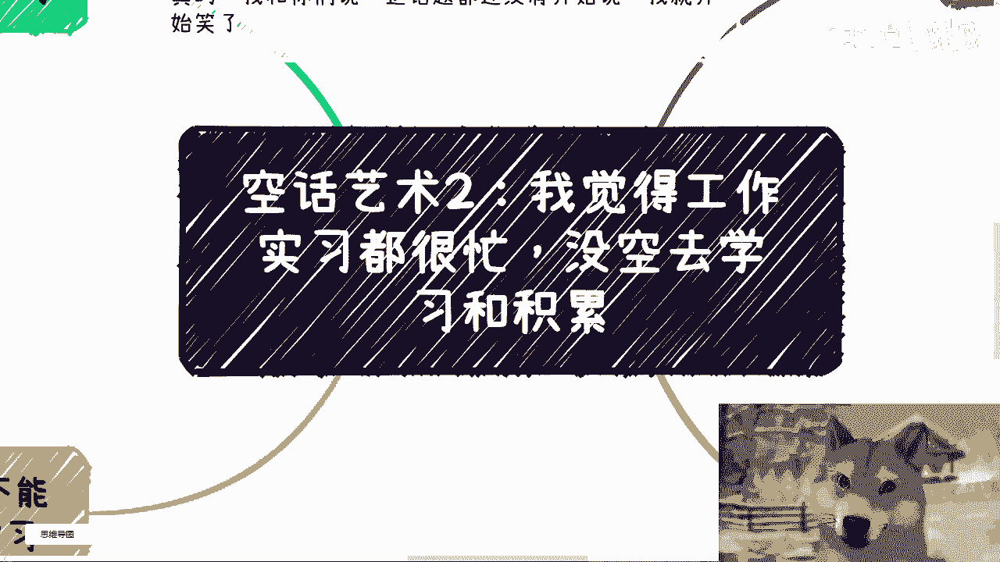

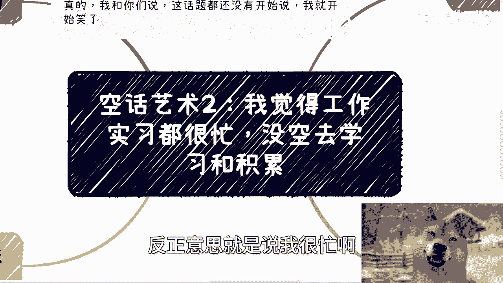

在本节课中，我们将要学习如何识别并应对一种常见的思维误区：以“忙碌”为借口，逃避真正的学习与积累。我们将剖析问题的核心矛盾，并提供清晰的行动思路。

---

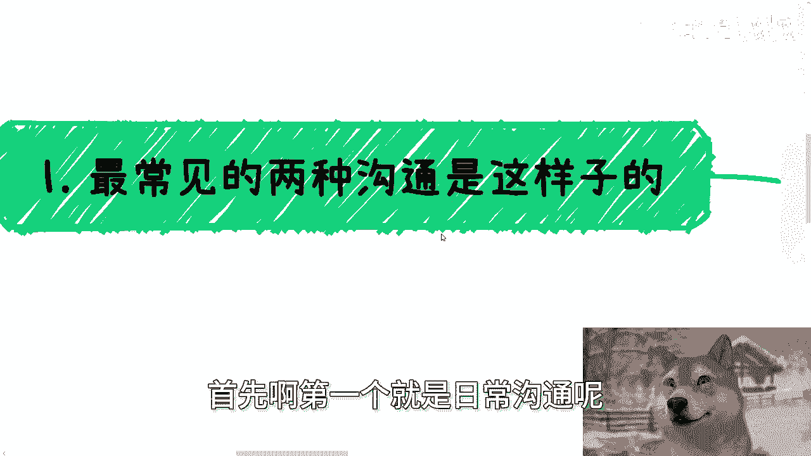

## 概述 📋

很多人常以工作或实习繁忙为由，声称没有时间学习和积累。本节课将深入探讨这一说法的背后逻辑，指出其核心矛盾并非时间不足，而是缺乏有效的方法论与持之以恒的毅力。

---

## 现象列举：常见的“忙碌”借口

以下是几种典型的、以“忙碌”为借口的沟通场景。

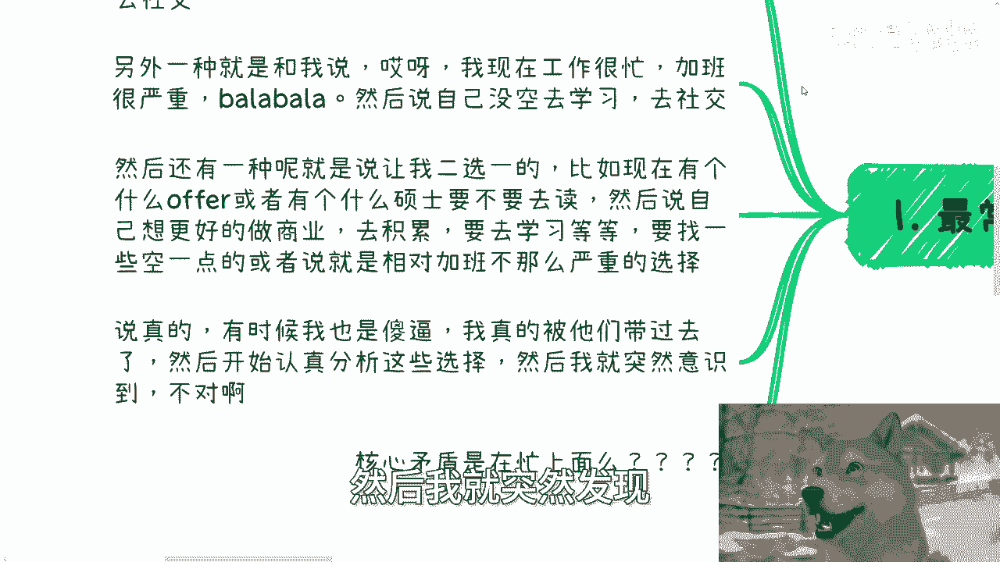

1.  声称学业或毕业事务繁忙，同时认为这些事务没有价值，导致没有时间学习和社交。
2.  抱怨工作加班严重，找不到轻松的工作，因此没空去学习和社交。
3.  在面对多个选择（如offer、深造机会）时，倾向于选择更“清闲”的选项，以便为所谓的“学习和积累”腾出时间。

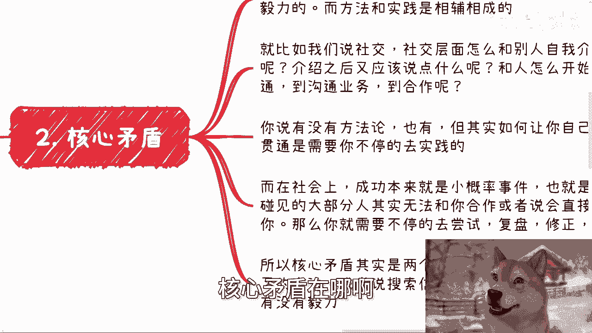

---

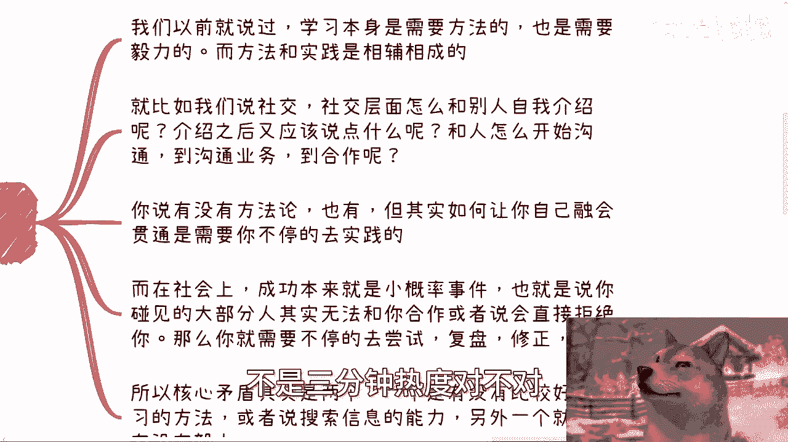

## 核心矛盾分析 🔍

上一节我们列举了常见的现象，本节中我们来看看这些说辞背后的真正问题是什么。

问题的核心矛盾并不在于“忙碌”本身。真正的矛盾集中在以下两点：

1.  **是否掌握了有效的学习方法论**。这包括高效的信息搜索与整合能力。公式可以表示为：**有效学习 = 方法论 × 信息处理能力**。
2.  **是否具备持之以恒的毅力，而非三分钟热度**。学习的持续性至关重要。

学习的方法论与实践是相辅相成的，适合自己的方法需要在实践中不断总结和修正。同样，社交等软技能的提升，也依赖于在大量实践中（面对普遍的拒绝与合作失败）去尝试、复盘和修正。

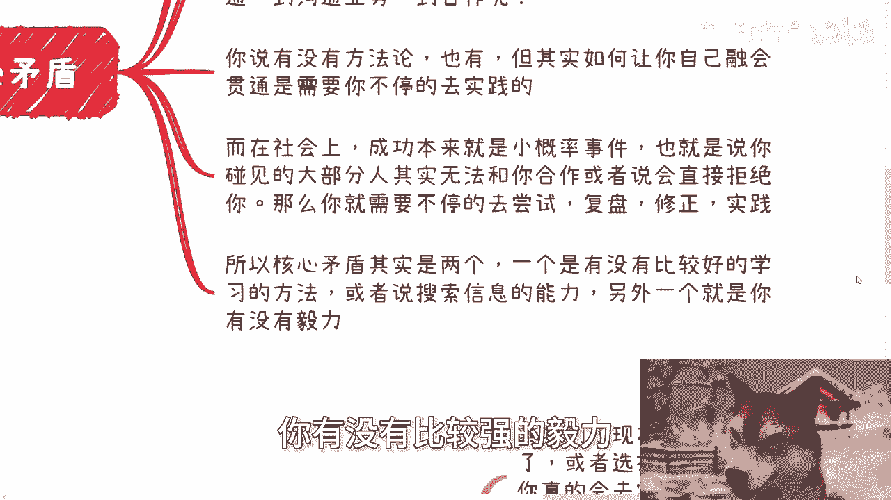

---

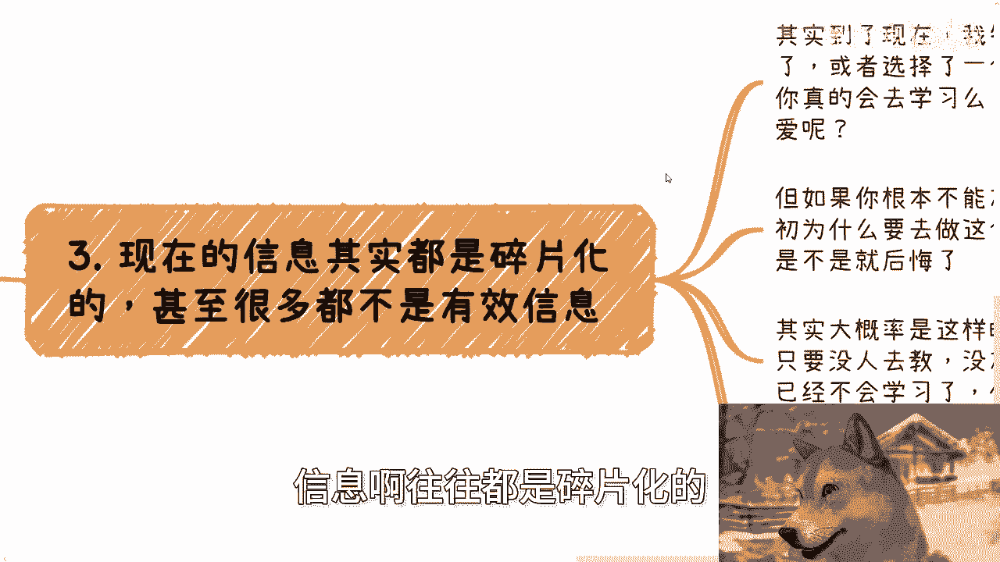

## 对“空闲”的反思 🤔

在明确了核心矛盾后，我们进一步思考：即使拥有了空闲时间，情况真的会改变吗？

在信息碎片化的时代，许多人已经丧失了自主学习和系统梳理信息的能力。如果缺乏内在驱动力和毅力，即使拥有了空闲时间，也可能被浪费在娱乐消遣上，而非用于真正的积累。因此，将选择建立在“为了未来学习”的假设上，最终可能导致后悔，甚至将责任归咎于他人。

所以，“我很忙，没空”的表述并没有触及问题的本质。

---

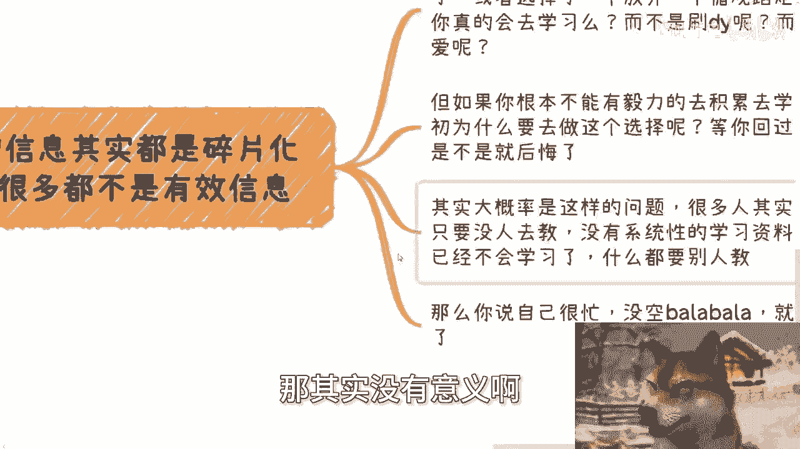

## 反向论证：忙碌不是障碍 ⚙️

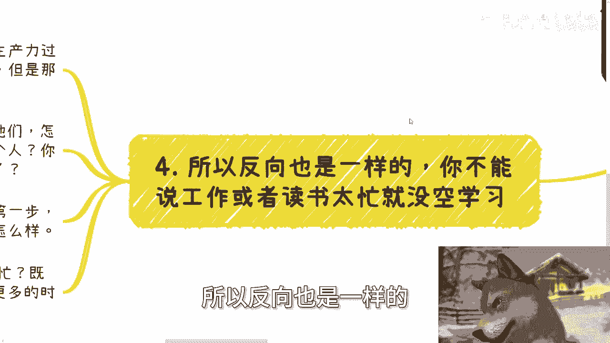

既然“空闲”不一定带来改变，那么“忙碌”也未必是真正的障碍。

在当下生产力普遍过剩的行业环境中，极少有工作会占据员工的每一分钟。对于绝大多数人，尤其是年轻人而言，工作中存在可自主利用的间隙时间。关键在于是否主动将这些时间有效利用起来，用于提升自己。

期望通过换一份“更轻松”的工作来每天获得两小时的空余，这种想法往往不切实际，且忽略了核心问题：**改变的动力和执行力**。过分纠结于细节时间，恰恰是缺乏大局观和强大执行力的表现。真正的突破，需要付出超越常人的努力。

---

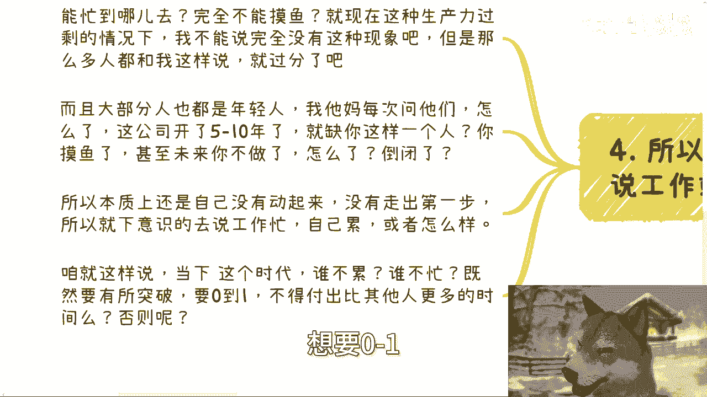

## 总结与行动指南 🚀

本节课我们一起学习了如何辨析“没时间学习”这一借口的本质。

核心结论是：阻碍你学习和积累的，通常不是客观的“忙碌”，而是**主观上缺乏高效的学习方法**和**坚持下去的毅力**。

行动建议如下：

1.  **停止寻找借口**：正视“忙碌”只是表面现象，深入分析自己无法行动的真实原因。
2.  **建立个人方法论**：开始有意识地总结适合自己的学习与实践方法，哪怕每天只进步一点点。代码式的坚持可以是：`while (hasTime): learn(something)`。
3.  **利用碎片时间**：无论工作多忙，主动寻找并利用起那些可支配的间隙时间，立即开始行动。
4.  **关注主要矛盾**：将精力集中在提升核心能力和积累有效经验上，而非纠结于工作时长等次要细节。

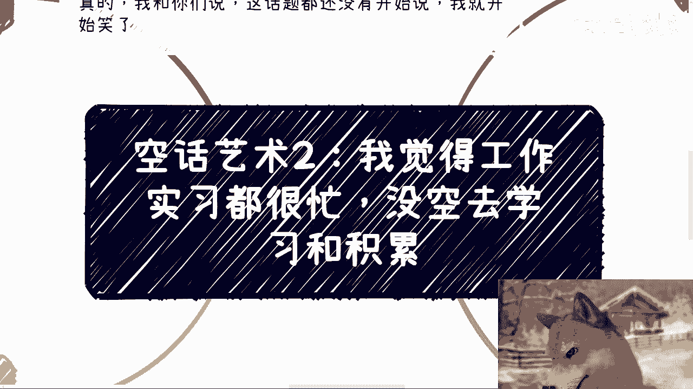

真正的改变，始于认清矛盾并迈出第一步。

---

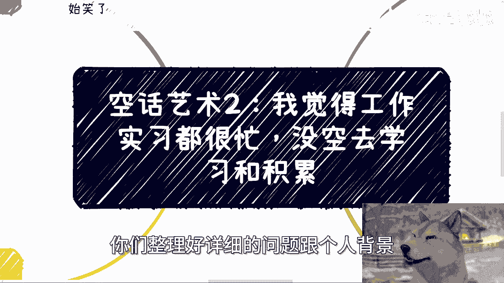

**附：活动与咨询信息**
下期活动定于7月13日（周六）在南京举行，内容涵盖低空经济、各类型企业分析及数字化发展机会。详情请私信了解。
如需职业规划、商业咨询等服务，请整理好详细问题与个人背景后预约咨询。