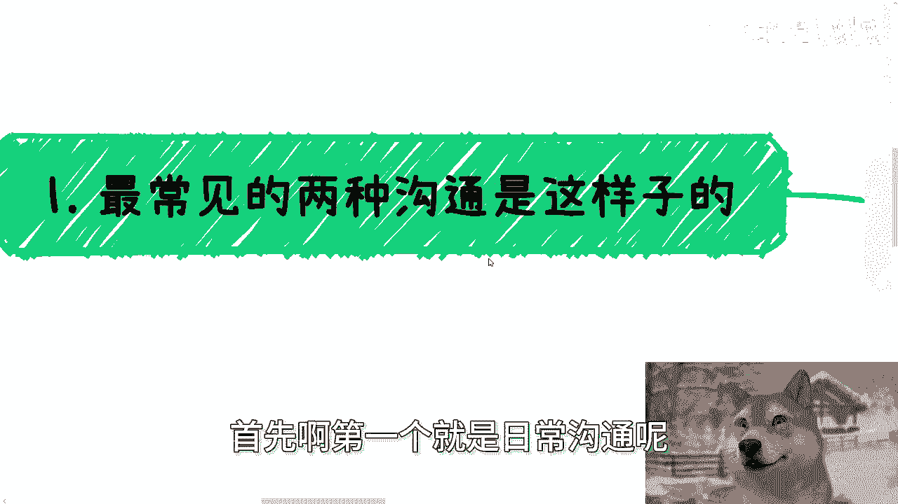
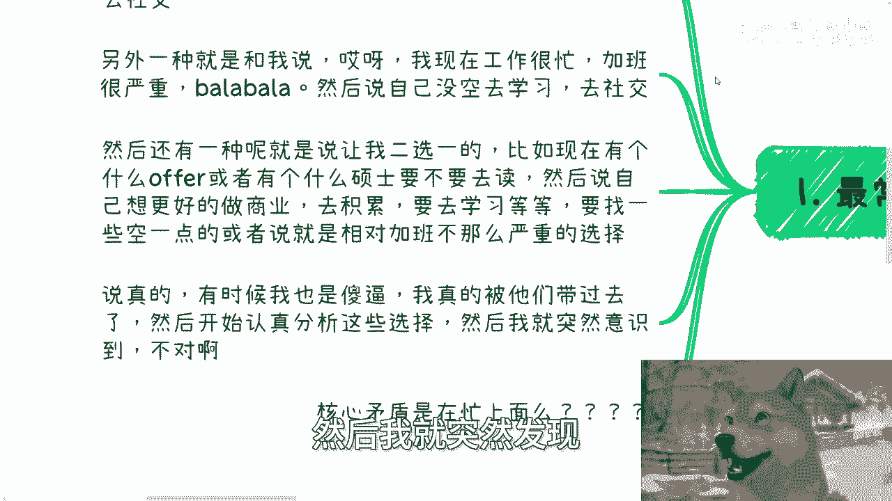
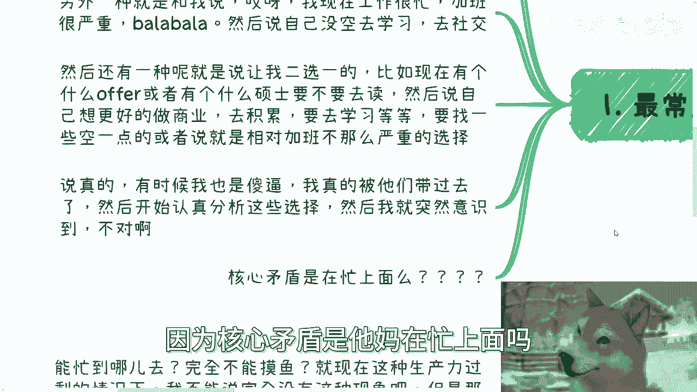
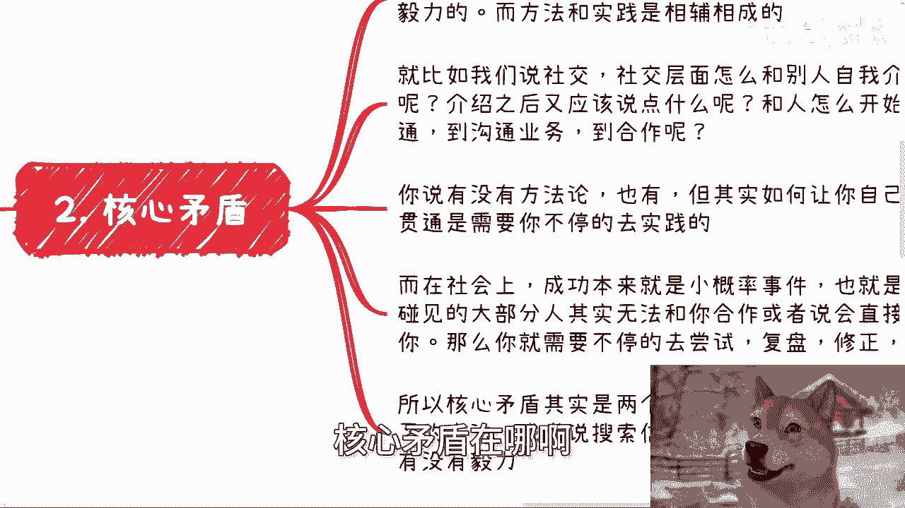
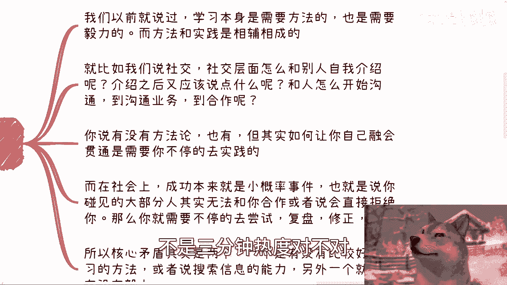
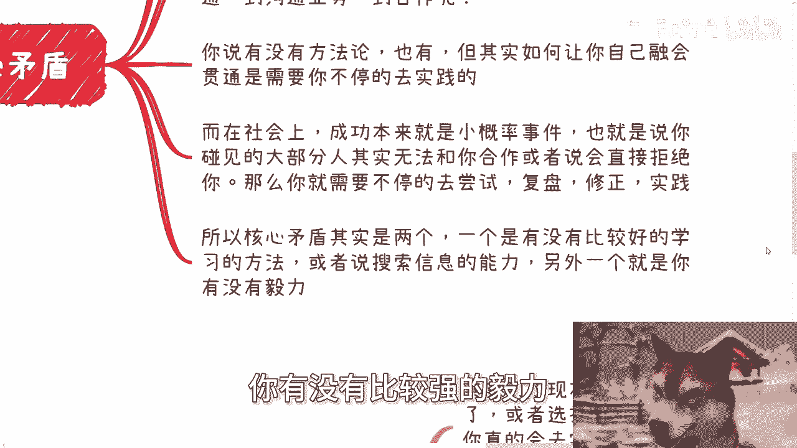
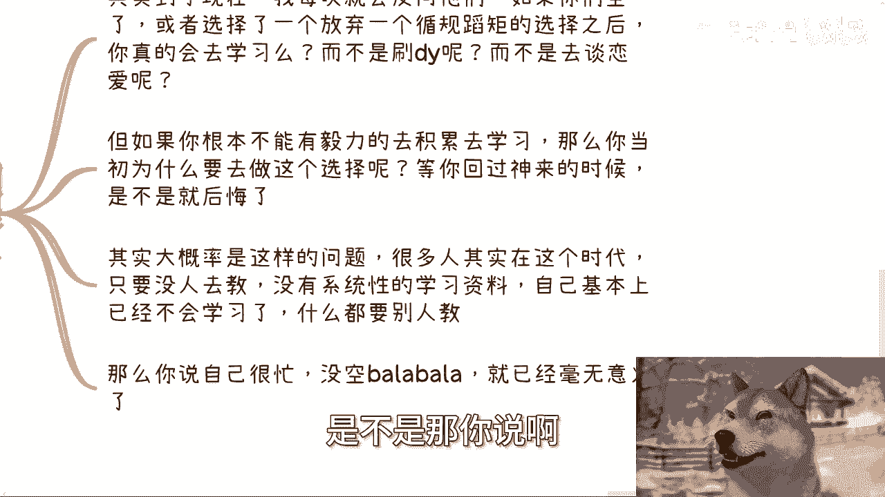
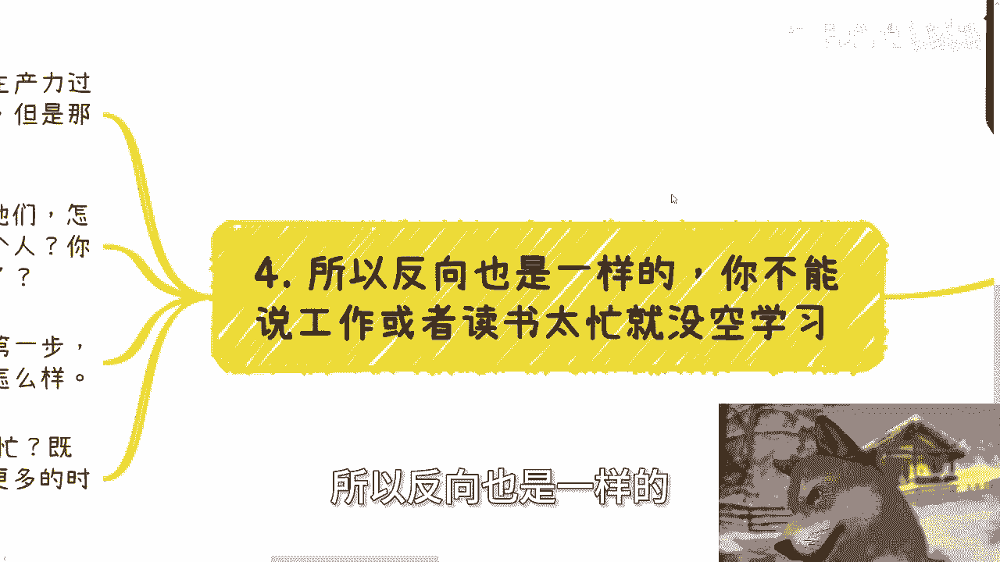
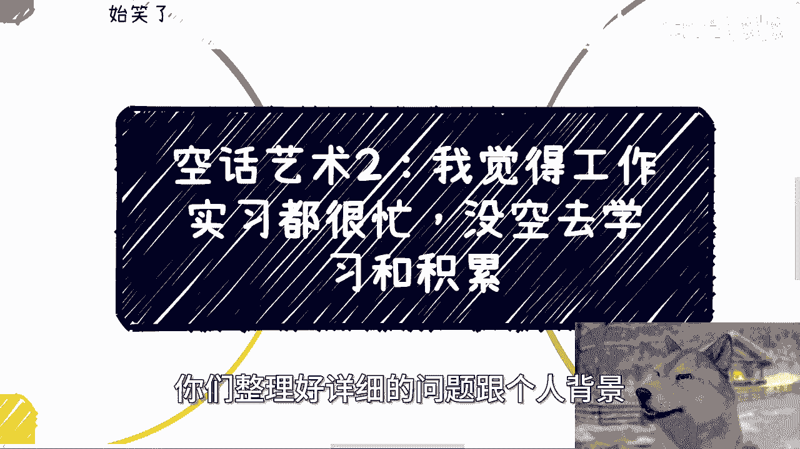

# 空话艺术2：我觉得工作实习都很忙，没空去学习和积累 - P1 - 赏味不足 - BV1kH4y1F7pU

好大家好，今天我们来讲的是空话艺术二啊，就很好玩啊，他说我觉得工作实习都很忙啊，或者我反正选择了一个什么东西啊，反正意思就是说我很忙啊。

然后没空去学习跟积累，然后哎反正就很好玩啊，呃首先啊就是下期活动我也定了，7月13号好吧，下周六在南京啊，一点到六点的样子，然后内容主题的话，一个是低空经济，一个是我会给大家分析一下民企国央企大厂。

外企当下的一些入职的优缺点，以及未来的一些发展，然后最后呢再聊一下当下企业的一些，数字化的额，数字化跟数字经济的一些发展跟机会好吧，然后详情跟报名也可以再私信我啊，唉看来来看一下我这智慧的眼神。

看到没有，咦，对不对啊，我跟你们讲今天这个主题真的啊，我跟你们说这话题他妈还没开始，我他妈就笑了，你知道为什么，因为日常呢，首先啊第一个就日常沟通呢。

很容易出现这种情况，一种是跟我说，他说陈老师我现在很忙啊，或者呢我觉得未来啊我的学习会很忙啊，又要毕业又要忙，毕业又要忙实习啊，但我觉得呢这些没什么价值啊，这就是话，反正好话坏坏话都被他说了啊。

就到时候我觉得没啥价值啊，浪费了我的时间啊，我根本没有时间去学习跟社交啊，那另外一种呢就跟我说，哎呀我现在工作很忙，加班很严重对吧，我我我没找到一个比较轻松的工作，吧啦吧啦吧啦说半天啊。

然后说自己没空去学习，去社交啊，然后呢还有一种呢就是让我二选一啊，比如说说现在有个什么offer啊，或者有一个什么什么硕士要不要读啊对吧，有个什么出国要不要去出啊，然后说自己要不要也呃。

没有空去这个做更好的商业去积累，去学习等等等啊，要找一些空一点，或者说相对来讲加班不那么严重的选择啊，反正说了一大堆啊，首先我先说一点啊，你们大部分人如果选择出去留学啊。

然后留完学之后不留下来的是要回国的，我跟你们讲，你们这两三年压根就他妈不叫留学，就出去旅游的啊，明白吗啊，别来跟我讲，他妈的有的没的，哎，你出去就是旅游的，不要自欺欺人啊，还有呢我跟你讲啊，就说真的啊。

有时候我他妈也是，我我我跟你们说啊，他们跟我讨论这个问题啊，我还真的被他们带过去了啊，然后呢我还开始跟他们认真分析啊，他们的这些选择当中啊，这个选择怎么样，那个选择怎么样。

为什么，因为核心矛盾是他妈在忙上面吗。

好我也觉得很奇怪，对不对啊，我跟你们讲核心矛盾在哪啊。

那这问题简单了，我们以前说过啊，学习本身两点是很重要的，一是叫做学习方法论，二就是要有毅力啊，不是3分钟热度，对不对。

然后呢，学习方法论呢跟实践啊往往是相辅相成的啊，也就是说每个人可能有适合自己的一些方法，但是呢这种适适合自己的方法呢，都是在实践当中呃，这个锻炼出来的啊，总结出来的好，那么就如我们说社交啊，社交层面。

他很多人都会问他说我怎么跟别人介绍自己呢，我介绍自己之后又该做些什么呢对吧，跟人开始怎么沟通呢，到沟通业务跟跟跟跟跟，到沟通业务之后该怎么合作呢对吧，说了半天，然后呢，你说有没有方法论有。

但其实如何让你们能够将这些方法论融合融会，贯通到你们自己身上，是需要不停的去实践的，而在社会上面成功本来就是小概率事件，我们应该也很清楚对吧，这道理都懂吗，你比如说社交1000个人能有那么1%对吧。

说说白了5%的人能够跟你合作下去，就是大家能够喜结连理对吧，能够往下走对吧，这他妈都是小概率事件，剩下95%的人都是拒绝你的，或者都是合作不了的，对不对，那么本质上就是说你既然作为一个普通人。

我既然作为一个普通人，我们能做的就是不停的去尝试，去复盘，去修正，去实践，所以核心矛盾在哪里呀，核心矛盾不是他妈的，你忙啊，不是不是说你找不到那个叫什么轻松的工作，核心矛盾是两个。

一个是你有没有比较好的这种学习的方法啊，方法论或者来说比较好的搜索信息的能力，另外一个就是你是不是不是那种3分钟热度，你有没有比较强的毅力。

这他妈是核心矛盾啊，啊我靠，我每次跟他们讲的时候，我发现我的妈也是，被他们带过去了对吧，三现在的信息，社会上的信息啊往往都是碎片化的。

甚至很多就他妈根本就不能称之为信息，其实到现在哦，我每次都会反问他们，我说哼我我我我说我他妈也，我说如果你们真的空了，或者你们选择了一个你们觉得唉还不错的offer啊，然后你们选择了一个放弃。

一个循规蹈矩的这个选择之后咳，就是因为有的人也跟我说嘛，他说哎比如说我不想去读个硕对吧，我就想直接去工作，直接去到商业上面去做，怎么样怎么样，我就反过来问我说你真的会去学习吗。

你真的不是说在这种空下来时间啊，这边偷偷懒，那边偷偷懒对吧，然后不是空下来时间，这边刷刷抖音，那边去谈个恋爱吗，啊你确定吗，我每次问他们，我说你确定吗，他们自己他妈都不确定，对不对。

那那但是如果你根本不能有毅力去积累去学习，那么你当初为什么要去做这个选择呢，你你你非要PUA自己说哦，这个我需要为了去积累去学习的，所以我选择了这个选择对吧，那么等到你回过神来的时候，是不是就后悔了。

甚至哦我说不好听点，还得把锅扣我头上啊，当时是陈老师说的对吧，这个东西选这个东西怎么样怎么样，唉自己不去学习，不去积累，怪我，对不对啊，所以说其实大概率我觉得都是这样的问题，就很多人在这个时代啊。

他只要没人去交，没有系统性的学习资料摊，他脸上就拍他脸上啊，他自己基本上已经不会学习了，他没有这个自主学习的能力对吧，什么都要别人教，那怎么办呢，是不是，那你说啊。

你说我很忙啊，你说我很忙啊，我我没空，巴拉巴拉巴拉，那其实没有意义啊。

因为这不是你的核心矛盾啊，那么第四，所以反向也是一样的。

你不能说工作或者读书太忙就没空学习，什么意思呢，就是我就这么问，你能忙到哪里去啊，我就这么问，你能忙到哪里去，就现在这种各行各业生产力过剩的情况下面，而且呃那当然啊，我不能说完全没有这种现象。

就是那种一天九个小时，每分钟都都都在那边忙的我，我不能否认这种现象，但是很多人跟我说啊，我很忙，完全不能摸鱼，大哥们，卧槽，你过分了啊，对不对，而且大部分人你们大部分人年纪都还比较轻，我他妈每次问他们。

我说怎么了哦，我说你们去的要么是大肠，要么就是一些至少开了两三年34年的公司哦，我说怎么滴了，这些公司他妈的缺你这么一个年轻人哦，你摸鱼了，或者未来你不做了，怎么了，这公司倒闭了啊。

那我就问你这他妈这公司他妈以前34年，五五到10年甚至20年，怎么开过来的，诶，奇了怪了，对不对，唉所以本质上还是自己没有动起来，没有走出第一步，然后下意识的非要去找借口说啊，我很忙。

我很累或者怎么样子，那咱就这么说，哎咱就这么说，2024年你们自己去看一下，我刚刚刷微博看到那个小红书又在裁员对吧，然后中汽好像那个销售也是全部在裁员，哎就当下这么一个时代，谁不累啊啊，谁不忙啊啊。

既然要有所突破，想要0~1。

那不得付出比其他人更多的时间吗，那否则呢怎么弄呢，对不对，所以说啊就是说我在这地方还得强调一下啊，就不是说陈老师啊，到时候又有人来说啊，陈老师跟我们说，不要认真工作，要摸鱼对吧，哎喂我只是跟你们讲。

你们一定会有空下来的时间，而我跟你们讲的是，你们要有效的利用起来，你们空下来的时间啊，我不管你们上班时候是空下来时间，还是晚上空下来时间对吧，你框架之间你要去利用，你不利用有什么用呢，对不对。

就是我跟你们讲，很多人都是属于那种主要矛盾，不管管次要矛盾，就像很多人跟我说，哎陈老师，我现在那个上班啊，比如说每天晚上十点钟下班啊，我想找个稍微轻松一点的，我说那这几点呢哦，他说那08：

30九点钟下班吧，或者八点钟下班，我说大哥，咱咱别自欺欺人，你找到一个八点钟下班，跟你十点钟下班，每天你就差这两个小时吗，我不相信的，我真不相信的，你要但凡有想做的东西，有毅力去做。

你不会差这两个小时的啊，而且更何况没有哪家公司跟你说十点就十点，跟你说，八点就八点没有的，他肯定是有上下浮动的，你到最后其实平均下来，你也不见得一定有这两个小时的这个空余时间，对不对。

所以说核心矛盾是你没动起来，核心矛盾不是这两个小时，就很多人真的做事情就是这个样子的，就是你知道吗，就是说在我看来，你其实是在找借口，但你从你自己看来，你可能觉得哎我想有改变，你要真有改变。

不会关注在这种细节上面的，你关注在这种细节上面，小细节的人，你做不成大事的，对不对啊。

行啊就这么着啊，那个下期活动好吧，南京啊，南京呃，下周67月13号啊，下午一点到六点好吧，然后报名或者了解详情的啊，你们私信我好吧好行，然后那个职业规划，商业规划啊，股权期权分红分润啊，合同啊。

商业计划书白皮书啊，或者你们手上有什么牌，你们没有什么牌，你们希望通过跟我的沟通，能够更好的呃，制定一些接近接近地气的这个未来的规划，或者方向的话，那么你们整理好详细的问题跟个人背景好吧。

我们再来约咨询啊。