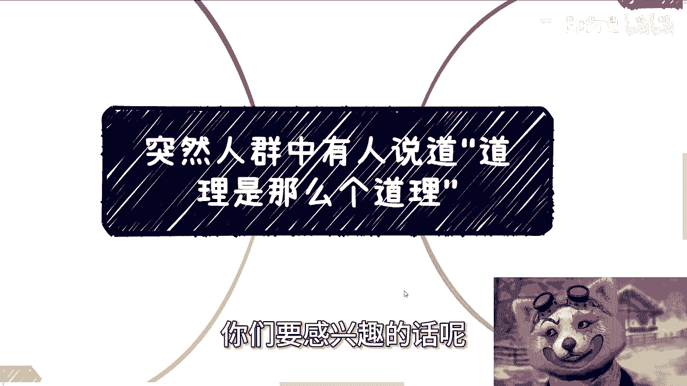
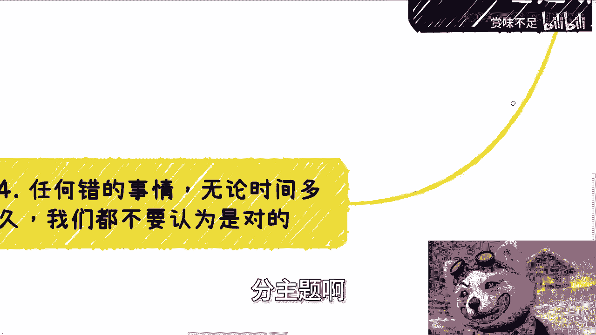
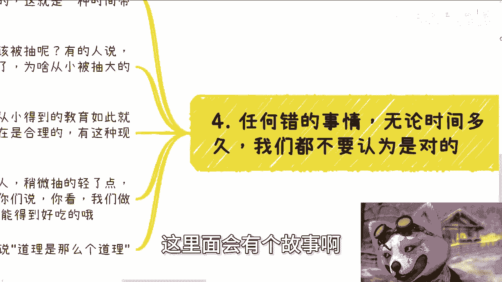
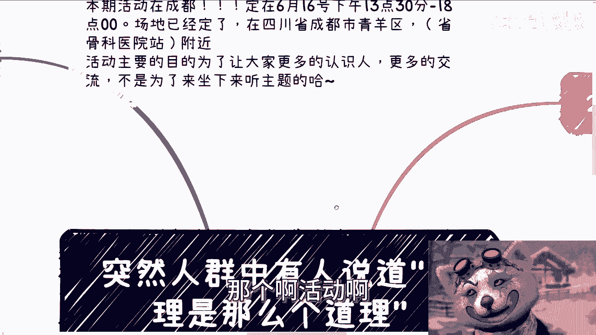
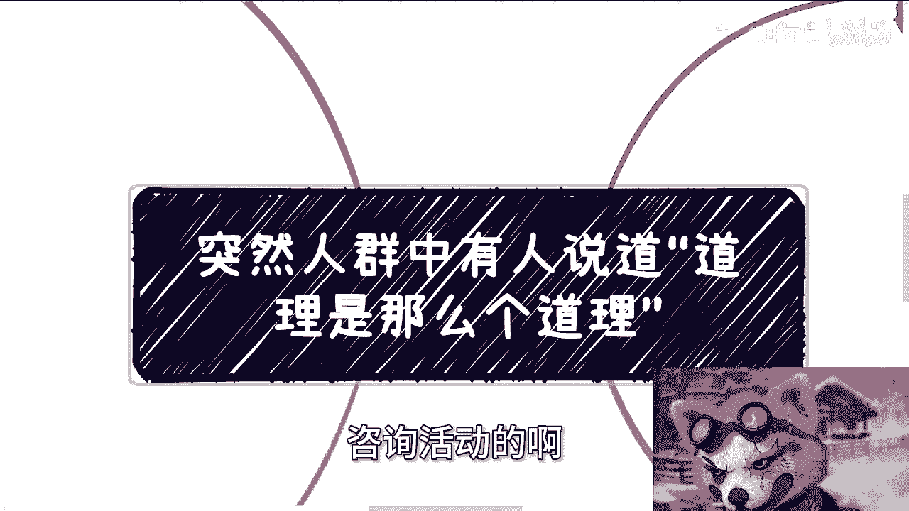
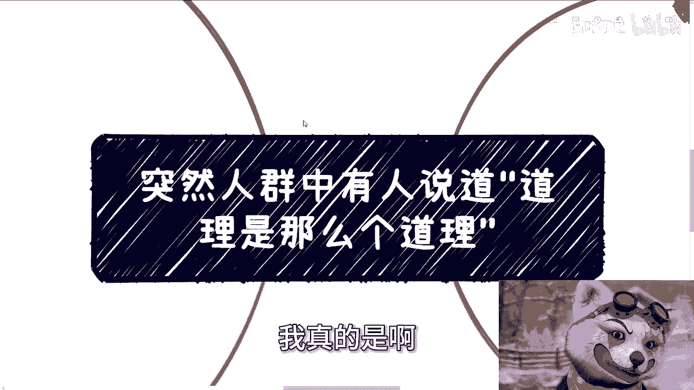
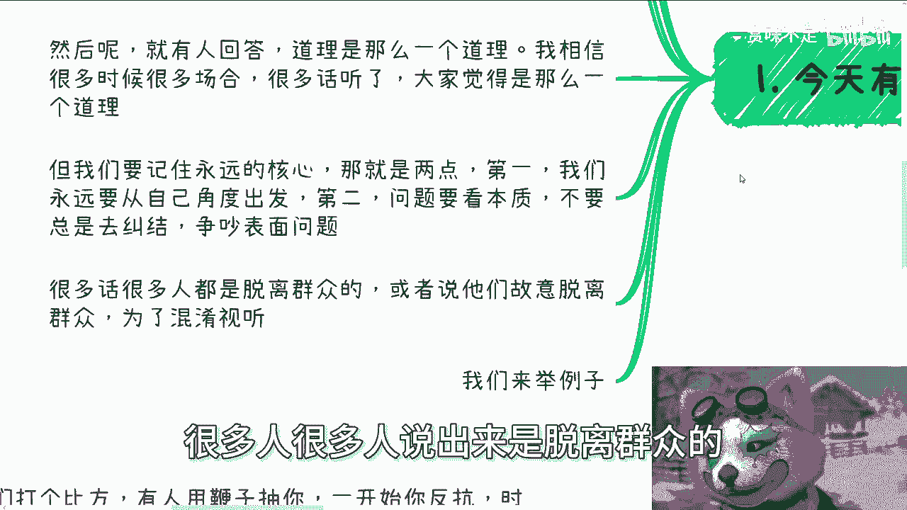
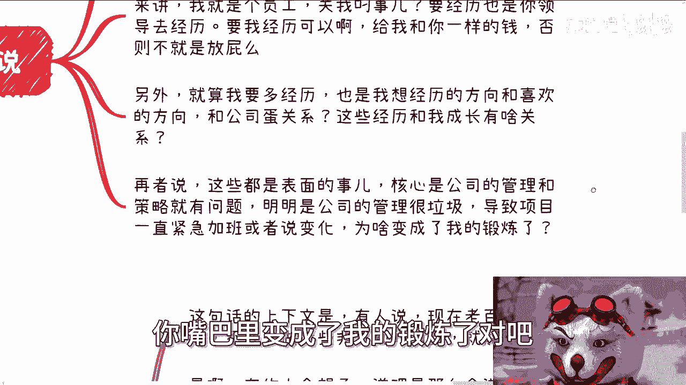
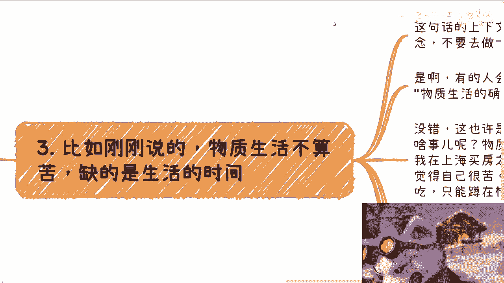
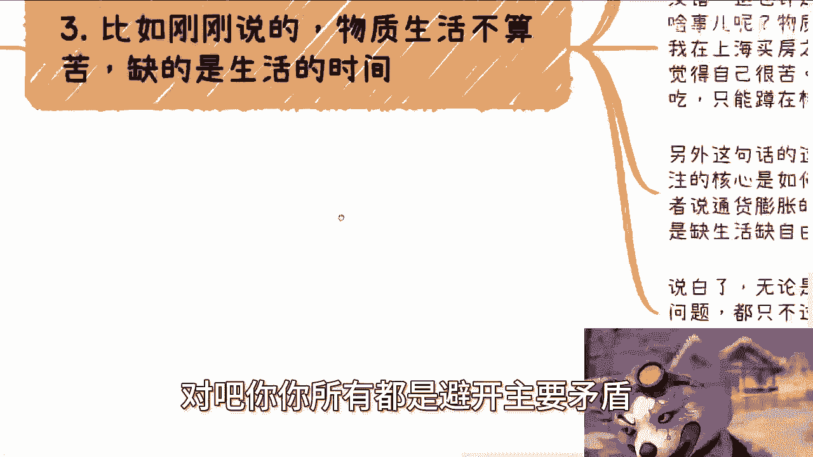

# 突然人群中有人说道，“道理是那么个道理” - P1 - 赏味不足 - BV1kJ4m1M7dx

好大家好。😊。

哎呀，今天我们讲的这个主题啊非常的奥妙啊，你们要感兴趣的话呢，你们可以直接拉到今天的第四个就是这个是什么分主题啊，叫做任何错的事情，无论时间多长，我们都不要认为是对的啊，这里面会有个故事啊。

大家可以看一下。😊。

呃，首先呢是这样子的那个呃活动啊，成都活动这边定了6月16号下午1点半到6点，好吧，场场地也已经定了。

在青羊区省骨科医院附近，好吧，要报名跟咨询的。咨询活动的啊，你们可以私信我。

呃，然后我先说一下前两天有个很好玩的事情，我本来想单独做一个主题，后来想算了，没啥好做。就是有一个有一个评论啊，之前是这么说的。他说啊陈老师，我觉得你这个每个评论都回复啊，闲得你很闲，跟你的人设不符啊。

我当时这么回复的这条评论我也没有删，我也没有拉黑，对吧？我觉得蛮好的啊，我是这么回复的，我说第一我也没什么人设，对吧？我要我需要什么人设呢？对吧？啊，我说第二，如果我有人设，那我就是很闲为什么？

因为我就是个老百姓，我我干嘛不闲呢？对吧？而且我觉得我每我大部分评论回复，是因为出于我对每个人尊重，这他妈还有问题吗？啊，而且另外一方面难道我要很忙吗？哎，那我不明白了，大家赚钱为了什么，为了享受生活。

为了自由，为了闲啊，我要是现在忙忙成狗啊，然后我还在这边一直一天到晚跟你们说啊，你们要努力，你们要你们要做想办法做商业，为自己要去创作机会，然后创造机会干嘛，跟我他妈一样忙吗？我他妈就不明白了。😊。

对吧哦，难道非要我是很忙很忙啊，吃得苦中苦方的为人上人吗？哎，真的我也我他妈也是服了，我真的是啊。那么今天这个主题呢叫做突然人群当中啊，有个人说到道理是这么个道理。😊。

一听这个主题就感觉很有故事性是吧啊？今天这个话题很有趣啊。首先啊我们以前说到过有件事情叫什么？就是有人采访啊，问你幸不幸福啊，回答我幸福啊，我幸福，还有回答我能说脏话吗？不能的话，我无话可说，对吧？

我现在就这个状态，我跟你们讲啊，那么今天这个主题呢说的是人民群众啊，生活幸不幸福，是不是有一些执念啊，有的人这样回复我，现在大部分人人民群众的这个物质上还是幸福的，但自己的时间太少了，加班太多了啊。

你们仔细听听这句话啊，你们仔细听听这句话啊。😊。

啊，我们待会儿再来说啊，这个话后面我会展开的，然后呢就有人回答啊，道理是这么个道理。😊，我相信很多时候很多场合很多话听了，大家也都觉得是这么个道理啊，但是我们永远要记住一个永远的核心是什么？就是第一。

我们所有的看问题的角度，一定先从自己角度出发，不是说你们要自私，而是说你们只有一开始自私了，你们才能成长才有积累，等未来再去为别人考虑，而不是一开始为别人考虑，没有意义的。😊，第二，看问题，要看本质。

不要总是去纠结其表面现象啊，当然后面我们也会展开啊，那么很多话呢，很多很多人说出来是脱离群众的，或者来说他们是故意脱离群众的。为了混淆视听啊。😊。

那但是呢那么很多人分不清楚啊，那比如说公司里面领导是这么说的，他说小陈啊啊你要好好工作，你还年轻啊，公司的未来啊，世界的未来都要靠你了啊。当然世界未来大了一点啊，你多经历一点啊，多做项目啊，多踩点坑。

对自己呢帮助都很大的，成长都很大对吧？好，可以啊，没问题啊，我觉得这个小陈啊，但是我我是这么想的，哎，道理是这么个道理啊，没有错呀，对吧？你这话没毛病啊，吧？但问题来了，从公司来讲，我就是个员工啊。

你他妈跟我说公司成长，关我屌事啊，公司未来关我事啊，要经力也是你领导去经历，要精力也是别人去经历吗关我屌事啊啊，要我经力可以啊，给我给我和你一样的钱啊，把你领导钱给我分我一半啊，赶你们股东的钱给我一半。

否则不就放屁吗？对吧？另外就算我要经力，那也是我要去经历，我我要经历的方向跟喜欢方向他妈跟公司有什么关系啊啊，你他妈公司给我的项目就是我要经力的啊妈奇了怪了，这些经力跟我成长有他妈当关系啊，再者说了。

这些东西也都是表面的现象。如果来说。😊，一直加班。如果来说一直项目各种各样的变化，那他妈说明你们公司管理策略就他妈有问题。明明是公司管理很垃圾，公司本身很垃圾，关我屌事啊啊，你公司很垃圾。

导致项目一直紧急加班或者变化啊，变就从你嘴巴里变成了我的锻炼了。😡。

对吧。哎，但是我还真跟你们讲，有的人啊，他就算被这样说了，他心里面还真这个想法，哎，道理是这么个道理，屁他妈道理，对吧？啊，第三，比如说刚刚说的物质生活不算苦啊，缺的是生活时间啊，我跟你讲啊。

这句话的上下文是什么？有人说现在老百姓要控制执念，不要去做一些非正规的消费，就能满足和幸福，对吧？好。😊。

是啊，有的人就会想道理是这么个道理，然后呢就会得出这么一句话。他他说物质生活的确不算苦，缺的是生活的时间啊。我跟你讲啊，你们有些人看到这句话觉得哎还是有道理的。哎，是事实，对吧？没错呀，这的确是事实。

但问题是从个体来讲，关我啥事呢？对吧？你跟我说物质生活不算苦，我没觉得呀，我觉得我很苦啊，对吧？我从10年前在上海买房之前，我从小小学551到五年级，我就是摆摊的啊，我就是卖报纸的。

当时上海有一个东西叫东方书报亭，我就我连东方书报亭的资格都没有。我就是在他妈的旁边租了一个地方，对吧？然后就是卖报纸，跟我妈一起卖。😊，对吧我一直觉得我很苦啊，我毕业之后打工吃饭还不能坐着吃。

他妈只能蹲在楼梯里吃。我一直觉得我很苦啊，你跟我说什么东西是不是事实，我不知道的，而且我我我心里第一个想法关我点事。😡，对吧另外这句话的想法非常的自我洗脑。为什么？因为我们要关注的核心是如何改变啊。

如何改变现在，比如说大众学历贬值，大众没有钱，或者说通货膨胀的问题。而不是说转移矛盾。就比如说刚刚那句话说，哎，比如说物质生活的确不算苦，缺的是生活的时间。那什么意思？解决生活的时间，我们就OK了啊。

现在问题就变成了缺生生活时间。😊，对吧。那么说白了。就像我们说的，无论性别歧视还是年龄歧视，还是很多问题。😊，都只不过是核心问题导致的一些结果，对吧？就像我们刚刚说的，核心问题是什么？

是公司的管理跟策略，他妈垃圾，对吧？你说加不加班，我经不精力，ok这都是结果，对吧？包括我们说的大众学历贬值，对吧？大众没有钱，这些东西也都是现象。😊，对吧我们要讨论的是什么？

我们要讨论的是核心的问题矛盾，主要矛盾。我们不要老是去讨论这些结果，讨论纠结这些结果是没有意义的。你纠结结果永远不会解解决问题。你就好像结果这个东西，有的人觉得现在学学历贬值，有的人觉得通货膨胀。

有的人觉得怎么样子。那问题是他妈的这些结果的根本原因在哪呢？😡。

对不对？😔，对吧你你所有都是避开主要矛盾，只只谈次要矛盾，有于有用不来，或者只只讨论矛盾所改变的现呃导致的现象有什么用呢？除了大家吵来吵去有什么用呢？好，那么第四点，我们来讲的今今天这个故事啊。

第四点我看看啊，差不多啊任何事情无论时间多久，我们都不要认为是对的，我们打个比方，有人用鞭子抽你一开始你反抗了，时间长了，很多人开始变态，甚至享受enjoy。再时间长了，人们认为活着就应该被抽。

为什么这就是一种时间带来的认知。但问题来了，为什么人活着就应该被抽呢？有的人就说我从小就被抽到大。😡。

哎那问题来了，那为什么你从小就被抽到大就是对的呢？你有没有想过这个问题？😡，啊，你说啊我就觉得是对的。好，那么你不能因为时间长，或者你从小得到的教育如此，就说是对的吧。当然你可以说存在即合理。

这句话是对的，对吧？就是说你说有存在于从小被抽到大，有存在于人民人民群众一直被抽的这个现象但是你不能说这个现象是对的啊，然后呢，突然有一天来了一个人，稍微抽的轻了一点。比如说以前人家一天抽100遍。

现在抽50遍，或者说现在抽完50遍呢，哎，不但抽完了还能给奖励，然后他跟你们说，你看啊，我们做了一些激励，对吧？谁抽的，比如说呃这个忍说的越时间越长，对吧？谁抽的不发出声音啊，还能吃到好吃的。

突然人群中就有人说嗯，道理是这么个道理。😊，对吧。对吧。😔，啊，你们他要告诉你们是什么，告诉你们，就是说哎你看啊我抽的不但少，哎，你们还能得到好吃的，对吧？所以说你要看啊，这个就是说我们已经进行改进了。

你要对我感恩戴德，对吧？然后突然就说到底是这么个道理。😊。

对吧？然后呢，那我就请问然后呢。然后人民群众就开始讨论是，哎，那我们以后是不是能只抽40遍。哎，我们以后是不是说哎给我们一点喝的对吧？怎么样子有意义吗？有没有任何意义呢？😊，对吧或者说有人来说，哎。

那你看啊我们现在大家其实抽的已经不疼了啊，大家大家现在缺的是一些这个这个更多的一些吃的东西。😊，你说这种话一任何就没有任何的意义呀。😡，对吧。哎，你们想想吧啊，想想好吧，然后那个成都活动啊。

成都活动继续报名啊，然后剩下的话就直接规划商业规划合同股权分润分红啊，那个啊商业计划书啊，白皮书啊，包括你们手上有什么牌，没有什么牌的，你们希望就是说通过跟我的沟通，通过跟我的一些视业啊，视角啊。

来给你们看呃得出一些更贴近于当下中国发展，或者说未来发展的一些这个路线的话啊，那么你们可以整理好自己的问题跟个人的背景，我们再来走咨询啊。啊，同样的啊，然后就是说呃想想通过这个咨询财务自由的。

想通过这个咨询赚到很多钱的，不要来找我啊，不要来找我所有东西只能靠你们实践啊，不实践，你单纯靠咨询，想得到任何东西，不可能好吧啊，你们你们你们觉得你们这个谁能给你们带来这个东西去找谁。

不要来找我我我带不来啊。😊。

