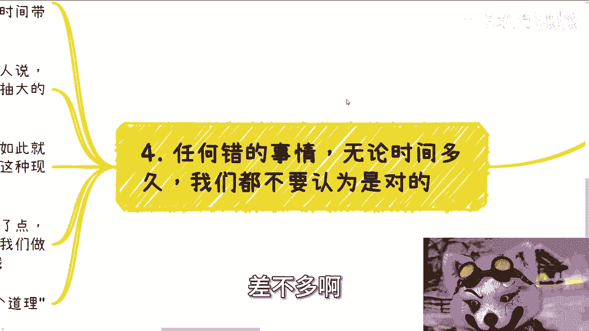

# 突然人群中有人说道--道理是那么个道理----P1---赏味不足---BV1kJ4m1M7dx_no

在本节课中，我们将学习如何识别和分析生活中那些听起来“有道理”的言论。我们将探讨这些言论如何转移核心矛盾，以及如何从个人角度出发，看清问题的本质，避免被表面现象所迷惑。

## 活动通知 📢

成都线下活动已确定。时间是6月16日下午1点半到6点。地点在青羊区省骨科医院附近。

如需报名或咨询活动详情，请私信联系。

## 从一条评论说起 💬

上一节我们发布了活动通知，本节我们从一个有趣的评论开始今天的主题。

前两天有一条评论说：“陈老师，我觉得你每个评论都回复，显得你很闲，跟你的人设不符。”

对于这条评论，我的回复如下：
1.  我没有人设。
2.  如果我有人设，那就是“很闲”。因为作为普通人，追求闲适和自由本就是目标。赚钱的目的就是为了享受生活，而非一直忙碌。
3.  我回复大部分评论是出于对每个人的尊重。

这个例子引出了我们今天要讨论的核心：许多听起来正确的话，需要我们仔细辨别。

## 主题引入：人群中的声音 🗣️

上一节我们从一个具体事例切入，本节我们正式进入今天的主题——“突然人群中有人说道，‘道理是这么个道理’”。

这个话题很有故事性。它通常出现在这样的场景：当有人提出一个关于大众生活状态的宏观论断时，会有人附和说“道理是这么个道理”。

例如，在讨论人民群众是否幸福时，可能会有这样的说法：“现在大部分人民群众物质上还是幸福的，但自己的时间太少了，加班太多了。”

很多人听到这里，会觉得“嗯，是这么个道理”。但我们需要警惕这种思维。

## 核心原则 ⚖️

在分析任何“有道理”的话之前，我们必须牢记两个核心原则：

1.  **视角从自身出发**：这不是鼓吹自私，而是强调个人成长和积累的起点。只有先稳固自身，未来才有能力为他人考虑。公式可以表示为：**个人成长 -> 能力积累 -> 利他可能**。
2.  **看问题要看本质**：不要纠结于表面现象。许多言论是脱离群众或故意混淆视听的。

## 案例分析：职场中的“道理” 💼

上一节我们确立了分析原则，本节我们来看一个职场中的典型例子。

以下是公司领导可能对员工说的话：

> “小陈，你要好好工作，你还年轻。公司的未来、世界的未来都要靠你了。多经历项目，多踩坑，对你自己成长帮助很大。”

很多人听到后会想：“道理是这么个道理。”但让我们用核心原则来分析：

*   **从自身角度**：公司成长与我何干？要我经历可以，请匹配相应的报酬。我想经历的方向，未必是公司指派的方向。
*   **看问题本质**：长期加班、项目频繁变动，这往往说明**公司管理策略存在问题**。明明是公司的问题，却包装成员工的“锻炼机会”。

所以，这并非“有道理”，而是将管理不善的后果转嫁给员工。

## 案例分析：被转移的矛盾 🔄

上一节我们剖析了职场话术，本节我们回到开头的那个社会话题。

有人说：“现在老百姓要控制执念，不做非正规消费就能幸福。”接着可能衍生出：“物质生活的确不算苦，缺的是生活时间。”

同样，有人会觉得“是这么个道理”。但请分析：

*   **从自身角度**：“物质不苦”是我的感受吗？我觉得苦，这就与我有关。
*   **看问题本质**：这句话将核心矛盾从“如何解决收入、学历贬值、通胀等根本问题”转移到了“如何增加生活时间”这个次要矛盾上。

这就像我们讨论性别歧视、年龄歧视一样，这些都是**核心矛盾导致的结果**。总纠结于结果（现象），而不去挖掘和解决根本原因（如资源分配、制度设计），是毫无意义的。

## 核心观点：时间不证明正确性 ⏳

前面我们分析了各种“有道理”的言论，本节我们通过一个比喻来揭示最核心的观点：**任何错误的事情，无论持续多久，都不应被认为是正确的**。

假设有人用鞭子抽你：
*   一开始你会反抗。
*   时间长了，有些人可能开始变态甚至享受。
*   时间更久，人们可能认为“活着就应该被抽”，因为他们从小就被这样对待。

但“从小如此”就等于“正确”吗？**存在不等于合理**。存在的现象，不意味着其本身是正当的。

有一天，抽鞭子的人抽得轻了些（比如从100下减到50下），并且抽完后给点奖励。他宣布：“我们进行了改进和激励。”
此时，人群中可能有人说：“嗯，道理是这么个道理。”

于是，大家的讨论焦点变成了“能否减到40下”、“能否多给点喝的”。这完全陷入了对方设定的框架，忽略了最根本的问题：**为什么我们要被抽？**

这个比喻说明，不要因为一种状态持续时间长，就接受其合理性，更不要因为轻微的“改善”而感恩戴德，从而忘记了去质疑和推翻那个错误的本源。

## 课程总结 📝

本节课我们一起学习了如何解构“道理是这么个道理”这类言论。

我们首先建立了两个分析原则：**从自身视角出发**和**抓住问题本质**。随后，我们通过职场和社会话题的案例，看到了这些原则如何应用，识别出那些转移矛盾、混淆视听的言论。最后，通过“抽鞭子”的比喻，我们强调了**时间长度不能赋予错误以正当性**，必须警惕对轻微“改良”的感恩心态，而要始终关注和挑战核心矛盾。

记住，独立思考的关键在于：**永远问自己“这关我什么事？”以及“问题的根源到底是什么？”**

---
**附：商业咨询说明**
如需商业规划、合同股权、计划书等咨询，请整理好个人背景与具体问题。请注意，咨询旨在提供视角与路线分析，**无法代替实践**，也无法承诺带来财富。拒绝幻想通过单纯咨询实现财务自由者。